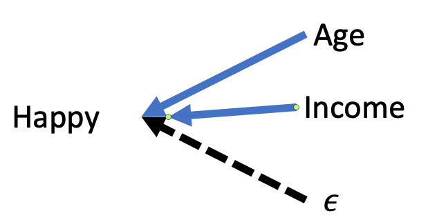
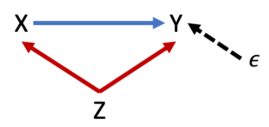

# Outline

```{r, include=FALSE}
library(tidyverse)
library(moderndive)
library(knitr)

set.seed(123)
options(scipen = 999)
```

- Overview of research design
  - Counterfactual
  - Internal validity
  - External validity
  - Experimental, quasi-experimental, non-experimental

- Criteria to claim that $x$ *causes* a change in $y$

- Systematic process to identify omitted variable bias (endogeneity) and what can be done about it

---
# Potential outcomes

- A causal effect is a comparison of two potential outcomes

  - The outcome that we observe in the presence of the event

  - **Counterfactual:** The outcome we would have observed had the event not happened

---
# Potential outcomes

- Half of the data we need to observe causation is missing

  - We observe the outcome for those who received some treatment

  - We observe the outcome for those who did not receive the treatment

- Cannot observe the outcome for the treated as if they had NOT been treated 

- Cannot observe the outcome for the untreated as if they HAD been treated

---
# The challenge of counterfactual

- All we can do is compare outcomes between observed groups (treated and untreated). This can take several forms.

--

- **Randomize** treatment so nothing else differs between treated and untreated groups

--
  
- **Quasi-experimental** methods that use a feature of the treatment that allows us to claim it is as good as randomized

--
  
- **Non-experimental:** Controlling for all the necessary variables to claim there is no relevant difference between treated and untreated (least credible)

---
# Credible Analysis

```{r, echo=FALSE, fig.align='center'}
include_graphics('lectures_files/credible.png')
```

---
# Internal validity

**Internal validity:** the credibility of the theoretical assumptions applied and the causal connection established between the cause (policy, program, treatment) and an effect

- Does a change in $x$ cause a change in $y$?

- Is the estimate biased? Is our estimate systematically higher or lower than the truth?

---
# Internal validity

- A criminal justice nonprofit explores potential factors that affect the likelihood of recidivism 

$$ReOffense = \beta_0 + \beta_1Age + \beta_2Sex + \epsilon$$

```{r, echo=FALSE}
recidivism <- tibble("Variable" = c("Intercept", "Age", "Sex"), "Estimates" = c(1.370, -0.036, 0.250))

kable(recidivism, digits = 3)
```

- Internal validity concerns whether there is a credible theory why these factors would have an impact and if estimates are accurate or biased. If biased, to what extent does it limit our ability to make useful conclusions?

---
# Criteria for causation

1. Correlation between $x$ and $y$ -- as $x$ changes, $y$ must also tend to change

2. Temporal precedence -- $x$ must occur before $y$

3. No plausible rival or alternative explanations -- no other variable $z$ can influence the change in $y$ we attribute to $x$

---
# Correlation between X and Y

- If you run a hypothesis test and the estimate is statistically significant (we haven't covered this yet), you have established credible non-random correlation 

- But many things correlate that share no causal relationship

---
# Temporal Precedence

- Cause must occur before its effect

- Easiest to claim for discrete events with a clear pre and post
  - Marijuana legalization on health outcomes
  - Child tax credit expansion on child poverty

--

- Without a clear pre and post period, harder to eliminate **reverse causality**
  - Crime rates and police funding
  - GDP and life expectancy

---
# No plausible alternative explanation

- No other variable $z$ can influence the change in $y$ we attribute to $x$

--

- Employment rate among those who participated in a job training program is 75% compared to 40% among those who did not participate.

--

- Conclusion: Job training programs increase the likelihood of employment by 35 percentage points. 

- Plausible alternatives?

---
class: inverse, center, middle

# Directed Acyclical Graphs (DAGS)

---
# DAGS

- Visual representation of causal pathways

- Forces us to consider our assumptions

- Allows us to evaluate our model and our ability to claim causation, especially using a **non-experimental** approach

---
# Regression and DAGS

- Behind every regression is a DAG

$$Happiness=\beta_0+\beta_1Age+\beta_2Income+\epsilon$$

```{r, echo=FALSE, fig.align='center'}

```

---
# Backdoor path

```{r, echo=FALSE, fig.align='center', fig.height=5}
include_graphics('lectures_files/dag3.png', dpi = 100)
```

- $Z$ is a **confounder**

- Leads to **omitted variable bias** (OVB)

---
# Close the backdoor

- Our goal is to close all backdoor paths between $X$ and $Y$

- Three ways to close a backdoor path

--

1. Control for the **confounder** in our regression

---
# Close the backdoor

```{r, echo=FALSE, fig.align='center'}

```

.pull-left[
$$Y=\beta_0+\beta_1X+\epsilon$$

- Backdoor open - OVB
]

.pull-right[
$$Y=\beta_0+\beta_1X+\beta_2Z+\epsilon$$

- Backdoor closed - No OVB
]

---
# Close the backdoor

- Three ways to close a backdoor path

1. Control for the **confounder**

--

2. Control for any variable along the backdoor path

---
# Close the backdoor

```{r, echo=FALSE, fig.align='center'}
include_graphics('lectures_files/dag4.2.png', dpi = 100)
```

.center[
$$X \rightarrow Y$$
$$X \leftarrow Z \rightarrow K \rightarrow Y$$
]

.pull-left[
$$Y=\beta_0+\beta_1X+\epsilon$$

- Backdoor open; OVB
]

.pull-right[
$$Y=\beta_0+\beta_1X+\beta_2K+\epsilon$$

- Backdoor closed/blocked; no OVB
]

---
# Close the backdoor

- Three ways to close a backdoor path

1. Control for the **confounder**

2. Control for any variable along the backdoor path

--

3. Identify a **collider** variable that closes the backdoor path

---
# Collider variable

```{r, echo=FALSE, fig.align='center'}
include_graphics('lectures_files/dag6.png', dpi = 100)
```

- $Z$ is a **collider** in this case

- Colliders close backdoors

---
# Close the backdoor

```{r, echo=FALSE, fig.align='center'}
include_graphics('lectures_files/dag5.png', dpi = 140)
```

.center[
$X \rightarrow Y$

$X \leftarrow Z \rightarrow K \leftarrow Y$
]

.pull-left[
$$Y=\beta_0+\beta_1X+\epsilon$$
$$Y=\beta_0+\beta_1X+\beta_2Z+\epsilon$$
$$Y=\beta_0+\beta_1X+\beta_2Z+\beta_3K+\epsilon$$
- All are fine; backdoor closed
]

.pull-right[
$$Y=\beta_0+\beta_1X+\beta_2K+\epsilon$$

- Backdoor now open; OVB

- Also known as **bad control**
]

---
# The error term and OVB

```{r, echo=FALSE, fig.align='center'}
include_graphics('lectures_files/dag8.png', dpi = 100)
```

.center[

$$Y=\beta_0+\beta_1X+\epsilon$$

]

- If true model was left DAG, our estimate $b_1$ is *not* solely due to $X$, but rather unobserved factors contained in $\epsilon$

- Referred to as **endogeneity** or "X is endogenous"

---
# Error term and OVB

.center[
$$Happiness=\beta_0+\beta_1Age+\beta_2Income+\epsilon$$]

.pull-left[
```{r, echo=FALSE, fig.align='center'}

```
]

.pull-right[
- What variables might the error term contain?

- Do any of our omitted variables also affect age or income?
]

---
class: inverse, center, middle

# Using DAGS

---
# Using DAGS

1. Begin with the direct path between $X$ and $Y$ based on your research question

2. Identify other factors that affect $X$ and/or $Y$, adding them to the DAG accordingly

3. List all paths starting from $X$ to $Y$

4. Identify any backdoor paths and determine how to close them

---
# Using DAGS

- Suppose we want to know if college, $C$, increases earnings, $Y$?

- $C \rightarrow Y$

$$Y=\beta_0+\beta_1C+\epsilon$$

--

- Now we should identify any other factors that affect earnings and/or going to college

- Suppose we identify three factors: 
  - Parent's education $PE$ 
  - Family income $I$ 
  - Natural aptitude of parents/child $A$

---
# Using DAGS

- Now we think of the relationships between all of our factors and draw the corresponding DAG

- Suppose we settle on the following DAG

```{r, echo=FALSE, fig.align='center'}
include_graphics('lectures_files/dag10.png', dpi = 125)
```

- Next step is to list all paths we can trace between $C$ and $Y$, drawing the arrows according to their direction in our diagram

---
# Using DAGS

```{r, echo=FALSE, fig.align='center'}
include_graphics('lectures_files/dag10.png', dpi = 150)
```

1. $C \rightarrow Y$ (the causal effect of college on earnings)

--

2. $C \leftarrow I \rightarrow Y$ (backdoor 1)

--

3. $C \leftarrow PE \rightarrow I \rightarrow Y$ (backdoor 2)

--

4. $C \leftarrow A \rightarrow PE \rightarrow I \rightarrow Y$ (backdoor3)

--

- Any colliders? No. We have three open backdoor paths. Systematic non-causal correlations between $C$ and $Y$

---
# Using DAGS

1. $C \rightarrow Y$ (the causal effect of college on earnings)
2. $C \leftarrow I \rightarrow Y$ (backdoor 1)
3. $C \leftarrow PE \rightarrow I \rightarrow Y$ (backdoor 2)
4. $C \leftarrow A \rightarrow PE \rightarrow I \rightarrow Y$ (backdoor3)

- Next step is to identify the minimum set of control variables needed to close all backdoors.

--

- Controlling for family income $I$ closes all three backdoors

.center[
$$Y=\beta_0+\beta_1C+\beta_2I+\epsilon$$
]

- If we believe this DAG, then we now have the causal effect of college on earnings.

---
# Assumptions & alternatives

```{r, echo=FALSE, fig.align='center'}
include_graphics('lectures_files/dag10.png', dpi = 150)
```

- Two key assumptions this DAG makes

--

1. Other than natural aptitude $A$, no other *unobserved* factors affect $C$

--

2. Natural aptitude does not directly affect earnings $Y$

---
# Assumptions & alternatives

```{r, echo=FALSE, fig.align='center'}
include_graphics('lectures_files/dag11.png', dpi = 150)
```

--

.pull-left[
1. $C \rightarrow Y$ 
2. $C \leftarrow I \rightarrow Y$ 
3. $C \leftarrow PE \rightarrow I \rightarrow Y$
4. $C \leftarrow A \rightarrow PE \rightarrow I \rightarrow Y$ 
5. $C \leftarrow A \rightarrow Y$
6. $C \leftarrow PE \leftarrow A \rightarrow Y$
7. $C \leftarrow I \leftarrow PE \leftarrow A \rightarrow Y$
]

.pull-right[

- Controlling for $I$ closes 2, 3, 4, & 7

- Controlling for $PE$ closes 6

- Currently no way to close 5; omitted variable bias
]

---
# Direction of OVB

- Suppose you or someone else has identified an omitted variable that causes bias.

- All is not necessarily lost. Results may still be useful.

```{r, echo=FALSE, fig.align='center'}
include_graphics('lectures_files/dag_ovbdirect.png', dpi = 150)
```

- If influence of $Z$ is in same direction: bias is positive
- If influence of $Z$ is in opposite directions: bias is negative

- Key question: Is the bias pushing my result toward 0 or away from 0?

---
# Recap

- Is my claim about the relationship between a cause and effect credible? Can I claim there is no OVB?

--

- If so, internally valid. Now we can consider **external validity**.

---
# External validity

- **External validity (generalizability):** can results be applied beyond the subjects or context included in the analysis?

--

- Are those in my sample representative of the population? Did the program select or recipients self-select in unrepresentative ways?

- Are there reasons to suspect location or time matter and results may not apply elsewhere or at later times?

--

- If you cannot claim sample represents population, possible you can claim sample represents a subset of the population that is larger than the sample.

- Example: Effect of job training on participants instead of any unemployed person. Known as **treatment on the treated**.

---
# Causal inference models

```{r, echo=FALSE, fig.align='center'}
include_graphics('lectures_files/dag14.png', dpi = 150)
```

- Random assignment breaks any OVB from the error term

- Random assignment is often difficult to achieve in social sciences

- There are quasi-experimental regression techniques that arguably achieve the same break from the error term as if random
  - Difference-in-differences, regression discontinuity, instrumental variables, synthetic control, propensity score matching

---
class: inverse, center, middle

# Supplemtary Slides: Collider Bias Revisited

---
# Collider bias

- Collider bias can occur in two ways:

- Controlling for a collider in our regression that opens a backdoor path

- Using a sample where observations are selected based on a collider variable

---
# Seeing collider bias

```{r, include=FALSE}
collider_bias <- data.frame(k = rnorm(2500, mean = 10, sd = 4), 
                            e = rnorm(2500), 
                            u = rnorm(2500))
```

```{r, include=FALSE}
head(collider_bias, n = 4) %>% 
  kable(digits = 2)
```

```{r, include=FALSE}
collider_bias <- collider_bias %>% 
  mutate(Treatment = if_else( k >= 12, 1, 0))
```

```{r, include=FALSE}
collider_bias <- collider_bias %>% 
  mutate(Outcome = 100 + 50*Treatment + e)
```

```{r, include=FALSE}
collider_bias <- collider_bias %>% 
  mutate(Collider = 50*Treatment + 10*Outcome + u)
```

```{r, echo=FALSE}
head(collider_bias, n = 4) %>%
  select(Treatment, Outcome, Collider) %>% 
  kable(digits = 0)
```

- Sample includes 2,500 observations

---
# Seeing Collider Bias

$$Outcome=\beta_0 + \beta_1Treatment + \epsilon$$

$$Outcome=\beta_0 + \beta_1Treatment + \beta_2Collider + \epsilon$$

- These data are made up in a way that the effect of Treatment, $\beta_1$, should equal 50.

- The collider does not affect the outcome or the treatment. The outcome and treatment affects the collider.

$$Treatment \rightarrow Collider \leftarrow Outcome$$

---
# Seeing collider bias

```{r}
valid <- lm(Outcome ~ Treatment, data = collider_bias)
biased <- lm(Outcome ~ Treatment + Collider, data = collider_bias)
```

.pull-left[
```{r, echo=FALSE}
get_regression_table(valid) %>% 
  select(term, estimate) %>% 
  kable(digits = 2)
```
]

.pull-right[
```{r, echo=FALSE}
get_regression_table(biased) %>% 
  select(term, estimate) %>% 
  kable(digits = 2)
```
]

- Coefficient for $X$ should be 50.

- Because $Treatment \rightarrow Collider \leftarrow Outcome$, controlling for Collider introduces bias

---
# Collider bias: bad sample

- Suppose a nonprofit that works with at-risk youth wants to understand the effect of school absences on grades. It only has access to data on its own clients.

- Suppose at-risk youth are identified by socioeconomic status, GPA, and absences

```{r, echo=FALSE, fig.align='center'}
include_graphics('lectures_files/dag13.png', dpi = 150)
```

---
# Collider bias (2) bad sample

$$GPA = \beta_0 + \beta_1TotAbsences + \beta_2 SES + \epsilon$$

```{r, echo=FALSE, fig.align='center'}
include_graphics('lectures_files/dag13.png', dpi = 150)
```

.pull-left[

1. $TA \rightarrow GPA$
2. $TA \leftarrow SES \rightarrow GPA$
3. $TA \rightarrow AtRisk \leftarrow GPA$
4. $TA \leftarrow SES \rightarrow AtRisk \leftarrow GPA$

]

.pull-right[

- Will our estimate $b_1$ be unbiased?

- No. Because our sample is selected from $AtRisk$; same as controlling for it.

- Selection bias
]

---
# Seeing selection bias

$Absent \rightarrow AtRisk \leftarrow GPA$

- Suppose our sample only includes those at-risk

- But we want to estimate the effect of absences on GPA

```{r, include=FALSE}
selection_bias <- data.frame(absent = rnorm(2500, 8, 2), 
                             gpa = rnorm(2500, 2.5, 0.45))

selection_bias <- mutate(selection_bias, score = (absent + 3*gpa))

quantile(selection_bias$score, 0.2)
selection_bias <- mutate(selection_bias, at_risk = if_else(score <= 13.423, 1, 0))
```


---
# Seeing selection bias

.pull-left[

```{r, echo=FALSE, message=FALSE}
selection_bias %>% 
  filter(at_risk == 1) %>% 
  ggplot(aes(x = absent, y = gpa)) +
  geom_point(alpha = 0.4) +
  geom_smooth(method = "lm", se = FALSE) + 
  labs(title = 'Effect of absences on GPA',
       subtitle = 'Sample of At-Risk Students') +
  theme_minimal() + 
  theme(text = element_text(size=18))
```

]

.pull-right[

```{r, echo=FALSE}
selbias_risk <- selection_bias %>% 
  filter(at_risk == 1)

atrisk_mod <- lm(gpa ~ absent, selbias_risk)

get_regression_table(atrisk_mod) %>% 
  select(term, estimate) %>% 
  kable(digits = 3)
```

]

---
# Seeing selection bias

.pull-left[

```{r, echo=FALSE, message=FALSE}
selection_bias %>% 
  filter(at_risk == 0) %>% 
  ggplot(aes(x = absent, y = gpa)) +
  geom_point(alpha = 0.4) +
  geom_smooth(method = "lm", se = FALSE) + 
  labs(title = 'Effect of absences on GPA',
       subtitle = 'Sample of Students Not At-Risk') +
  theme_minimal() +
  theme(text = element_text(size=18))
```

]

.pull-right[

```{r, echo=FALSE}
selbias_norisk <- selection_bias %>% 
  filter(at_risk == 0)

norisk_mod <- lm(gpa ~ absent, selbias_norisk)

get_regression_table(norisk_mod) %>% 
  select(term, estimate) %>% 
  kable(digits = 3)
```

]

---
# Seeing selection bias

.pull-left[

```{r, echo=FALSE, message=FALSE}
selection_bias %>% 
  ggplot(aes(x = absent, y = gpa)) +
  geom_point(alpha = 0.4) +
  geom_smooth(method = "lm", se = FALSE) + 
  labs(title = 'Effect of absences on GPA',
       subtitle = 'All Students') +
  theme_minimal() +
  theme(text = element_text(size=18))
```

]

.pull-right[

```{r, echo=FALSE}
allstud_mod <- lm(gpa ~ absent, selection_bias)

get_regression_table(allstud_mod) %>% 
  select(term, estimate) %>% 
  kable(digits = 3)
```

]

---
# Seeing Selection Bias

```{r, echo=FALSE, fig.align='center', out.height='90%', message=FALSE}
selection_bias %>% 
  ggplot(aes(x = absent, y = gpa)) +
  geom_point(aes(x = absent, y = gpa, color = as.factor(at_risk)), alpha = 0.4) +
  geom_smooth(method = "lm", se = FALSE) +
  geom_smooth(aes(x = absent, y = gpa, color = as.factor(at_risk)), method = "lm", se = FALSE) +
  labs(color = "At-Risk") +
  theme_minimal() +
  theme(text = element_text(size=18))
```

