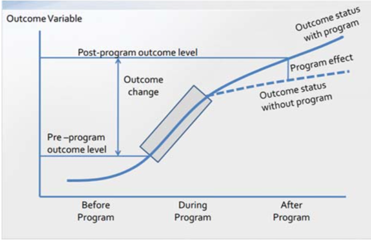
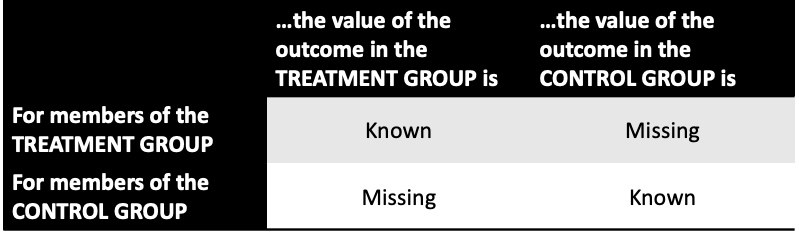
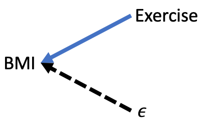
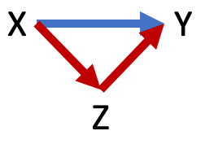

# Outline

```{r, include=FALSE}
library(tidyverse)
library(moderndive)
library(knitr)
set.seed(123)
options(scipen = 999)
```

- How to know if we can conclude that $x$ *causes* a change in $y$

- How to know if our model has omitted variable bias and what can be done about it

---
# Potential outcomes

- A causal effect is a comparison of two potential outcomes

--

1. The outcome that we observe in the presence of the event

2. The outcome that we would have observed had the event **not happened**

--

- What would have happened in this alternate reality is referred to as the **counterfactual**

---
# Counterfactual Key to Effect

```{r, echo=FALSE, fig.align='center', dpi=125}

```

---
# Half of Causal Data is Missing

```{r, echo=FALSE}

```

- For each member in either group, we do not observe their outcome had they been in the other group

---
# The challenge of counterfactual

- So what can we do?

- Compare outcomes between observed groups
  - Randomize treatment
  - Use quasi-experimental model
  - Control for the **right** variables and argue you have engineered virtual twins between treated and control as if randomized

---
# Criteria for causation

1. Correlation between $x$ and $y$ -- as $x$ changes, $y$ must also tend to change not due to random noise

2. Temporal precedence -- $x$ must occur before $y$

3. No plausible rival or alternative explanations -- no other variable $Z$ can influence the change in $y$ we attribute to $x$

---
# Correlation between X and Y

- Easiest to satisfy

- If you run a regression and the coefficient is statistically significant, you have established correlation

- Many things correlate that share no causal relationship

---
# Temporal Precedence

- Fairly easy to establish when studying an acute event or intervention
  - Medicaid expansion on health outcomes
  - Participation in job training on employment

--
  
- More difficult when studying nebulous behaviors/facts
  - Minutes of exercise on Body Mass Index (BMI)
    - Do people have a high BMI because they don't exercise or do they not exercise because they already have a high BMI?
  - Merit scholarship on degree completion
    - Did scholarship increase motivation or did student already have motivation as evidenced by receiving scholarship?
  
- Possible solution: Use values of $x$ measured prior to $y$

---
# No plausible alternative explanation

- No other variable $z$ can influence the change in $y$ we attribute to $x$

- Employment rate among those who participated in a job training program is 75% compared to 40% among those who did not participate.

--

- Job training programs increase the likelihood of employment by 35 percentage points. 
- Plausible alternatives?
  
---
# Key questions

- When I run a regression, how do I know if I can conclude a one-unit change in $x$ **causes** a (value of coefficient) change in $y$?

- Or do my results provide only a correlation/association between $x$ and $y$?

---
class: inverse, center, middle

# Directed Acyclical Graphs (DAGS)

---
# DAGS

- Visual representation of causal pathways

- Used to identify causal effects in **observational** data

- Requires you to consider your assumptions

- Can incorporate existing theory and research as well as your own hypotheses

---
# Regression and DAGS

- Behind every regression is a DAG

$$BMI=\beta_0+\beta_1Exercise+\epsilon$$

```{r, echo=FALSE, fig.align='center'}

```

---
# Notation and Rules

.pull-left[

- Solid arrow: effect is observable

- Dashed arrow: effect is unobservable

- Two types of causal paths:
  - Direct $X \rightarrow Y$
  - Mediated (indirect) $X \rightarrow Z \rightarrow Y$

]

.pull-right[

```{r, echo=FALSE}

```

- No two-way arrows

- No direct path from $Y$ back to $X$

]

---
# Our focus on DAGS

- Backdoor paths
- Adjusting for **confounding** and **colliding** variables
- Translating regression to DAGS and vice versa

- Further reading on DAGS: Pearl, J. (2018). [The Book of Why](https://www.amazon.com/dp/B07CYJ4G2L/ref=cm_sw_em_r_mt_dp_QlXEFb2CK71MS)

---
# Backdoor paths

- Any path from $X$ to $Y$ with an arrow pointing into $X$

- Or an arrow from $X$ to another variable(s) that trace to $Y$

--

- Our goal is to close all backdoor paths

---
# Generic backdoor path

```{r, echo=FALSE, fig.align='center'}
include_graphics('lectures_files/dag3.png', dpi = 100)
```

- $Z$ is a **confounder**

- Leads to **omitted variable bias** (OVB)

---
# Close the backdoor

Two ways to close a backdoor path

--

1. Control for the **confounder**

---
# Close the backdoor

```{r, echo=FALSE, fig.align='center'}
include_graphics('lectures_files/dag4.png')
```

.pull-left[
$$Y=\beta_0+\beta_1X+\epsilon$$

- Backdoor open - OVB
]

.pull-right[
$$Y=\beta_0+\beta_1X+\beta_2Z+\epsilon$$

- Backdoor closed - No OVB
]

---
# Close the backdoor

Two ways to close a backdoor path

1. Control for the **confounder**

--

2. Identify a **collider** variable that closes the backdoor path

---
# Collider variable

```{r, echo=FALSE, fig.align='center'}
include_graphics('lectures_files/dag6.png', dpi = 100)
```

- $Z$ is a **collider**

- Colliders close backdoors

---
# Close the backdoor

```{r, echo=FALSE, fig.align='center'}
include_graphics('lectures_files/dag5.png', dpi = 140)
```

.center[
$X \rightarrow Y$

$X \leftarrow Z \rightarrow K \leftarrow Y$
]

.pull-left[
$$Y=\beta_0+\beta_1X+\epsilon$$
$$Y=\beta_0+\beta_1X+\beta_2Z+\epsilon$$
- Either is fine; backdoor closed; no OVB
]

.pull-right[
$$Y=\beta_0+\beta_1X+\beta_2K+\epsilon$$

- Backdoor open; OVB

- **Controlling for a collider opens the backdoor it closed**
]

---
class: inverse, center, middle

# If we can demonstrate all backdoor paths are blocked along the way by either controlling for a confounder or identifying a collider, and only the path from $X$ to $Y$ remains, then we can claim we have satisfied the third criterion of causality.

---
# The error term and OVB

```{r, echo=FALSE, fig.align='center'}
include_graphics('lectures_files/dag8.png', dpi = 100)
```

.center[

$$Y=\beta_0+\beta_1X+\epsilon$$

]

- If true model was left DAG, out estimate $b_1$ is *not* solely due to $X$, but rather unobserved factors contained in $\epsilon$

- Referred to as **endogeneity** or "X is endogenous"

---
# Error term and OVB

.center[
$$BMI=\beta_0+\beta_1Exercise+\epsilon$$
]

.pull-left[
```{r, echo=FALSE, fig.align='center'}

```
]

.pull-right[
- What variables might the error term contain?

- Do any of those variables also affect exercise?
]

---
class: inverse, center, middle

# Using DAGS starting from a research question

---
# Using DAGS

- Suppose we want to know if college, $C$, increases earnings, $Y$?

- $C \rightarrow Y$

$$Y=\beta_0+\beta_1C+\epsilon$$

--

- Now we should think of all the factors that affect earnings and/or going to college

- Suppose we identify three factors: parent's education $PE$, family income $I$, natural aptitude $A$

---
# Using DAGS

- Now we think of the relationships between all of our factors and draw the corresponding DAG

- Suppose we settle on the following DAG

```{r, echo=FALSE, fig.align='center'}
include_graphics('lectures_files/dag10.png', dpi = 125)
```

- Next step is to list paths between $C$ and $Y$

---
# Using DAGS

```{r, echo=FALSE, fig.align='center'}
include_graphics('lectures_files/dag10.png', dpi = 150)
```

1. $C \rightarrow Y$ (the causal effect of college on earnings)

--

2. $C \leftarrow I \rightarrow Y$ (backdoor 1)

--

3. $C \leftarrow PE \rightarrow I \rightarrow Y$ (backdoor 2)

--

4. $C \leftarrow A \rightarrow PE \rightarrow I \rightarrow Y$ (backdoor3)

--

- Are there any colliders closing one or more backdoors? No.

- We have three open backdoor paths; systematic non-causal correlations between $C$ and $Y$

---
# Using DAGS

1. $C \rightarrow Y$ (the causal effect of college on earnings)
2. $C \leftarrow I \rightarrow Y$ (backdoor 1)
3. $C \leftarrow PE \rightarrow I \rightarrow Y$ (backdoor 2)
4. $C \leftarrow A \rightarrow PE \rightarrow I \rightarrow Y$ (backdoor3)

- Next step is to identify the minimum set of control variables needed to close all backdoors.

--

- Controlling for family income $I$ closes all three backdoors

.center[
$$Y=\beta_0+\beta_1C+\beta_2I+\epsilon$$
]

- If we believe this DAG, then we now have the causal effect of college on earnings.

---
# Assumptions

```{r, echo=FALSE, fig.align='center'}
include_graphics('lectures_files/dag10.png', dpi = 150)
```

- There are at least two key assumptions this DAG makes

1. Other than natural aptitude $A$, there are no other unobserved factors that affect $C$, thus avoiding **endogeneity**

--

2. Natural aptitude does not directly affect earnings $Y$

---
# Assumptions

```{r, echo=FALSE, fig.align='center'}
include_graphics('lectures_files/dag11.png', dpi = 150)
```

--

.pull-left[
1. $C \rightarrow Y$ 
2. $C \leftarrow I \rightarrow Y$ 
3. $C \leftarrow PE \rightarrow I \rightarrow Y$
4. $C \leftarrow A \rightarrow PE \rightarrow I \rightarrow Y$ 
5. $C \leftarrow A \rightarrow Y$
6. $C \leftarrow PE \leftarrow A \rightarrow Y$
7. $C \leftarrow I \leftarrow PE \leftarrow A \rightarrow Y$
]

.pull-right[

- Controlling for $I$ closes 2, 3, 4, & 7

- Controlling for $PE$ closes 6

- Currently no way to close 5; our causal hopes are dashed
]

---
class: inverse, center, middle

# Collider Bias Revisited

---
# Collider bias

- Collider bias can occur in two ways:

- Controlling for a collider in our regression in a way that opens a backdoor path that would have been closed

- Using a sample where observations are based on a collider variable

---
# Collider bias (1) bad control

```{r, echo=FALSE, fig.align='center'}
include_graphics('lectures_files/dag12.png', dpi = 150)
```

1. $Marijuana \rightarrow CarAcc$
2. $Marijuana \leftarrow Norms \rightarrow Seatbelt \leftarrow Safety \rightarrow CarAcc$


$$CarAcc = \beta_0 + \beta_1Marijuana + \beta_2Seatbelt + \epsilon$$

- Controlling for seatbelt usage introduces bias


---
# Seeing collider bias

- Creating a dataset with 2500 observations and 3 variables drawn randomly from a normal distribution

```{r}
collider_bias <- data.frame(k = rnorm(2500, mean = 10, sd = 4), 
                            e = rnorm(2500), 
                            u = rnorm(2500))
```

```{r, echo=FALSE}
head(collider_bias, n = 4) %>% 
  kable(digits = 2)
```

---
# Seeing collider bias

- Adding the explanatory variable of interest $X$ equal to 1 when $k$ is greater than or equal to 12 (arbitrary choice)

```{r}
collider_bias <- collider_bias %>% 
  mutate(X = if_else( k >= 12, 1, 0))
```

--

- Creating a known parameter for the effect of $X$ on $Y$. 

```{r}
collider_bias <- collider_bias %>% 
  mutate(Y = 100 + 50*X + e)
```

--

- Creating a collider $Z$ that is a function of $X$ and $Y$. $Y$ **is not** a function of $Z$.

```{r}
collider_bias <- collider_bias %>% 
  mutate(Z = 50*X + Y + u)
```

---
# Seeing collider bias

- Now have the data we need to run two regressions

```{r, echo=FALSE}
head(collider_bias, n = 4) %>% 
  kable(digits = 2)
```

$$Y=\beta_0 + \beta_1X + \epsilon$$

$$Y=\beta_0 + \beta_1X + \beta_2Z + \epsilon$$

```{r}
valid <- lm(Y ~ X, data = collider_bias)
biased <- lm(Y ~ X + Z, data = collider_bias)
```

---
# Seeing collider bias

.pull-left[
```{r, echo=FALSE}
get_regression_table(valid) %>% 
  select(term, estimate) %>% 
  kable(digits = 2)
```
]

.pull-right[
```{r, echo=FALSE}
get_regression_table(biased) %>% 
  select(term, estimate) %>% 
  kable(digits = 2)
```
]

- Coefficient for $X$ should be 50 because I engineered it to.

- Because $X \rightarrow Z \leftarrow Y$, controlling for Z introduces serious bias

---
# Collider bias (2) bad sample

- Suppose a nonprofit that works with at-risk youth wants to understand the effect of school absences on grades. It only has access to data on its own clients.

- Suppose at-risk youth are identified by socioeconomic status, GPA, and absences

```{r, echo=FALSE, fig.align='center'}
include_graphics('lectures_files/dag13.png', dpi = 150)
```

---
# Collider bias (2) bad sample

$$GPA = \beta_0 + \beta_1TotAbsences + \beta_2 SES + \epsilon$$

```{r, echo=FALSE, fig.align='center'}
include_graphics('lectures_files/dag13.png', dpi = 150)
```

.pull-left[

1. $TA \rightarrow GPA$
2. $TA \leftarrow SES \rightarrow GPA$
3. $TA \rightarrow AtRisk \leftarrow GPA$
4. $TA \leftarrow SES \rightarrow AtRisk \leftarrow GPA$

]

.pull-right[

- Will out estimate $b_1$ be unbiased?

- No. Because our sample is selected from $AtRisk$; same as controlling for it.

- Selection bias
]

---
# Seeing selection bias

$Absent \rightarrow AtRisk \leftarrow GPA$

- Suppose our sample only includes those at-risk

- But we want to estimate the effect of absences on GPA

```{r, include=FALSE}
selection_bias <- data.frame(absent = rnorm(2500, 8, 2), 
                             gpa = rnorm(2500, 2.5, 0.45))

selection_bias <- mutate(selection_bias, score = (absent + 3*gpa))

quantile(selection_bias$score, 0.2)
selection_bias <- mutate(selection_bias, at_risk = if_else(score <= 13.423, 1, 0))
```


---
# Seeing selection bias

.pull-left[

```{r, echo=FALSE, message=FALSE}
selection_bias %>% 
  filter(at_risk == 1) %>% 
  ggplot(aes(x = absent, y = gpa)) +
  geom_point(alpha = 0.4) +
  geom_smooth(method = "lm", se = FALSE) + 
  labs(title = 'Effect of absences on GPA',
       subtitle = 'Sample of At-Risk Students') +
  theme_minimal()
```

]

.pull-right[

```{r, echo=FALSE}
selbias_risk <- selection_bias %>% 
  filter(at_risk == 1)

atrisk_mod <- lm(gpa ~ absent, selbias_risk)

get_regression_table(atrisk_mod) %>% 
  select(term, estimate) %>% 
  kable(digits = 3)
```

]

---
# Seeing selection bias

.pull-left[

```{r, echo=FALSE, message=FALSE}
selection_bias %>% 
  filter(at_risk == 0) %>% 
  ggplot(aes(x = absent, y = gpa)) +
  geom_point(alpha = 0.4) +
  geom_smooth(method = "lm", se = FALSE) + 
  labs(title = 'Effect of absences on GPA',
       subtitle = 'Sample of Students Not At-Risk') +
  theme_minimal()
```

]

.pull-right[

```{r, echo=FALSE}
selbias_norisk <- selection_bias %>% 
  filter(at_risk == 0)

norisk_mod <- lm(gpa ~ absent, selbias_norisk)

get_regression_table(norisk_mod) %>% 
  select(term, estimate) %>% 
  kable(digits = 3)
```

]

---
# Seeing selection bias

.pull-left[

```{r, echo=FALSE, message=FALSE}
selection_bias %>% 
  ggplot(aes(x = absent, y = gpa)) +
  geom_point(alpha = 0.4) +
  geom_smooth(method = "lm", se = FALSE) + 
  labs(title = 'Effect of absences on GPA',
       subtitle = 'All Students') +
  theme_minimal()
```

]

.pull-right[

```{r, echo=FALSE}
allstud_mod <- lm(gpa ~ absent, selection_bias)

get_regression_table(allstud_mod) %>% 
  select(term, estimate) %>% 
  kable(digits = 3)
```

]

---
# Seeing Selection Bias

```{r, echo=FALSE, fig.align='center', out.height='90%', message=FALSE}
selection_bias %>% 
  ggplot(aes(x = absent, y = gpa)) +
  geom_point(aes(x = absent, y = gpa, color = as.factor(at_risk)), alpha = 0.4) +
  geom_smooth(method = "lm", se = FALSE) +
  geom_smooth(aes(x = absent, y = gpa, color = as.factor(at_risk)), method = "lm", se = FALSE) +
  labs(color = "At-Risk") +
  theme_minimal()
```


---
# Recap

- What would be the ideal experiment and how does my analysis differ?

--

- Can I convincingly claim there is no OVB?

--

- If so, internally valid. On to external validity.

--

- To whom can I generalize my results? Are those in my sample systematically different than those in the population?

--

- If different, was my sample drawn from a collider?
  - Yes? Then all backdoors are not closed. Start over.
  - No? I can generalize to the subgroup my sample represents.

---
# Causal inference models

```{r, echo=FALSE, fig.align='center'}
include_graphics('lectures_files/dag14.png', dpi = 150)
```

- Random assignment breaks any OVB from the error term

- Random assignment is often difficult to achieve in social sciences

- There are regression modeling techniques that achieve the same break from the error term without random assignment
  - Difference-in-differences, regression discontinuity, instrumental variables, synthetic control, fixed effects, propensity score matching
