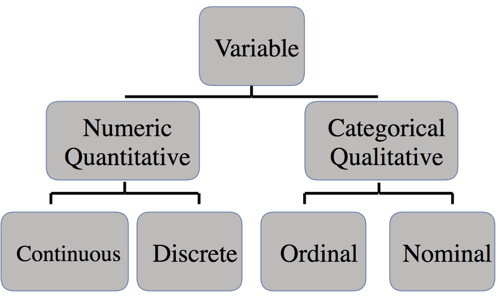
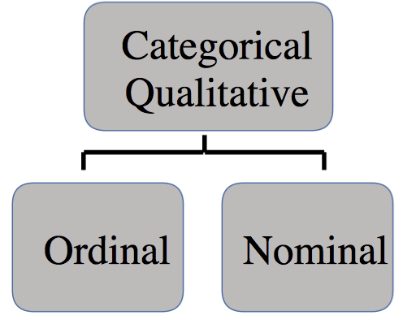
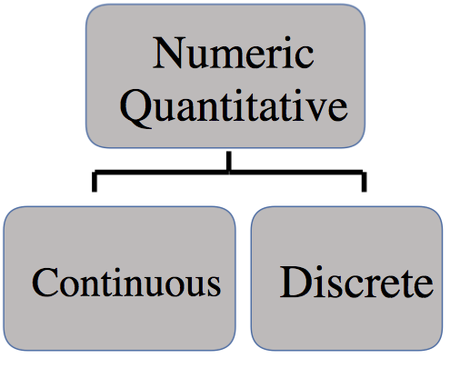
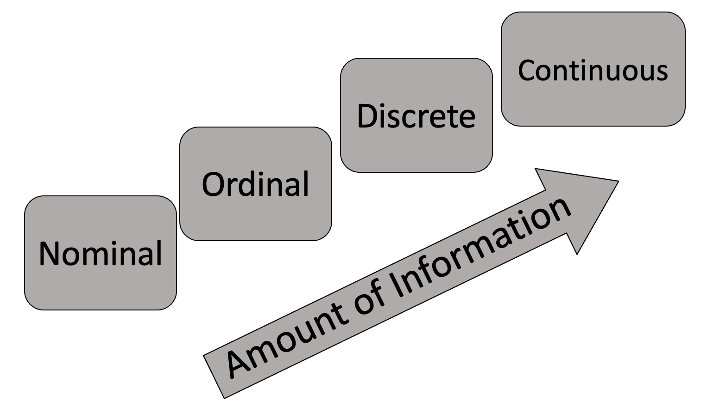

# Outline

- Identify the unit of analysis

- Identify types of variables

- Identify types of data structures

---
# Rectangular data

- Rectangular data consists of

  - Observations of a unit of analysis
  - Variables

--

- **Unit of analysis**:  The subject/entity generating the data. Each row contains an observation of a member of the unit of analysis.

--

- **Variable**:  A characteristic measured of each member of the unit of analysis. Each column contains a variable.

---
# Rectangular data

```{r, include=FALSE}
library(tidyverse)
library(knitr)
generic <- tibble(Variable_1 = c("Member 1 of Unit of Analysis", "Member 2 of Unit of Analysis", "Member 3 of Unit of Analysis"),
                  Variable_2 = c("Datum", "Datum", "Datum"),
                  Variable_3 = c("Datum", "Datum", "Datum"))
```

```{r, echo=FALSE}
kable(generic, format = 'html')
```

- Each row is (or should be) an **observation**

- Each column is (or should be) a **variable**

---
# Identify the unit of analysis

- What is the likely unit of analysis based on the variable names?

```{r, echo=FALSE}
generic <- tibble(Var1 = c("Unit of Analysis", "Unit", "Unit"),
                  GDP = c("Datum", "Datum", "Datum"),
                  Population = c("Datum", "Datum", "Datum"))
kable(generic, format = 'html')
```

---
# Identify the unit of analysis

- What is the likely unit of analysis based on the variable names?

```{r, echo=FALSE}
generic <- tibble(Var1 = c("Unit of Analysis", "Unit", "Unit"),
                  GRE_Score = c("Datum", "Datum", "Datum"),
                  Income = c("Datum", "Datum", "Datum"))
kable(generic, format = 'html')
```

---
# Identify the unit of analysis

- What is the unit of analysis based on the variable names?

```{r, echo=FALSE}
generic <- tibble(Year = c(2017, 2018, 2019),
                  Unemployment = c("Datum", "Datum", "Datum"),
                  Poverty = c("Datum", "Datum", "Datum"))
kable(generic, format = 'html')
```

---
# Why care about unit of analysis?

- Important to know what level is observed or measured. For example, individuals vs. an aggregation of individuals within a city, county, state, etc.

- Spreadsheets will sometimes combine units of analysis. For example, state totals calculated from multiple county totals.

- Be careful not to accidentally include a unit analysis that does not belong in the data

---
class: inverse, middle, center

# Suppose we want to study homelessness in Athens-Clarke County (potential causes or correlates, demographics, government performance metrics, etc.). We need to collect data.

---
class: inverse, middle, center

# What variables might we collect if the unit of analysis is **individuals**?

---
class: inverse, middle, center

# What variables might we collect if the unit of analysis is **years**? 

---
# Types of variables



---
# Qualitative vs. quantitative

- A **qualitative** or **categorical** variable is a variable that is naturally expressed in words with no intrinsic numerical value

--

- A **quantitative** or **numerical** variable is a variable that has intrinsic numerical meaning

---
class: inverse, middle, center

# Which of our variables are qualitative and which are quantitative?

---
# Types of qualitative variables
.center[
 ]

- **Nominal** variables take on values that differ by name only

- **Ordinal** variables take on values that can be ranked relative to each other but the difference between rankings has no numerical value

---
# Types of quantitative variables
.center[
 ]

- **Discrete** variables take on numeric values that are **countable**, integers (e.g. 0, 1, 2, ...)

- **Continuous** variables take on potentially any value. For example, a percentage ranges between 0 and 100 but can take on infinite values between that range (e.g. 50, 50.4, 50.44, 50.444, ...) even though we round to a finite set of values.  

---
class: inverse, middle, center

# Which of our qualitative variables are nominal or ordinal. Which of our quantitative variables are discrete or continuous?

---
# Variables and information

- Variables measure a characteristic of the unit of analysis

- Each variable has some amount of information encoded into it

```{r, echo=FALSE, out.height='50%'}

```

---
# Why variable types matter

- Types of variables inform what kind of visualization and analysis to use. 

- For [example](https://coggle.it/diagram/Vxlydu1akQFeqo6-/t/inference).

---
class:  inverse, center, middle

# Dataset structures

---
# Cross-sectional

```{r, echo=FALSE}
library(gapminder)
gapminder %>% 
  filter(year == 2007 & continent == 'Americas') %>% 
  select(-pop, -gdpPercap) %>% 
  head(n=3) %>% 
  kable(format = 'html')
```

- A snapshot in time

--

- One way to identify the unit of analysis is finding the variable or set of variables that uniquely identifies each row in a dataset.

- What is the unit of analysis?

---
# Pooled cross-sectional

```{r, echo=FALSE}
gapminder %>% 
  filter((year == 2007 & continent == 'Americas') | (year==2002 & continent=='Africa')) %>% 
  select(-pop, -gdpPercap) %>% 
  head(n=7) %>% 
  kable(format = 'html')
```

- Multiple cross-sections combined
- Different subjects observed in each cross-section
- What is the unit of analysis?

---
# Time Series

```{r, echo=FALSE}
gapminder %>% 
  filter(country == 'Argentina') %>% 
  select(-pop, -gdpPercap) %>% 
  tail(n=7) %>% 
  kable(format = 'html')
```

- One subject across time
- What is the unit of analysis?

---
# Panel or longitudinal data

```{r, echo=FALSE}
gapminder %>% 
  filter(continent == 'Americas', year >= 1997) %>%
  select(-pop, -gdpPercap) %>% 
  head(n=6) %>% 
  kable(format = 'html')
```

- Same subjects observed across time
- Combination of cross-sectional and time series data
- What is the unit of analysis?
