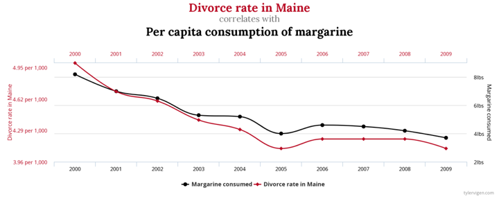

# Outline

- Distinguish between descriptive and inferential statistics

- Identify population, sample, parameter, and statistic

- Distributions and their description

- Describing categorical variables with frequency tables

- Deceptive descriptions

```{r, include=FALSE}
library(tidyverse)
library(knitr)
ncbirths <- read_csv("https://docs.google.com/spreadsheets/d/e/2PACX-1vTm2WZwNBoQdZhMgot7urbtu8eG7tzAq-60ZJsQ_nupykCAcW0OXebVpHksPWyR4x8xJTVQ8KAulAFS/pub?gid=202410847&single=true&output=csv")
```

---
# Two types of statistics

.center[

]

- **Descriptive statistics** has the goal of summarizing qualities of variables, typically describing aspects of their distributions or the relationship between two variables.

- **Inferential statistics** has the goal of using the descriptive statistics of a sample to make conclusions about an unobserved population.

---
# Descriptive vs. inferential

- Suppose we survey 100 SPIA alumni 2 years after completing their MPA to examine employment and earnings outcomes.

.pull-left[
**Descriptive**

- What is the average income of respondents?
- What percentage of respondents are employed?
- How many earn more than they did prior to starting MPA?

]

--

.pull-right[
**Inferential**

- What is the expected income for MPA grads 2 years after graduation?
- Does getting an MPA increase the likelihood of being employed?
- Does getting an MPA increase income?
]

---
# Population vs. sample

- **Population:** all members of a specified group pertaining to a research question

  - A population can be any size based on our research question

- **Sample:** a subset of that population

--

- We can describe a sample or a population

- Inference uses a sample to make educated, scientific guesses about an unobserved population

---
# Parameter vs. statistic

- **Parameter:** a measure pertaining to a population

- **Statistic:** a measure pertaining to a sample

  - In inference, a statistic is often referred to as an **estimate** because it is being used to estimate a population parameter

--

- Thinking back to that survey of SPIA MPA alumni...
  - What is one statistic we might report?
  - When might that statistic be referred to as an estimate?

---
# Practice

Suppose we are told the average salary of college-educated women in Georgia is greater than the national average for all college-educated women, suggesting a college degree provides a better return on investment for women in Georgia than women in other states. Suppose we find this dubious and set out to investigate average salary in Georgia for ourselves. 

You take a sample of 100 college-educated women in Georgia and record the income of each.

- What is the unit of analysis in your dataset?
- What are the variables in your dataset?
- What is the population and sample for this study?
- What is the parameter and statistic/estimate for this study?

---
class: inverse, middle, center

# Data description begins with the distribution of a variable.

---
# Distribution

- A distribution shows the (possible) values for a variable and how often they occur.

- Let's look at weeks pregnancy for live births in North Carolina. Lots of data on births and deaths from [NCHS Vital Statistics](https://www.cdc.gov/nchs/nvss/index.htm)

```{r, echo=FALSE, fig.align='center', fig.height=5}
ggplot(ncbirths, aes(x = weeks)) +
  geom_histogram(fill = 'steelblue', color = 'white', binwidth = 1) +
  labs(title = 'Weeks of pregnancy in North Carolina') +
  theme_light() +
  theme(axis.text=element_text(size=16))
```

---
# Conditional distributions

- Distribution of a variable *given* another variable's values

```{r, echo=FALSE, fig.align='center'}
ggplot(ncbirths, aes(x = weeks, fill = habit)) +
  geom_density(alpha = 0.4, bw = 0.6) +
  labs(title = 'Weeks of pregnancy in North Carolina', 
       fill = 'Smoker') +
  theme_minimal() +
  theme(axis.text=element_text(size=16))
```

---
class: inverse, center, middle

# Descriptive statistics report important characteristics of distributions.

---
# Measures of center

- Mean: the balancing point of the distribution
- Median: the middle of the distribution (50th percentile)
- Mode: the peak(s) of the distribution

---
# Mean (average)

- Add values and divide by the count of values

```{r}
(2 + 4 + 6 + 8 + 10)/5
```

```{r, include=FALSE}
x <- tibble(ID = 1:5, variable = c(2,4,6,8,10))
library(knitr)
```

.pull-left[
```{r, echo=FALSE}
kable(x, format = 'html')
```
]

.pull-right[
```{r}
mean(x$variable)
```

```{r, echo=FALSE}
include_graphics('lectures_files/mean.png')
```

```{r}
mean(ncbirths$weeks)
```


]

---
# Median

- Arrange values in order, find the middle value
- If no middle value because even number of values, average the two middle values

.pull-left[
```{r, echo=FALSE}
kable(x, format = 'html')
```
]

.pull-right[
```{r}
median(x$variable)
```


```{r}
median(ncbirths$weeks)
```

]

---
# Mode

- The value that occurs most frequently

.pull-left[
```{r, echo=FALSE}
kable(x, format = 'html')
```
]

.pull-right[

- Variable has no mode. One more of any of the 5 values would make that value the mode.

]

---
# Mean vs. median vs. mode

- Measures of center are our way of communicating the *typical* value of a distribution.

- Which measure best conveys the typical value depends on the data.


---
# Mean vs. median vs. mode

- Mean is sensitive to extreme values

- Median is not sensitive to extreme values

- Median is better to use when a distribution is skewed

- Mode is rarely used for continuous variables, usually used for the frequency of categorical variables

---
# Mean vs. median vs. mode

- Which measure of center is best for describing typical weeks pregnant?

.pull-left[
```{r, echo=FALSE, fig.align='center'}
ggplot(ncbirths, aes(x = weeks)) +
  geom_histogram(fill = 'steelblue', color = 'white', binwidth = 1) +
  labs(title = 'Weeks of pregnancy in North Carolina') +
  theme_light() +
  theme(axis.text=element_text(size=16))
```
]

.pull-right[
```{r}
mean(ncbirths$weeks)
median(ncbirths$weeks)
```
]

---
# Mean vs. median vs. mode

- Which measure of center is best for describing typical GDP per capita?

.pull-left[
```{r, echo=FALSE, message=FALSE, fig.align='center'}
library(gapminder)
gapminder %>% 
  filter(year==2007) %>% 
  ggplot(aes(x = gdpPercap)) +
  geom_histogram(fill = 'steelblue', color = 'white') +
  labs(title = 'GDP Per Capita') +
  theme_light() +
  theme(axis.text=element_text(size=16))
```
]

.pull-right[
```{r}
mean(gapminder$gdpPercap)
median(gapminder$gdpPercap)
```
]

---
class: inverse, middle, center

# Measures of spread

---
class: inverse, middle, center

# Measures of center tell us one point inside the distribution. They give us no sense by how much and how frequently values deviate above and below the center.

---
# Measures of spread

- **Variance:** the average squared deviation from the mean

- **Standard deviation:** the average deviation from the mean

- **Interquartile range:** the difference between 75th and 25th percentiles

- **Range:** the difference between the maximum and minimum values

---
# Variance

- Subtract mean from each value, square the deviation, add up deviation, divide by count of values minus 1

```{r, include=FALSE}
xvar <- x %>% 
  mutate(deviation = variable - mean(variable), squared_dev = deviation^2)
```

.pull-left[
```{r, echo=FALSE}
kable(xvar, format = 'html')
```
]
.pull-right[
```{r}
sum(xvar$squared_dev)
sum(xvar$squared_dev)/4
var(xvar$variable)
```
]

---
# Standard deviation (SD)

- Variance is important in statistics, but it makes no sense as a descriptive measure of spread because it is in squared units

- If our original variable were dollars, the variance says that on average variable deviates from the mean by 10 squared dollars

- Standard deviation is the square root of variance, returns us to the original unit of the variable

```{r}
sqrt(10)
```

- On average, `variable` deviates from its mean by 3.2 units

---
# Standard deviation (SD)

```{r}
var(ncbirths$weeks)
```

- On average, weeks pregnant deviates from the average by 7.6 squared weeks. Huh?

```{r}
sd(ncbirths$weeks)
```

- On average, weeks pregnant deviates from the average by almost 3 weeks.

---
# Interquartile range (IQR)

- Divide the distribution into 4 equal parts 
- The value of each divider line is called a quartile
- IQR is the difference between 1st and 3rd quartiles; 50% of values

```{r}
quantile(x$variable, c(.25, .75))
IQR(x$variable)
quantile(ncbirths$weeks, c(.25, .5, .75))
```

---
# SD vs. IQR

- SD and IQR are our way of describing the typical deviation of a distribution from its center
- SD is based on the mean, so it is also sensitive to extreme values
- IQR is based on percentiles like median, so it is not sensitive to extreme values

.pull-left[
```{r, echo=FALSE}
xextreme <- tibble(ID = 1:5, variable = c(2,4,6,8,100))
kable(xextreme, format = 'html')
```
]

.pull-right[
```{r}
sd(xextreme$variable)
IQR(xextreme$variable)
```
]

---
# SD vs. IQR

.pull-left[
```{r, echo=FALSE}
ggplot(ncbirths, aes(x = weeks)) +
  geom_histogram(fill = 'steelblue', color = 'white', binwidth = 1) +
  labs(title = 'Weeks of pregnancy in North Carolina') +
  theme_light() +
  theme(axis.text=element_text(size=16))
```
]

.pull-right[
```{r}
var(ncbirths$weeks)
sd(ncbirths$weeks)
IQR(ncbirths$weeks)
```
]

---
# SD vs. IQR

.pull-left[
```{r, echo=FALSE, message=FALSE, fig.align='center'}
library(gapminder)
gapminder %>% 
  filter(year==2007) %>% 
  ggplot(aes(x = gdpPercap)) +
  geom_histogram(fill = 'steelblue', color = 'white') +
  labs(title = 'GDP Per Capita') +
  theme_light() +
  theme(axis.text=element_text(size=16))
```
]

.pull-right[
```{r}
var(gapminder$gdpPercap)
sd(gapminder$gdpPercap)
IQR(gapminder$gdpPercap)
```
]

---
# Range

.pull-left[
- Answer to what is the greatest extent this variable changes?

- Or what are the possible or plausible values of this variable?

- Or how different are the most different values?
]

.pull-right[
```{r}
range(x$variable)
range(xextreme$variable)
range(ncbirths$weeks)
range(gapminder$gdpPercap)
```
]

---
class: inverse, middle, center

# When deciding between mean and median, standard deviation and IQR, consider whether extreme values are distractions or an important part of the story. And, don't forget about effects of measurement validity and reliability.

---
class: inverse, middle, center

# Measures of Association

---
# Measures of association

- Instead of describing the distribution of one variable, now describing conditional distributions

- What does the distribution of one variable look like *given* a value within another variable's distribution

- Requires at least two variables: usually some explanatory variable (x) and a response variable (y)

---
# Measures of association

Suppose we want to investigate the association between the weight a mother gains during pregnancy and the weight of the child?

.pull-left[
```{r, echo=FALSE}
ncbirths %>% 
  select(gained, weight) %>% 
  head(n=8) %>% 
  kable(format = 'html')
```
]

.pull-right[
```{r, echo=FALSE}
ggplot(ncbirths, aes(x = gained, y = weight)) +
  geom_point() +
  theme_minimal() +
  theme(axis.text=element_text(size=16))
```
]

---
# Measures of association

- The association between two or more variables can be described in terms of

- **Direction:** when one variable increases, does the other variable increase or decrease

- **Strength:** how much do the variables move together in tandem

- **Magnitude:** when one variable increases, for instance, one unit, by how much does the other variable increase or decrease

---
# Measures of association

- **Covariance:** measures **direction** of association between between two variables

- **Correlation coefficient:** measures **direction** and **strength** of association between two variables

- **Regression coefficient:** measures the **direction** and **magnitude** of association between an explanatory variable and an outcome variable

---
# Correlation coefficient

- Ranges between -1 and 1

- Positive or negative value tells us the direction

- The closer to -1 or 1, the stronger the association in that direction, with 0 indicating no association

- No definitive scale; rule of thumb:
  - 0.8: very strong
  - 0.6: moderately strong
  - 0.2: weak

```{r}
cor(ncbirths$gained, ncbirths$weight)
```

---
# Limitations of correlation

- Measures only linear association

- Sensitive to extreme values

- Is necessary but not sufficient to claim causation

---
# Spurious correlation

- For example, crime is strongly correlated with ice cream sales.

--

- Many such examples.



- And more [here](https://www.tylervigen.com/spurious-correlations)

---
class: inverse, middle, center

# Describing categorical variables

---
# Describing categorical variables

.pull-left[
```{r, echo=FALSE}
ggplot(ncbirths, aes(x = premie)) +
  geom_bar(fill = 'steelblue') +
  theme_minimal() +
  theme(axis.text=element_text(size=16))
```
]

.pull-right[

- There isn't a continuous distribution to calculate mean, median, variance, SD, IQR, or range.

- Mode still works.

- Frequency and cross-tabulations (contingency tables) are common.
]

---
# Frequency Table

- Tabulates  count or proportion for each level of a categorical variable

```{r}
(premie.table <- table(ncbirths$premie)) %>% kable(col.names = c('Term', 'Count'))
```

```{r}
prop.table(premie.table) %>% kable(digits = 2, col.names = c('Term', 'Proportion'))
```
]

---
# Contingency Table or Cross-tab

```{r}
(mytable <- table(ncbirths$habit, ncbirths$premie)) %>% 
  kable()
```

- Tabulates the intersections between levels of two categorical variables

- Common to use proportions or percentages

- Important whether you use row or column percentages

---
# Contingency Table

```{r}
prop.table(mytable, 1) %>% 
  kable(digits = 2)
```

- This table reports row proportions; note each row sums to 1

- This table conveys the relative frequency of term levels conditional on smoking status level

- "Among non-smoking mothers, 87% carried full-term and 13% had premature births."

---
# Contingency Table

```{r}
prop.table(mytable, 2) %>% 
  kable(digits = 2)
```

- This table reports column proportions; note each column sums to 1

- Conditional on term status, the relative frequency of smoking

- "Among full-term births, 90% came from non-smoking mothers and 10% came from smoking mothers."

---
# Contingency Table

- If your question involves an outcome and a possible explanation

- Place the outcome in the columns

- Use row percentages

--

- **Be careful using contingency tables to make conclusions. Do not generalize from a sample without inferential tests. Consider the measurement and scope of the numerator and denominator.**

---
class: inverse, center, middle

# Let's consider some cases of possible deception

---
# Deceptive description

- **Politician A:** The economy is awful! Thirty states had falling incomes last year.

- **Politician B:** Our economy is showing promising gains. Seventy percent of Americans had rising incomes last year.

---
# Deceptive description

- Suppose PADP has only 5 classes with no student in more than 1 class

- 4 classes have 5 students

- 1 class has 100 students

---
# Deceptive description

- Average class size
```{r}
(100 + 5 + 5 + 5 + 5)/5
```

  - Average class size is only 24. Put that on a website!

--
  
- What about class size experienced by average student
  - Survey all 120 students about class size
  - 100 would answer 100
  - 20 would answer 5

```{r}
(100*100+20*5)/120
```

---
# Deceptive description

- An expensive new drug increases the median life expectancy among patients by only two weeks. 

- Insurance won't cover such an expensive drug for such small gains in life expectancy.

- What may be wrong with this rationale?

---
# Deceptive descriptions

- [Those damn denominators](https://www.wired.com/story/damn-denominators-coronavirus/)

- When given a percentage or rate, think carefully about the denominator 
  - How large is it
  - Is it measured validly and reliably

- [Hot tea and throat cancer](https://www.cnn.com/2019/03/20/health/hot-tea-linked-to-higher-cancer-risk-study-intl/index.html)

---
# Fatal police encounters

```{r, include=FALSE}
load('lectures_files/fatal_encounters.RData')
load('lectures_files/fatal_shot.RData')
```

```{r}
glimpse(fatal_encounters)
```

- Data from [Fatal Encounters](https://fatalencounters.org)

---
# Fatal police encounters

```{r}
levels(fatal_encounters$cause)
```

---
# Fatal police encounters

```{r, eval=FALSE}
fatal_shot_2019 <- fatal_encounters %>% 
  select(year, race_imputed, cause) %>% 
  filter(cause == 'Gunshot' & year == 2019) %>% 
  glimpse()
```

```{r, echo=FALSE}
fatal_shot_2019 <- fatal_encounters %>% 
  select(year, race_imputed, cause) %>% 
  filter(cause == 'Gunshot' & year == 2019)

fatal_shot_2019$cause <- fct_drop(fatal_shot_2019$cause)
fatal_shot_2019$race_imputed <- fct_drop(fatal_shot_2019$race_imputed)

fatal_shot_2019 %>% 
  glimpse()
```

---
# Fatal police encounters
```{r, results='hide'}
fatal.table <- table(fatal_shot_2019$race_imputed,
                      fatal_shot_2019$cause)
kable(fatal.table)
```

.pull-left[
```{r, echo=FALSE}
kable(fatal.table)
```
]

.pull-right[
- Note limitations of these data:
  - Only includes gunshots
  - No context of encounter
  - Measurement issues
  - No perspective of non-fatal encounters
  
- Could already start manipulating messages by ignoring these
]

---
# Using different denominators

.pull-left[
```{r, echo=FALSE}
kable(fatal.table)
```
]
.pull-right[
- Total gunshots = 1,346
- Group 1: Your goal is to highlight bias against people of color. ([Hint](https://www.census.gov/quickfacts/fact/table/US/PST045219))
- Group 2: Your goal is to downplay severity of police shootings in general ([Hint](https://www.census.gov/quickfacts/fact/table/US/PST045219))
- Group 3: Your goal is to downplay bias against people of color. Two ways to do this. ([Hint for one](https://ucr.fbi.gov/crime-in-the-u.s/2017/crime-in-the-u.s.-2017/tables/table-43))
]

---
# Data from 2019 Census and FBI UCR

**US Pop = 328,239,523**

White, not Hispanic/Latino 196,789,401 (60%)

Black, not Hispanic/Latino: 40,596,040 (12%)

Hispanic/Latino (any race): 60,481,746 (18%)

**Total Arrests: 8,162,849**

White, not Hispanic/Latino: 4,669,696 (57%)

Black, not Hispanic/Latino: 2,155,046 (26%)

Hispanic/Latino (any race): 1,190,671 (15%)

Total Violent Crime: 404,236
White, not Hispanic/Latino: 196,370 (49%)
Black, not Hispanic/Latino: 147,192 (36%)
Hispanic/Latino: 79,078 (20%)

