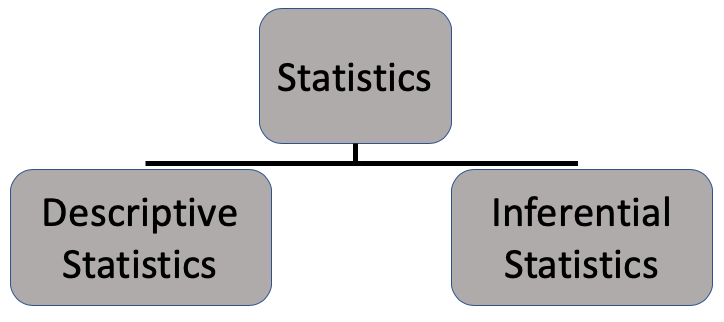
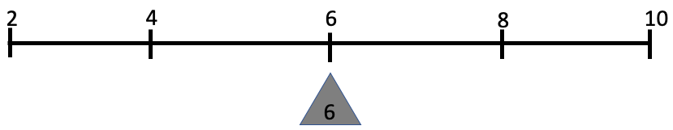
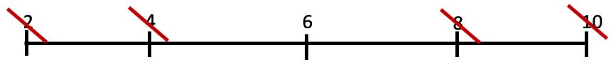
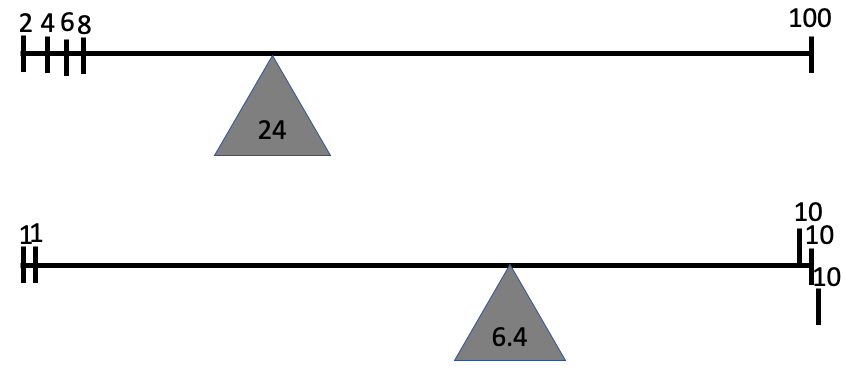

# Outline

- Distinguish between descriptive and inferential statistics

- Identify population, sample, parameter, and statistic

- Distributions and their description

```{r, include=FALSE}
library(tidyverse)
library(knitr)
ncbirths <- read_csv("https://docs.google.com/spreadsheets/d/e/2PACX-1vTm2WZwNBoQdZhMgot7urbtu8eG7tzAq-60ZJsQ_nupykCAcW0OXebVpHksPWyR4x8xJTVQ8KAulAFS/pub?gid=202410847&single=true&output=csv")
library(fivethirtyeight)
```

---
# Two types of statistics

.center[

]

---
# Population vs. Sample

- **Population:** all members of a specified group pertaining to a research question

  - A population can be any size based on our research question
  
  - If we can observe the population, all we need to do is describe it to reach useful conclusions

--

- **Sample:** a subset of that population

- We can describe a sample or a population

- If we cannot observe the population, we take a sample and use inferential statistics to reach useful conclusions about that population

---
# Descriptive vs. inferential

Suppose we survey UGA alumni 2 years after completing their MPA to examine employment and earnings outcomes.

- Who *could* be the population for this survey?

---
# Descriptive vs. inferential

Suppose the population of our survey is all recent MPA graduates.

--

.pull-left[
**Descriptive Questions**

- What is the average income of respondents?
- What percent of respondents are employed?
- What percent of respondents earn more than they did prior to MPA?

]

--

.pull-right[
**Inferential Questions**

- What is the average income for MPA grads 2 years after graduation?
- Does an MPA increase employment over a Bachelor's?
- Does an MPA increase income?
]

---
# Parameter vs. statistic

- **Parameter:** a measure pertaining to a population

  - Typically used when population is unobserved
  - The "true" value we try to estimate using a sample

- **Statistic:** a measure pertaining to a sample

  - Also referred to as an **estimate**

---
# Back to Survey Example

Suppose our survey finds that the median income of UGA MPA alumni 2 years following graduation is $75,000

- Is this a sample statistic or a population parameter?

---
# Descriptive vs. inferential

Suppose we are told the average salary of college-educated women in Georgia is greater than the national average for college-educated women. 

Suppose we set out to confirm the average salary in Georgia for ourselves. We survey a sample of 1,000 college-educated women in Georgia and record their income.

--

- What is the population and sample?
- What is the parameter and statistic/estimate?

---
# Descriptive vs. inferential

Suppose we want to know the percent of Clarke County residents who have a valid ID for the upcoming election.

--

What is the population?

--

We survey people entering Baldwin Hall if they have a valid ID according to Georgia's election laws. We get 100 responses, and 80% said they have a valid ID.

--

- Is our result of 80% a population parameter or an estimate?

--

- Why might we have a sample size less than 100?

---
class: inverse, middle, center

# Data description


---
# Distribution

- A distribution shows the (possible) values for a variable and how often they occur.

- Weeks of pregnancy for births in North Carolina.

```{r, echo=FALSE, fig.align='center', fig.height=5}
ggplot(ncbirths, aes(x = weeks)) +
  geom_histogram(fill = 'steelblue', color = 'white', binwidth = 1) +
  labs(title = 'Weeks of pregnancy for births in North Carolina') +
  theme_light() +
  theme(axis.text=element_text(size=16))
```

---
# Describing numerical variables

- Center
  - Mean, median, mode
- Spread
  - Variance, standard deviation, IQR, range
- Association
  - Covariance, correlation
  - Regression coefficient, coefficient of determination (will cover later)

---
# Measures of center

- Mean: the balancing point of the distribution
- Median: the middle of the distribution (50th percentile)
- Mode: the peak(s) of the distribution

---
# Mean (average)

- Add values and divide by the count of values

```{r}
(2 + 4 + 6 + 8 + 10)/5
```

```{r, include=FALSE}
x <- tibble(ID = 1:5, variable = c(2,4,6,8,10))
library(knitr)
```

.pull-left[
```{r, echo=FALSE}
kable(x, format = 'html')
```
]

.pull-right[
```{r}
mean(x$variable)
```

```{r, echo=FALSE}

```

```{r}
mean(ncbirths$weeks)
```


]

---
# Median

- Arrange values in order, find the middle value
- If no middle value because even number of values, average the two middle values

.pull-left[
```{r, echo=FALSE}
kable(x, format = 'html')
```
]

.pull-right[
```{r}
median(x$variable)
```



```{r}
median(ncbirths$weeks)
```

]

---
# Mode

- The value that occurs most frequently

.pull-left[
```{r, echo=FALSE}
kable(x, format = 'html')
```
]

.pull-right[

- Variable has no mode. One more of any of the 5 values would make that value the mode.

]

---
# Mean vs. median vs. mode

- We use measures of center to communicate the *typical* value of a distribution.

- Which measure best conveys what is typical depends on the distribution.




---
# Mean vs. median vs. mode

- Mean is sensitive to extreme values, median is not

- Median is better to use when a distribution is skewed

- Mode is can be used for discrete or categorical variables

---
# Mean vs. median vs. mode

- Which measure of center is best for describing typical weeks pregnant?

.pull-left[
```{r, echo=FALSE, fig.align='center'}
ggplot(ncbirths, aes(x = weeks)) +
  geom_histogram(fill = 'steelblue', color = 'white', binwidth = 1) +
  labs(title = 'Weeks of pregnancy in North Carolina') +
  theme_light() +
  theme(axis.text=element_text(size=16))
```
]

.pull-right[
```{r}
mean(ncbirths$weeks)
median(ncbirths$weeks)
```
]

---
# Mean vs. median vs. mode

- Which measure of center is best for describing typical GDP per capita?

.pull-left[
```{r, echo=FALSE, message=FALSE, fig.align='center'}
library(gapminder)
gapminder %>% 
  filter(year==2007) %>% 
  ggplot(aes(x = gdpPercap)) +
  geom_histogram(fill = 'steelblue', color = 'white') +
  labs(title = 'GDP Per Capita') +
  theme_light() +
  theme(axis.text=element_text(size=16))
```
]

.pull-right[
```{r}
mean(gapminder$gdpPercap)
median(gapminder$gdpPercap)
```
]

---
class: inverse, middle, center

# Measures of spread

---
# Measures of spread

- **Variance:** the average squared deviation from the mean

- **Standard deviation:** the average deviation from the mean

- **Interquartile range:** the difference between 75th and 25th percentiles

- **Range:** the difference between the maximum and minimum values

---
# Standard deviation (SD)

- Variance is important but makes no sense as a descriptive measure of spread

--

```{r}
var(ncbirths$weeks)
```

- On average, weeks pregnant deviates from the average by 7.6 squared weeks. Huh?

--

- Standard deviation is the square root of variance, returns us to the original variable

```{r}
sd(ncbirths$weeks)
```

- On average, weeks pregnant deviates from the average by almost 3 weeks.

---
# Interquartile range (IQR)

- Divide the distribution into 4 equal parts
- Each dividing value is the 25th, 50th, and 75th percentiles
- IQR is the difference between 25th and 75th percentiles

```{r}
quantile(ncbirths$weeks, c(.25, .5, .75))
```

- What is the IQR for weeks pregnant?

--

```{r}
IQR(ncbirths$weeks)
```

---
# SD vs. IQR

- We use SD and IQR to communicate the typical deviation of a distribution from its center
- SD is based on the mean; sensitive to extreme values
- IQR uses percentiles; not sensitive to extreme values

--

.pull-left[
```{r, echo=FALSE}
xextreme <- tibble(ID = 1:5, variable = c(2,4,6,8,100))
kable(xextreme, format = 'html')
```
]

.pull-right[
```{r}
sd(xextreme$variable)
IQR(xextreme$variable)
```
]

---
# SD vs. IQR

.pull-left[
```{r, echo=FALSE}
ggplot(ncbirths, aes(x = weeks)) +
  geom_histogram(fill = 'steelblue', color = 'white', binwidth = 1) +
  labs(title = 'Weeks of pregnancy in North Carolina') +
  theme_light() +
  theme(axis.text=element_text(size=16))
```
]

.pull-right[
```{r}
var(ncbirths$weeks)
sd(ncbirths$weeks)
IQR(ncbirths$weeks)
```
]

---
# SD vs. IQR

.pull-left[
```{r, echo=FALSE, message=FALSE, fig.align='center'}
library(gapminder)
gapminder %>% 
  filter(year==2007) %>% 
  ggplot(aes(x = gdpPercap)) +
  geom_histogram(fill = 'steelblue', color = 'white') +
  labs(title = 'GDP Per Capita') +
  theme_light() +
  theme(axis.text=element_text(size=16))
```
]

.pull-right[
```{r}
var(gapminder$gdpPercap)
sd(gapminder$gdpPercap)
IQR(gapminder$gdpPercap)
```
]

---
# Range

.pull-left[
- Describes the greatest extent to which the variable changes

- Or the possible values of the variable

- Or how different are the most different observations
]

.pull-right[
```{r}
range(ncbirths$weeks)
range(gapminder$gdpPercap)
```
]

---
class: inverse, middle, center

# Measures of Association

---
# Conditional distributions

- Distribution of a variable *given* another variable's values

```{r, echo=FALSE, fig.align='center'}
ggplot(ncbirths, aes(x = weeks, fill = habit)) +
  geom_density(alpha = 0.4, bw = 0.6) +
  labs(title = 'Weeks of pregnancy in North Carolina', 
       fill = 'Smoker') +
  theme_minimal() +
  theme(axis.text=element_text(size=16))
```

---
# Measures of association

Suppose we want to investigate the association between the percent of a state population that is white and the percent of the state population that voted for Donald Trump.

```{r, include=FALSE}
state_trump <- hate_crimes %>%
  mutate(share_white = 1 - share_non_white,
         urbanization = if_else(share_pop_metro<=0.75, "low", "high")) %>% 
  select(state, 
         median_house_inc, 
         share_pop_hs, 
         share_white, 
         share_white_poverty, 
         share_vote_trump,
         urbanization) %>%
  filter(state != "District of Columbia") %>% 
  mutate_at(vars(share_pop_hs, share_white, share_white_poverty,
              share_vote_trump), funs(.*100))
```

.pull-left[
```{r, echo=FALSE}
state_trump %>% 
  select(share_white, share_vote_trump) %>% 
  head(n=6) %>% 
  kable(format = 'html')
```
]

.pull-right[
```{r, message=FALSE, echo=FALSE, fig.align='center'}
ggplot(data = state_trump, 
       aes(y = share_vote_trump, x = share_white)) + 
  geom_point(color = 'springgreen4', size = 2) + 
  labs(x = "Percent of state population white", 
       y = "Percent of population voted for Trump", 
       title = "White density and Trump support in the US") +
  theme_minimal() +
  theme(text=element_text(size=16))
```
]

---
# Measures of association

- Or percent of white population in poverty

```{r, message=FALSE, echo=FALSE, fig.align='center', fig.height=5}
ggplot(data = state_trump, 
       aes(y = share_vote_trump, x = share_white_poverty)) + 
  geom_point(color = 'springgreen4', size = 2) + 
  labs(x = "Percent of white population in poverty", 
       y = "Percent of population voted for Trump", 
       title = "White poverty and Trump support in the US") +
  theme_minimal() +
  theme(text=element_text(size=16))
```

- Units with higher values along the x-axis tend to have higher or lower values along the Y axis. Or no tendency.

---
# Measures of association

- The association between two variables can be described in terms of

- **Direction:** when one variable increases, does the other variable *tend* to increase or decrease

- **Strength:** how closely do the variables move together

- **Magnitude:** when one variable increases a certain amount, how much does the other variable increase or decrease

---
# Measures of association

- **Covariance:** measures **direction** of association between two variables

- **Correlation coefficient:** measures **direction** and **strength** of association between two variables

- **Regression coefficient:** measures the **direction** and **magnitude** of association between an explanatory variable and an outcome variable

---
# Correlation coefficient

- Ranges between -1 and 1

- Positive or negative value tells us the direction

- The closer to -1 or 1, the stronger the association in that direction, with 0 indicating no association

- No definitive scale; rule of thumb:
  - 0.8: very strong
  - 0.6: strong
  - 0.4: moderate
  - 0.2: weak

---
# Correlation coefficient
```{r, message=FALSE, echo=FALSE, fig.align='center', fig.height=5}
ggplot(data = state_trump, 
       aes(y = share_vote_trump, x = share_white_poverty)) + 
  geom_point(color = 'springgreen4', size = 2) + 
  labs(x = "Percent of white population in poverty", 
       y = "Percent of population voted for Trump", 
       title = "White poverty and Trump support in the US") +
  theme_minimal() +
  theme(text=element_text(size=16))
```

```{r}
cor(state_trump$share_vote_trump, state_trump$share_white_poverty)
```

- What is the interpretation?

---
# Correlation

Percent white population in poverty
```{r}
cor(state_trump$share_vote_trump, state_trump$share_white_poverty)
```


Percent population that is white
```{r}
cor(state_trump$share_vote_trump, state_trump$share_white)
```


Which correlation is stronger?

---
# Limitations of correlation

- Measures only linear association

- Sensitive to extreme values

- Is necessary but not sufficient to claim causation

---
class: inverse, middle, center

# Review Questions

---
# Affected measures

A city has a private high school and a public high school. Each year, all students take a state standardized test. Student scores can range between 0-100.

--

Suppose the student who will score the highest in the public school transfers to the private school.

--

What effect does this transfer have on the measures of center and spread for the public school's distribution of test scores?

---
# Affected measures

A city has a private high school and a public high school. Each year, all students take a state standardized test. Student scores can range between 0-100.

--

After hiring better teachers, the public school is able to raise the test scores of each of its students by 5 points.

--

What effect does this have on the measures of center and spread for the public school's distribution of test scores?

---
# Affected measures

A city has a private high school and a public high school. Each year, all students take a state standardized test. Student scores can range between 0-100.

--

After hiring better teachers, the public school is able to raise the test scores of each of its students by 5%.

--

What effect does this have on the measures of center and spread for the public school's distribution of test scores?

---
# Shapes of distributions

.pull-left[
- Private school
  - Mean: 80
  - Median: 80
  - Standard deviation: 5
  - Min: 65
  - Max: 100
]

.pull-right[
- Public school
  - Mean: 70
  - Median: 80
  - Standard deviation: 12
  - Min: 25
  - Max: 100
]

- What do these numbers tell us about test scores between the two schools? What don't they tell us?

---
# Choosing measures

.pull-left[
```{r, echo=FALSE}
ggplot(ncbirths, aes(x = weeks)) +
  geom_histogram(fill = 'steelblue', color = 'white', binwidth = 1) +
  labs(title = 'Weeks of pregnancy in North Carolina') +
  theme_light() +
  theme(axis.text=element_text(size=16),
        axis.title = element_text(size = 16),
        text = element_text(size = 16))
```
]

.pull-right[
```{r, echo=FALSE, message=FALSE, fig.align='center'}
library(gapminder)
gapminder %>% 
  filter(year==2007) %>% 
  ggplot(aes(x = gdpPercap)) +
  geom_histogram(fill = 'steelblue', color = 'white') +
  labs(title = 'GDP Per Capita') +
  theme_light() +
  theme(text=element_text(size=16))
```
]

- Which measures of center and spread should we use or not use for the above distributions?

---
# Correlation

```{r, message=FALSE, echo=FALSE, fig.align='center', fig.height=5}
ggplot(data = state_trump, 
       aes(y = share_vote_trump, x = median_house_inc)) + 
  geom_point(color = 'springgreen4', size = 2) + 
  labs(x = "Median household income", 
       y = "Percent of population voted for Trump", 
       title = "Income and Trump support in the US") +
  theme_minimal() +
  theme(text=element_text(size=16))
```

Unit of analysis is states.
Is the correlation positive or negative?

---
# Correlation

```{r, message=FALSE, echo=FALSE, fig.align='center', fig.height=5}
ggplot(data = state_trump, 
       aes(y = share_vote_trump, x = median_house_inc)) + 
  geom_point(color = 'springgreen4', size = 2) + 
  labs(x = "Median household income", 
       y = "Percent of population voted for Trump", 
       title = "Income and Trump support in the US") +
  theme_minimal() +
  theme(text=element_text(size=16))
```

```{r}
cor(state_trump$median_house_inc, state_trump$share_vote_trump)
```

What is the interpretation?

---
# Recap

- Difference between descriptive and inferential statistics; sample and population

--

- When presented with descriptive statistics, consider what they say and don't say about the underlying distribution.

--

- When presented with changes in descriptive statistics, consider the different ways the distribution could have changed.

--

- Correlation is a building block of how we explain or predict phenomena in our world using statistics.

