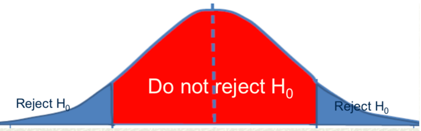

# Outline

```{r, include=FALSE}
library(tidyverse)
library(moderndive)
library(fivethirtyeight)
library(infer)
library(knitr)
set.seed(123)
options(scipen = 999)

hisp_data <- read_csv("lectures_files/health_insurance_subsidy.csv")

hisp_data <- rename(hisp_data, treatment = treatment_locality)
```

- Hypothesis testing
- p-values
- Null distribution
- Reporting statistically significant results
- Practical significance

---
# Regression table

$$HealthExpenditure = \beta_0 + \beta_1TreatmentLocality + \epsilon$$

```{r, include=FALSE}
mod1 <- lm(health_expenditures ~ treatment, data = hisp_data)
```

```{r, echo=FALSE}
get_regression_table(mod1) %>% 
  kable(digits = c(2,2,0,6,2,2))
```

- Our goal is to better understand the `statistic` (less important) and `p_value` columns. 

---
class: inverse, center, middle

# What is a hypothesis test & p-value?

---
# Hypotheses and p-values

**Hypothesis test** asks the following question: "Is my result so unlikely that I can conclude with a sufficient level of confidence that there is evidence in support of my hypothesis?"

**p-value:** the probability of obtaining my result or more extreme in a world where the **null hypothesis**, which states a variable has no relationship (effect) with (on) the outcome, is actually true.

- The p-value enables us to answer the hypothesis test

---
# Structure of hypothesis test

- Alternative hypothesis $H_A$

  - Claims there is evidence for the phenomenon you are interested in testing.
  
  - For example: $\beta_k \neq 0$

--

- Null hypothesis $H_0$

  - Claims there is no relationship or effect; the opposite of the alternative
  
  - For example: $\beta_k = 0$

---
# Example

```{r, echo=FALSE, fig.align='center', fig.height=5}
ggplot(promotions, aes(x = gender, fill = decision)) +
  geom_bar() +
  labs(title = "Observed Promotions", 
       x = "Gender of name on resume")
```

> **Run all code chunks down to and including `promo-estimates`**

---
# Example

- Descriptive:

  - For our one sample, we have calculated the proportion of males promoted $p_M=0.88$ and proportion of females promoted $p_F=0.58$
  - In this sample, the difference in proportion promoted is $p_M-p_F= 0.88-0.58=0.3$ or 30 percentage points.

--

- Inference:

  - This is a sample of an unobserved population
  - And/or the counterfactual is unobservable
  - This sample provides us estimates of $P_M$, $P_F$, and $P_M-P_F$

---
# Example

- Following this case of promotions by gender, the difference in rates of promotion between males and females, $P_M-P_F$, is either 0 or something other than 0 

- What are our null and alternative hypotheses for this analysis?

  - $H_A$:  
  - $H_0$:

- What are the possible conclusions of this and all hypothesis tests?

---
# Example

1. If results reject the null, then

  - We found statistically significant evidence that $P_M-P_F \neq 0$
  - Means the result of 0.3 is too improbable to be only due to random chance

--

2. If results fail to reject the null
  - We did not find statistically significant evidence that $P_M-P_F \neq 0$
  - Means result of 0.3 is not improbable enough to rule out random chance
  - $P_M-P_F\lesseqqgtr0$ ; we don't know which
  
--

- Can *never* conclude males and females *are* promoted equally $P_M-P_F = 0$ from a hypothesis test. This is equivalent to accepting the null.

---
# What If We're Wrong

- Suppose our estimate of $P_M-P_F=?$, $p_M-p_F=0.3$, is so unlikely that we reject the null 

- Conclude that males and females are not promoted in equal proportions $P_M-P_F \neq 0$.

--

- Our estimate of 0.3 is a scientific guess around which we construct a range of plausible values we assume captures the parameter

--

- Our confidence interval could be 1 of the 5 out of 100 (assuming 95% CI) expected to fail to capture the parameter

---
# What If We're Wrong

- We may reject the null because our 95% CI does **not** contain 0, thus $P_M-P_F \neq 0$

--

- But our CI could be wrong and the true value is that $P_M-P_F = 0$
  - Type I error
  - False positive

---
# What If We're Wrong

- We may fail to reject the null because our 95% CI does include 0, thus we can't rule out with high enough confidence that $P_M-P_F \neq 0$

--

- But our CI could be wrong and the true value is that $P_M-P_F \neq 0$
  - Type II error
  - False negative

---
# Decision rule

- Common to choose a **significance level** of 5%, which is the same as choosing a **confidence level** of 95%.

  - Sometimes denoted $\alpha = 0.05$ where $\alpha$ is significance level

--

- If p-value is less than 0.05, we **reject** the null. If it is greater than or equal to 0.05, we **fail to reject** the null.

- If p-value $<\alpha$, reject $H_0$

- If p-value $\geq \alpha$, fail to reject $H_0$

---
class: inverse, center, middle

# How do we know the probability of our result in a world where the null is true without knowing which world we live in?

---
# Null distribution

```{r, echo=FALSE, fig.align='center', out.height='66%'}

```

- We assume a null distribution, similar to the sampling distribution

- Null distribution is centered at 0 as if null were actually true

- Assuming null distribution is normal, we can then calculate the probability of our result

---
# Example

- If the null were true, then promotions would be random with respect to gender

  - On average, $P_M-P_F = 0$
  - Promotions and gender would share no correlation

--

- Let's use R to simulate a world where the null is true.

> **Run all code chunks from `one-shuffle` down to and including `null-estimate`**

- Our null estimate is the difference in promotion rates between males and females if promotions were truly random with respect to gender based on one sample

- This simulates a world where the null is true

---
# Example

- Let's repeat this random shuffling 1,000 times, calculating the difference in promotions between males and females each time.

- Then we could plot the 1,000 values as a histogram, giving us a distribution of differences between males and females based on 1,000 samples in a world where promotions are random with respect to gender

> **Run `null-distribution` code chunk**

---
# Null distribution

- The **LLN** tells us the center of the null distribution will settle around 0, and the **CLT** tells us that the null distribution will be normal just like the sampling distribution.

- Therefore, we can calculate the percent of values expected to fall outside some chosen number of standard errors by applying the **68-95-99 rule** to the null distribution.

--

> **Run `null-center`, `null-se`, and `null-ci` code chunks.**

---
# Example p-value

- Our observed difference was 0.29

- How likely is this result if the null were actually true?

> **Run `p-value-viz` and `p-value` code chunks**

---
# Chi-square test

- A typical analysis does not simulate a null hypothesis to obtain the p-value

- Instead, statistical tests that use standard theoretical formulas are used

--

- We have two nominal variables to test $\rightarrow$ Chi-square test

> **Run the `cross-tab` and `chi-square` code chunks**

- Does our conclusion change?

---
# Using an LPM

- We *could* use regression (LPM) for this

> **Run the `lpm` code chunk**

- Does our conclusion change?

--

- Note the estimate is the same but p-value differs. This case pushes the limits of when a regression is appropriate to use.

- But if we wanted to control for additional variables, such as age or years employed, we are back to needing a regression model.

---
# Back to regression table

```{r, echo=FALSE}
get_regression_table(mod1) %>% 
  kable(digits = 2)
```

- What are the null and alternative hypotheses? What is the result of the test?

- How many standard errors is our estimate from the center (0) of the null distribution?

- What is the probability of obtaining our estimates or more extreme in a world where the null is true (treatment = 0)?

---
# Back to regression table

```{r, echo=FALSE}
get_regression_table(mod1) %>% 
  kable(digits = 2)
```

There is statistically significant evidence that the health insurance subsidy reduced out-of-pocket expenditures on health care. On average, expenditures among treated households declined about $6 dollars per person. 

---
# Another example

$$Pr(Treatment=1) = \beta_0 + \beta_1Age + \beta_2Educ + \beta_3DirtFloor + \beta_4Bathroom + beta_5HospDist + \epsilon$$

```{r, include=FALSE}
hisp_data <- hisp_data %>% 
  mutate(treatment = if_else(treatment == 'Yes', 1, 0))

mod3 <- lm(treatment ~ + age_hh + educ_hh + dirtfloor + bathroom + hospital_distance, data = hisp_data)
```

```{r, echo=FALSE}
get_regression_table(mod3) %>% 
  kable(digits = c(3,3,2,3,3,3))
```


---
class: inverse, center, middle

# Practical significance

---
# Practical significance steps

1. What is the typical change in the explanatory variable of interest?

--

2. Is the predicted change in the outcome due to a typical change in the explanatory variable meaningful?

--

3. Do the bounds of the confidence interval for the explanatory variable potentially change the answer to step 2?

--

- What is considered a meaningful change is somewhat subjective.

---

# Practical significance from PS3

```{r, include=FALSE}
sum.ps3 <- arsenal::tableby( ~ health_expenditures + treatment, data = hisp_data)
```

```{r, echo=FALSE, results='asis'}
summary(sum.ps3, digits=0, test=FALSE)
```

```{r, echo=FALSE}
get_regression_table(mod1) %>% 
  kable(digits = 3)
```


