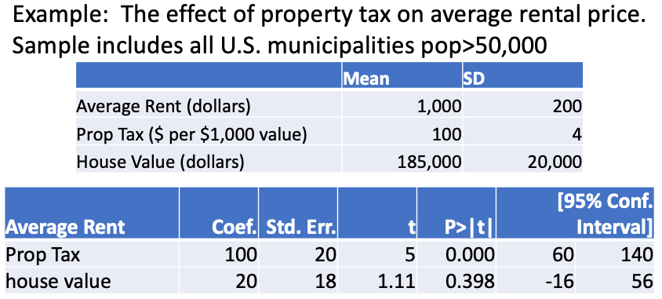
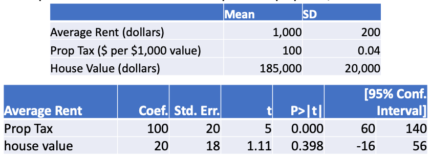
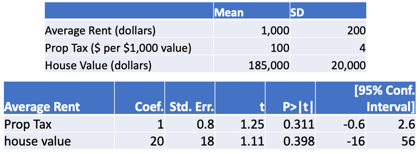

# Outline

```{r, include=FALSE}
library(tidyverse)
library(moderndive)
library(fivethirtyeight)
library(infer)
library(knitr)
set.seed(123)
options(scipen = 999)

state_trump <- hate_crimes %>%
  mutate(share_white = 1 - share_non_white,
         urbanization = if_else(share_pop_metro<=0.75, "low", "high")) %>% 
  select(state, 
         median_house_inc, 
         share_pop_hs, 
         share_white, 
         share_white_poverty, 
         share_vote_trump,
         urbanization) %>%
  filter(state != "District of Columbia") %>% 
  mutate_at(vars(share_pop_hs, share_white, share_white_poverty,
              share_vote_trump), funs(.*100)) %>% 
  rename(med_inc = median_house_inc, hs = share_pop_hs, urban = urbanization)
```

- p-values (probability-values)
- Comparing a sampling distribution to the null distribution
- Reporting statistically significant results
- Practical significance

---
# Regression table

$$MedHHInc = \beta_0 + \beta_1HSDegree + \beta_2 Urbanization + \epsilon$$ 

```{r, include=FALSE}
inc_mod <- lm(med_inc ~ hs + urban, 
              data = state_trump)
```

```{r, echo=FALSE}
get_regression_table(inc_mod) %>% 
  kable(digits = 0)
```

- We will learn the meaning behind `statistic` (less important) and `p_value` today. 

---
class: inverse, center, middle

# What is a p-value?

---
class: inverse, center, middle

# A p-value is the probability of obtaining my result or more extreme in a world where the **null hypothesis** is actually true. The p-value is misunderstood and abused in research. [Article1](https://www.vox.com/science-and-health/2017/7/31/16021654/p-values-statistical-significance-redefine-0005) [Article2](https://www.vox.com/latest-news/2019/3/22/18275913/statistical-significance-p-values-explained)

---
class: inverse, center, middle

# Okay. Let's first seek to understand hypothesis testing.

---
class: inverse, center, middle

# Hypothesis tests ask, "Is my result **so unlikely** that I can conclude with a **sufficient level of confidence** that there is statistically significant evidence in support of my hypothesis?"

---
# Structure of hypothesis test

- Alternative hypothesis $H_A$
  - Claims there is evidence for the phenomenon you are interested in testing.
  - Often denoted as the parameter does not equal $\theta \neq 0$

- Null hypothesis $H_0$
  - Claims there is no such evidence; the mutually exclusive opposite of the alternative
  - $\theta = 0$

---
# Example

```{r, echo=FALSE}
slice_sample(promotions, n = 10) %>% 
  kable()
```

---
# Example

```{r, echo=FALSE, fig.align='center'}
ggplot(promotions, aes(x = gender, fill = decision)) +
  geom_bar() +
  labs(title = "Observed Promotions", 
       x = "Gender of name on resume")
```

---
# Example

```{r, echo=FALSE, message=FALSE}
promotions %>% 
  group_by(gender, decision) %>% 
  summarize(n = n()) %>% 
  kable()
```

```{r}
(m_promo <- 21/24)

(f_promo <- 14/24)
```

---
# Example

- Descriptive:
  - For our one sample, we have calculated the proportion of males promoted $\hat{p}_M=0.88$ and proportion of females promoted $\hat{p}_F=0.58$
  - In this sample, the difference in proportion promoted is $\hat{p}_M-\hat{p}_F= 0.88-0.58=0.3$ or 30%.

--

- Inference:
  - But this is just a sample of an unobserved population. If we want to use this sample to claim there is a difference in the population, we need to use inference.
  - This sample provides us estimates of $P_M$, $P_F$, and $P_M-P_F$
  - The question is whether $P_M-P_F=0.3$ something close enough to that, or does $P_M-P_F=0$?

---
# Example

$H_A$: Males and females are not promoted in equal proportions. $P_M-P_F \neq 0$

$H_0$: Males and females are promoted in equal proportions. $P_M-P_F=0$

--

- Some might state the $H_A$ as "Males are promoted in higher proportion than females."
- $H_A: P_M-P_F>0$ and $H_0: P_M-P_F \leq 0$
- This is a one-tailed test instead of a two-tailed test
- I do not support one-tailed tests and won't be teaching them

---
# Hypothesis test conclusion

Hypothesis tests result in one of two possible conclusions:

1. Reject the null hypothesis that $\theta = 0$, thus $\theta \neq 0$, or

--

2. Fail to reject the null hypothesis, thus it could be the case that $\theta=0$ or $\theta \neq 0$. We can't tell from our evidence.

--

It is never the case that we accept the null hypothesis that $\theta = 0$

---
# Example

1. Results reject the null that males and females are promoted equally
  - Means we have statistically significant evidence that $P_M-P_F \neq 0$
  - Our results are too unlikely to be due to random noise

--

2. Results fail to reject the null that males and females are promoted equally
  - Means we do not have statistically significant evidence that $P_M-P_F \neq 0$
  - Our results are not unlikely enough; *could* be that $P_M-P_F = 0$

--

- Can **never** conclude males and females *are* promoted equally $P_M-P_F = 0$.

---
# Hypothesis test conclusions

```{r, echo=FALSE, fig.align='center'}
include_graphics('lectures_files/hypotest-tables.png')
```

---
# Example

- Suppose our estimate, $\hat{p}_M-\hat{p}_F$, of $P_M-P_F$ is so unlikely that we reject the null, concluding that males and females are not promoted in equal proportions $P_M-P_F \neq 0$.

--

- We learned last week that our estimate is a scientific guess based on a sample of data around which we construct a range of plausible values that capture the parameter (i.e. confidence interval)

--

- We also learned that the parameter can fall *anywhere* inside our confidence interval

- And our confidence interval could be 1 of the 5 out of 100 (assuming 95% CI) expected to fail to capture the parameter at all

---
# Example

- Therefore, we may reject the null, concluding $P_M-P_F \neq 0$ because our 95% CI does **not** include 0

--

- But our CI could be wrong and the true value is that $P_M-P_F = 0$
  - Type I error
  - False positive

--

- Or we could fail to reject the null because our 95% CI does include 0, so we can't rule out with high enough confidence that $P_M-P_F \neq 0$

--

- But our CI could be wrong and the true value is that $P_M-P_F \neq 0$
  - Type II error
  - False negative

---
# Type I vs. II error

- Is one error worse than another?

--

- No. It depends entirely on the context/consequence of the conclusion.

--

- Dilemma: the more we choose to reduce the chance of a false positive, the more we increase the chance of a false negative

- Have to balance the two based on the context

- Research community is strongly averse to false positives

---
class: inverse, center, middle

# "Is my result **so unlikely** that I can reject my null hypothesis with a **sufficient level of confidence**?" The p-value estimates the probability of obtaining our results (or more extreme) in a world where the null hypothesis is in fact true.

---
class: inverse, center, middle

# To estimate the probability of our results in a world where the null is true, we have to have an idea of what that world would look like. But we only have one sample of data and we don't know what world we are living in (i.e. null true or not). How do we estimate this probability?

---
class: inverse, center, middle

# We estimate the null distribution, similar to the sampling distribution, but the null distribution is centered at 0 as if the null hypothesis were actually true.

---
# Null distribution

```{r, echo=FALSE, fig.align='center', out.height='66%'}
include_graphics('lectures_files/nulldist.png')
```

- If the null were true like above, how far out does my estimate have to be for me to reject the null?

---
# Decision rule

- Suppose we declare that if the probability of our estimate $\hat{p}_M-\hat{p}_F= 0.88-0.58=0.3$ in a world where the null, $P_M-P_F = 0$, is true is less than 5%, then we will reject the null and conclude that $P_M-P_F \neq 0$.

--

- This means we have chosen a **significance level** of 5%, which is the same as choosing a **confidence level** of 95%.
  - Sometimes denoted $\alpha = 0.05$ where $\alpha$ is significance level

--

- Therefore, if our p-value is less than 0.05, we reject the null. If it is greater than or equal to 0.05, we fail to reject the null.

--

- If $pvalue<\alpha$, reject $H_0$
- If $pvalue \geq \alpha$, fail to reject $H_0$

---
# Example

- If the null were true, then there would be no correlation between gender and promotions

- If the null were true, promotions with respect to gender would be random

--

- If random, promotions between genders probably won't be equal, but would they be as different as what we see in our sample?

```{r}
(real_diff <- m_promo - f_promo)
```

---
# Example

- To simulate a world in which the null were true, we could randomly shuffle gender in our data

```{r, echo=FALSE}
promotions %>%
  slice(c(36, 39, 40, 1, 2, 22)) %>% 
  mutate(`shuffled gender` = sample(gender)) %>% 
  select(-id) %>% 
  mutate(`resume number` = 1:n()) %>% 
  select(`resume number`, everything()) %>% 
  kable()
```

---
# Example

```{r, echo=FALSE, fig.align='center'}
ggplot(promotions_shuffled, aes(x = gender, fill = decision)) +
  geom_bar() +
  labs(title = "Randomly Shuffled Gender", 
       x = "Gender of resume name")
```

---
# Example

```{r, echo=FALSE, message=FALSE}
promotions_shuffled %>% 
  group_by(gender, decision) %>% 
  summarize(n = n()) %>% 
  kable()
```

```{r}
(m_promo_shuff <- 18/24)

(f_promo_shuff <- 17/24)
```

---
# Example

- What if we repeated this random shuffling 1,000 times, calculating the difference in promotions between males and females each time?

- Then we could plot the 1,000 values as a histogram, giving us a distribution of differences between males and females in a world where promotions are random with respect to promotions

- Then we would have a simulated null distribution

---
# Example null distribution

```{r, echo=FALSE, fig.align='center'}
null_distribution <- promotions %>% 
  specify(formula = decision ~ gender, success = "promoted") %>% 
  hypothesize(null = "independence") %>% 
  generate(reps = 1000, type = "permute") %>% 
  calculate(stat = "diff in props", order = c("male", "female"))

visualize(null_distribution, bins = 10)
```

---
# Null distribution

- The **LLN** tells us the center of the null distribution will settle around 0, and the **CLT** tells us that the null distribution will be normal just like the sampling distribution.

- Therefore, we can calculate the percent of values expected to fall outside some chosen number of standard errors (a.k.a. standard deviations). That is, we can apply the **68-95-99 rule** to the null distribution.

---
# Example

**Center of null distribution**
```{r}
mean(null_distribution$stat)
```

**Standard error of null distribution**
```{r}
sd(null_distribution$stat)/sqrt(1000)
```

---
# Null distribution

**95% CI of null distribution**
```{r}
-0.0022-1.96*0.0041
-0.0022+1.96*0.0041
```

- 95% of differences between male and female promotions fall between -0.01 and 0.006

- Our observed difference was 0.3! How unlikely is this result if the null were actually true?

---
# Example

.pull-left[
```{r, echo=FALSE}
arrange(null_distribution, desc(stat)) %>% 
  head(n=7) %>% 
  kable()
```
]

.pull-right[
```{r, echo=FALSE}
arrange(null_distribution, stat) %>% 
  head(n=7) %>% 
  kable()
```
]

- Only 3 out of 1000 simulated differences are greater than or equal in either direction to the difference we observe in our sample. 

---
# Example p-value

.pull-left[
```{r, echo=FALSE, fig.align='center'}
visualize(null_distribution, bins = 10) + 
  shade_p_value(obs_stat = real_diff, direction = "two-sided")
```
]

.pull-right[

```{r, echo=FALSE}
null_distribution %>% 
  get_p_value(obs_stat = real_diff, direction = "two-sided") %>% 
  kable()
```

- The probability of obtaining an estimate of +/- 0.3 or greater is 3%.

- $0.03<0.05 \rightarrow$ reject the null $H_0$

- We have statistically significant evidence that males and females are promoted in different proportions.

]

---
# Back to regression table

```{r, echo=FALSE}
get_regression_table(inc_mod) %>% 
  kable(digits = 3)
```

- Can we now explain the prior concepts with respect to this table?

- What are the null and alternative hypotheses? What is the result of the test?

- How many standard errors is are our estimates from the center of the null distribution?

- What is the probability of obtaining our estimates or more extreme in a world where the null is true?

---
# Back to regression table

```{r, echo=FALSE}
get_regression_table(inc_mod) %>% 
  kable(digits = 3)
```

$H_0:$ $\beta_1 = 0$ Percent of population has no association/effect on median income

$H_A:$ $\beta_1 \neq 0$ Percent of population has an association/effect on median income

--

Reject the null. Our estimate is 7.6 standard errors away from 0. Probability of this result or more extreme in a world where the null is true less than 0.05%.

---
# Back to regression table

```{r, echo=FALSE}
get_regression_table(inc_mod) %>% 
  kable(digits = 3)
```

There is statistically significant evidence that educational attainment is positively associated with median income in states. On average, state median income increases approximately 1,993 dollars per 1 percentage point increase in the population with at least a high school degree, all else equal. With 95% confidence, a 1 p.p. increase in high school attainment is associated with an increase of median income between 1,465 and 2,521 dollars. 

---
# Example

- Again, could simulate a null world where `hs` and `med_inc` are random; calculating 1,000 regression slopes/estimates

```{r, echo=FALSE}
null_distn_slopes <- state_trump %>% 
  specify(response = med_inc, explanatory = hs) %>%
  hypothesize(null = "independence") %>% 
  generate(reps = 1000, type = "permute") %>% 
  calculate(stat = "slope")

null_distn_slopes %>% 
  head() %>% 
  kable(col.names = c('replicate', 'slope'))
```

---
# Example

```{r, echo=FALSE, fig.align='center'}
ggplot(null_distn_slopes, aes(x=stat)) +
  geom_histogram(bins = 15, color = "white") +
  geom_vline(xintercept = 1993, 
             color = "red", linetype = "dashed", size = 1.5) +
  geom_vline(xintercept = 1465, 
             color = "red", size = 1.5) +
  geom_vline(xintercept = 2521, 
             color = "red", size = 1.5) +
  labs(title = "Null distribution for education and median income")
```


---
# Credible analysis

```{r, echo=FALSE, fig.align='center'}
include_graphics('lectures_files/credible.png')
```

---
# Practical significance

- What is the typical change in the explanatory variable associated with the statistically significant estimate?

--

- Is the predicted change in the outcome due to a typical change in the explanatory variable negligible or meaningful?

--

- If the explanatory variable is statistically significant, is its confidence interval so close to zero that using the upper or lower bound instead of the midpoint estimate would make the predicted change in the outcome negligible? 

  - Or, if the explanatory variable is statistically insignificant, is its confidence interval so closely around zero that the entire range of plausible values of the parameter would lead to a negligible change in the outcome?
  
---
# Example

```{r, echo=FALSE, fig.align='center', out.height='33%', out.width='66%'}

```

- Is the property tax result practically significant?

--

- Typical change (standard deviation) in property tax is $4

- Predicted change in average rent from a 1 SD increase in property tax is $400, or at least 240.

- That's a 40% (24%) increase compared to the mean of rent and 2x (1.2x) the SD of rent. Practically significant!

---
# Example

```{r, echo=FALSE, fig.align='center', out.height='33%', out.width='66%'}

```

- Is the property tax result practically significant?

--

- Typical change in property tax is now $0.04

- Predicted change in average rent from 1 SD increase in property tax = $4. Not significant.

- Confidence intervals do not change this conclusion.

---
# Example

```{r, echo=FALSE, fig.align='center', out.height='33%', out.width='66%'}
include_graphics('lectures_files/prac-sig3.png')
```

- Is the property tax result practically significant?

--

- Same as first example and would be practically significant if not for the 95% CI being so close to 0.

- Minimum effect of a 1 SD increase in property tax could be as small as $8. Practical significance is questionable in this case.

---
# Example

```{r, echo=FALSE, fig.align='center', out.height='33%', out.width='66%'}
include_graphics('lectures_files/prac-sig4.png')
```

- Is the property tax result practically significant?

--

- Result is statistically insignificant. Effect of property tax is anywhere between -40 and 60, including 0. 

- Unlikely for statistical insignificance to have practical significance.

---
# Example

```{r, echo=FALSE, fig.align='center', out.height='33%', out.width='66%'}

```

- Is the property tax result practically significant?

--

- The exception to the rule on the previous slide. Even though statistically insignificant, the CI is very precisely around 0.

- A 1 SD increase in property tax ranges between -2.40 and 10.40 dollars. No plausible value is a meaningful change average rent. 

- This could be useful in reporting that there is no evidence that property tax has any meaningful impact on average rent.
