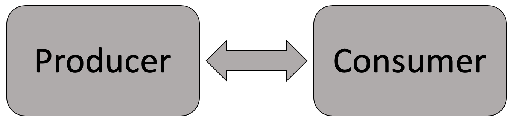

# Outline (Syllabus Review)

1. Why this course

2. Course objectives

3. Topics

4. Course materials

5. Course assignments

6. Policies

---

# Why statistics

- Data is the raw material of knowledge

- Statistics is the most powerful tool we have to convert raw information into something useful

- Helps us be more critical thinkers

---

# Planes and bullet holes

.pull-left[


Suppose we had 100 pounds (or 45.5 kg) of armor to add to each plane. How would you explain the best way to distribute that armor around the plane based on the data?

]

.pull-right[

Data from planes returning from battle:

```{r, include=FALSE}
library(tidyverse)
library(knitr)
bholes <- tibble(plane_section = c("Engine", "Body", "Fuel System", "Wings"),
                      holes_per_sqft = c(1.11, 1.73, 1.55, 1.8))
```

```{r, echo=FALSE}
kable(head(bholes), format = 'html')
```

]

---

# MPA Objectives

[Network of Schools of Public Policy, Affairs, and Administration](https://www.naspaa.org) promotes five core competencies

--

1. To Lead and Manage in Public Governance

2. To Participate in the Public Policy Process

3. **To analyze, synthesize, think critically, solve problems and make decisions**

4. To articulate and apply a public service perspective

5. To Communicate with a Diverse Workforce and Citizenry

---

# Course Objectives

- To analyze, synthesize, think critically, solve problems and make decisions
  - Students will **use various methods and analytical tools to analyze and interpret data** to provide effective reasoning for decision making and policy creation
  - Students will concisely inform the public and other stakeholders of decisions and initiatives through **the presentation of data and research findings**
  - Students will produce policy papers involving the synthesis of information, evaluation, and analysis of critical questions or problems currently facing the field of public administration and policy

---

# Course Objectives

- To Participate in the Public Policy Process

  - Students will **analyze policy alternatives using quantitative** and qualitative tools to evaluate decisions and explain potential ramifications for diverse constituencies

--

- To Communicate with a Diverse Workforce and Citizenry

  - Students will **execute specific strategies to enhance equity** within and representatives of the public workforce to ensure all people within a government’s jurisdiction are well served

---

# Why learn R

- Adams, et al. (2013) Statistical Software for Curriculum and Careers. Journal of Public Affairs Education.

  - 80% of MPA schools use stats software other than Excel
  
  - 30% of public sector jobs asked for (at least) familiarity with stats software other than Excel

--

- **Replication**

--

- R is popular across many industries

- R is free

- Struggle of programming helps you think and learn

---
# Why learn R



<br>

- Both sides need to communicate

- We are always consuming statistics

- Producing helps you be a more critical consumer

---
class: inverse, center, middle

# I want this course to help you be as competitive as possible in your respective job markets through competency in statistics and statistical software.

---

# Topics

.pull-left[
**Description**

- Data
- Measurement
- Descriptive measures
- Visualization
- Regression

]

--

.pull-right[
**Inference**
- Causality
- Sampling
- Hypothesis tests
- Significance
- Assumptions

**Bonus Skills**
- Forecasting
- Panel Analysis
]

---

# Balancing Concepts and R

- Operating R is primary focus at first, then we will turn more to concepts

- Statistical concepts initially easy, then increase in difficulty

- Initial struggles are part of the process; do not worry

---

# Course Materials

- All materials are free

- Almost all materials produced using R

- Text: [Data Apps in PA](https://alex-combs.github.io/data-apps-text/)
  - List of supplemental texts provided in the preface

- Slides mostly build off of text with different examples or additional R code that may be helpful for assignments

---
# Course Components & Assignments

- 9 R Chapters (10% of grade)

- 10 R Labs (10% of grade)

- 3 Problem sets (40% of grade)

- 2 Exams (40% of grade)

---
# R Chapters

- Provides weekly R practice

- Designed to take about an hour or point of diminishing returns

- Graded pass/fail conditional on good faith effort

- Sample answers available on eLC once you upload your answers

- You should compare your answers to my own prior to class

---
# R Labs

- Supervised R practice

- Instructional slides will become available at 6:30 the day of class

- If you attend and participate, you receive credit

- If you choose not to attend, you may upload your lab by the end of the day for credit

---
# Problem Sets

- Combination of conceptual questions and applied R skills

- Graded on 100 point scale

- Designed to take about 10-20 hours
  - **Do not** try to complete in one sitting
  - Each week will prepare you to answer certain questions
  - We will have covered all material relevant to the problem set by the week prior to its due date

- Can work in groups of at most 3

---
# Exams

- Midterm and final administered via eLC

- Graded on 100 point scale

- Focuses entirely on concepts and interpretation of analysis

- No use of R

---
# Remainder

- Attendance not required; no excuses needed unless pertains to missing a deadline

- Link to schedule office hours is on syllabus

- I am responsive to emails

- Check discussion boards and consider using them instead of email

