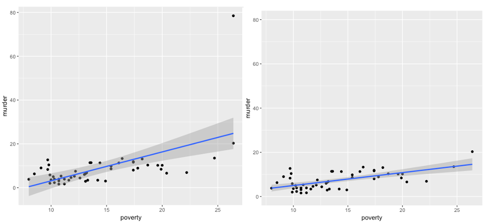

# Outline

```{r, include=FALSE}
library(tidyverse)
library(moderndive)
library(fivethirtyeight)
library(broom)
library(knitr)
library(ggfortify)
set.seed(123)
options(scipen = 999)

state_trump <- hate_crimes %>%
  mutate(share_white = 1 - share_non_white,
         urbanization = if_else(share_pop_metro<=0.75, "low", "high")) %>% 
  select(state, 
         median_house_inc, 
         share_pop_hs, 
         share_white, 
         share_white_poverty, 
         share_vote_trump,
         urbanization) %>%
  mutate_at(vars(share_pop_hs, share_white, share_white_poverty,
              share_vote_trump), funs(.*100)) %>% 
  rename(med_inc = median_house_inc, hs = share_pop_hs, urban = urbanization,
         white = share_white, white_pov = share_white_poverty)
```

- Are my confidence interval and hypothesis test valid?
  - Classic assumptions of regression (LINE)
  - Multicollinearity
  - Outliers, high-leverage, and high-influence

---
# Credible analysis

```{r, echo=FALSE, fig.align='center'}
include_graphics('lectures_files/credible.png')
```

- Today is all about statistical conclusion validity

---
# Regression is BLUE

- Regression gives us the best (most precise), linear, unbiased, estimate

- But only if a set of assumptions hold

---
# Consequences of violated assumptions

- Can't be so sure that **LLN** and **CLT** are working properly for inference

- Biased estimates

- Invalid hypothesis test
  - Higher chance of false positives or negatives than p-value indicates

- Less precision around estimate
  - Undesirable but tolerable

---
# Regression table

$$TrumpVote = \beta_0 + \beta_1PctWhite + \beta_2 PctWhitePov + \epsilon$$ 

```{r, include=FALSE}
trump_mod <- lm(share_vote_trump ~ white + white_pov,
                data = state_trump)
```

```{r, echo=FALSE}
get_regression_table(trump_mod) %>% 
  kable(digits = 2)
```

- We finally understand everything this table is telling us. But it could all be wrong if we don't check assumptions.

---
# It's all about residuals

```{r, include=FALSE}
trump_mod.metrics <- augment(trump_mod)
trump_mod2 <- lm(share_vote_trump ~ white,
                data = state_trump)
trump_mod2.metrics <- augment(trump_mod2)
```

```{r, echo=FALSE, message=FALSE, fig.align='center', fig.height=7}
trump_mod2.graph <- ggplot(trump_mod2.metrics, aes(white, share_vote_trump)) +
  geom_point() +
  stat_smooth(method = lm, se = FALSE) +
  geom_segment(aes(xend = white, yend = .fitted), color = "red", size = 0.3) +
  theme_minimal() +
  labs(y = 'Trump Vote',
       x = 'Pct. White')

trump_mod2.graph
```

---
# Classical regression assumptions

- LINE
  - **L**inear relationship between $x$s and $y$ (or nonlinear relationship included appropriately)
  - **I**ndependent residuals (independent observations; random sampling)
  - **N**ormality of residuals
  - **E**qual variance in residuals

--

- Should at least be knowledgeable enough to competently ask an analyst whether they have checked their regression assumptions and explain the consequences

- Of course, we will go one step further and learn how to check them ourselves

---
# Residual vs. Fitted Plot

.pull-left[
```{r, echo=FALSE, message=FALSE, fig.align='center'}
trump_mod2.graph
```
]

.pull-right[
```{r, echo=FALSE, message=FALSE, fig.align='center'}
ggplot(trump_mod2.metrics, aes(.fitted, .resid)) +
  geom_point() +
  geom_segment(aes(xend = .fitted, yend = 0), color = "red", size = 0.3) +
  geom_hline(yintercept = 0, color = 'red') +
  theme_minimal() +
  labs(y = 'Residuals',
       x = 'Fitted values (y-hat)')
```
]

- Assumptions L, N, and E can be seen using an RVF plot

- We want to see no discernible pattern in the RVF plot points

---
# Linear assumption

```{r, echo=FALSE, fig.align='center'}
include_graphics('lectures_files/rvfp-linear.png')
```

---
# Linear assumption

```{r, echo=FALSE, fig.align='center'}
include_graphics('lectures_files/rvfp-linear2.png')
```

---
# Normally distributed residuals

```{r, echo=FALSE, fig.align='center'}
include_graphics('lectures_files/norm-residuals.png')
```

---
# Normally distributed residuals

```{r, echo=FALSE, fig.align='center'}
include_graphics('lectures_files/rvfp-normality.png')
```

---
# Equal variance in residuals

```{r, echo=FALSE, fig.align='center'}
include_graphics('lectures_files/homo-hetero.png')
```

---
# Equal variance in residuals

```{r, echo=FALSE, fig.align='center'}
include_graphics('lectures_files/homoskedasticity.png')
```

---
# Equal variance in residuals

```{r, echo=FALSE, fig.align='center'}
include_graphics('lectures_files/heteroskedasticity.png')
```

---
# Independent residuals/observations

- Evidence of linear or normal violation could be due to violation of independence

- Requires an understanding of how sample was collected

- True independence is extremely hard to achieve unless sample was randomized

---
# Consequences

- Violation of **L** or **N** or **I**
  - Biased estimates

- Violation of **E**
  - Biased standard errors, thus biased confidence intervals
  - Invalid hypothesis testing

---
# Solutions

- Violation of **L** or **N**
  - Modify the regression model

- Violation of **E**
  - Log transform the outcome variable
  - Statistical correction outside scope of class (robust standard errors)

- Violation of **I**
  - Obtain a better sample
  - Control for the variables related to non-randomness
  - Statistical correction outside scope of class (clustered standard errors)

---
# Multicollinearity

- When two explanatory variables are strongly correlated with each other

- Since regression computes the association between an $x$ and $y$, **controlling for all other $x$s**, multicollinearity can mask statistically significant associations between those $x$s and the $y$.

--

- Multicollinearity can cause false negatives

---
# Multicollinearity

- Detection
  - If two variables have a correlation stronger than +/- 0.8, multicollinearity might be a problem
  - Variance Inflation Factor (VIF) > 10 is another method

- Solutions
  - Combine the collinear variables into a single index variable
  - If one variable is really important to your RQ, drop the other. Be careful not to introduce OVB!

---
# Unusual and influential data

- Regression outlier
  - An observation with a large residual

- High-leverage
  - An observation with a large deviation from the explanatory variable's mean

- High-influence
  - A regression outlier with high leverage

- Removing an influential observation will sunbstantially change regression results

---
# Unusual and influential data

```{r, echo=FALSE, fig.align='center'}

```

---
# Back to regression table

$$TrumpVote = \beta_0 + \beta_1PctWhite + \beta_2 PctWhitePov + \epsilon$$ 

```{r, echo=FALSE}
get_regression_table(trump_mod) %>% 
  kable(digits = 2)
```

---
# In R

- R makes all of this very easy!

- After saving a regression model...

```{r, eval=FALSE}
trump_mod <- lm(share_vote_trump ~ white + white_pov,
                data = state_trump)
```

- Run the following, which generates four diagnostic plots

```{r, eval=FALSE}
plot(trump_mod)
```

---
# RVF Plot

```{r, echo=FALSE, fig.align='center', fig.height=5}
plot(trump_mod, 1)
```

- We want to see no pattern and a straight red line along 0

- Especially useful for evaluating **L**

---
# Normal Q-Q

```{r, echo=FALSE, fig.align='center', fig.height=5}
plot(trump_mod, 2)
```

- We want to see points fall approximately along the straight line

- If not, **N** may be violated

---
# Scale-Location

```{r, echo=FALSE, fig.align='center', fig.height=5}
plot(trump_mod, 3)
```

- We want to see a straight red line

- If not, **E** may be violated

---
# Residuals vs. Leverage

```{r, echo=FALSE, fig.align='center', fig.height=5}
plot(trump_mod, 5)
```

- We want to see a relatively straight red line

- More importantly, this graph will place observations along a dotted Cook's distance that may be a problem

---
# Cook's distance

- Cook's distance is the most common measure for identifying high-influence observations

- A rule of thumb is that an observation has high influence if Cook's distance exceeds...

$$4/(n-p-1)$$

- Where $n$ is the number of observations and $p$ the number of explanatory variables in our model

- This is a rule of thumb; even if you an observation does not meet this threshold, it is wise to consider whether that observation is different somehow from other observations

---
# Cook's distance

```{r, fig.align='center', fig.height=5}
plot(trump_mod, 4)
```

- This is a separate graph that focuses on Cook's distance

---
# Precise Cook's distance

```{r, eval=FALSE}
library(broom)
trump_mod.metrics <- augment(trump_mod) %>% 
  arrange(desc(.cooksd))
```

```{r, echo=FALSE}
trump_mod.metrics %>%
  select(-white, -white_pov) %>%
  arrange(desc(.cooksd)) %>% 
  kable(digits = 2)
```

---
# Influencer?

```{r}
4/(51-2-1)
```

- So observation 9 doesn't exceed the threshold, but it still warrants investigation

---
# Identifying an observation from `plot()`

- With 51 observations, we could easily identify row 9

- But what if we're working with 51,000 observations?

```{r, eval=FALSE}
state_trump[9, ]
```

```{r, echo=FALSE}
state_trump[9, ] %>% 
  kable()
```

- Even though D.C. doesn't exceed the rule of thumb, it is just different; probably warrants exclusion

---
# Influencer?

```{r}
state_trump_nodc <- state_trump %>%
  filter(state != "District of Columbia")

trump_mod_nodc <- lm(share_vote_trump ~ white + white_pov,
                data = state_trump_nodc)
```

```{r, eval=FALSE}
get_regression_table(trump_mod_nodc)
```

```{r, echo=FALSE}
get_regression_table(trump_mod_nodc) %>% 
  kable(digits = 2)
```

- Need to compare this to the results including D.C. on slide 6

---
# Results including DC

```{r, echo=FALSE}
get_regression_table(trump_mod) %>% 
  kable(digits = 2)
```

- Estimates changed a quite a bit

---
# Comparing regression lines

.pull-left[
```{r, message=FALSE, echo=FALSE, fig.align='center'}
ggplot(data = state_trump, 
       aes(y = share_vote_trump, x = white_pov)) + 
  geom_point(color = 'springgreen4') + 
  geom_smooth(method = "lm", se = FALSE, color = 'steelblue4') +
  scale_y_continuous(limits = c(0,80)) +
  labs(x = "Percent of whites in poverty", 
       y = "Percent of population voted for Trump", 
       title = "White poverty and Trump support in the US") +
  theme_minimal()
```
]

.pull-right[
```{r, message=FALSE, echo=FALSE, fig.align='center'}
ggplot(data = state_trump_nodc, 
       aes(y = share_vote_trump, x = white_pov)) + 
  geom_point(color = 'springgreen4') + 
  geom_smooth(method = "lm", se = FALSE, color = 'steelblue4') +
  scale_y_continuous(limits = c(0,80)) +
  labs(x = "Percent of whites in poverty", 
       y = "Percent of population voted for Trump", 
       title = "White poverty and Trump support in the US") +
  theme_minimal()
```
]

- D.C. (on left) pulls the left of regression line down; forces slope to be greater

---
# Statistical test on assumptions

```{r, eval=FALSE}
library(gvlma)
gvlma(trump_mod)
```

```{r, eval=FALSE}
gvlma(trump_mod_nodc)
```

- Can't show on slide; demonstrate in R

- Excluding DC passes test

---
# Checking multicollinearity

```{r, message=FALSE}
library(car)
```
```{r}
vif(trump_mod_nodc)
```

- Nothing greater than 10; no multicollinearity