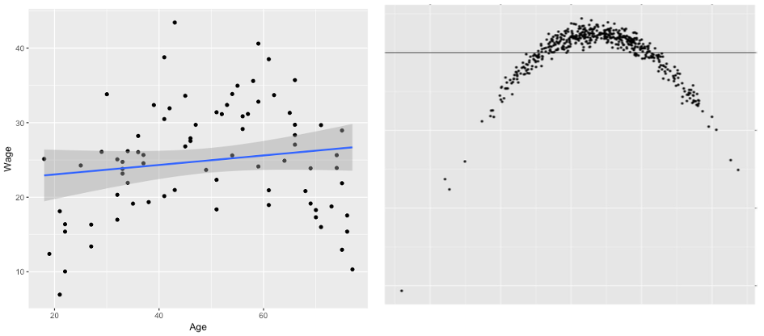
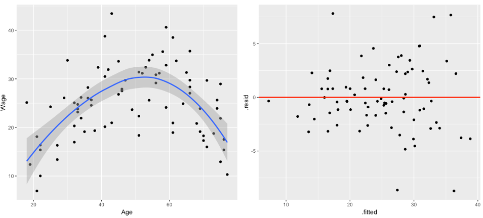
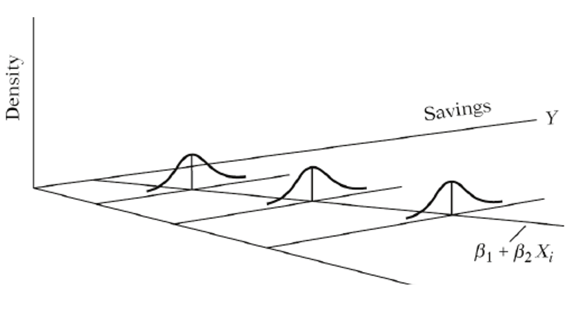
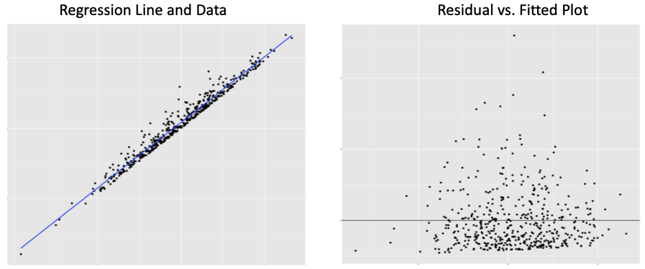
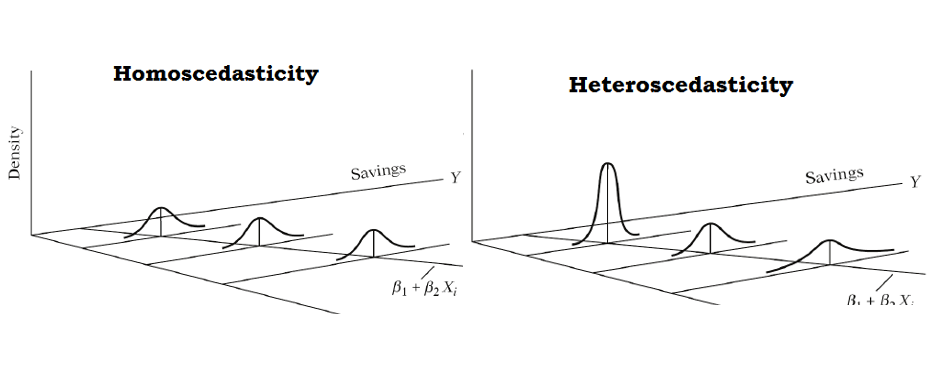
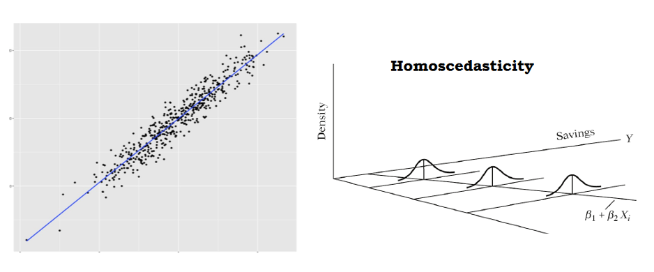
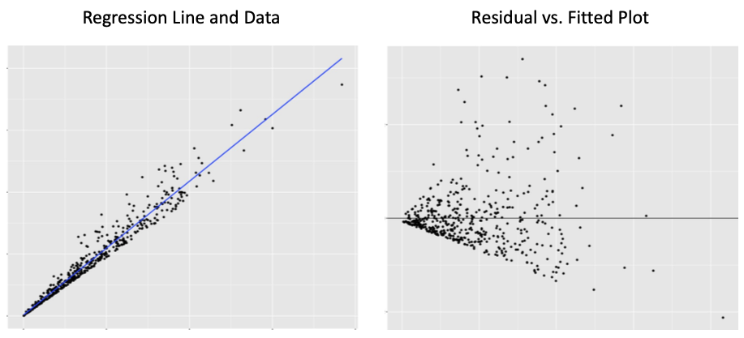
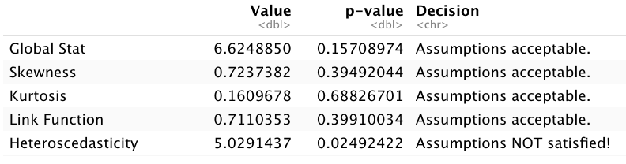

# Outline

```{r, include=FALSE}
library(tidyverse)
library(moderndive)
library(fivethirtyeight)
library(broom)
library(knitr)
library(ggfortify)
set.seed(123)
options(scipen = 999)

state_trump <- hate_crimes %>%
  mutate(share_white = 1 - share_non_white,
         urbanization = if_else(share_pop_metro<=0.75, "low", "high")) %>% 
  select(state, 
         median_house_inc, 
         share_pop_hs, 
         share_white, 
         share_white_poverty, 
         share_vote_trump,
         urbanization) %>%
  mutate_at(vars(share_pop_hs, share_white, share_white_poverty,
              share_vote_trump), funs(.*100)) %>% 
  rename(med_inc = median_house_inc, hs = share_pop_hs, urban = urbanization,
         white = share_white, white_pov = share_white_poverty)
```

- Are my regression results statistically valid?
  - Classic assumptions of regression (LINE)
  - Multicollinearity
  - Outliers, high-leverage, and high-influence

- Goal is to have sufficient knowledge to ask good questions and explain consequences if an analyst did not check assumptions

---
class: inverse, center, middle

# Classical assumptions of linear regression

---
# Regression table

$$TrumpVote = \beta_0 + \beta_1PctWhite + \beta_2 PctWhitePov + \epsilon$$ 

```{r, include=FALSE}
trump_mod <- lm(share_vote_trump ~ white + white_pov,
                data = state_trump)
```

```{r, echo=FALSE}
get_regression_table(trump_mod) %>% 
  kable()
```

- We now understand all the information in this table. 

--

- But the information could be wrong if regression assumptions are violated.

---
# Concerns

- Our data or regression model choices may cause **LLN** or **CLT** to fail.

- Biased estimates
  - Systematically higher/lower estimates than the parameter

- Invalid hypothesis test
  - Inflated chance of false positives or false negatives

- Wider confidence intervals than necessary (i.e., less precision)
  - Undesirable but tolerable

---
# Valid Assumptions Depend on Residuals

```{r, include=FALSE}
trump_mod.metrics <- augment(trump_mod)
trump_mod2 <- lm(share_vote_trump ~ white,
                data = state_trump)
trump_mod2.metrics <- augment(trump_mod2)
```

```{r, echo=FALSE, message=FALSE, fig.align='center', fig.height=7}
trump_mod2.graph <- ggplot(trump_mod2.metrics, aes(white, share_vote_trump)) +
  geom_point() +
  stat_smooth(method = lm, se = FALSE) +
  geom_segment(aes(xend = white, yend = .fitted), color = "red", size = 0.3) +
  theme_minimal() +
  labs(y = 'Trump Vote',
       x = 'Pct. White')

trump_mod2.graph
```

---
# Classical regression assumptions

- LINE

- **L**inear relationship between $x$ and $y$ 

  - Or proper inclusion of a nonlinear relationship

--

- **I**ndependent residuals (independent observations; random sampling)

--

- **N**ormality of residuals

--

- **E**qual variance in residuals

---
# Residual vs. Fitted Plot (RVF)

.pull-left[
```{r, echo=FALSE, message=FALSE, fig.align='center'}
trump_mod2.graph
```
]

.pull-right[
```{r, echo=FALSE, message=FALSE, fig.align='center'}
ggplot(trump_mod2.metrics, aes(.fitted, .resid)) +
  geom_point() +
  geom_segment(aes(xend = .fitted, yend = 0), color = "red", size = 0.3) +
  geom_hline(yintercept = 0, color = 'red') +
  theme_minimal() +
  labs(y = 'Residuals',
       x = 'Fitted values (y-hat)')
```
]

- Assumptions **L**, **N**, and **E** can be inspected using an RVF plot (on right).

- We want to see no obvious pattern in the RVF plot points

---
# Linear assumption

```{r, echo=FALSE, fig.align='center'}

```

- Obvious pattern in RVF on the right

- Violation of **L**

---
# Linear assumption

```{r, echo=FALSE, fig.align='center'}

```

- Changing the model to quadratic has improved the RVF

---
# Normally distributed residuals

```{r, echo=FALSE, fig.align='center'}

```

---
# Normally distributed residuals

```{r, echo=FALSE, fig.align='center'}

```

- Pattern on right shows a highly skewed distribution of residuals

- Violation of **N**

---
# Equal variance in residuals

```{r, echo=FALSE, fig.align='center'}

```

---
# Equal variance in residuals

```{r, echo=FALSE, fig.align='center'}

```

- Spread of the distribution is constant along the regression line

---
# Equal variance in residuals

```{r, echo=FALSE, fig.align='center'}

```

- Spread of distribution clearly changing

- Violation of **E**

---
# Independent residuals/observations

- Cannot directly observe violation of **I**

- If there are signs that **L** or **N** have been violated, could be violation of **I**

--

- Evaluating **I** requires an understanding of how observations in the data are related to each other

- Independence is hard to achieve unless sample is random

---
# Consequences

- Violation of **L** or **N** or **I**
  - Biased estimates

- Violation of **E**
  - Biased standard errors, thus biased confidence intervals
  - Invalid hypothesis testing

---
# Solutions

- Violation of **L** or **N**
  - Include quadratic or log transformations

- Violation of **E**
  - Log transform the outcome variable
  - Statistical correction outside scope of class (robust standard errors)

- Violation of **I**
  - Control for the variables that capture how observations are related to each other
  - Statistical correction outside scope of class (clustered standard errors)

---
class: inverse, center, middle

# Multicollinearity

---
# Multicollinearity

- When two explanatory variables are strongly correlated with each other

- Since regression computes the association between an $x$ and $y$, **controlling for all other $x$s**, multicollinearity can mask statistically significant associations between an $x$ and $y$.

--

- In other words, multicollinearity can cause false negatives

---
# Multicollinearity

- Detection
  - If two variables have a correlation stronger than +/- 0.8, multicollinearity might be a problem
  - Variance Inflation Factor (VIF) is another method
    - A VIF greater than 10 indicates multicollinearity may be a problem

- Solutions
  - Combine the variables into a single index variable
  - If one variable is really important to the analysis, exclude the variables correlated to it. Be careful not to introduce omitted variable bias.

---
class: inverse, center, middle

# Unusual and influential data

---
# Unusual and influential data

- Regression outlier
  - An observation with a large residual

--

- High-leverage
  - An observation with a large deviation from the explanatory variable's mean

--

- High-influence
  - A regression outlier with high leverage

--

- An influential observation is an observation that, if removed, meaningfully changes regression results

---
class: inverse, center, middle

# Regression diagnostics in R

---
# Revisiting Trump Support

$$TrumpVote = \beta_0 + \beta_1PctWhite + \beta_2 PctWhitePov + \epsilon$$ 

```{r, echo=FALSE}
get_regression_table(trump_mod) %>% 
  kable()
```

- We got our initial results. 

- Now we should check assumptions.

---
# In R

- After saving a regression model...

```{r, eval=FALSE}
trump_mod <- lm(share_vote_trump ~ white + white_pov,
                data = state_trump)
```

- Run the following, which generates four diagnostic plots

```{r, eval=FALSE}
plot(trump_mod)
```

- Each plot targets a specific assumption or issue

---
# RVF Plot

```{r, echo=FALSE, fig.align='center', fig.height=5}
plot(trump_mod, 1)
```

- We want to see no obvious pattern and a relatively straight red line along 0

- Especially useful for evaluating **L**

---
# Normal Q-Q

```{r, echo=FALSE, fig.align='center', fig.height=5}
plot(trump_mod, 2)
```

- We want to see points fall approximately along the dotted line

- If not, suggests **N** may be violated

---
# Scale-Location

```{r, echo=FALSE, fig.align='center', fig.height=5}
plot(trump_mod, 3)
```

- We want to see a straight red line

- If not, evidence **E** may be violated

---
# Residuals vs. Leverage

```{r, echo=FALSE, fig.align='center', fig.height=5}
plot(trump_mod, 5)
```

- Useful for identifying high-influence observations

- Observations that cross the dotted Cook's distance may be a problem

---
# Cook's distance

- Cook's distance is the most common measure for identifying high-influence observations

- One rule of thumb is that an observation has high influence if Cook's distance exceeds...

$$4/(n-p-1)$$

- Where $n$ is the number of observations and $p$ the number of explanatory variables in our model

- Even if an observation does not meet this threshold, it is worth considering whether an observation is somehow different from other observations

---
# Influencer?

- Model has 51 observations and 2 explanatory variables. 

- Threshold is:

```{r}
4/(51-2-1)
```

---
# Cook's distance

```{r, fig.align='center', fig.height=5}
plot(trump_mod, 4)
```

- Observations 9, 18, 20, and 46 may be worth investigating


---
# Identifying an observation

- Which observations are rows 9, 18, 20, and 46? Can use subsetting.

```{r, eval=FALSE}
state_trump[c(9,18,20,46), ]
```

```{r, echo=FALSE}
state_trump[c(9,18,20,46), ] %>% 
  kable()
```

- D.C. probably warrants exclusion.

---
# Influencer?

- Can create a new dataset that excludes DC, then run the regression using the new dataset

```{r}
state_trump_nodc <- state_trump %>%
  filter(state != "District of Columbia")

trump_mod_nodc <- lm(share_vote_trump ~ white + white_pov,
                data = state_trump_nodc)
```

```{r, eval=FALSE}
get_regression_table(trump_mod_nodc)
```

---
# Comparing results

- Including DC

```{r, echo=FALSE}
get_regression_table(trump_mod) %>% 
  kable()
```

- Excluding DC

```{r, echo=FALSE}
get_regression_table(trump_mod_nodc) %>% 
  kable()
```

---
# Influencer?

- Whether change in results is meaningful can be subjective

- Obvious meaningful changes:
  - Change in statistical significance
  - Estimates change between positive and negative
  - Changes validity of LINE assumptions

- Consider whether it makes sense to include or exclude certain observations

---
# Comparing regression lines

.pull-left[
```{r, message=FALSE, echo=FALSE, fig.align='center'}
ggplot(data = state_trump, 
       aes(y = share_vote_trump, x = white_pov)) + 
  geom_point(color = 'springgreen4') + 
  geom_smooth(method = "lm", se = FALSE, color = 'steelblue4') +
  scale_y_continuous(limits = c(0,80)) +
  labs(x = "Percent of whites in poverty", 
       y = "Percent of population voted for Trump", 
       title = "White poverty and Trump support in the US") +
  theme_minimal()
```
]

.pull-right[
```{r, message=FALSE, echo=FALSE, fig.align='center'}
ggplot(data = state_trump_nodc, 
       aes(y = share_vote_trump, x = white_pov)) + 
  geom_point(color = 'springgreen4') + 
  geom_smooth(method = "lm", se = FALSE, color = 'steelblue4') +
  scale_y_continuous(limits = c(0,80)) +
  labs(x = "Percent of whites in poverty", 
       y = "Percent of population voted for Trump", 
       title = "White poverty and Trump support in the US") +
  theme_minimal()
```
]

- D.C. (on left) pulls the left of regression line down; causing slope to be steeper

---
# Statistical test on assumptions

```{r, eval=FALSE}
library(gvlma)
gvlma(trump_mod)
```

```{r, echo=FALSE, fig.align='center'}
include_graphics('lectures_files/gvlma1.png')
```

- Global Stat: Overall test of your model
- Skewness: Primary test of **N**; secondary test for influence
- Kurtosis: Primary test for influence; secondary test of **N**
- Link Function: Test of **L**
- Heteroskedasticity: Test of **E**

---
# Statistical test on assumptions

```{r, eval=FALSE}
gvlma(trump_mod_nodc)
```
```{r, echo=FALSE, fig.align='center'}

```

- Exclusion of DC makes a difference

---
# Checking multicollinearity

```{r, message=FALSE}
library(car)
```
```{r}
vif(trump_mod_nodc)
```

- Nothing greater than 10; no multicollinearity