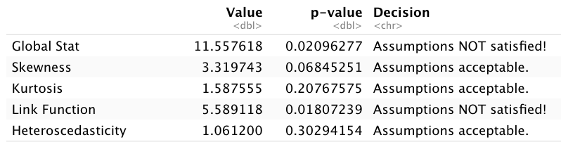

# Outline

```{r, include=FALSE}
library(tidyverse)
library(moderndive)
library(carData)
library(car)
library(gvlma)
library(fivethirtyeight)
library(broom)
library(knitr)
library(ggfortify)
set.seed(123)
options(scipen = 999)

trump_vote <- hate_crimes %>%
  mutate(share_white = 1 - share_non_white,
         urbanization = if_else(share_pop_metro<=0.75, "low", "high")) %>% 
  select(state, 
         median_house_inc, 
         share_pop_hs, 
         share_white, 
         share_white_poverty, 
         share_vote_trump,
         urbanization) %>%
  mutate_at(vars(share_pop_hs, share_white, share_white_poverty,
              share_vote_trump), funs(.*100)) %>% 
  rename(med_inc = median_house_inc, hs = share_pop_hs, urban = urbanization,
         white = share_white, white_pov = share_white_poverty)
```

- Are regression results statistically valid?
  - Classic assumptions of regression (LINE)
  - Multi-collinearity
  - Outliers, high-leverage, and high-influence
  
---
# Setup

> **Start a new project and Rmd**

> **Change YAML.**

```{r, eval=FALSE}
---
title: "RLab 7: Reporting Regression"
author: "Your Name"
output: 
  html_document:
    theme: spacelab
    df_print: paged
---
```

---
# Setup

> **Download `trump_vote` data on eLC and import**

> **Load the following packages**

```{r, eval=FALSE}
library(tidyverse)
library(moderndive)
library(carData)
library(car)
library(gvlma)
```

---
# Data Summary

> **Use the `summary()` function to obtain a simple display of summary statistics**

---
# Regression

> **Run the following regression and produce tables of results and goodness-of-fit**

$$TrumpVoteShare = \beta_0 + \beta_1PctWhite + \beta_2 PctWhitePov + \epsilon$$ 
---
# Regression

```{r, include=FALSE}
trump_mod <- lm(share_vote_trump ~ white + white_pov,
                data = trump_vote)
```

```{r, echo=FALSE}
get_regression_table(trump_mod) %>% 
  kable()
```

- We now understand all the information in this table. 

- But the information could be wrong if regression assumptions are violated.

---
class: inverse, center, middle

# Classical assumptions of linear regression

---
# Concerns

- Biased estimates
  - Systematically higher/lower estimates than the parameter

- Invalid hypothesis test
  - Inflated chance of false positives or false negatives

- Wider confidence intervals (less precision) than necessary

---
# Assumptions Focus on Residuals

```{r, include=FALSE}
trump_mod.metrics <- augment(trump_mod)
trump_mod2 <- lm(share_vote_trump ~ white,
                data = trump_vote)
trump_mod2.metrics <- augment(trump_mod2)
```

```{r, echo=FALSE, message=FALSE, fig.align='center', fig.height=7}
trump_mod2.graph <- ggplot(trump_mod2.metrics, aes(white, share_vote_trump)) +
  geom_point() +
  stat_smooth(method = lm, se = FALSE) +
  geom_segment(aes(xend = white, yend = .fitted), color = "red", linewidth = 0.3) +
  theme_minimal() +
  labs(y = 'Trump Vote',
       x = 'Pct. White')

trump_mod2.graph
```

---
# Classical regression assumptions

- **L.I.N.E.**

- **L**inear relationship between $x$ and $y$ 

  - Or proper inclusion of a nonlinear relationship

--

- **I**ndependent residuals

  - Requires independent observations; data of one observation shares no correlation with other observations

--

- **N**ormality of residuals

- **E**qual variance in residuals

---
# Residual vs. Fitted Plot (RVF)

.pull-left[
```{r, echo=FALSE, message=FALSE, fig.align='center'}
trump_mod2.graph
```
]

.pull-right[
```{r, echo=FALSE, message=FALSE, fig.align='center'}
ggplot(trump_mod2.metrics, aes(.fitted, .resid)) +
  geom_point() +
  geom_segment(aes(xend = .fitted, yend = 0), color = "red", linewidth = 0.3) +
  geom_hline(yintercept = 0, color = 'red') +
  theme_minimal() +
  labs(y = 'Residuals',
       x = 'Fitted values (y-hat)')
```
]

- Assumptions **L**, **N**, and **E** can be inspected using an RVF plot (on right).

- We want to see no obvious pattern in the RVF plot points

---
# Linear assumption

```{r, echo=FALSE, fig.align='center'}
include_graphics('lectures_files/rvfp-linear.png')
```

- Obvious pattern in RVF on the right

- Violation of **L**

---
# Linear assumption

```{r, echo=FALSE, fig.align='center'}
include_graphics('lectures_files/rvfp-linear2.png')
```

- Changing the model to quadratic has improved the RVF

---
# Normally distributed residuals

```{r, echo=FALSE, fig.align='center'}
include_graphics('lectures_files/norm-residuals.png')
```

---
# Normally distributed residuals

```{r, echo=FALSE, fig.align='center'}
include_graphics('lectures_files/rvfp-normality.png')
```

- Pattern on right shows a highly skewed distribution of residuals

- Violation of **N**

---
# Equal variance in residuals

```{r, echo=FALSE, fig.align='center'}
include_graphics('lectures_files/homo-hetero.png')
```

---
# Equal variance in residuals

```{r, echo=FALSE, fig.align='center'}
include_graphics('lectures_files/homoskedasticity.png')
```

- Spread of the distribution is constant along the regression line

---
# Equal variance in residuals

```{r, echo=FALSE, fig.align='center'}
include_graphics('lectures_files/heteroskedasticity.png')
```

- Spread of distribution clearly changing

- Violation of **E**

---
# Independent residuals/observations

- Cannot directly observe violation of **I**

- Requires an understanding of how observations in the data are related to each other

- Examples of possible dependencies:
  - Schools in the same district
  - People in the same household
  - Counties treated by the same state policy
  - Past periods related to current, future periods
  
- If **L** or **N** are violated, could be due to violation of **I**

---
# Potential Consequences

- Violation of **L** or **N** or **I**
  - Biased estimates

- Violation of **E**
  - Biased standard errors, thus biased confidence intervals
  - Invalid hypothesis testing

---
# Checking Assumptions

- The `gvlma(saved_results)` function from the gvlma package will perform a test of assumptions

  - GVLMA:  Global Validation of Linear Model Assumptions

> **Run `gvlma()` on your saved results**

---
# GVLMA

```{r, eval=FALSE, include=FALSE}
library(gvlma)
gvlma(trump_mod)
```

```{r, echo=FALSE, fig.align='center'}

```

- Global Stat: Holistic test of assumptions
- Skewness: Primary test of **N**; secondary test for influence
- Kurtosis: Primary test for influence; secondary test of **N**
- Link Function: Test of **L**
- Heteroskedasticity: Test of **E**

---
# Checking Assumptions

- The `plot(saved_regression_results)` function will produce a series of diagnostic plots

- Each plot targets a specific assumption or issue and will identify rows in the data **potentially** causing a problem

> **Use `plot()` on your regression results**

---
# RVF Plot

```{r, echo=FALSE, fig.align='center', fig.height=5}
plot(trump_mod, 1)
```

- We want to see no obvious pattern and a relatively straight line along 0

- Especially useful for evaluating **L**

---
# Normal Q-Q

```{r, echo=FALSE, fig.align='center', fig.height=5}
plot(trump_mod, 2)
```

- We want to see points fall approximately along the dotted line

- If not, suggests **N** may be violated

---
# Scale-Location

```{r, echo=FALSE, fig.align='center', fig.height=5}
plot(trump_mod, 3)
```

- We want to see a straight red line

- If not, evidence **E** may be violated

---
# Residuals vs. Leverage

```{r, echo=FALSE, fig.align='center', fig.height=5}
plot(trump_mod, 5)
```

- Useful for identifying high-influence observations

- Observations that cross the dotted Cook's distance may be a problem

---
# Unusual and influential data

- Regression outlier
  - An observation with a large residual

- High-leverage
  - An observation with a large deviation from the explanatory variable's mean

- High-influence
  - A regression outlier with high leverage

- An influential observation is an observation that, if removed, meaningfully changes regression results

---
# Summary of our Diagnostics

- Our model fails to meet assumptions, driven by **L**

- Is there one or more observations identified in the diagnostic plots that seem most problematic?

- What can or should we do?

---
# Potential Corrections

- Violation of **L** or **N**
  - Include quadratic or log transformations
  - Remove influential observation that could be cause

- Violation of **E**
  - Log transform the outcome variable
  - Specify **robust** standard errors (outside scope of class)
  - Remove influential observation that could be cause

- Violation of **I**
  - Control for variables that capture how observations are related to each other
  - Specify **clustered** standard errors (outside scope of class)

---
# Influencer?

- Visualizing the data can also provide an intuitive check for high influence

> **Generate a plot for the relationship between white poverty and Trump vote**

```{r, include=FALSE}
ggplot(trump_vote, aes(x = white_pov, y = share_vote_trump)) +
  geom_point() +
  geom_smooth(method = "lm", se=FALSE)
```

- What is the pattern of plot points doing to our attempt to fit a line to them?

- Which state is this problematic point?

---
# Excluding DC

```{r, include=FALSE}
state_trump_nodc <- trump_vote %>%
  filter(state != "District of Columbia")

trump_mod_nodc <- lm(share_vote_trump ~ white + white_pov,
                data = state_trump_nodc)
```

```{r, eval=FALSE, include=FALSE}
get_regression_table(trump_mod_nodc)
```

> **Save a new dataset that excludes DC**

> **Re-run regression and produce table of results**

---
# Comparing results

- Including DC

```{r, echo=FALSE}
get_regression_table(trump_mod) %>% 
  kable()
```

- Excluding DC

```{r, echo=FALSE}
get_regression_table(trump_mod_nodc) %>% 
  kable()
```

---
# Influencer?

- Whether change in results is meaningful can be subjective

- Obvious meaningful changes:
  - Change in statistical significance
  - Estimates change between positive and negative
  - Changes validity of LINE assumptions

- Consider whether it makes sense to include or exclude certain observations

---
# Comparing regression lines

.pull-left[
```{r, message=FALSE, echo=FALSE, fig.align='center'}
ggplot(data = trump_vote, 
       aes(y = share_vote_trump, x = white_pov)) + 
  geom_point(color = 'springgreen4') + 
  geom_smooth(method = "lm", se = FALSE, color = 'steelblue4') +
  scale_y_continuous(limits = c(0,80)) +
  labs(x = "Percent of whites in poverty", 
       y = "Percent of population voted for Trump") +
  theme_minimal() +
  theme(axis.title = element_text(size = 16),
        axis.text = element_text(size = 16))
```
]

.pull-right[
```{r, message=FALSE, echo=FALSE, fig.align='center'}
ggplot(data = state_trump_nodc, 
       aes(y = share_vote_trump, x = white_pov)) + 
  geom_point(color = 'springgreen4') + 
  geom_smooth(method = "lm", se = FALSE, color = 'steelblue4') +
  scale_y_continuous(limits = c(0,80)) +
  labs(x = "Percent of whites in poverty", 
       y = "Percent of population voted for Trump") +
  theme_minimal() +
  theme(axis.title = element_text(size = 16),
        axis.text = element_text(size = 16))
```
]

- D.C. (on left) pulls the left of regression line down; causing slope to be steeper

---
# Checking Assumptions

> **Use gvlma() on this second set of results**

- Did excluding DC improve the diagnostic results?

- What could we do to fix the remaining violation? Refer to slide 31.

> **Run another model with that correction and check assumptions again**

---
class: inverse, center, middle

# Multicollinearity

---
# Multicollinearity

- When two explanatory variables are strongly correlated with each other

- Since regression computes the association between an $x$ and $y$, **controlling for all other $x$s**, multicollinearity can mask statistically significant associations between an $x$ and $y$.

- In other words, multicollinearity can cause false negatives

---
# Multicollinearity

- Detection
  - If two variables have a correlation stronger than +/- 0.8, multicollinearity might be a problem
  - Variance Inflation Factor (VIF) is another method
    - A VIF greater than 10 indicates multicollinearity may be a problem

- Solutions
  - Combine the variables into a single index variable
  - If one variable is really important to the analysis, exclude the variables correlated to it. Be careful not to introduce omitted variable bias.

---
# Checking multicollinearity

- Can use `vif(saved_results)` from car package to check multicollinearity

```{r, include=FALSE}
vif(trump_mod_nodc)
```

> **Run `vif()` on our preferred results**

- Is multicollinearity a problem?
