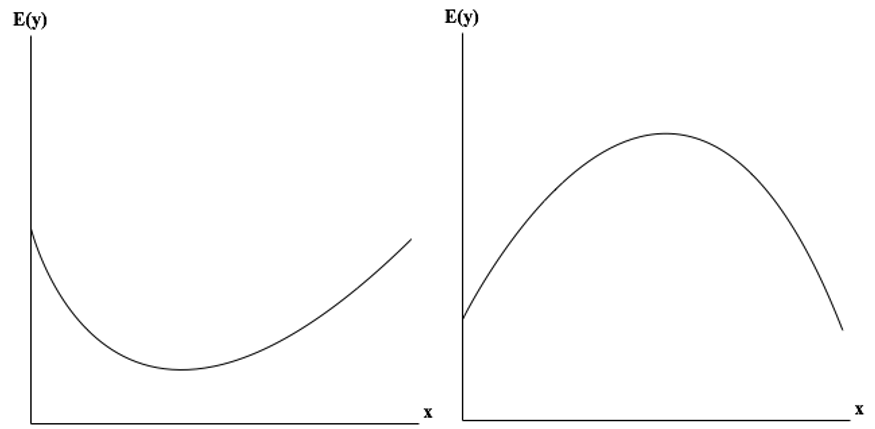
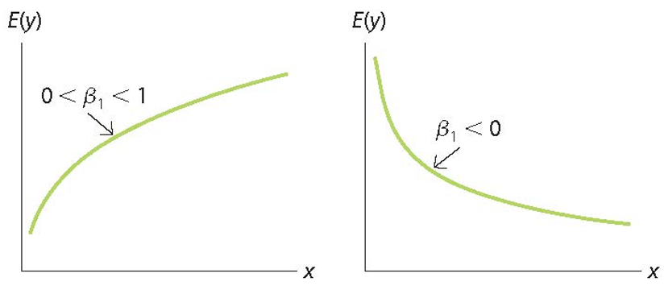
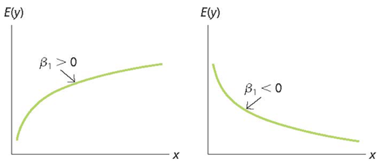
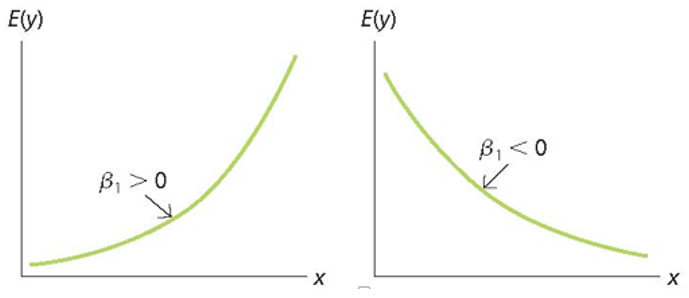
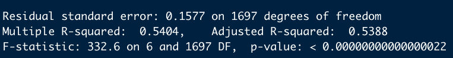
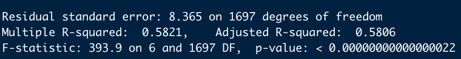
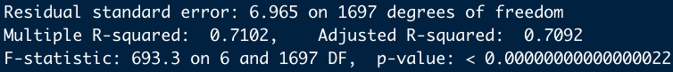

# Outline

```{r, include=FALSE}
library(tidyverse)
library(moderndive)
library(knitr)
library(gapminder)
load('lectures_files/wages.RData')
options(scipen = 999)
```

- Why use nonlinear variables

- How to interpret coefficients for nonlinear variables

- How to choose the best model

---
# Why use nonlinear variables

- The relationship between $x$ and $y$ may not follow a straight line

```{r, echo=FALSE, message=FALSE, fig.align='center', fig.height=6}
gapminder %>% 
  filter(year == 2007) %>% 
  ggplot(aes(x = gdpPercap, y = lifeExp)) +
  geom_point(alpha = 0.5, color = 'steelblue', size = 2) +
  geom_smooth(method = 'lm', se = FALSE, color = 'blue') +
  geom_smooth(span = 1, se = FALSE, color = 'red') +
  labs(y = 'Life Expectancy', x = 'GDP per Capita') +
  theme_minimal()
```


---
# Common nonlinear variable regressions

- Quadratic model

- Logarithmic model
  - Log-log
  - Log-level
  - Level-log

---
# Quadratic model

$$y=\beta_0+\beta_1x_1+\beta_2x_1^2+\beta_3x_2+...+\beta_kx_{k-1}+\epsilon$$

```{r, echo=FALSE}

```

---
# Quadratic regression

$$y=\beta_0+\beta_1x_1+\beta_2x_1^2+\epsilon$$

--

- What is the change in $y$ from a unit-change in $x$?

$$b_1+2b_2x_1$$

--

- At what value of $x$ is $y$ at its maximum or minimum?

$$\frac{-b_1}{2b_2}$$

---
class: inverse, center, middle

# Quadratic regression example using R

---
# Data

```{r, echo=FALSE}
summary(wages)
```

---
# Viz

```{r, echo=FALSE, message=FALSE, fig.align='center', fig.height=6}
ggplot(wages, aes(x = Age, y = Wage)) +
  geom_point() +
  geom_smooth(method = "lm", se = FALSE, color = 'blue') +
  geom_smooth(se = FALSE, span = 1, color = 'red') +
  theme_minimal()
```

---
# Quadratic regression

$$Wage=\beta_0+\beta_1Educ+\beta_2Age+\beta_3Age^2+\epsilon$$

```{r}
quad <- lm(Wage ~ Educ + Age + I(Age^2), data = wages)
```

```{r, eval=FALSE}
get_regression_table(quad)
```

```{r, echo=FALSE}
get_regression_table(quad) %>% 
  kable()
```

$$\hat{Wage}=-22.7+1.25*Educ+1.35*Age-0.013*Age^2$$

---
# Interpretation

$$\hat{Wage}=-22.7+1.25*Educ+1.35*Age-0.013*Age^2$$

- What is the marginal effect of age on wage?

- At what age are wages at their maximum?

- What is the predicted wage for a 27-year old with 12 years of education?

---
# Interpretation

$$\hat{Wage}=-22.7+1.25*Educ+1.35*Age-0.013*Age^2$$

- What is the marginal effect of age on wage at average age of 49?

```{r}
1.35-2*0.013*49
```

- On average, 49-year old workers' wages will increase 8 cents next year, controlling for education.

---
# Interpretation

$$\hat{Wage}=-22.7+1.25*Educ+1.35*Age-0.013*Age^2$$

- At what age are wages at their maximum?

```{r}
-1.35/(2*-0.013)
```

- Controlling for education, the results suggest wages reach their maximum at age 52, on average.

---
# Interpretation

$$\hat{Wage}=-22.7+1.25*Educ+1.35*Age-0.013*Age^2$$

- What is the predicted wage for a 27-year old with 12 years of education?

```{r}
-22.7+(1.25*12)+(1.35*27)-(0.013*27^2)
```

- The predicted wage is approximately 19.27, on average.

---
class: inverse, center, middle

# Log Transformations

---
# Log transformation

$$y=log_ax \leftrightarrow x=a^y$$

- Log base $a$ of $x$ returns the exponent by which to raise $a$ to get $x$.

- Common log bases include 10, 2, and $e$

$$log_{10}10=1$$
$$log_{10}100=2$$

- In regression, we use the **natural log**, which is base $e$

$$log_ex$$
$$ln(x)$$

---
# Why use log transformation

- Transform skewed data to be more normal

- Express change in percentages instead of units

- Reflect our theoretical claim for the relationship between two variables

--

- Cannot log transform 0 or negative values

```{r}
log(0)
```

```{r}
log(-5)
```

---
# Transform skewed data

```{r, fig.align='center', fig.height=6}
ggplot(gapminder, aes(x = gdpPercap)) +
  geom_histogram(bins = 50, fill = 'steelblue', color = 'white') +
  theme_minimal()
```

---
# Transform skewed data

```{r, fig.align='center', fig.height=6}
ggplot(gapminder, aes(x = log10(gdpPercap))) +
  geom_histogram(bins = 50, fill = 'steelblue', color = 'white') +
  theme_minimal()
```

---
# Transform skewed data

```{r, fig.align='center', fig.height=5}
ggplot(gapminder, aes(x = gdpPercap)) +
  geom_histogram(bins = 50, fill = 'steelblue', color = 'white') +
  scale_x_log10(labels = scales::dollar) +
  theme_minimal()
```

---
# Transform skewed data

```{r, message=FALSE, fig.align='center', fig.height=5}
gapminder %>% 
  ggplot(aes(x = gdpPercap, y = lifeExp)) +
  geom_point(color = 'steelblue', alpha = 0.4) +
  labs(x = 'GDP per capita', y = 'Life expectancy') +
  theme_minimal()
```

---
# Transform skewed data

```{r, message=FALSE, fig.align='center', fig.height=4.5}
gapminder %>% 
  ggplot(aes(x = gdpPercap, y = lifeExp)) +
  geom_point(color = 'steelblue', alpha = 0.4) +
  scale_x_log10(labels = scales::dollar) +
  labs(x = 'Log GDP per capita', y = 'Life expectancy') +
  theme_minimal()
```

---
# Report results in percent change

- Recall that regression coefficients quantify the **unit-change** in $y$ given a **one-unit** change in $x$

--

- Using the natural log in regression quantifies percent changes

- This is useful when the effect of $x$ on $y$ is not constant and depends on the starting value of $x$ or $y$

--

- Remember not to confuse **percent change** with **percentage-point change**

---
# Report results in percent change

```{r, include=FALSE}
df <- tibble(Country = c(1,2,3,4), gdpPercap = c(1000, 11000, 21000, 31000), lifeExp = c(40, 60, 62, 64))
```

```{r, echo=FALSE}
kable(df)
```

```{r, echo=FALSE, fig.align='center', fig.height=3.5}
ggplot(df, aes(x = gdpPercap, y = lifeExp)) +
  geom_point(size = 3, color = 'steelblue') +
  theme_minimal()
```

---
class: inverse, center, middle

# Log models, interpretation, and using them in R

---
# Log-log Model

$$ln(y)=\beta_0+\beta_1ln(x_1)+...+\beta_kx_k+\epsilon$$
$$ln(\hat{y})=b_0+b_1ln(x_1)+...+b_kx_k$$

```{r, echo=FALSE}

```

---
# Interpreting Log-log Model

$$ln(\hat{y})=b_0+b_1ln(x_1)+...+b_kx_k$$

- As $x_1$ increases 1%, y changes $b_1$%

- This is how **elasticities** are estimated

---
# In R

- First, let's run a level-level model

$$LifeExp=\beta_0+\beta_1GDPperCap+\beta_2Pop+\beta_3Continent+\epsilon$$

```{r}
lev_lev <- lm(lifeExp ~ gdpPercap + pop + continent, 
               data = gapminder)
```

---
# In R

```{r, eval=FALSE}
get_regression_table(lev_lev) %>% 
  select(term, estimate)
```

.pull-left[
```{r, echo=FALSE}
get_regression_table(lev_lev) %>% 
  select(term, estimate) %>% 
  kable(digits = 3)
```
]

.pull-right[

- Why 0s for `gdpPercap` and `pop`?

- How do we interpret the `continentEurope` estimate?

]

---
# In R

- One dollar and one person are very small unit-changes for an outcome that does not change drastically like life expectancy

```{r}
gapminder2 <- gapminder %>% 
  mutate(gdpPercap_thou = gdpPercap/1000,
         pop_100mill = pop/100000000)

lev_lev2 <- lm(lifeExp ~ gdpPercap_thou + pop_100mill + continent, 
               data = gapminder2)
```

---
# In R

```{r, eval=FALSE}
get_regression_table(lev_lev2) %>% 
  select(term, estimate)
```

.pull-left[

```{r, echo=FALSE}
get_regression_table(lev_lev2) %>% 
  select(term, estimate) %>% 
  kable(digits = 3)
```

]

.pull-right[

- How do we interpret `gdpPercap_thou` and `pop_100mill`?

]

---
# Log-log model in R

$$ln(LifeExp)=\beta_0+\beta_1ln(GDPperCap)+\beta_2Pop+\beta_3Continent+\epsilon$$

```{r}
log_log <- lm(log(lifeExp) ~ log(gdpPercap) + pop_100mill + continent, 
               data = gapminder2)
```

---
# Log-log Model in R

```{r, eval=FALSE}
get_regression_table(log_log) %>% 
  select(term, estimate)
```

.pull-left[
```{r, echo=FALSE}
get_regression_table(log_log) %>% 
  select(term, estimate) %>% 
  kable(digits = 3)
```
]

.pull-right[

- How do we interpret `log(gdpPercap)` coefficient?

- What about the `pop_100mill` and `continent` coefficients? Refer to the handout on eLC.

]

---
# Level-log Model

$$y=\beta_0+\beta_1ln(x_1)+...+\beta_kx_k+\epsilon$$
$$\hat{y}=b_0+b_1ln(x_1)+...+b_kx_k$$

```{r, echo=FALSE}

```

---
# Interpreting Level-log Model

$$\hat{y}=b_0+b_1ln(x_1)+...+b_kx_k$$

- As $x_1$ increases 1%, y changes $\frac{b_1}{100}$ units

---
# Level-log Model in R

$$LifeExp=\beta_0+\beta_1ln(GDPperCap)+\beta_2Pop+\beta_3Continent+\epsilon$$

```{r}
lev_log <- lm(lifeExp ~ log(gdpPercap) + pop_100mill + continent, 
               data = gapminder2)
```

---
# Level-log Model in R

```{r, eval=FALSE}
get_regression_table(lev_log) %>% 
  select(term, estimate)
```

.pull-left[
```{r, echo=FALSE}
get_regression_table(lev_log) %>% 
  select(term, estimate) %>% 
  kable(digits = 3)
```
]

.pull-right[

- How do we interpret `log(gdpPercap)` coefficient?

- What about the `pop_100mill` and `continent` coefficients?

]

---
# Log-level Model (Exponential Model)

$$ln(y)=\beta_0+\beta_1x_1+...+\beta_kx_k+\epsilon$$
$$ln(\hat{y})=b_0+b_1x_1+...+b_kx_k$$

```{r, echo=FALSE}

```

---
# Interpreting Log-level Model

$$ln(\hat{y})=b_0+b_1x_1+...+b_kx_k$$

- As $x_1$ increases 1 unit, y changes $b_1 \times 100$%

---
# Log-level Model in R

$$ln(LifeExp)=\beta_0+\beta_1GDPperCap+\beta_2Pop+\beta_3Continent+\epsilon$$

```{r}
log_lev <- lm(log(lifeExp) ~ gdpPercap_thou + pop_100mill + continent, 
               data = gapminder2)
```

---
# Log-level Model in R

```{r, eval=FALSE}
get_regression_table(log_lev) %>% 
  select(term, estimate)
```

.pull-left[
```{r, echo=FALSE}
get_regression_table(log_lev) %>% 
  select(term, estimate) %>% 
  kable(digits = 3)
```
]

.pull-right[

- How do we interpret `gdpPercap_thou` and `pop100_mill` coefficient?

- What about the `continent` coefficients? Refer to handout on eLC.

]

---
# Predicting Value of Y

- Everything so far has focused on predicting *change* in $y$

- If you use $ln(y)$ in your regression, predicted *value* of $y$ will be in units of $ln(y)$

- How do we return natural log units to original units? Exponentiate.

$$e^{ln(y)}=y$$

--

```{r}
log(50)
```

```{r}
exp(3.912023)
```

---
# Predicting value of Y

- For example, log-level model

$$ln(\hat{y})=b_0+b_1x_1+...+b_kx_k$$

$$\hat{y}=e^{b_0+b_1x_1+...+b_kx_k+\frac{MSE}{2}}$$

- Where MSE is mean squared error $RMSE^2$

---
# Predicting value of Y

$$ln(LifeExp)=\beta_0+\beta_1GDPperCap+\beta_2Pop+\beta_3Continent+\epsilon$$
.pull-left[
```{r, echo=FALSE}
get_regression_table(log_lev) %>% 
  select(term, estimate) %>% 
  kable(digits = 3)
```
]

.pull-right[
- Suppose we want to know the predicted life expectancy of an African country with a gdpPercap of $25,000 and population of 90,000,000?
]

---
# Predicting value of Y

$$ln(\hat{LifeExp})=3.9+(0.007*25)+(0.012*0.9)$$

```{r, eval=FALSE}
summary(log_lev)
```

```{r, echo=FALSE}

```


$$\hat{LifeExp}=e^{3.9+(0.007*25)+(0.012*0.9)+\frac{0.1577^2}{2}}$$

```{r}
exp(3.9+(0.007*25)+(0.012*0.9)+((0.1577^2)/2))
```

---
class: inverse, center, middle

# Choosing between models

---
# How to choose

- We want to use the best model from our regression toolbox

--

- Could use model fit

- Could use theory and/or data visualization

---
# Model fit

- Choose the model with highest $R^2$ or lowest RMSE

- There's a catch: we can only compare models with the same response variable

- Therefore, we can't compare models with level and log response without some extra work

---
# R-squared with level response

```{r, eval=FALSE}
summary(lev_lev2)
summary(lev_log)
```

```{r, echo=FALSE}

```

```{r, echo=FALSE}

```

---
# R squared with log response

```{r}
library(broom)
aug_log_log <- augment(log_log)
```

```{r, eval=FALSE}
aug_log_log
```

```{r, echo=FALSE}
aug_log_log %>% 
  head(n=3) %>% 
  kable(digits = 2)
```

---
# R squared with log response

- To obtain $R^2$, calculate correlation between $y$ and $\hat{y}$ then square it

```{r}
r_yyhat <- cor(aug_log_log$`log(lifeExp)`, aug_log_log$.fitted)
r_yyhat^2
```

```{r}
aug_log_lev <- augment(log_lev)
r_yyhat <- cor(aug_log_lev$`log(lifeExp)`, aug_log_lev$.fitted)
r_yyhat^2
```

---
# Summary of Models

```{r, echo=FALSE}
sum.models <- tibble(Model = c('Level-level', 'Level-log', 'Log-level', 'Log-log'), R_sq = c(0.58, 0.71, 0.54, 0.67))

kable(sum.models)
```

- Results suggest level-log model is the best

- How far off is this model, on average, when predicting life expectancy?

- We saw this on slide 49; residual standard error

---
# RMSE from log Y

- The RMSE reported from models using $ln(y)$ is in log units

- What if we want RMSE in original units?

```{r}
aug_log_log <- aug_log_log %>% 
  mutate(lifeExp = exp(`log(lifeExp)`), 
         yhat = exp(.fitted)) %>% 
  mutate(error = lifeExp - yhat)
  
sqrt(mean(aug_log_log$error^2))
```

- Log-log model is off by 7 years, on average

---
# RMSE from log Y

```{r}
aug_log_lev <- aug_log_lev %>% 
  mutate(lifeExp = exp(`log(lifeExp)`), 
         yhat = exp(.fitted)) %>% 
  mutate(error = lifeExp - yhat)
  
sqrt(mean(aug_log_lev$error^2))
```

- Log-level model is off by 8.7 years, on average.

---
# Summary

```{r, echo=FALSE}
sum.models2 <- tibble(Model = c('Level-level', 'Level-log', 'Log-level', 'Log-log'), R_sq = c(0.58, 0.71, 0.54, 0.67), RMSE = c(8.37, 6.97, 8.71, 7.05))

kable(sum.models2)
```

- Which model should we choose?