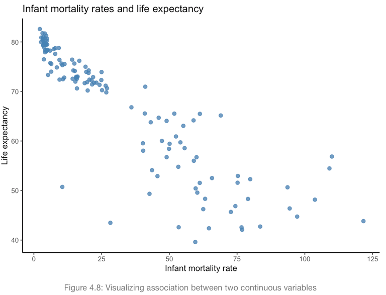

# Outline

```{r, include=FALSE}
library(carData)
library(openintro)
library(tidyverse)
library(moderndive)
library(knitr)
```

- Understand the purpose of regression and its relevance to making decisions

- Interpret regression coefficients

- Assess goodness-of-fit for one model or between several competing models

- Understand what it means to control for other variables

---
# Correlation review

.center[

]

- Correlation reports the direction and strength between two variables

- Correlation between infant mortality rate and life expectancy is -0.9; very strong negative correlation

---
# Correlation coefficients

```{r}
select(States, -region) %>% 
  cor()
```

---
# Visualizing correlation

```{r, message=FALSE, fig.height=5, fig.width=6, fig.align='center'}
ggplot(States, aes(x = dollars, y = SATM)) +
  geom_point() +
  labs(x = 'Public ed spending in $1000s per student',
       y = 'Average SAT Math score')
```

---
# Correlation conclusions

```{r, echo=FALSE, message=FALSE, fig.height=5, fig.width=6, fig.align='center'}
ggplot(States, aes(x = dollars, y = SATM)) +
  geom_point() +
  labs(x = 'Public ed spending in $1000s per student',
       y = 'Average SAT Math score')
```

- States that spend more on public education tend to have lower average SAT Math scores among its graduating high school students

- The strength of the relationship is moderate at -0.48

---
# Basic purpose of regression

.pull-left[
```{r, echo=FALSE, message=FALSE}
ggplot(States, aes(x = dollars, y = SATM)) +
  geom_point() +
  geom_smooth(method = 'lm', se = FALSE) +
  labs(x = 'Public ed spending in $1000s per student',
       y = 'Average SAT Math score') +
  theme_minimal() +
  theme(text = element_text(size=16))
```
]

.pull-right[
- Regression gives us direction, strength, and magnitude of association
- Draws the line of **best fit** through a set of paired x-y data points
- The slope of the line tells us the **average, predicted change in y given a change in x**
- At any value along x-axis, regression line gives us the **predicted value of y**
]

---
# Basic purpose of regression

- Regression is a statistical method to
  - **Explain** the relationship between an outcome variable and one or more explanatory variables, and/or
  - **Predict** the value of an outcome given the value(s) of one or more explanatory variables

- Either way, regression is a way of modeling an outcome $y$ as a function of explanatory $x$

---
# Adding a regression line

```{r, message=FALSE, fig.height=5, fig.width=6, fig.align='center'}
ggplot(States, aes(x = dollars, y = SATM)) +
  geom_point() +
  geom_smooth(method = 'lm', se = FALSE) + #<<
  labs(x = 'Public ed spending in $1000s per student',
       y = 'Average SAT Math score')
```

---
# Simple linear regression model

.pull-left[
$$y=\beta_0+\beta_1x+\epsilon$$

- $y$ referred to as the outcome, response, dependent variable
- $\beta_0$ (beta-naught) is the y-intercept constant
- $\beta_1$ is the slope of the regression line; the marginal effect of $x$ on $y$
- $x$ referred to as explanatory, independent variable
- $\epsilon$ is referred to as the error term or random noise
]

--

.pull-right[
- This is a **population** model. 
- The $\beta$s are **population parameters** we wish to estimate, assuming we don't observe the entire population.
- $\epsilon$ is also a parameter that captures all the other factors that affect $y$ for which we cannot include in our model
]

---
# Simple linear regression model

.pull-left[
$$\hat{y}=b_0+b_1x$$

- $\hat{y}$ is the **predicted** value of $y$ given a value of $x$
- $b_0$ is the estimate of $\beta_0$; our prediction of $y$ if $x$ equaled 0
- $b_1$ is the estimate of $\beta_1$; our predicted slope; our predicted marginal effect of $x$ on $y$
- the $b$s are often referred to as **coefficients**
]

--

.pull-right[
- This is our sample regression equation based on the population model
]

---
# Interpreting Regression Results

$$\hat{y}=b_0+b_1x$$

On average, a [one] [unit] [increase/decrease] in $x$ [is associated with] a [increase/decrease] of $b_1$ [units] in $y$.

--

- [one] can be any number
- Replace [unit] with the actual units of the $x$ variable (e.g. dollars, percentage point, count of houses)
- Replace $x$ with what $x$ is
- [is associated with] can be any combination of words that expresses the intended relationship (causes, results in)
- Replace $b_1$ with the estimate from the results
- Replace [units] with the units of the $y$ variable
- Replace $y$ with what $y$ is

---
# Example: Population to sample models

- Suppose we want to model average SAT math scores, `SATM`, in a state as a function of its spending on public education in **1000s per student**, `dollars`

$$SATM=\beta_0+\beta_1Dollars+\epsilon$$

--

```{r, echo=FALSE}
satm_mod1 <- lm(SATM ~ dollars, data = States)
get_regression_table(satm_mod1) %>% 
  kable(format = 'html')
```

--

$$\hat{SATM} = 560 - 12 \times Dollars$$

---
# Example: Reporting results

$$\hat{SATM} = 560 - 12 \times Dollars$$

On average, a one thousand dollar increase in state spending on public education per student is associated with a 12 point decline in average SAT math scores.

--

Results suggest each additional thousand dollars spent on public education per student decreases average SAT math scores by 12 points, on average.

--

If states increased spending by $5,000 per student, SAT math scores are predicted to decrease 60 points, on average.

--

If states spent nothing on public education, SAT math scores are predicted to be 560, on average.

---
# Many ways to interpret

- Regression results can be applied to countless scenarios
- Any scenario involves either 
  - a predicted *change* in $y$ given a *change* in $x$ or 
  - a predicted *value* of $y$ given a *value* of $x$

--

- Run regression, plug coefficients into equation, plug scenario into equation, then solve.

---
# Predicted Change vs. Predicted Value

- Now `SATM` as a function of the percent of graduating high school students who take the SAT, `percent`

$$SATM=\beta_0+\beta_1Percent+\epsilon$$
```{r, echo=FALSE}
satm_mod2 <- lm(SATM ~ percent, data = States)
get_regression_table(satm_mod2) %>% 
  kable(format = 'html')
```

$$\hat{SATM} = 539 - 1.2 \times Percent$$

- Now we can consider any hypothetical *change* in percent or specific *value* of percent and provide a prediction for SAT math scores.

---
# Change vs. value
$$\hat{SATM} = 539 - 1.2 \times Percent$$
.pull-left[
What if percent taking SAT increased from 50% to 55%?
```{r}
-1.2*5
```
SAT math is predicted to **decrease** 6 points, on average.
]

--

.pull-right[
What is the predicted average SAT math score for a state where 75% of high school graduates take the SAT?
```{r}
539 - 1.2*75
```

Average SAT math is predicted to **equal** 449, on average.
]

---
# You practice

$$\hat{SATM} = 539 - 1.2 \times Percent$$

- What is the predicted average SAT math score in a state where 25% of its high school graduates take the SAT?
- What is the predicted average SAT math score in a state where 100% of its high school graduates take the SAT?
- What is the predicted change in average SAT math score in a state where the percent of high school graduates taking the SAT increases 75 percentage points?

---
class: inverse, middle, center

# Make sure you understand the difference between a percent change and a percentage point change.

---
# Percent vs. percentage point change

- Linear regression involves **unit changes** (for now)

- A unit change of a variable expressed in percentages is a **percentage point** change

- Increase from 25% to 100% is an increase of 75 percentage points

---
# Percent vs. percentage point change

- Percent change conveys the percent of the old number it takes to get to the new number

$$ \%\Delta = (\frac{New-Old}{Old}) \times 100$$
- An increase from 25% to 100% is a 300% increase.

```{r}
((100-25)/25)*100
```

---
class: inverse, middle, center

# Running regressions in R

---
# Running regression

- Explore data

```{r}
glimpse(States)
```

---
# Running regression

```{r, out.width=8}
summary(States)
```

---
# Running regression

```{r, eval=FALSE}
satm_mod1 <- lm(SATM ~ dollars, data = States)
satm_mod2 <- lm(SATM ~ percent, data = States)
```

```{r, eval=FALSE}
library(moderndive)
get_regression_table(satm_mod1)
```
```{r, echo=FALSE}
get_regression_table(satm_mod1) %>% 
  kable()
```

---
# Running regression

- Alternative: `summary` available by default; not as pretty

```{r}
summary(satm_mod1)
```

---
# Recap of population and sample regressions

**Population Model**

$$y=\beta_0+\beta_1x+\epsilon$$

$$SATM=\beta_0+\beta_1Dollars+\epsilon$$

**Sample Model**

$$\hat{y}=b_0+b_1x$$
$$\hat{SATM} = 560 - 12 \times Dollars$$

---
class: inverse, center, middle

# What happens to that error term, $\epsilon$, when we move to the sample model?

---
# The residual

$$e=y-\hat{y}$$

- The residual is the difference between the *observed* outcome $y$ and the *predicted* outcome $\hat{y}$ in our regression model

- The residual is the sample statistic of the population parameter $\epsilon$

```{r, include=FALSE}
satm_mod1.metrics <- broom::augment(satm_mod1)

viz.resid <- ggplot(satm_mod1.metrics, aes(x = dollars, y = SATM)) +
  geom_point(color = 'steelblue') +
  geom_smooth(method = 'lm', se = FALSE) +
  geom_segment(aes(xend = dollars, yend = .fitted), color = "red", size = 0.3) +
  labs(x = 'Public ed spending in $1000s per student',
       y = 'Average SAT Math score') +
  theme_classic()
```


```{r, echo=FALSE, message=FALSE, fig.align='center', fig.height=5, fig.width=6}
viz.resid
```

---
# How to examine residuals

```{r, eval=FALSE}
get_regression_points(satm_mod1)
```

- Regression results for each observation

- Shows observed data, predicted outcomes, and residuals

```{r, echo=FALSE}
get_regression_points(satm_mod1) %>% 
  head(n=6) %>% 
  kable(format = 'html')
```

---
class: inverse, center, middle

# Regression draws the line of best fit through observed x-y pairs. What does best fit mean?

---
# Ordinary least squares (OLS)

- Standard regression is also known as OLS

- Regression uses math you don't need to worry about to determine the intercept and slope of a line that **minimizes the sum of squared residuals (SSR)**

---
# OLS

.pull-left[
```{r, echo=FALSE, message=FALSE}
viz.resid
```
]

.pull-right[
```{r, echo=FALSE}
get_regression_points(satm_mod1) %>% 
  select(-dollars) %>% 
  head(n=8) %>% 
  kable(format = 'html')
```
]

---
# OLS

```{r, echo=FALSE}
satm_mod1_points <- get_regression_points(satm_mod1) %>% 
  mutate(sq_resid = residual^2)

head(satm_mod1_points, n=4) %>% 
  kable(format = 'html')
```

```{r}
sum(satm_mod1_points$sq_resid)
```

- No other line will achieve a sum of squared residuals less than 45,727

---
class: inverse, middle, center

# But how good is the best?

---
# Goodness-of-fit

- Any outcome varies across observations (i.e. variance)

- When we ask how good is our best regression line, one way to answer is the **percent of total variation/variance in the outcome that is explained by our model**

--

- $R^2$ (r-squared)
  - Ranges from 0 to 1
  - The percent of variation in $y$ explained by our regression

---
# Goodness of fit

```{r, eval=FALSE}
get_regression_summaries(satm_mod1)
```

```{r, echo=FALSE}
get_regression_summaries(satm_mod1) %>%
  select(r_squared, adj_r_squared, rmse, sigma) %>% 
  kable(format = 'html')
```

The regression using dollars explains 24% of total variation in average SAT math scores.

---
# Goodness of fit
```{r, eval=FALSE}
get_regression_summaries(satm_mod2)
```

```{r, echo=FALSE}
get_regression_summaries(satm_mod2) %>%
  select(r_squared, adj_r_squared, rmse, sigma) %>% 
  kable(format = 'html')
```

- What percent of variation in average SAT math scores is explained by model 2?

--

- 74%

--

- Model 2 has the highest $R^2$, thus it is the *statistically* superior model

---
# Goodness of fit

```{r}
select(States, SATM, dollars, percent) %>% 
  cor()
```

```{r}
-0.48^2
-0.86^2
```

---
# Goodness of fit

.pull-left[
```{r, echo=FALSE, message=FALSE, fig.align='center'}
ggplot(States, aes(x = dollars, y = SATM)) +
  geom_point() +
  geom_smooth(method = 'lm', se = FALSE) +
  labs(x = 'Public ed spending in $1000s per student',
       y = 'Average SAT Math score')
```
]

.pull-right[
```{r, echo=FALSE, message=FALSE, fig.align='center'}
ggplot(States, aes(x = percent, y = SATM)) +
  geom_point() +
  geom_smooth(method = 'lm', se = FALSE) +
  labs(x = 'Percent high school graduates taking SAT',
       y = 'Average SAT Math score')
```
]

---
# Goodness of fit

- $R^2$ isn't very useful for a general audience and it has limited practical application for predictions.

--

- Root mean squared error (**RMSE**) answers the question: "How far off is our model, on average, from observed outcomes? If we predict an outcome, what is the typical range of inaccuracy?

--

- RMSE is the regression version of standard deviation; provides the average deviation from the regression line

- The lower the RMSE the better our model is at fitting the data

---
# Goodness of fit
Model 1 using dollars
```{r, echo=FALSE}
get_regression_summaries(satm_mod1) %>%
  select(r_squared, adj_r_squared, rmse, sigma) %>% 
  kable(format = 'html')
```

Model 2 using percent
```{r, echo=FALSE}
get_regression_summaries(satm_mod2) %>%
  select(r_squared, adj_r_squared, rmse, sigma) %>% 
  kable(format = 'html')
```

--

- Model 1 predictions are off by about 30 points, on average.
- Model 2 predictions are off by about 18 points, on average.
- Model 2 is the *statistically* superior model.

---
class: inverse, center, middle

# Multiple regression

---
# Multiple regression

- Multiple regression adds more than one explanatory variable to the model. 

--

**Population model**
$$y=\beta_0+\beta_1x_1+\beta_2x_2+\dots+\beta_kx_k+\epsilon$$

**Sample model**
$$\hat{y}=b_0+b_1x_1+b_2x_2+\dots+b_kx_k$$

--

- This isolates the association between the outcome and each explanatory variable, holding all other variables constant.

---
# Controlling for other factors

- The two previous regressions each controlled for one variable we might theorize affects average state SAT math scores

--

- There is any number of additional variables contained in the error term $\epsilon$

--

- Typically, if we can, we should include those additional variables in the same regression model

- Especially if those variables affect the explanatory variables currently in our model

---
class: inverse, center, middle

# Importance of theory or subject-matter expertise

---
# Making sense of our results

- So far, states spending more on public education apparently tend to have lower SAT math scores; may seem counter-intuitive to some

--

- We also see that states with a higher percent of graduates taking the SAT tend to have lower SAT math scores

--

- What may be going on here?

---
# Making sense of our results

```{r, echo=FALSE, message=FALSE, fig.align='center'}
ggplot(States, aes(x = dollars, y = percent)) +
  geom_point() +
  geom_smooth(method = 'lm', se = FALSE) +
  labs(x = 'Public ed spending in $1000s per student',
       y = 'Percent of graduates taking SAT')
```

---
# Controlling for other factors

- Multiple regression provides the marginal effect of $x_k$ on $y$, while holding all other $x$s constant at their respective mean

**Interpretation**

On average, a [one-unit] [increase/decrease] in $x_k$ [is associated with] a $b_k$ [unit] [increase/decrease] in $y$, [**holding other factors constant].**

- Variations on last part:
  - all else equal
  - controlling for other factors
  - *ceteris paribus*

---
# Running multiple regression

$$SATM=\beta_0+\beta_1Dollars+\beta_2Percent+\epsilon$$

```{r}
satm_mod3 <- lm(SATM ~ dollars + percent, data = States)
```
```{r, eval=FALSE}
get_regression_table(satm_mod3)
```
```{r, echo=FALSE}
get_regression_table(satm_mod3) %>% 
  kable(format = 'html')
```

$$SATM=515+6.4 \times Dollars - 1.5 \times Percent+\epsilon$$

---
# Interpreting results

```{r, echo=FALSE}
get_regression_table(satm_mod3) %>% 
  kable(format = 'html')
```

$$SATM=515+6.4 \times Dollars - 1.5 \times Percent+\epsilon$$

- Controlling for the percent of graduates taking the SAT, what is the predicted change in SAT math scores if states increase public education spending by $5,000 per student?

--

```{r}
6.4*5
```

---
# Interpreting results

```{r, echo=FALSE}
get_regression_table(satm_mod3) %>% 
  kable(format = 'html')
```

$$SATM=515+6.4 \times Dollars - 1.5 \times Percent+\epsilon$$

What is the predicted average SAT math score for a state that spends $5,000 per student, and has 50% of high school graduates take the SAT?

--

```{r}
515 + 6.4*5 - 1.5*50
```

---
class: inverse, middle, center

# Connecting results to policy decisions

---
# Policy Decision

- We haven't covered enough material to know whether or how we should act on this information, but let's work with what we know so far

  - Let's ignore matters of inference
  
  - Let's assume these results are causal

--

- That said, so far:

  - Spending increases average SAT math scores among states, *controlling for percent of high school grads taking SAT*
  
  - But spending seems to increase the percent of SAT participation, which then decreases average SAT math scores

- Let's examine the effect of spending on SAT math scores

---
# Spending and SAT participation

```{r}
satm_mod4 <- lm(percent ~ dollars, data = States)
```

```{r, eval=FALSE}
get_regression_table(satm_mod4)
```

```{r, echo=FALSE}
get_regression_table(satm_mod4) %>% 
  kable(format = 'html')
```

- A $1,000 increase in spending per pupil increases the percent of grads taking the SAT by 12.4 *percentage points*.

---
# Policy Decision

- A $1,000 increase in spending per student:
  
  - Directly increases average SAT math scores 6.4 points
  
  - Directly increases participation 12.4 percentage points
  
  - Increase of 12.4 p.p. reduces average SAT math scores 14.9 points
  
- The total effect of a $1,000 increase on average SAT math scores is about -8.5 points.

--

- What should be our policy recommendation?

---
class: inverse, middle, center

# Goodness-of-fit with multiple regression

---
# Goodness-of-fit

**Model 2 using only percent**
```{r, echo=FALSE}
get_regression_summaries(satm_mod2) %>%
  select(r_squared, adj_r_squared, rmse, sigma) %>% 
  kable(format = 'html')
```

**Model 3 using dollars and percent**

```{r, echo=FALSE}
get_regression_summaries(satm_mod3) %>% 
  select(r_squared, adj_r_squared, mse, rmse, sigma) %>%
  kable(format = 'html')
```

- Based on $R^2$, model 3 appears to be the better model, however...

---
# Goodness of fit

- $R^2$ mechanically increases as you add more variables whether or not they improve the model

- Therefore, we should not use $R^2$ to compare models with different numbers of explanatory variables

--

- Adjusted $R^2$ accounts for this, adjusting based on how useful each additional variable is at explaining the outcome

- Model 3 still has the higher adjusted $R^2$ so it remains the statistically better model

- And the RMSE agrees; virtually always the case