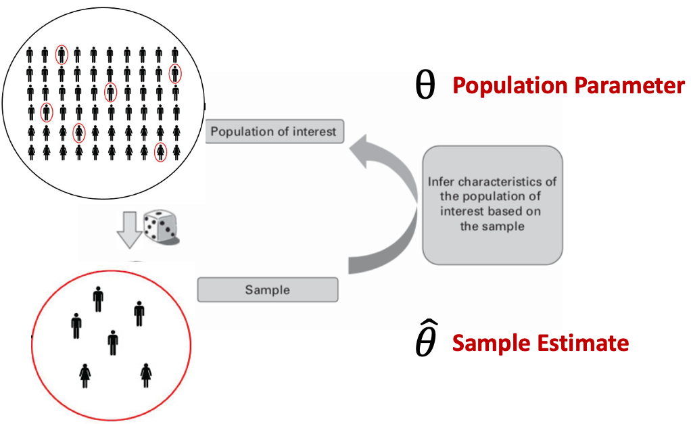

# Outline

```{r, include=FALSE}
library(tidyverse)
library(moderndive)
library(knitr)
library(fivethirtyeight)
set.seed(123)
options(scipen = 999)

state_trump <- hate_crimes %>%
  mutate(share_white = 1 - share_non_white,
         urbanization = if_else(share_pop_metro<=0.75, "low", "high")) %>% 
  select(state, 
         median_house_inc, 
         share_pop_hs, 
         share_white, 
         share_white_poverty, 
         share_vote_trump,
         urbanization) %>%
  filter(state != "District of Columbia") %>% 
  mutate_at(vars(share_pop_hs, share_white, share_white_poverty,
              share_vote_trump), funs(.*100)) %>% 
  rename(med_inc = median_house_inc, hs = share_pop_hs, urban = urbanization)
```

- Understand what allows us to take a sample and make conclusions about a population
  - Normal distribution and standard deviation (68-95-99 rule)
  - Law of large numbers (LLN)
  - Central limit theorem (CLT)
  
- We will use R to make this as concrete as possible

> **Download and open the "sampling-simulations.Rmd" on eLC.**

---
# Credible analysis

```{r, echo=FALSE, fig.align='center'}
include_graphics('lectures_files/credible.png')
```

---
# Regression table

$$MedHHInc = \beta_0 + \beta_1HSDegree + \beta_2 Urbanization + \epsilon$$ 

```{r, include=FALSE}
inc_mod <- lm(med_inc ~ hs + urban, 
              data = state_trump)
```

```{r, echo=FALSE}
get_regression_table(inc_mod) %>% 
  kable(digits = 0)
```

--

- Our goal is to gain an intuitive understanding of `std_error`, `lower_ci`, and `upper_ci` columns; how they are derived and what they tell us.

---
# Inference

```{r, echo=FALSE, fig.align='center', out.height='90%'}

```

---
# Sample estimates

- A sample estimate can be any statistical measure we are interested in:
  - Mean, median of a continuous variable
  - Proportion, percentage of levels of a categorical variable
  - Difference between two means or percentages between groups
  - Regression coefficient/estimate of $\beta$

---
# Questions of inference

- Is our estimate an accurate guess of the population parameter?
  - $E$ denotes expected value; the average of our estimate over many repetitions

$$E(\hat{\theta}) = \theta  ?$$

- **Biased** if our estimate is systematically too high or low

--

- How precise is our estimate? Is it useful?

- Inference involves a range of plausible values.

- The larger the range needed to confidently capture the parameter, the less useful it is.

---
# Inference overview

1. We take a sample. Hopefully **random**. If not, need to correct using sample weights and/or controls in a regression. Otherwise, **biased**.

--

2. **Law of large numbers (LLN)** allows us to say our sample estimate is expected to be close to the population parameter.

--

3. **Central limit theorem (CLT)** allows us to assume the **sampling distribution** of our estimate is a **normal distribution**.

--

4. We calculate the standard deviation of the sampling distribution, **standard error**, and construct **confidence intervals** based on the **68-95-99 rule**.

---
# Law of Large Numbers (LLN)

- We *know* a (fair) coin has 50% chance landing heads. 

- The population parameter for the number of heads for all coin flips ever is 50%.

--

- We do not know the population parameter for most phenomena

- LLN says: given a large enough sample size, our sample estimate will approach the population parameter

---
# Law of Large Numbers (LLN)

> **Run the `set-up` and `functions` code chunks**

> **Run the `coin-flips` code chunk**

---
# Law of Large Numbers (LLN)

> **Run the `head-count` code chunk. Notice the percent of flips resulting in heads.**

> **Change the number of flips from 10 to 100 and run again. Notice the percent of flips resulting in heads. Is it relatively closer to 50%?**

---
class: inverse, center, middle

# As sample size increases, accuracy tends to increase (assuming no bias in the sample or methodology)

---
# Sampling distribution

- Our sample of 100 has revealed an estimate of the probability of heads that should be close to the parameter

- Highly unlikely that our estimate *equals* the parameter, so we need to construct a **range of plausible values** that will capture the parameter

- What if we collected all of the estimates we got from each of our samples and plotted their distribution? 

- That would give us the **sampling distribution** for our estimate.

---
# Sampling distribution

> **Replace values in the `class-sampling-distribution` code chunk then run.**

---
# Sampling distribution

- Distribution of a variable is the distribution of *values* for that variable in a given sample

- Sampling distribution is the distribution of *estimates* (e.g., proportion, average, regression coefficient) each obtained from a different sample that contains the variable(s) of interest

--

- In our coin flip example:
  - Data: 100 observations of a coin flip
  - Distribution: the distribution of heads and tails in our sample of 100
  - Estimate: percent of flips resulting in heads in our sample of 100 
  - Sampling distribution: the distribution of percent heads from all of the samples of 100 flips we simulated

---
# Central Limit Theorem

- The CLT says, no matter the shape of the underlying distribution of the variable from which our estimate was derived, its sampling distribution will be approximately normal given sufficient sample size.

--

- For a normal distribution:

  - 68% of the estimates fall within one standard deviation

  - 95% of the estimates fall within 1.96 standard deviations

  - 99% fall within 2.58 standard deviations

---
# Standard Error

- We need to know the **standard deviation of our sampling distribution**. Then we can compute a range of plausible values for our parameter.

- **Standard error** is the specific name we give to the standard deviation of a sampling distribution.

> **Run the `standard-error` code chunk to compute the standard error of our sampling distribution.**

---
# Confidence intervals

- **Confidence interval** is the range of plausible values that captures our population parameter.

- Common to use a 95% confidence interval: 1.96 standard errors below and above our estimate.

> **Run the `confidence-interval`, `lower_ci`, and `upper_ci` code chunks**

- Does our confidence interval contain the true parameter of 50%? 

---
# Confidence intervals & sample size

- Each of the next three code chunks: 
  - Uses a different sample size of coin flips (10,100,1000), 
  - Counts the number of heads, 
  - Replicates this 100 times to provide 100 estimates for percent heads,
  - Plots the 100 estimates on a histogram.

> **Run the three `sampling-distribution` code chunks**

- How do the three sampling distributions compare?

---
# Confidence intervals & sample size

> **Run the `se` code chunks**

- The standard error should be decreasing as sample size increases

---
class: inverse, center, middle

# As sample size increases, precision increases

---
# MPA Salary Inference

- In reality, we do not have many samples to construct an actual sampling distribution.

- We just have one sample and one estimate

- Let's use inference in a more realistic way, but test its success by making a simulated population we can observe

> **Run the `mpa-population` and `parameter` code chunks.**

- What is the population parameter for average salary among all MPA graduates?

---
# Sample and estimate

> **Once you've been given your sample size (n), run the `sample` code chunk.**

- We now have a random sample of MPA graduates drawn from the population

--

> **Run the `salary-estimate` code chunk**

- You now have an estimate of average salary for the population

---
# Sample and estimate

- This time, we won't compile our estimates to make a sampling distribution.

- Instead, we assume our estimate is a single draw from a sampling distribution that is approximately normal even though we do not observe the sampling distribution

- But we still need the standard error of the sampling distribution to construct confidence intervals.

---
# Standard error

- Our estimate is a sample mean. The formula for the standard error of a sample mean is:

$$SE_{\bar{x}}=\frac{s}{\sqrt{n}}$$
- Where $s$ is the standard deviation of our variable ($x$) in the sample and $n$ is the size of the sample.

> **Run the `salary-standard-error` code chunk**

---
# Confidence intervals

- Now we need a plausible range of values that we expect to capture the parameter 95 times if this "study" was conducted 100 times

> **Run the `salary-ci` and `precision` code chunks**

- Those with larger sample sizes should have more precise confidence intervals

- Does your confidence interval contain the population parameter?

---
# Confidence interval

- A 95% confidence interval **does not** mean there is a 95% probability that it contains the parameter.

- Rather, if we were to do this "study" 100 times, our method of constructing the 95% CI is *expected* to produce 95 successful CIs and 5 unsuccessful CIs, on average.

- We can determine whether our one CI was successful because we knew the parameter. 

- In reality, our CI could be one of the unsuccessful ones. But we accept this knowing that our method is expected to fail only 5 out of 100 times.

---
# A look at 100 CIs

```{r, message=FALSE, warning=FALSE, include=FALSE}
set.seed(657)

salaries <- tibble(ID = c(1:100000), 
                   salary = rnorm(100000, 70000, 9000))

sal_100_samples <- salaries %>% 
  rep_sample_n(size = 50, reps = 100)
```

```{r, message=FALSE, warning=FALSE, include=FALSE}
sal_dist_means <- sal_100_samples %>% 
  group_by(replicate) %>% 
  summarize(sample_avg = mean(salary),
            sample_sd = sd(salary))
```

```{r, include=FALSE}
sal_dist_means <- sal_dist_means %>% 
  mutate(st_error = sample_sd/sqrt(50)) %>% 
  mutate(low_95ci = sample_avg - (1.96*st_error),
         upper_95ci = sample_avg + (1.96*st_error))
```

```{r, echo=FALSE, fig.height=7, fig.width=11, fig.align='center'}
ggplot(sal_dist_means, aes(x=as.factor(replicate))) + 
  geom_linerange(aes(ymin = low_95ci, ymax = upper_95ci))+
  geom_hline(yintercept = 70000, color = 'darkred') +
  labs(title = "100 95% Confidence Intervals",
       subtitle = "Parameter = 70,000",
       y = "95% Confidence Interval") +
  theme_minimal()+
  theme(axis.title.x = element_blank(),
        axis.text.x = element_blank())
```


---
# Point estimate vs. CI

- Suppose our estimate for average salary was $80,000. This is often the only information that is reported. This is for brevity and convenience.

- But the point estimate **does not** represent the most likely value for the parameter within the CI. No value within the CI is more or less likely to represent the parameter.

--

- Assuming we have a successful CI, the parameter could fall **anywhere** within it, including the lower and upper bounds.

- Depending on the context of our study and the width of the CI, only reporting the point estimate could be very misleading.

--

- What if the 95% CI for average salary was [20,000, 140,000]?

---
# Back to regression table

$$MedHHInc = \beta_0 + \beta_1HSDegree + \beta_2 Urbanization + \epsilon$$ 

```{r, echo=FALSE}
get_regression_table(inc_mod) %>% 
  kable()
```

- Now we can apply the concepts to our regression table
- We took one sample of state data
- Obtained estimates for $\beta$s (similar to sample mean; different math)
- **LLN** and **CLT** allow us to assume each estimate is close to the parameter and is drawn from a sampling distribution that is normal

---
# Back to regression table

```{r, echo=FALSE}
get_regression_table(inc_mod) %>% 
  kable(digits=0)
```

- Therefore, we calculate the standard error (similar to before but math is different)
- Then calculate the lower and upper bounds of the 95% CI

---
# Back to the regression table

```{r, echo=FALSE}
get_regression_table(inc_mod) %>% 
  kable(digits=0)
```

- Report on the point estimate for `hs` would be something like "On average, as the percent of a state's population with at least a high school degree increases 1 percentage point, median household income tends to increase almost 2,000 dollars."

- Assuming this estimate is unbiased, it is still just one possible value for the *true* value of $\beta_1$

---
# Back to the regression table

```{r, echo=FALSE}
get_regression_table(inc_mod) %>% 
  kable(digits=0)
```

```{r}
# not exactly equal due to slight differences in underlying math
1993 - 1.96*262
1993 + 1.96*262
```

---
# Back to the regression table

```{r, echo=FALSE}
get_regression_table(inc_mod) %>% 
  kable(digits=0)
```

- $\beta_1$ could fall anywhere in the 95% CI with equal likelihood

- So we might want to say, "On average, as the percent of a state's population with at least a high school degree increases 1 percentage point, median household income tends to increase between 1,500 and 2,500 dollars."

- Remember, precision can be used to make us more confident in an answer than we should be.

---
# Back to the regression table

```{r, echo=FALSE}
get_regression_table(inc_mod) %>% 
  kable(digits=0)
```

- Even still, our sample could be one of the 5 out of 100 samples where our method of inference is expected to fail to capture $\beta_1$.

- We could lower this frequency by reporting a 99% CI...

---
# Back to the regression table

```{r, echo=FALSE}
get_regression_table(inc_mod) %>% 
  kable(digits=0)
```

```{r}
1993-2.58*262
1993+2.58*262
```

---
# Recap

- Sample size improves the accuracy of the estimate settling on parameter

- Sample size improves the precision of the CI

- Do not ignore the confidence interval for a point estimate

- The worse our regression fits the data (i.e. lower $R^2$ or higher RMSE), the larger the standard error and thus less precise our CI