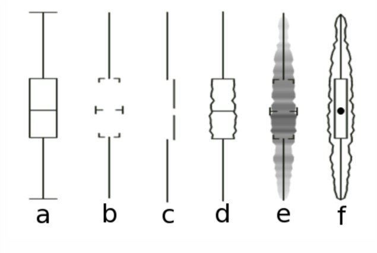

# Outline

- Principles of good and bad visualization

- Complementing human perception

---
# Exploratory vs. explanatory

- Like most applications within statistics, visualizations can either explore or explain

.center[

]

---
# An exploratory graph

```{r, include=FALSE, message=FALSE}
library(tidyverse)
library(gapminder)

gm_americas <- gapminder %>% 
  filter(continent == "Americas" & year == 2007)
```

.pull-left[
```{r, echo=FALSE, message=FALSE}
ggplot(gm_americas, aes(x = gdpPercap, y = lifeExp)) +
  geom_point() +
  geom_smooth(method = "lm", se = FALSE)
```
]

.pull-right[
```{r, eval=FALSE}
ggplot(gm_americas, aes(x = gdpPercap, y = lifeExp)) +
  geom_point() +
  geom_smooth(method = "lm", se = FALSE)
```
]
---
# An explanatory graph
.pull-left[
```{r, echo=FALSE, message=FALSE}
ggplot(gm_americas, aes(x = gdpPercap, y = lifeExp)) +
  geom_point() +
  geom_smooth(se = FALSE, linetype = "dashed", color = "gray", span = 1) +
  scale_x_continuous(labels = scales::dollar) +
  labs(title = "Life Expectancy and Wealth in the Americas",
       subtitle = "2007",
       y = "Life Expectancy",
       x = "GDP Per Capita",
       caption = "Source: Gapminder Dataset") +
  theme_classic()
```
]
.pull-right[
```{r, eval=FALSE}
ggplot(gm_americas, aes(x = gdpPercap, y = lifeExp)) +
  geom_point() +
  geom_smooth(se = FALSE, linetype = "dashed", color = "gray", span = 1) +
  scale_x_continuous(labels = scales::dollar) +
  labs(title = "Life Expectancy and Wealth in the Americas",
       subtitle = "2007",
       y = "Life Expectancy",
       x = "GDP Per Capita",
       caption = "Source: Gapminder Dataset") +
  theme_classic()
```
]

---

# Another graph for an audience

.center[

]

---
class: inverse, middle, center

# While there are general guidelines to good visualization, much is still subjective.

---
# Qualities of good viz

- **Properly chosen format**

- Use words, numbers, and drawing together

- Display an accessible complexity of detail

- Avoid content-free decoration--chart junk

- Maximize data-to-ink ratio

---
# Qualities of bad viz

- Bad taste, unnecessary ink

- Bad data

- Bad perspective

---
# Bad taste? Unnecessary ink?

.center[

]

---
# Maximize data-to-ink?

- Six ways to show a distribution with varying data-to-ink ratios

.center[

]

---
# Bad data

- Reproduction of a graph in the *New York Times* about a crisis in democracy

.center[

]

---
# Bad data

.center[

]

- Previous graph focused on the percentage of people who gave a rating of 10, "essential"

---
# Bad perception

.center[

]

- Don't use 3-D

---
# Bad perception

- Law school enrollment trend

.center[

]

- Consider how axes change the perception of scale.

---
# Bad perception? Data-to-ink?

.center[

]

- Depending on context, bar charts can lead people to think values inside the bars are more likely than values above.

---
class: inverse, middle, center

# Human vision has certain strengths and weaknesses

---
# Decoding numerical visualization

.center[

]

- Why simple (i.e., one or two variables) bar graphs or scatterplots are typically better

- Including additional information usually requires one of the less efficient methods toward the left

---
# Examples

.center[

]

- Easily compare totals and bottom category, but other three are difficult to compare across bars.

- Also difficult to compare within bars.

- Dodged bar chart would be better.

---
# Examples

```{r, echo=FALSE, message=FALSE, fig.height=8, fig.width=10, fig.align='center'}
ggplot(gm_americas, aes(x = gdpPercap, y = lifeExp)) +
  ggrepel::geom_label_repel(aes(label = country)) +
  geom_point(aes(x = gdpPercap, y = lifeExp, size = pop/1000000)) +
  geom_smooth(se = FALSE, linetype = "dashed", color = "gray", span = 1) +
  scale_x_continuous(labels = scales::dollar) +
  labs(title = "Life Expectancy and Wealth in the Americas",
       subtitle = "2007",
       y = "Life Expectancy",
       x = "GDP Per Capita",
       size = "Population (millions)",
       caption = "Source: Gapminder Dataset") +
  theme_classic() +
  theme(legend.position = 'right')
```

---
# Examples

```{r, echo=FALSE, message=FALSE, fig.height=8, fig.width=10, fig.align='center'}
ggplot(gm_americas, aes(x = gdpPercap, y = lifeExp)) +
  ggrepel::geom_label_repel(aes(label = country)) +
  geom_point(aes(x = gdpPercap, y = lifeExp, color = pop/1000000), size = 5) +
  geom_smooth(se = FALSE, linetype = "dashed", color = "gray", span = 1) +
  scale_x_continuous(labels = scales::dollar) +
  scale_color_continuous(type = 'viridis') +
  labs(title = "Life Expectancy and Wealth in the Americas",
       subtitle = "2007",
       y = "Life Expectancy",
       x = "GDP Per Capita",
       color = "Population (millions)",
       caption = "Source: Gapminder Dataset") +
  theme_classic() +
  theme(legend.position = 'right')
```

---
# Decoding categorical visualization

.center[

]

---
# Find the blue circle

.center[

]
---
# Find the blue circle
.center[

]
---
# Find the blue circle
.center[

]
---
# Find the blue circle
.center[

]
---
# Find the blue circle
.center[

]

