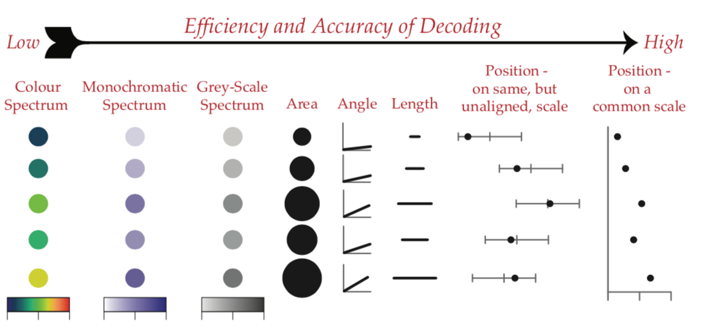
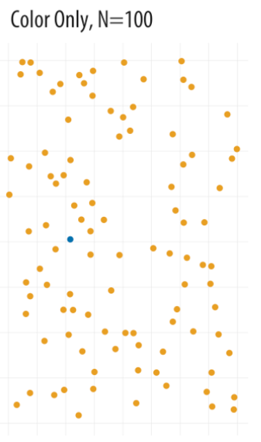

# Outline

- Principles of good and bad visualization

- Qualities of human perception

---
# Exploratory vs. explanatory

- Like most applications in statistics, visualizations can either explore or explain

.center[

]

---
# An exploratory graph

```{r, include=FALSE, message=FALSE}
library(tidyverse)
library(gapminder)

gm_americas <- gapminder %>% 
  filter(continent == "Americas" & year == 2007) %>% 
  select(country, lifeExp, gdpPercap)
```

.center[
```{r, echo=FALSE, message=FALSE}
ggplot(gm_americas, aes(x = gdpPercap, y = lifeExp)) +
  geom_point() +
  geom_smooth(method = "lm", se = FALSE)
```
]

---
# An explanatory graph
.center[
```{r, echo=FALSE, message=FALSE}
ggplot(gm_americas, aes(x = gdpPercap, y = lifeExp)) +
  geom_point() +
  geom_smooth(se = FALSE, linetype = "dashed", color = "gray", span = 1) +
  scale_x_continuous(labels = scales::dollar) +
  labs(title = "Life Expectancy and Wealth In the Americas",
       subtitle = "2007",
       y = "Life Expectancy",
       x = "GDP Per Capita",
       caption = "Source: Gapminder Dataset") +
  theme_classic()
```
]

---

# Another graph for an audience

.center[

]

---
class: inverse, middle, center

# Keep in mind while there are general guidelines to good visualization, there remains some subjectivity.

---
# Qualities of good viz

1. Properly chosen format and design

2. Use words, numbers, and drawing together

3. Display an accessible complexity of detail

4. Avoid content-free decoration--chart junk

5. Maximize data-to-ink ratio

---
# Qualities of bad viz

1. Bad taste, unnecessary ink

2. Bad data

3. Bad perspective

---
# Bad taste?

.center[

]

---
# Maximize data-to-ink?

- Six ways to show a distribution with varying data-to-ink ratios

.center[

]

---
# Bad data

- Reproduction of a graph in the *New York Times* about a crisis in democracy

.center[

]

---
# Bad data

.center[

]

- Previous graph focused on the percentage of people who gave a rating of 10, "essential"

---
# Bad perception

.center[

]

- Don't use 3-D

---
# Bad perception

.center[

]

- Be aware of how axes change the perception of scale.

---
# Bad perception

.center[

]

---
class: inverse, middle, center

# Human vision has evolved to have certain strengths and weaknesses

---
# Decoding numerical visualization

.center[

]

---
# Decoding categorical visualization

.center[

]

---
# Find the blue circle

.center[

]
---
# Find the blue circle
.center[

]
---
# Find the blue circle
.center[

]
---
# Find the blue circle
.center[

]
---
# Find the blue circle
.center[

]

