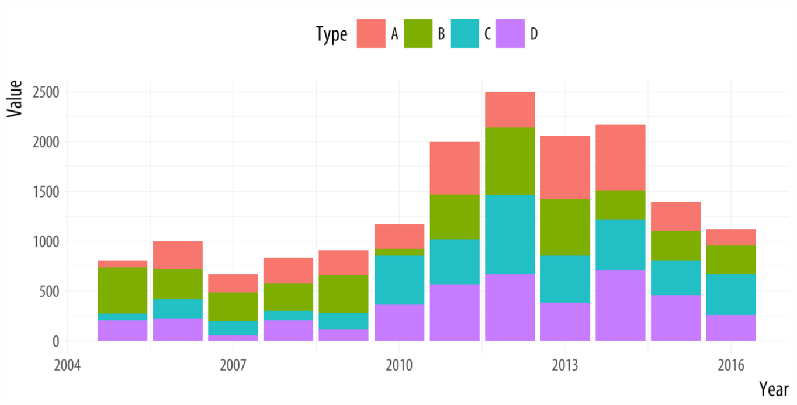

# Outline

- Choosing the appropriate graphs

- Guidelines of good visualization

```{r, include=FALSE}
library(tidyverse)
library(fivethirtyeight)
library(knitr)
```


---
# Some Data

```{r, echo=FALSE}
college_grad_students %>% 
  select(major, grad_median) %>% 
  slice_sample(n=5) %>% 
  kable()
```

- Includes 173 graduate degree majors

---
# Choosing appropriate graph

- Which graph might we use if we want to visualize the distribution of median pay?

---
# Histogram

.pull-left[
```{r, echo=FALSE}
ggplot(college_grad_students, 
       aes(x = grad_median)) +
  geom_histogram(bins = 30)
```
]

.pull-right[
```{r, eval=FALSE}
ggplot(college_grad_students, 
       aes(x = grad_median)) +
  geom_histogram(bins = 30)
```
]

---
# Exploratory vs. explanatory

.center[

]

---
# An exploratory graph

```{r, include=FALSE, message=FALSE}
library(tidyverse)
library(gapminder)

gm_americas <- gapminder %>% 
  filter(continent == "Americas" & year == 2007)
```

.pull-left[
```{r, echo=FALSE, message=FALSE}
ggplot(gm_americas, aes(x = gdpPercap, y = lifeExp)) +
  geom_point() +
  geom_smooth(method = "lm", se = FALSE)
```
]

.pull-right[
```{r, eval=FALSE}
ggplot(gm_americas, aes(x = gdpPercap, y = lifeExp)) +
  geom_point() +
  geom_smooth(method = "lm", se = FALSE)
```
]
---
# An explanatory graph
.pull-left[
```{r, echo=FALSE, message=FALSE}
ggplot(gm_americas, aes(x = gdpPercap, y = lifeExp)) +
  geom_point() +
  geom_smooth(se = FALSE, linetype = "dashed", color = "gray", span = 1) +
  scale_x_continuous(labels = scales::dollar) + 
  labs(title = "Life Expectancy and Wealth in the Americas",
       subtitle = "2007",
       y = "Life Expectancy",
       x = "GDP Per Capita",
       caption = "Source: Gapminder Dataset") +
  theme_classic() +
  theme(text = element_text(size = 14))
```
]
.pull-right[
```{r, eval=FALSE}
ggplot(gm_americas, aes(x = gdpPercap, y = lifeExp)) +
  geom_point() +
  geom_smooth(se = FALSE, linetype = "dashed", color = "gray", span = 1) +
  scale_x_continuous(labels = scales::dollar) +
  labs(title = "Life Expectancy and Wealth in the Americas",
       subtitle = "2007",
       y = "Life Expectancy",
       x = "GDP Per Capita",
       caption = "Source: Gapminder Dataset") +
  theme_classic() +
  theme(text = element_text(size = 14))
```
]

---

# Another graph for an audience

.center[

]

---
# Qualities of good viz

- Proper graph given the data

- Display an accessible complexity of detail

- Don't distort perception

- Avoid content-free decoration--chart junk

- Maximize data-to-ink ratio

---
# Chart junk?

.center[

]

---
# Distortion

- Reproduction of a graph in the *New York Times* about a crisis in democracy

.center[

]

---
# Distortion

.center[

]

- Previous graph focused on the percentage of people who gave a rating of 10

---
# Distortion

.center[

]

---
# Distortion

- Law school enrollment trend

.center[

]

- Consider how axes change the perception of scale.

---
# Possible distortion

.center[

]

- Depending on context, bar charts can lead people to think values inside the bars are more likely than values above.

- More examples of bad graphs can be found [here](https://badvisualisations.tumblr.com)

---
class: inverse, middle, center

# Human perception has strengths and weaknesses

---
# Decoding numerical visualization

.center[

]

- Why simple (i.e., one or two variables) bar graphs or scatterplots are typically better.

---
# Example

.center[

]

- Easily compare totals and bottom category, but other three are difficult to compare across bars.

- Also difficult to compare within bars.

- Dodged bar chart would be better.

---
# Example

```{r, echo=FALSE, message=FALSE, fig.height=8, fig.width=10, fig.align='center'}
ggplot(gm_americas, aes(x = gdpPercap, y = lifeExp)) +
  ggrepel::geom_label_repel(aes(label = country)) +
  geom_point(aes(x = gdpPercap, y = lifeExp, size = pop/1000000)) +
  geom_smooth(se = FALSE, linetype = "dashed", color = "gray", span = 1) +
  scale_x_continuous(labels = scales::dollar) +
  labs(title = "Life Expectancy and Wealth in the Americas",
       subtitle = "2007",
       y = "Life Expectancy",
       x = "GDP Per Capita",
       size = "Population (millions)",
       caption = "Source: Gapminder Dataset") +
  theme_classic() +
  theme(legend.position = 'right')
```

---
# Example

```{r, echo=FALSE, message=FALSE, fig.height=8, fig.width=10, fig.align='center'}
ggplot(gm_americas, aes(x = gdpPercap, y = lifeExp)) +
  ggrepel::geom_label_repel(aes(label = country)) +
  geom_point(aes(x = gdpPercap, y = lifeExp, color = pop/1000000), size = 5) +
  geom_smooth(se = FALSE, linetype = "dashed", color = "gray", span = 1) +
  scale_x_continuous(labels = scales::dollar) +
  scale_color_continuous(type = 'viridis') +
  labs(title = "Life Expectancy and Wealth in the Americas",
       subtitle = "2007",
       y = "Life Expectancy",
       x = "GDP Per Capita",
       color = "Population (millions)",
       caption = "Source: Gapminder Dataset") +
  theme_classic() +
  theme(legend.position = 'right')
```

---
# Decoding categorical visualization

.center[

]

---
# Find the blue circle

.center[

]
---
# Find the blue circle
.center[

]
---
# Find the blue circle
.center[

]
---
# Find the blue circle
.center[

]
---
# Find the blue circle
.center[

]

---
class: inverse, middle, center

# Let's consider a few graphs you all made in R Chapter 5

---
# Number of counties by state

```{r, include=FALSE}
library(data.table)
countyComplete <- fread('http://openintro.org/data/tab-delimited/county_complete.txt')
```

```{r, echo=FALSE, fig.height=7, fig.width=9}
# Question 3
ggplot(countyComplete, aes(x= state)) + geom_bar(fill = "red")+ labs(y='Number of Counties')
```

---
# Number of counties by state

```{r, echo=FALSE, fig.height=7, fig.width=9}
ggplot(countyComplete, aes(y = state)) +
  geom_bar()
```

---
# Number of counties by state

```{r, echo=FALSE, fig.height=7, fig.width=9}
ggplot(countyComplete, aes(y = state)) +
geom_bar(fill = 'steelblue') +
  labs(y = 'States', x = 'Number of Counties') +
  theme_classic()
```

---
# Scatterplot

```{r, echo=FALSE, warning=FALSE, fig.height=7, fig.width=9}
ggplot(countyComplete, aes(x = state, y = poverty_2010)) +
  geom_point()
```

---
# Scatterplot

```{r, echo=FALSE, warning=FALSE, fig.height=7, fig.width=9}
ggplot(countyComplete, aes(x = bachelors_2010, y = hs_grad_2010)) +
  geom_point()
```

---
# Scatterplot

```{r, echo=FALSE, warning=FALSE, fig.height=7, fig.width=9}
ggplot(countyComplete, aes(x=median_household_income_2010, y=bachelors_2010)) +
  geom_point()
```

---
# Scatterplot

```{r, echo=FALSE, warning=FALSE, fig.height=7, fig.width=9}
ggplot(countyComplete, aes(x = veterans_2017, y = some_college_2017)) +
  geom_point(color="lightskyblue2")
```

---
# Scatterplot

```{r, echo=FALSE, warning=FALSE, fig.height=7, fig.width=9}
ggplot(countyComplete, aes(x=poverty_2016, y= unemployment_rate_2016)) + geom_point(color = "red", size = 2) 
```

---
# Scatterplot

```{r, echo=FALSE, warning=FALSE, fig.height=7, fig.width=9}
ggplot(countyComplete, aes (x = bachelors_2017, y = age_over_65_2017)) +
  geom_point()
```