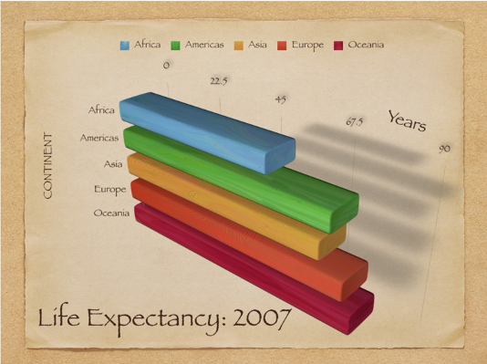
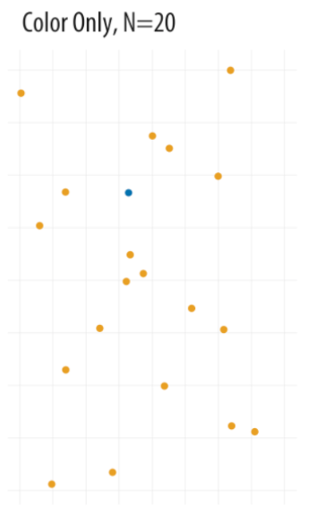

# Outline

- Principles of good and bad visualization

- Complementing human perception

---
# Exploratory vs. explanatory

- Like most applications within statistics, visualizations can either explore or explain

.center[

]

---
# An exploratory graph

```{r, include=FALSE, message=FALSE}
library(tidyverse)
library(gapminder)

gm_americas <- gapminder %>% 
  filter(continent == "Americas" & year == 2007)
```

.pull-left[
```{r, echo=FALSE, message=FALSE}
ggplot(gm_americas, aes(x = gdpPercap, y = lifeExp)) +
  geom_point() +
  geom_smooth(method = "lm", se = FALSE)
```
]

.pull-right[
```{r, eval=FALSE}
ggplot(gm_americas, aes(x = gdpPercap, y = lifeExp)) +
  geom_point() +
  geom_smooth(method = "lm", se = FALSE)
```
]
---
# An explanatory graph
.pull-left[
```{r, echo=FALSE, message=FALSE}
ggplot(gm_americas, aes(x = gdpPercap, y = lifeExp)) +
  geom_point() +
  geom_smooth(se = FALSE, linetype = "dashed", color = "gray", span = 1) +
  scale_x_continuous(labels = scales::dollar) +
  labs(title = "Life Expectancy and Wealth in the Americas",
       subtitle = "2007",
       y = "Life Expectancy",
       x = "GDP Per Capita",
       caption = "Source: Gapminder Dataset") +
  theme_classic()
```
]
.pull-right[
```{r, eval=FALSE}
ggplot(gm_americas, aes(x = gdpPercap, y = lifeExp)) +
  geom_point() +
  geom_smooth(se = FALSE, linetype = "dashed", color = "gray", span = 1) +
  scale_x_continuous(labels = scales::dollar) +
  labs(title = "Life Expectancy and Wealth in the Americas",
       subtitle = "2007",
       y = "Life Expectancy",
       x = "GDP Per Capita",
       caption = "Source: Gapminder Dataset") +
  theme_classic()
```
]

---

# Another graph for an audience

.center[

]

---
class: inverse, middle, center

# While there are general guidelines to good visualization, much is still subjective.

---
# Qualities of good viz

- Proper graph given the data

- Display an accessible complexity of detail

- Don't distort perception

- Avoid content-free decoration--chart junk

- Maximize data-to-ink ratio

---
# Chart junk?

.center[

]

---
# Maximize data-to-ink?

- Six ways to show a distribution with varying data-to-ink ratios

.center[

]

---
# Distortion

- Reproduction of a graph in the *New York Times* about a crisis in democracy

.center[

]

---
# Distortion

.center[

]

- Previous graph focused on the percentage of people who gave a rating of 10, "essential"

---
# Distortion

.center[

]

- Don't use 3-D if the third dimension does not add information

---
# Distortion

- Law school enrollment trend

.center[

]

- Consider how axes change the perception of scale.

---
# Possible distortion

.center[

]

- Depending on context, bar charts can lead people to think values inside the bars are more likely than values above.

---
class: inverse, middle, center

# Human vision has certain strengths and weaknesses

---
# Decoding numerical visualization

.center[

]

- Why simple (i.e., one or two variables) bar graphs or scatterplots are typically better.

---
# Example

.center[

]

- Easily compare totals and bottom category, but other three are difficult to compare across bars.

- Also difficult to compare within bars.

- Dodged bar chart would be better.

---
# Example

```{r, echo=FALSE, message=FALSE, fig.height=8, fig.width=10, fig.align='center'}
ggplot(gm_americas, aes(x = gdpPercap, y = lifeExp)) +
  ggrepel::geom_label_repel(aes(label = country)) +
  geom_point(aes(x = gdpPercap, y = lifeExp, size = pop/1000000)) +
  geom_smooth(se = FALSE, linetype = "dashed", color = "gray", span = 1) +
  scale_x_continuous(labels = scales::dollar) +
  labs(title = "Life Expectancy and Wealth in the Americas",
       subtitle = "2007",
       y = "Life Expectancy",
       x = "GDP Per Capita",
       size = "Population (millions)",
       caption = "Source: Gapminder Dataset") +
  theme_classic() +
  theme(legend.position = 'right')
```

---
# Examples

```{r, echo=FALSE, message=FALSE, fig.height=8, fig.width=10, fig.align='center'}
ggplot(gm_americas, aes(x = gdpPercap, y = lifeExp)) +
  ggrepel::geom_label_repel(aes(label = country)) +
  geom_point(aes(x = gdpPercap, y = lifeExp, color = pop/1000000), size = 5) +
  geom_smooth(se = FALSE, linetype = "dashed", color = "gray", span = 1) +
  scale_x_continuous(labels = scales::dollar) +
  scale_color_continuous(type = 'viridis') +
  labs(title = "Life Expectancy and Wealth in the Americas",
       subtitle = "2007",
       y = "Life Expectancy",
       x = "GDP Per Capita",
       color = "Population (millions)",
       caption = "Source: Gapminder Dataset") +
  theme_classic() +
  theme(legend.position = 'right')
```

---
# Decoding categorical visualization

.center[

]

---
# Find the blue circle

.center[

]
---
# Find the blue circle
.center[

]
---
# Find the blue circle
.center[

]
---
# Find the blue circle
.center[

]
---
# Find the blue circle
.center[

]

---
# More examples

For more examples of bad visualizations, check out this [Tumblr blog](https://badvisualisations.tumblr.com)

---
class: inverse, middle, center

# Let's consider a few graphs you all made in R Chapter 5

---
# Number of counties by state

```{r, include=FALSE}
library(data.table)
countyComplete <- fread('http://openintro.org/data/tab-delimited/county_complete.txt')
```

```{r, echo=FALSE, fig.height=7, fig.width=9}
# Question 3
print(ggplot(countyComplete, aes(x = "state", fill = state)) +
  geom_bar(position = 'fill') +
  labs(y = 'Count of county',
       fill = 'county') +
    ggtitle("Bar Chart"))
```

---
# Number of counties by state

```{r, echo=FALSE, fig.height=7, fig.width=9}
ggplot(countyComplete, aes(x = state)) +
  geom_bar() +
labs(y = 'Number of Counties')
```

---
# Number of counties by state

```{r, echo=FALSE, fig.height=7, fig.width=9}
ggplot(countyComplete, aes(y = state)) +
  geom_bar()
```

---
# Number of counties by state

```{r, echo=FALSE, fig.height=7, fig.width=9}
ggplot(countyComplete, aes(y = state)) +
  geom_bar(fill = 'steelblue') +
  labs(y = 'Number of counties') +
  theme_classic() +
  theme(axis.line.x = element_blank(),
        axis.ticks.x = element_blank(),
        axis.title.x = element_blank())
```

---
# Scatterplot

```{r, echo=FALSE, warning=FALSE, fig.height=7, fig.width=9}
ggplot(countyComplete, aes(x = median_age_2017, y = pop2017)) +
  geom_point()
```

---
# Scatterplot

```{r, echo=FALSE, warning=FALSE, fig.height=7, fig.width=9}
ggplot(countyComplete, aes(x = some_college_2016 , y = log(firms_2007))) +
  geom_point()
```

---
# Scatterplot

```{r, echo=FALSE, warning=FALSE, fig.height=7, fig.width=9}
ggplot(countyComplete, aes(x = hs_grad_2017, y = median_household_income_2017)) +
  geom_point()
```

---
# Scatterplot

```{r, echo=FALSE, warning=FALSE, fig.height=7, fig.width=9}
ggplot(countyComplete, aes(x = bachelors_2017 , y = foreign_spoken_at_home_2010)) +
  geom_point()
```

---
# Scatterplot

```{r, echo=FALSE, warning=FALSE, fig.height=7, fig.width=9}
ggplot(countyComplete, aes(x = white_not_hispanic_2017, 
                           y = speak_english_only_2017)) +
  geom_point() +
  geom_smooth(method = 'lm', se = FALSE, 
              linetype = 'dashed', color = 'black')
```

---
# Scatterplot

```{r, echo=FALSE, warning=FALSE, fig.height=7, fig.width=9}
ggplot(countyComplete, aes(x = no_move_in_one_plus_year_2010, y = foreign_born_2010)) +
  geom_point(color = 'steelblue', size = 2) +
  geom_smooth(method = 'lm', se = FALSE, 
              linetype = 'dashed', color = 'black') +
  scale_y_log10(label=scales::comma_format()) +
  labs(y = 'Foreign Born',
       x = 'No Move') +
  theme_minimal()
```