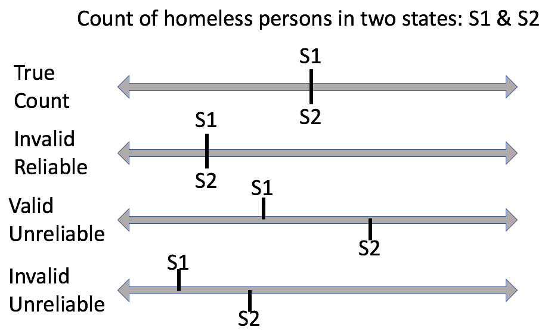

# Outline

- Introduction to the building blocks of credible analysis

- Measurement validity

- Measurement reliability

---
# Credible analysis


---
class: inverse, middle, center

# All data is a measured representation of reality -- shadows on the wall of the cave.

---
# Measurement

- **Measurement Validity**: Does the variable accurately represent what it claims to represent? Are the values accurate representations of the intended concept/phenomenon?

--

- **Measurement Reliability**: Does the way the variable is measured generate the same value given the same reality? Given two real and identical conditions, will my data contain identical values?

---
# Measurement
.center[

]

- Match one of the below to one of the above
  - W-2 gross earnings
  - Self-reported income
  - Count of homeless persons
  - Federal poverty line

---
# Measurement



---
# Why does this matter?

- Often leads to important and interesting questions about how data is collected and whether it is trustworthy.

- If data have a weak or no relationship with the thing you are trying to study, you have no foundation upon which to continue your work.

- Sometimes flawed data is the best we got, and understanding its flaws can help mitigate mistakes in interpretations and decisions.

---
background-image: url(lectures_files/covid_deathrate.jpg)

# Recap

---
class: inverse, middle, center

# Speaking of flawed data, we must also consider **missing** data

---
# Missingness

- Two types
  - Explicit
  - Implicit
  
- Explicitly missing data are data that we can *see* are missing in the data; cells containing a value that denotes missing

- Implicitly missing data are data that we would expect to be included based on data structure but are not; no obvious sign of missing

---
# Explicitly missing

```{r, echo=FALSE, message=FALSE}
library(gapminder)
library(tidyverse)
library(knitr)

crossgap <- gapminder %>% 
  filter(year == 2007 & continent == 'Americas') %>% 
  head(n=3)

crossgap[1,4] <- NA
crossgap[2,6] <- NA

kable(crossgap, format = 'html')
```

--

- Conceptual/theoretical concerns
  - Do not assume data are missing at random
  - Ask yourself why data are missing and if missingness is influenced by a factor that is relevant to your work

--
- Technical concern
  - When summarizing data, account for missing values
  - Incorrect to say we have 3 countries with a mean life expectancy of `r mean(crossgap$lifeExp, na.rm=TRUE)`

---
# Explicit examples

- Missing income from a survey of SPIA MPA alumni
- Missing financial aid data in a college student data set
- Missing sales tax rates in state finance data

---
# Implicitly missing

```{r, echo=FALSE}
gapminder %>% 
  filter(continent == 'Americas', year >= 1997) %>% 
  head(n=6) %>%
  filter(country!='Bolivia' | year!=2002) %>% 
  kable(format = 'html')
```

- Typical in panel data where units seem to enter and exit the data
- Same concerns apply

---
# Implicit examples

- Drug trials
- Panels of sub-state government jurisdictions
- Time series of a smaller unit of time aggregated up to a larger unit of time (monthly data aggregated to annual)

---
# Recap

- Missingness is also a measurement issue
- Almost never missing at random; reason may or may not be critical to your work; you don't know if you don't think about it
- We will learn what to do with missing data later

---
class: inverse, middle, center

# Measurement vality concerns accuracy. Measurement reliability concerns precision. But another definition of precision concerns the exactness of our measurement, which most associate with accuracy.

---
background-image: url(lectures_files/ruler.jpg)

# Precision

---
```{r, echo=FALSE}
head(gapminder, n=6) %>% 
  kable(format = 'html')
```

- Life expectancy is reported to the nearest thousandth decimal place.
- This means *true* life expectancy is some value that would round to the the nearest thousandth.
- What was the possible life expectancy in Afghanistan in 1952?

---
# Why does this matter

- 14.38% of all statistics are lies

--

- Precision can be used to convince people that dubious facts are true

--

- Do not report numbers that are more precise than the underlying data
- There may be legitimate reasons to round to fewer decimal places than underlying data, but understand you are decreasing precision

