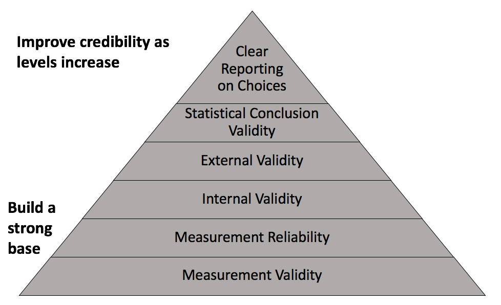

# Outline

```{r, include=FALSE}
library(gapminder)
library(tidyverse)
library(knitr)
```


- Measurement validity

- Measurement reliability

- Missing data

---
# What does the data say?

"Data doesn't *say* anything. *Humans* say things. ... Data can’t say anything about an issue any more than a hammer can build a house ... Data is a necessary ingredient in discovery, but you need a human to select it, shape it, and then turn it into an insight. Data is therefore only as useful as its quality and the skills of the person wielding it" (Jones-Rooy, 2019). 

---
# Credible analysis



---
# Measurement Validity

- **Measurement Validity**: The extent to which a variable measures what it is intended to measure.

- Are values recorded accurately?

- Do values accurately measure the phenomenon I or others claim they do?

---
# Measurement Reliability

- **Measurement Reliability**: The extent to which the measurement process or instrument for a variable generates consistent values.

- Are values consistent across subjects and/or time?

- Is variation across subjects or time real or due to inconsistent measurement?

---
# Example


---
# Discussion

- With some of your neighbors, discuss the following about one or more of the examples below:
  - How might there be issues with measurement validity and/or reliability?
  - What might be some consequences of poor measurement validity and/or reliability?

- Property values

- Crime rates

- Test scores

- Census data (e.g., population, race/ethnicity)

---
# Why does this matter?

- Can lead to important questions about how data are collected.

- Can impact our ability to make comparisons between entities or over time that are often involved in decision-making.

- One of many reminders not to be too certain. Much of statistics is about producing a *range* of values we trust will usually contain the truth.

---
class: inverse, middle, center

# Missing data

---
# Missing Data

- Two types
  - Explicit
  - Implicit
  
- Explicitly missing data are data that we can *see* are missing in the data; cells containing a value that denotes missing

- Implicitly missing data are data that we would expect to be included based on data structure but are not; no obvious sign of missing

---
# Explicitly missing

```{r, echo=FALSE, message=FALSE}
crossgap <- gapminder %>% 
  filter(year == 2007 & continent == 'Americas') %>% 
  head(n=3)

crossgap[1,4] <- NA
crossgap[2,6] <- NA

kable(crossgap, format = 'html', digits = 1)
```

- Incorrect to say we have 3 countries with a mean life expectancy of `r mean(crossgap$lifeExp, na.rm=TRUE)`

---
# Implicitly missing

```{r, echo=FALSE}
gapminder %>% 
  filter(continent == 'Americas', year >= 1997) %>% 
  head(n=6) %>%
  filter(country!='Bolivia' | year!=2002) %>% 
  kable(format = 'html', digits = 1)
```

- Bolivia missing in 2002 may affect a statistic I want to compute from these data

---
# Remember

- Don't assume data are missing at random

- Missing data may be systematically different than observed data

- Consider the group the data is supposed to contain and whether missing data require us to limit the scope/generalizability of conclusions


