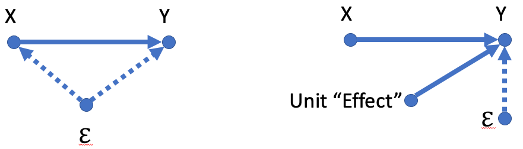

# Outline

```{r, include=FALSE}
library(tidyverse)
library(gapminder)
library(moderndive)
library(plm)
library(knitr)
library(broom)
load("lectures_files/statepanel.RData")

statepanel <- statepanel %>% 
  mutate(tuition = tuition/1000)
```

- Our goal is to learn how to incorporate the additional information of panel data into regression and why it matters

- Whether or not to run a fixed effects regression

---
# Panel Data

```{r, echo=FALSE}
gapminder %>% 
  filter(continent == 'Americas', year >= 1997) %>% 
  head(n=6) %>% 
  kable(format = 'html')
```

- Variation across units AND time

---
# Revisiting Life Exp and GDP

- We have seen versions of the following regression many times

```{r}
gap_ols <- lm(log(lifeExp) ~ log(gdpPercap) + continent, data = gapminder)
get_regression_table(gap_ols) %>% 
  kable()
```

---
# Revisiting Life Exp and GDP

- But previous model treats `gapminder` as pooled cross-sectional instead of panel

- Might there be unobserved, "fixed" characteristics of each country that effects GDP and life expectancy?

- If so, we have OVB in our model.

- This is what a fixed effects regression accounts for

---
# Revisiting Life Exp and GDP

- Controlling for country and year fixed effects:

```{r, echo=FALSE}
gap_fe <- plm(log(lifeExp) ~ log(gdpPercap), data = gapminder, model = "within", effect = "twoways", index = c("country", "year"))

tidy(gap_fe) %>% 
  kable()
```


- GDP no longer rejects the null hypothesis

- No statistically significant evidence that GDP affects life expectancy

---
# Enter fixed effects regression

```{r, echo=FALSE, fig.align='center'}

```

- On left, $X$ is biased

- *IF* we assume *ALL* relevant omitted variables are captured by controlling for **constant** differences between units

- Then we have eliminated the OVB and we are back to a causal estimate of $X$ on $Y$

---
# Fixed effects regression

- Fixed effects (FE) regression controls for time-invariant (i.e. constant), unobserved differences across units of a panel

--

- Essentially includes a dummy variable for each unit in the panel, allowing each unit to have its own y-intercept

--

- This controls for whatever constant factor(s) cause the different intercepts

--

- If those constant factors also affect other explanatory variables in our model, then FE closes the backdoor path they created

---
# Regression notation

- Standard OLS:

$$ y_i=\beta_0 + \beta_1x_i + \epsilon_i $$

- The $i$ subscript is an **index**; corresponds to the unit of analysis

- Signals to the reader that we are using variation *between* units $i = 1 \dots N$ where $N$ is the total units in our data

- Each row $i$ in our data has an observed value for $y$ and $x$

- For all the rows in our data, we estimate a *single, common* intercept, $b_0$, and a common slope $b_1$

---
# Fixed Effects Notation

$$y_{it}=\beta x_{it} + \alpha z_i + \delta w_t + \epsilon_{it}$$

- Now we have values for unit $i = 1 \dots N$ at time $t = 1 \dots T$ where $N$ is still the total units in the data and $T$ is the total time periods 

--

- $x_{it}$ represents factors that vary between units $i$ and over time $t$
  - Education level, crime, unemployment, tax rates, etc.
  
--

- $z_i$ vary between units $i$ but are constant over time
  - Sex, race, geographic region, treatment/control group

--

- $w_t$ vary over time $t$ but are constant between units
  - Inflation, interest rates, recession, war

---
# Fixed effects

$$y_{it}=\beta x_{it} + \alpha z_i + \delta w_t + \epsilon_{it}$$

- Fixed effects is an admission that we can't possibly collect data for all the $z_i$ variables

- Fortunately, we don't need data for $z_i$ if we have panel data and run fixed effects

--

- With fixed effects. ALL $z_i$ variables collapse into a *unique* intercept for each unit $i$

$$y_{it}= \alpha_i + \beta x_{it} + \delta w_t + \epsilon_{it}$$
- Note the subscript $i$ for the intercept instead of a common $\beta_0$ intercept

---
# Two-Way Fixed Effects

$$y_{it}= \alpha_i + \beta x_{it} + \delta w_t + \epsilon_{it}$$

- We can also control for all factors that vary over time but not across units $w_t$

- Often referred to as two-way fixed effects: unit and time

- Now including a dummy variable for each unit and each time period

$$y_{it}= \alpha_i + \delta_t + \beta x_{it} + \epsilon_{it}$$

---
# Example

- Suppose we want to investigate state-level college enrollment as a percentage of population age 18-24

- Let's first look at trends over time

```{r, echo=FALSE, fig.align='center', fig.height=5}
ggplot(statepanel, aes(x=year, y=enroll_pct, color = state)) +
  geom_line() +
  labs(y = 'Percent Enrollment',
       x ='',
       color = '') +
  theme_minimal()
```

---
# Example
```{r, echo=FALSE, fig.align='center'}
ggplot(statepanel, aes(x=year, y=enroll_pct)) +
  geom_line() +
  facet_wrap(~ state) +
  theme_minimal() +
  theme(axis.title = element_blank(),
        axis.text.x = element_blank())
```

---
# Example

- Now suppose we want to investigate the effect of average tuition on enrollment

```{r, echo=FALSE, fig.align='center', fig.height=5.5, message=FALSE, warning=FALSE}
ggplot(statepanel, aes(x=tuition, y=enroll_pct)) +
  geom_point() +
  geom_smooth(method = lm, se = FALSE) +
  labs(y = 'Percent Enrollment',
       x ='Tuition') +
  theme_minimal()
```

---
# Example

```{r, echo=FALSE, fig.align='center', message=FALSE, warning=FALSE}
ggplot(statepanel, aes(x=tuition, y=enroll_pct, color = state)) +
  geom_point() +
  geom_smooth(method = lm, se = FALSE) +
  labs(y = 'Percent Enrollment',
       x ='Tuition') +
  theme_minimal()
```

---
# Example

```{r, echo=FALSE, fig.align='center', message=FALSE, warning=FALSE}
ggplot(statepanel, aes(x=tuition, y=enroll_pct)) +
  geom_point(alpha = 0.5) +
  geom_smooth(method = lm, se = FALSE) +
  facet_wrap(~ state) +
  labs(y = 'Percent Enrollment',
       x ='Tuition') +
  theme_minimal()
```

---
# Fixed effects

- Fixed effects estimates the relationship between variables *within* each unit of the panel

- The estimate for an explanatory variable is the average slope of all the individual unit slopes

---
# Running FE in R and interpretation

- First, standard OLS regression. Tuition is in 1,000s of dollars.

$$PctEnroll_i = \beta_0 + \beta_1 tuition_i + \epsilon_i$$
```{r}
standard_ols <- lm(enroll_pct ~ tuition, data = statepanel)
```

```{r, eval=FALSE}
get_regression_table(standard_ols)
```

```{r, echo=FALSE}
get_regression_table(standard_ols) %>% 
  kable()
```

---
# Running FE in R and interpretation

$$PctEnroll_{it} = \alpha_i + \beta_1 tuition_{it} + \epsilon_{it}$$
```{r}
fe <- plm(enroll_pct ~ tuition, data = statepanel,
              index = c("state", "year"), model = "within")
```

```{r, eval=FALSE}
summary(fe) #get_regression_table won't work
```

```{r, eval=FALSE}
broom::tidy(fe) # nicer looking results
```
```{r, echo=FALSE}
broom::tidy(fe) %>% 
  kable()
```

On average, a 1,000 dollar increase in states' average tuition is associated with a 1 percentage point increase in college enrollment, **controlling for fixed effects**. 

---
# Example

- Our FE results are counterintuitive; enrollment is not expected to increase as the price increases

- What is a plausible explanation?

--

- Most students do not pay full tuition

- A rise in tuition is typically followed by a rise in financial aid

- We should control for how much tuition students pay

---
# Example

```{r, echo=FALSE}
statepanel %>% 
  select(-stfips, -enrollment, -appropriations, -povrate, -medinc) %>% 
  slice_sample(n = 6) %>% 
  kable(digits = 1)
```


---
# Better FE model

```{r}
fe2 <- plm(enroll_pct ~ tuition + studentshare + unemp + pop1824 + region, 
           data = statepanel,
           index = c("state", "year"), model = "within")
```

```{r, echo=FALSE}
broom::tidy(fe2) %>% 
  kable()
```

---
# Interpretation

- On average, an increase in tuition of 1,000 dollars results in a 0.63 percentage point decrease in enrollment, all else equal.

- Why no estimates for `region`?

--

- Because region does not vary over time ( $z_i$ ); a state's region is always the same

- Therefore, it gets absorbed into the fixed effect

- If we really care about a time-invariant variable, using FE will prevent us from obtaining an estimate

---
# Back to standard OLS

```{r}
standard_ols2 <- lm(enroll_pct ~ tuition + studentshare + unemp + pop1824 + region, 
           data = statepanel)
```

```{r, eval=FALSE}
get_regression_table(standard_ols2)
```

```{r, echo=FALSE}
get_regression_table(standard_ols2) %>% 
  kable()
```

---
# Drawbacks of FE

- Can't estimate association/effect of time-invariant variables

- Estimates are less precise than standard OLS regression
  - FE is like adding a dummy explanatory variable for each unit in the panel
  - Each explanatory variable imposes a penalty on precision (reduces sample size by 1)
  - Preferable if we can avoid this loss

---
# Testing whether FE should be used

```{r}
pFtest(fe2, standard_ols2)
```

- If p-value < 0.05, use FE

- We should use FE in this example

---
# Controlling for time trends

$$y_{it}= \alpha_i + \delta_t + \beta x_{it} + \epsilon_{it}$$

- We may also want to control for a common time trend, $\delta_t$
- Adds dummy variables for each year in our panel
- Controls for factors that changed/occurred during over this time period that affected all units in the panel

---
# Adding time trends in FE

```{r}
fe2_time <- plm(enroll_pct ~ tuition + studentshare + unemp + pop1824,
                data = statepanel, index = c("state", "year"), 
                model = "within", effect = "twoways") #<<
```

```{r, echo=FALSE}
broom::tidy(fe2_time) %>% 
  kable()
```

---
# Testing whether to include time trends

- Adding a dummy for each year costs us more observations

```{r}
pFtest(fe2_time, fe2)
```

- If p-value < 0.05, include time trends

- We should include time trends in this example

---
# Recap

- FE eliminates OVB caused by time-invariant explanatory variables only

- Controlling for time trends eliminates OVB caused by unit-invariant explanatory variables only

- Omitted variables that change over time and vary between units can still cause OVB

