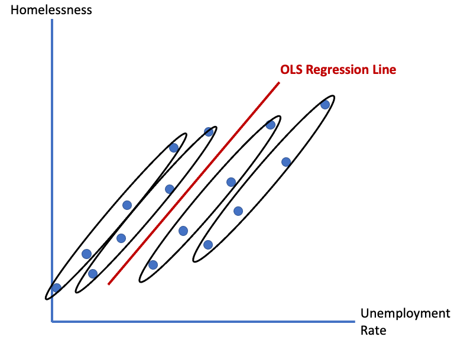
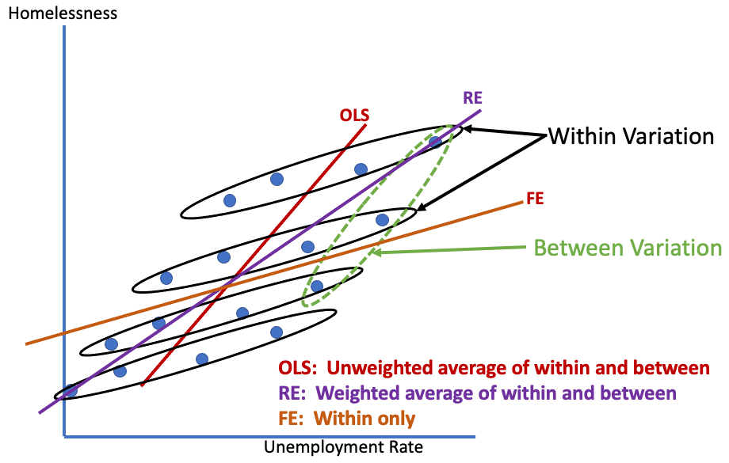

# Outline

```{r, include=FALSE}
library(tidyverse)
library(gapminder)
library(moderndive)
library(plm)
library(knitr)
load("lectures_files/statepanel.RData")

statepanel <- statepanel %>% 
  mutate(tuition = tuition/1000)
```

- Our goal is to learn how to incorporate the additional information of panel data into regression and why it matters

- Whether or not to run a fixed effects regression

---
# Panel Data

```{r, echo=FALSE}
gapminder %>% 
  filter(continent == 'Americas', year >= 1997) %>% 
  head(n=6) %>% 
  kable(format = 'html')
```

- Variation across units AND time

---
# Example

- Suppose we want to examine the effect of unemployment (rate) on homelessness

- Suppose we have homelessness and unemployment data for 4 cities (N = 4) for 4 years (T=4), so we would have a total of 16 observations
  - Not enough data for an actual analysis; just an example

- Let's assume homelessness increases as unemployment increases

---
# Example

.pull-left[
```{r, echo=FALSE, fig.align='center'}

```
]

.pull-right[
- Cities have same slope

- Each has different intercept
  - Each city's "effect"
  - Inherent omitted differences
]

- Key question is whether we think these omitted differences also affect unemployment. If so, we have omitted variable bias

---
# Enter fixed effects regression

```{r, echo=FALSE, fig.align='center'}
include_graphics('lectures_files/fixfx-dag.png')
```

- On left, $X$ is biased

- *IF* we assume *ALL* relevant omitted variables are captured by controlling for **constant** differences between units

- Then we have eliminated the OVB and we are back to a causal estimate of $X$ on $Y$

---
# Fixed effects regression

- Fixed effects (FE) regression controls for time-invariant (i.e. constant), unobserved differences across units of a panel

--

- Essentially includes a dummy variable for each unit in the panel, allowing each unit to have its own y-intercept

--

- This controls for whatever constant factor(s) cause the different intercepts

--

- If those constant factors also affect other explanatory variables in our model, then FE closes the backdoor path they created

---
# Some helpful notation

$$y_{it}=\beta x_{it} + \alpha z_i + \delta w_t + \epsilon_{it}$$

- N cross-sectional units $i$ followed over T time periods $t$

--

- $x_{it}$ vary across units and over time
  - Education, crime, unemployment, tax rates, etc.

--

- $z_i$ vary across units but are constant over time
  - Sex, race, geographic region, governance model

--

- $w_t$ vary over time but are constant across units
  - Macroeconomic trends like inflation or interest rates; events that affect all units like a recession or war

---
# Fixed effects

$$y_{it}=\beta x_{it} + \alpha z_i + \delta w_t + \epsilon_{it}$$

- If we observe (i.e. have data) on all the $z_i$ variables that matter, we could just control for them

--

- If we don't and run fixed effects instead, then ALL of those variables in $z_i$ get collapsed into the intercept

$$y_{it}= \alpha_i + \beta x_{it} + \delta w_t + \epsilon_{it}$$

- Even if we do control for a few $z_i$ variables, they will be absorbed by the fixed effect intercept

---
# Example

- Suppose we want to investigate state-level college enrollment as a percentage of population age 18-24

- Let's first look at trends over time

```{r, echo=FALSE, fig.align='center', fig.height=5}
ggplot(statepanel, aes(x=year, y=enroll_pct, color = state)) +
  geom_line() +
  labs(y = 'Percent Enrollment',
       x ='',
       color = '') +
  theme_minimal()
```

---
# Example
```{r, echo=FALSE, fig.align='center'}
ggplot(statepanel, aes(x=year, y=enroll_pct)) +
  geom_line() +
  facet_wrap(~ state) +
  theme_minimal() +
  theme(axis.title = element_blank(),
        axis.text.x = element_blank())
```

---
# Example

- Now suppose we want to investigate the effect of average tuition on enrollment

```{r, echo=FALSE, fig.align='center', fig.height=5.5, message=FALSE, warning=FALSE}
ggplot(statepanel, aes(x=tuition, y=enroll_pct)) +
  geom_point() +
  geom_smooth(method = lm, se = FALSE) +
  labs(y = 'Percent Enrollment',
       x ='Tuition') +
  theme_minimal()
```

---
# Example

```{r, echo=FALSE, fig.align='center', message=FALSE, warning=FALSE}
ggplot(statepanel, aes(x=tuition, y=enroll_pct, color = state)) +
  geom_point() +
  geom_smooth(method = lm, se = FALSE) +
  labs(y = 'Percent Enrollment',
       x ='Tuition') +
  theme_minimal()
```

---
# Example

```{r, echo=FALSE, fig.align='center', message=FALSE, warning=FALSE}
ggplot(statepanel, aes(x=tuition, y=enroll_pct)) +
  geom_point(alpha = 0.5) +
  geom_smooth(method = lm, se = FALSE) +
  facet_wrap(~ state) +
  labs(y = 'Percent Enrollment',
       x ='Tuition') +
  theme_minimal()
```

---
# Within and Between Variation

- Last few slides demonstrated within and between variation

```{r, echo=FALSE, fig.align='center'}

```

---
# Fixed effects

- Fixed effects estimates the relationship between variables *within* each unit of the panel

- The estimate for an explanatory variable is the average slope of all the individual unit slopes

---
# Running FE in R and interpretation

- First, standard OLS regression. Tuition is in 1,000s of dollars.

$$PctEnroll_i = \beta_0 + \beta_1 tuition_i + \epsilon_i$$
```{r}
standard_ols <- lm(enroll_pct ~ tuition, data = statepanel)
```

```{r, eval=FALSE}
get_regression_table(standard_ols)
```

```{r, echo=FALSE}
get_regression_table(standard_ols) %>% 
  kable()
```

---
# Running FE in R and interpretation

$$PctEnroll_{it} = \alpha_i + \beta_1 tuition_{it} + \epsilon_{it}$$
```{r}
fe <- plm(enroll_pct ~ tuition, data = statepanel,
              index = c("state", "year"), model = "within")
```

```{r, eval=FALSE}
summary(fe) #get_regression_table won't work
```

```{r, eval=FALSE}
broom::tidy(fe) # nicer looking results
```
```{r, echo=FALSE}
broom::tidy(fe) %>% 
  kable()
```

On average, a 1,000 dollar increase in states' average tuition is associated with a 1 percentage point increase in college enrollment, **controlling for fixed effects**. 

---
# Example

- Our FE results are counterintuitive; enrollment is not expected to increase as the price increases

- What is a plausible explanation?

--

- Most students do not pay full tuition

- A rise in tuition is typically followed by a rise in financial aid

- We should control for how much tuition students pay

---
# Example

```{r, echo=FALSE}
statepanel %>% 
  select(-stfips, -enrollment, -appropriations, -povrate, -medinc) %>% 
  slice_sample(n = 6) %>% 
  kable(digits = 1)
```


---
# Better FE model

```{r}
fe2 <- plm(enroll_pct ~ tuition + studentshare + unemp + pop1824 + region, 
           data = statepanel,
           index = c("state", "year"), model = "within")
```

```{r, echo=FALSE}
broom::tidy(fe2) %>% 
  kable()
```

---
# Interpretation

- On average, an increase in tuition of 1,000 dollars results in a 0.63 percentage point decrease in enrollment, all else equal.

- Why no estimates for `region`?

--

- Because region does not vary over time ( $z_i$ ); a state's region is always the same

- Therefore, it gets absorbed into the fixed effect

- If we really care about a time-invariant variable, using FE will prevent us from obtaining an estimate

---
# Back to standard OLS

```{r}
standard_ols2 <- lm(enroll_pct ~ tuition + studentshare + unemp + pop1824 + region, 
           data = statepanel)
```

```{r, eval=FALSE}
get_regression_table(standard_ols2)
```

```{r, echo=FALSE}
get_regression_table(standard_ols2) %>% 
  kable()
```

---
# Drawbacks of FE

- Can't estimate association/effect of time-invariant variables

- Estimates are less precise than standard OLS regression
  - FE is like adding a dummy explanatory variable for each unit in the panel
  - Each explanatory variable imposes a penalty on precision (reduces sample size by 1)
  - Preferable if we can avoid this loss

---
# Testing whether FE should be used

```{r}
pFtest(fe2, standard_ols2)
```

- If p-value < 0.05, use FE

- We should use FE in this example

---
# Controlling for time trends

$$y_{it}= \alpha_i + \beta x_{it} + \delta w_t + \epsilon_{it}$$

- We may also want to control for common time trends, $w_t$
- Adds dummy variables for each year in our panel
- Controls for factors that changed/occurred during this time period that affected all units in the panel similarly

---
# Adding time trends in FE

```{r}
fe2_time <- plm(enroll_pct ~ tuition + studentshare + unemp + pop1824 + factor(year),
                data = statepanel,
                index = c("state", "year"), model = "within")
```

```{r, echo=FALSE}
broom::tidy(fe2_time) %>% 
  kable()
```

---
# Testing whether to include time trends

- Adding a dummy for each year costs us more observations

```{r}
pFtest(fe2_time, fe2)
```

- If p-value < 0.05, include time trends

---
# Recap

- Remember, FE eliminates OVB caused by time-invariant explanatory variables only

- Omitted variables that change over time can still cause OVB