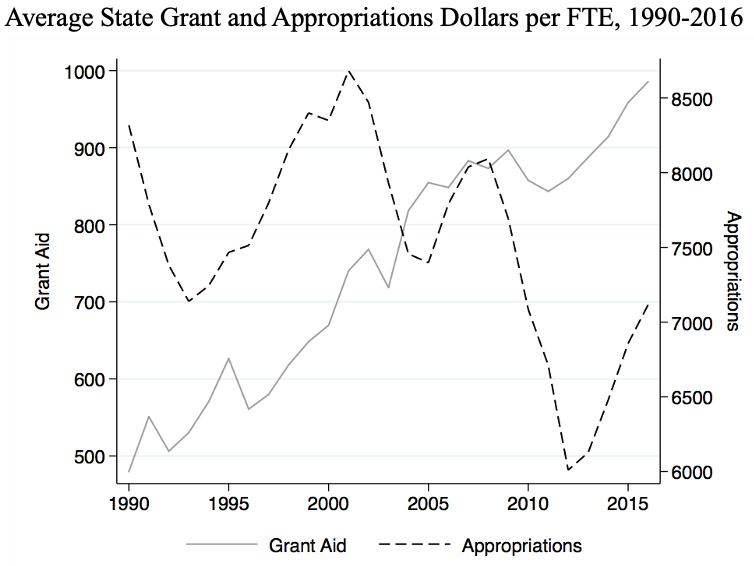
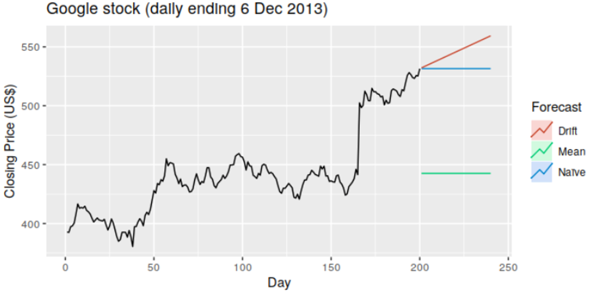
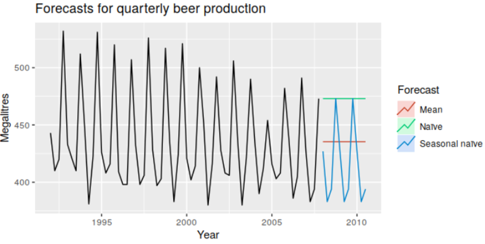
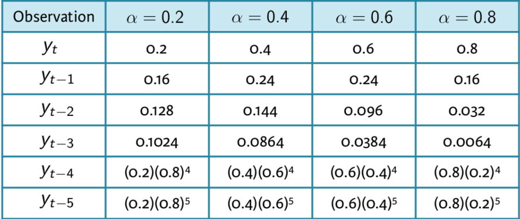
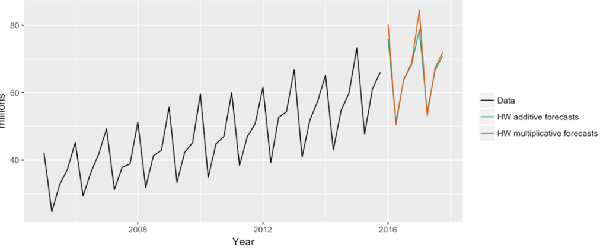

# Set-up

```{r, include=FALSE}
library(tidyverse)
library(forecast)
library(fpp2)
library(knitr)
options(scipen = 999)
```

> **Start a new project and Rmd**

> **Change YAML**

```{r, eval=FALSE}
---
title: "RLab 9: Forecasting"
author: "Your Name"
output: 
  html_document:
    theme: spacelab
    df_print: paged
---
```

---
# Packages

> **In setup code chunk, load following packages and add the option that stops R from using scientific notation for large values**

```{r, eval=FALSE}
library(tidyverse)
library(forecast)
library(fpp2)
options(scipen = 999)
```

---
# Set-up

> **Download `acc_select_tax_rev` from eLC and import. You can copy and paste the below code in your setup code chunk.**

```{r, include=FALSE}
acc_taxrev <- read_csv("labs_files/acc_select_tax_rev.csv")
```

```{r, eval=FALSE}
acc_taxrev <- read_csv("acc_select_tax_rev.csv")
```

---
# Learning objectives

- Convert a dataset to a time series dataset in R
- Explore time series for patterns
- Use simple forecasting models like naive, average, and trend
- Use exponential smoothing forecast
- Assess goodness-of-fit between forecast models

---
# Steps of forecasting

1. Preliminary/exploratory analysis
2. Choosing and fitting models
3. Using and evaluating a forecasting model

---
# Creating a time series (TS) object

- First, need to tell R that data is time series

- Generic syntax:

```{r, eval=FALSE}
ts_name <- ts(data_set_name[,-1],
              start = year_of_first_observation,
              end = year_of_last_observation, 
              frequency = number_of_observations_between_years)
```

- The `-1` in the bracket tells R which column in the data contains the time variable

- In this case the time variable is the first column in the data

---
# TS object examples

- annual time series

```{r, include=FALSE}
annual <- tibble::tibble(year = rep(2016:2020, 1), revenue = round(rnorm(5, 50, 10),0))

annual <- arrange(annual, year)
```

```{r, echo=FALSE}
annual %>% kable()
```

```{r, eval=FALSE}
ts_data <- ts(data[,-1], 
              start = 2016,
              end = 2020,
              frequency = 1)
```

---
# TS object examples

```{r, include=FALSE}
quarterly <- tibble::tibble(year = rep(2016:2020, 4), quarter = rep(1:4, 5), revenue = round(rnorm(20, 50, 10),0))

quarterly <- arrange(quarterly, year, quarter)
```

- quarterly data (top & bottom rows shown)

```{r, echo=FALSE}
head(quarterly, n = 2) %>% kable()
tail(quarterly, n = 2) %>% kable()
```

```{r, eval=FALSE}
ts_quarterly <- ts(quarterly[,-1], 
                   start = 2016, end = 2020,
                   frequency = 4) #<<
```

---
# TS object examples

- monthly data (top & bottom rows shown)

```{r, include=FALSE}
monthly <- tibble::tibble(year = rep(2016:2020, 12), month = rep(1:12, 5), revenue = round(rnorm(60, 50, 10),0))

monthly <- arrange(monthly, year, month)
```

```{r, echo=FALSE}
head(monthly, n = 2) %>% kable()
tail(monthly, n = 2) %>% kable()
```

```{r, eval=FALSE}
ts_monthly <- ts(monthly[,-1], 
                 start = 2016, end = 2020,
                   frequency = 12) #<<
```

---
# TS object examples

- biennial data (top & bottom rows shown)

```{r, include=FALSE}
biennial <- tibble::tibble(year = seq(2000, 2020, 2), revenue = round(rnorm(11, 50, 10),0))

biennial <- arrange(biennial, year)
```

```{r, echo=FALSE}
head(biennial, n = 2) %>% kable()
tail(biennial, n = 2) %>% kable()
```

```{r, eval=FALSE}
ts_biennial <- ts(biennial[,-1], 
                  start = 2000, end = 2020,
                   frequency = 0.5) #<<
```

---
# Frequencies

```{r, echo=FALSE}
freq.table <- tibble(Data = c('Quadrennial', 'Biennial', 'Annual', 'Quarterly', 'Monthly', 'Weekly', 'Daily'), frequency = c('0.25', '0.5', '1', '4', '12', '52', '365'))

freq.table %>% 
  kable()
```

---
# Creating TS object

- `acc_taxrev` contains annual property tax and sales tax revenues for Athens-Clarke County from 1992-2022

> **In a new code chunk, set `acc_taxrev` as a TS object.**

```{r, eval=FALSE}
ts_taxrev <- ts(acc_taxrev[,-1], start = 1992, end = 2022, 
               frequency = 1)
```

```{r, include=FALSE}
ts_taxrev <- ts(acc_taxrev[,-1], start = 1992, end = 2022, 
               frequency = 1)
```

---
# Exploratory plotting

- The purpose of exploratory plotting is to detect **patterns**

- Patterns provide information for prediction in the future

- Certain forecast models are better for certain patterns

---
# Types of patterns

1. Trend - A long-term increase or decrease in the variable

2. Seasonal - A periodic pattern that follows the calendar (e.g. quarter, month, day of the week)

3. Cyclic - Variable rises and falls not according to a fixed calendar (e.g. recessions)

- Time series can exhibit any combination of the above patterns

- Time series must be more frequent than annual to have seasonality
  
---
# Patterns

```{r, echo=FALSE, fig.align='center', fig.height=5}
autoplot(usmelec) +
  labs(title = 'U.S. monthly net electricity generation')
```

- Trend with seasonality

---
# Patterns

```{r, echo=FALSE, fig.align='center'}

```

---
# Exploratory plots (line graphs)

- If R knows data is time series, we can use `autoplot` to quickly generate some useful graphs.

> **In a new code chunk, add and run each line of the following code**

```{r, fig.show='hide'}
autoplot(ts_taxrev)
autoplot(ts_taxrev[,1])
autoplot(ts_taxrev[,2])
```


---
class: inverse, center, middle

# Choosing and fitting forecast models

---
# Sources of information

- There are two sources of information for making future predictions

  - Past values of the outcome
  - Variables that explain and/or predict the outcome
  
--

- Models that use only past values of outcome

  - Simple models: naive, mean, trend
  - Exponential smoothing (common; we will cover this)
  - ARIMA (common; we will not cover)

--

- Regression models that use past outcome and explanatory variables (not covered)

  - Useful for forecasts based on scenarios where explanatory variables change

---
# Autocorrelation

- Recall the correlation coefficient measures the linear association between two variables

- Models using past values rely on **autocorrelation**: the linear association between a variable and past values of the *same* variable

- If past values are correlated with future values, then the past informs the future

- **Lag**: term used to refer to a past value
  - The 3rd lag for annual time series value in 2020 is 2017

---
# Autocorrelation

```{r, echo=FALSE, fig.align='center', fig.height=5}
autoplot(ts_taxrev[,1]) +
  labs(title = 'Athens Annual Property Tax Revenue')
```

- Clear trend; we should expect presence of autocorrelation

---
# Autocorrelation Plot

- Can test for autocorrelation using `ggAcf()` 

```{r, fig.align='center', fig.height=4}
ggAcf(ts_taxrev[,1])
```


- Blue dashed line distinguishes statistically significant autocorrelation

- Past property tax revenue significantly correlates with future

---
# White noise

- A time series that shows no autocorrelation is called **white noise**

- The time series is random and past values do not correlate with future values

- Athens property tax revenue does not exhibit white noise

---
# Autocorrelation Plot

> **Use `ggAcf` to generate an autocorrelation plot for sales_use_tax in the `ts_taxrev` dataset**

```{r, include=FALSE}
ggAcf(ts_taxrev[,2])
```

---
# Simple Forecasting Models

1. Mean - future values predicted to equal average over time
  - No trend pattern
  - Cyclic or seasonal pattern around a stable average level

--

2. Naive - future values predicted to equal most recent value
  - No trend pattern; last period is best guess

--

3. Drift - draw line from first to last value and extrapolate
  - Strong trend from start to end

--

4. Seasonal Naive - same as naive but predicts each season as equal to its most recent season

---
# Simple forecast models

```{r, echo=FALSE, fig.align='center'}

```

---
# Simple forecast models

```{r, echo=FALSE, fig.align='center'}

```

---
# Simple Forecasts in R

- Generic syntax

```{r, eval=FALSE}
new_object <- forecast_model(tsdata, h = periods_into_future)
```

- Replace `forecast_model` with:

```{r, eval=FALSE}
meanf()
naive()
rwf(drift = TRUE) 
snaive()
```

- Default for `h`orizon is 10 periods
- Corresponds to frequency of the data; h = 4 in quarterly data is one year

---
# In R

- Running `meanf`, `naive`, and `rwf` on property tax revenue in the `ts_taxrev` data to forecast the next 4 years

```{r}
proprev_meanf <- meanf(ts_taxrev[,1], h = 4)
proprev_naive <- naive(ts_taxrev[,1], h = 4)
proprev_drift <- rwf(ts_taxrev[,1], drift = TRUE, h = 4)
```

- These new objects are like the regression results we have saved many times

- We can use functions on these new objects to view our results

---
# Viewing forecasts in R

- Can use `autoplot` on the saved model to visualize forecast.

```{r, fig.align='center', fig.height=5, fig.width=8}
autoplot(proprev_meanf)
```

- Mean forecast will be the worst model for strong trend data

---
# Viewing forecasts in R

```{r, fig.align='center', fig.height=6, fig.width=8}
autoplot(proprev_naive)
```

---
# Viewing forecasts in R

```{r, fig.align='center', fig.height=7, fig.width=9}
autoplot(proprev_drift)
```

---
# Reporting plausible ranges

- Can use `summary` on saved models to obtain ranges.

```{r, eval=FALSE}
summary(proprev_drift)
```

```{r, include=FALSE}
sum.proprev_naive <- summary(proprev_drift)
```

```{r, echo=FALSE}
kable(sum.proprev_naive)
```

---
# Practice

> **In a new code chunk, use the drift forecast on sales tax for next 3 years**

```{r, echo=FALSE}
salestax_drift <- rwf(ts_taxrev[,2], drift = TRUE, h = 3)
```

> **Produce the graph and the numerical results**

```{r, eval=FALSE, echo=FALSE}
autoplot(salestax_drift)
summary(salestax_drift)
```

---
class: inverse, center, middle

# Exponential Smoothing

---
# Exponential smoothing

- Assigns a descending weight to each past value

```{r, echo=FALSE, fig.align='center'}

```

---
# Exponential smoothing

- Can also incorporate trend, damped or linear

```{r, echo=FALSE, fig.align='center'}
include_graphics('labs_files/expsmooth-trend.png')
```

---
# Exponential smoothing

- Can also incorporate seasonality that is additive (constant over time) or multiplicative (increases over time)

```{r, echo=FALSE, fig.align='center'}

```

---
# Exponential smoothing combinations

- Error: `A`dditive, `M`ultiplicative

- Trend: `N`one, `A`dditive, `A_d`amped

- Seasonal: `N`one, `A`dditive, `M`ultiplicative

- 18 possible combinations of exponential smoothing models

---
# Exponential smoothing in R

- The `ets` (error, trend, seasonal) function tests the 18 possible models and chooses the best one

- Generic syntax

```{r, eval=FALSE}
ets(ts_data) %>% 
  forecast(h=forecast_horizon) %>% 
  autoplot() OR summary()
```

---
# Exponential smoothing in R


```{r, fig.align='center', fig.height=5}
ets(ts_taxrev[,1]) %>%
  forecast(h=4) %>% 
  autoplot()
```


- Chose `M`ultiplicative error, `Additive` trend, and `N`o seasonality

---
# Exponential smoothing in R

```{r, eval=FALSE}
ets(ts_taxrev[,1]) %>%
  forecast(h=4) %>% 
  summary()
```

```{r, include=FALSE}
sum.ets_proprev <- ets(ts_taxrev[,1]) %>%
  forecast(h = 4) %>% 
  summary()
```

```{r, echo=FALSE}
kable(sum.ets_proprev)
```

---
# Practice

> **Use the `ets` function on sales tax for the next 3 years to produce a graph and table.**

```{r, eval=FALSE, echo=FALSE}
ets(ts_taxrev[,2]) %>% 
  forecast(h=3) %>% 
  autoplot()
```

```{r, eval=FALSE, echo=FALSE}
ets(ts_taxrev[,2]) %>% 
  forecast(h=3) %>% 
  summary()
```

---
class: inverse, center, middle

# Assessing goodness-of-fit

---
# Goodness of fit

- Can use `accuracy()` to compare the fit of competing models

```{r}
accuracy(proprev_drift)
ets(ts_taxrev[,1]) %>% 
  accuracy()
```

- ets model has a lower RMSE: better fit

---
# Goodness of fit

> **Use `accuracy` to compare drift and ets models for sales tax**

```{r, eval=FALSE, echo=FALSE}
accuracy(salestax_drift)
ets(ts_taxrev[,2]) %>% accuracy()
```

- Which model fits the data better? How far off is it, on average?

> **Upload your Rmd to eLC**


