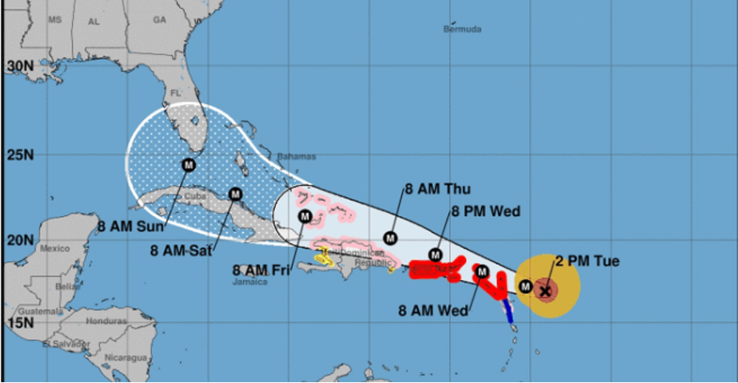
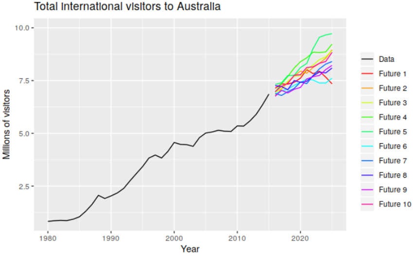
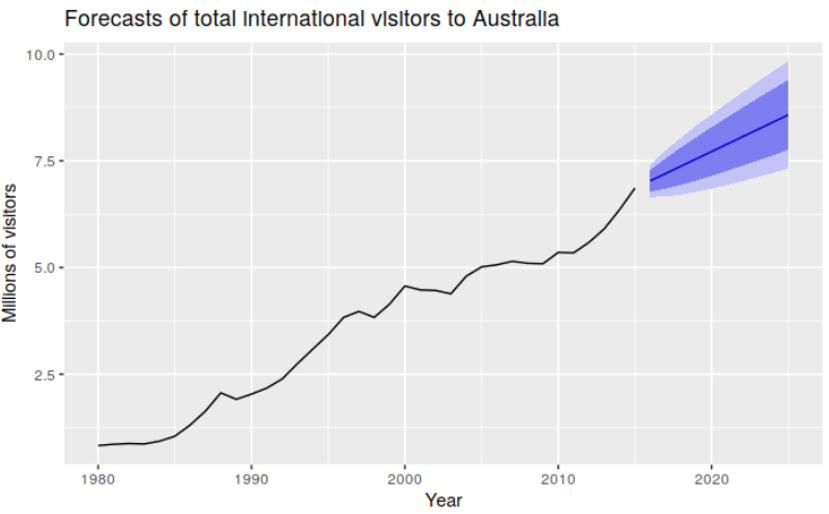
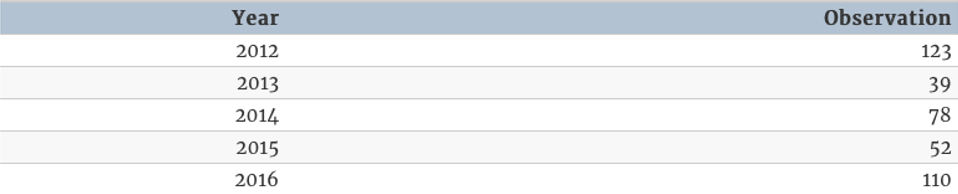

# Set-up

```{r, include=FALSE}
library(tidyverse)
library(forecast)
library(fpp2)
library(knitr)
```

> **Start a new project and Rmd**

> **Change YAML**

```{r, eval=FALSE}
---
title: "RLab 10: Forecasting"
author: "Your Name"
output: 
  html_document:
    theme: spacelab
    df_print: paged
---
```

---
# Set-up

> **Download `sales` and `voting` from eLC and import**

```{r, include=FALSE}
load("labs_files/sales.RData")
load("labs_files/voting.RData")
```

---
# Packages

> **Load following packages**

- Remember to set `include=FALSE`

```{r, eval=FALSE}
library(tidyverse)
library(forecast)
library(fpp2)
```

---
# Learning objectives

- Convert a dataset to a time series dataset in R
- Explore time series for patterns
- Understand simple forecasting models like naive, average, and (seasonal) trend
- Use exponential smoothing
- Use regression-adjusted forecast
- Evaluate and choose between forecast models

---
# Forecasts

```{r, echo=FALSE, fig.align='center'}

```

---
# Forecasts

```{r, echo=FALSE, fig.align='center'}
include_graphics('labs_files/hurricanespag.png')
```

---
# Forecasts

```{r, echo=FALSE, fig.align='center'}

```

---
# Forecasts

```{r, echo=FALSE, fig.align='center'}

```

---
# Steps of forecasting

1. Preliminary/exploratory analysis
2. Choosing and fitting models
3. Using and evaluating a forecasting model

---
# Creating a time series (TS) object

- First, need to tell R that data is time series

- Generic syntax:

```{r, eval=FALSE}
ts_name <- ts(data_name[,-1], # skips first row of variable names
              start = first_time_period,
              end = last_time_period, 
              frequency = unit_of_time_between_observations)
```

---
# TS object examples

- annual time series

```{r, echo=FALSE, fig.align='center'}

```

```{r, eval=FALSE}
ts_data <- ts(data[,-1], start = 2012, end = 2016,
              frequency = 1)
```

---
# TS object examples

```{r, include=FALSE}
quarterly <- tibble::tibble(year = rep(2016:2020, 4), quarter = rep(1:4, 5), value = round(rnorm(20, 50, 10),0))

quarterly <- arrange(quarterly, year, quarter)
```

- quarterly data (head & tail shown)

```{r, echo=FALSE}
head(quarterly, n = 2) %>% kable()
tail(quarterly, n = 2) %>% kable()
```

```{r, eval=FALSE}
ts_quarterly <- ts(quarterly[,-1], start = 2016, end = 2020,
                   frequency = 4) #<<
```

---
# TS object examples

- monthly data (head & tail shown)

```{r, include=FALSE}
monthly <- tibble::tibble(year = rep(2016:2020, 12), month = rep(1:12, 5), value = round(rnorm(60, 50, 10),0))

monthly <- arrange(monthly, year, month)
```

```{r, echo=FALSE}
head(monthly, n = 2) %>% kable()
tail(monthly, n = 2) %>% kable()
```

```{r, eval=FALSE}
ts_monthly <- ts(monthly[,-1], start = 2016, end = 2020,
                   frequency = 12) #<<
```

---
# TS object examples

- biennial data (head & tail shown)

```{r, include=FALSE}
biennial <- tibble::tibble(year = seq(2000, 2020, 2), value = round(rnorm(11, 50, 10),0))

biennial <- arrange(biennial, year)
```

```{r, echo=FALSE}
head(biennial, n = 2) %>% kable()
tail(biennial, n = 2) %>% kable()
```

```{r, eval=FALSE}
ts_biennial <- ts(biennial[,-1], start = 2000, end = 2020,
                   frequency = 0.5) #<<
```

---
# Frequencies

```{r, echo=FALSE}
freq.table <- tibble(Data = c('Quadrennial', 'Biennial', 'Annual', 'Quarterly', 'Monthly', 'Weekly', 'Daily'), frequency = c('0.25', '0.5', '1', '4', '12', '52', '365'))

freq.table %>% 
  kable()
```

---
# Creating TS object

- `voting` contains national turnout for each U.S. presidential election from 1912 to 2016

> **Set `voting` as a TS object**

```{r, eval=FALSE}
ts_voting <- 
```

--

```{r}
ts_voting <- ts(voting[,-1], start = 1912, end = 2016, 
                frequency = 0.25)
```

---
# Creating TS object

- `sales` contains quarterly data

> **Set `sales` as a TS object**

```{r, eval=FALSE}
ts_sales <- 
```

--

```{r}
ts_sales <- ts(sales[,-1], start = 1981, end = 2005, 
               frequency = 4)
```

---
# Exploratory plotting

- The purpose of exploratory plotting is to detect **patterns**

- Patterns provide information for prediction in the future

- Certain forecast models are better for certain patterns

---
# Types of patterns

1. Trend - A long-term increase or decrease in the data

2. Seasonal - A periodic pattern that follows the calendar (e.g. quarter, month, day of the week)

3. Cyclic - Data rises and falls not according to a fixed period (e.g. recessions)

- Time series can exhibit any combination of the above patterns
  
---
# Patterns

```{r, echo=FALSE, fig.align='center'}
autoplot(usmelec) +
  labs(title = 'U.S. monthly net electricity generation')
```

---
# Patterns

```{r, echo=FALSE, fig.align='center'}
include_graphics('labs_files/patterns-colfinance.png')
```

---
# Exploratory plots

- With a TS object, line graphs can be made very quickly

> **Add and run following code**

```{r, fig.show='hide'}
autoplot(ts_voting)
autoplot(ts_sales)
```

---
# Exploratory plots

- The sales data exhibits seasonality. There are useful ways to visualize seasonal patterns.

> **Add and run following code**

```{r, eval=FALSE}
ggseasonplot(ts_sales[,1]) 
#tells R to run on first variable only - sales
```

```{r, eval=FALSE}
ggsubseriesplot(ts_sales[,1])
```

---
# Exploratory plots

> **Use `autoplot` and `ggsubseriesplot` on `GDP` in `ts_sales`**


```{r, include=FALSE}
autoplot(ts_sales[,3])
ggseasonplot(ts_sales[,3])
ggsubseriesplot(ts_sales[,3])
```

---
# Exploratory Recap

- Exploratory graphs are good for showing patterns to an audience and getting an initial sense for our own forecasts

  - Voting appears to be cyclical

  - Sales are clearly seasonal with a slight upward trend

---
class: inverse, center, middle

# Choosing and fitting forecast models

---
# Sources of information

- When choosing a forecast model, there are two general sources of information for making future predictions
  - Past values of the outcome
  - Explanatory variables of the outcome
  
--

- Models that use past values
  - Simple methods: naive, mean, trend
  - Exponential smoothing (common; we will learn how to use)
  - ARIMA (common; we will not cover)

--

- Regression-adjusted models are useful for scenario forecasts
  - Example: predicted sales if GDP increases 2% year-over-year

---
# Autocorrelation

- Models using past values rely on autocorrelation

--

- Recall correlation measures the linear association between two variables

--

- **Autocorrelation** measures the linear association between a variable and past values of the *same* variable

- If past values are correlated with future values, then the past informs the future

--

- **Lag**: term used to refer to a past value
  - The 3rd lag for annual time series value for 2020 is 2017

---
# Autocorrelation Plot

.pull-left[
```{r, echo=FALSE, fig.align='center', fig.height=3}
autoplot(usmelec) +
  labs(title = 'U.S. monthly net electricity generation')
```

```{r, fig.align='center', fig.height=3}
ggAcf(usmelec)
```
]

.pull-right[

- Blue dashed line delineates statistically significant autocorrelation

- Here, values as far back as 2 years significantly correlate with values at a particular time

]

---
# White noise

- A time series that shows no autocorrelation is called **white noise**

- The time series is random and past values do not correlate with future values

---
# Autocorrelation Plot

- Can use `ggAcf` to generate an autocorrelation plot of sales.

```{r, fig.align='center', fig.height=4}
ggAcf(ts_sales[,1])
```

> **Generate an autocorrelation plot for voting**

```{r, include=FALSE}
ggAcf(ts_voting)
```

---
# Simple Forecasting Models

1. Mean - future values predicted to equal average over time
  - No trend pattern
  - Cyclic or seasonal pattern around what appears to be a stable mean

--

2. Naive - future values predicted to equal most recent value
  - No trend pattern

--

3. Drift - draw line from first to last value and extrapolate
  - Strong trend

--

4. Seasonal Naive - same as naive but predicts each season as equal to its most recent season

---
# Simple forecast models

```{r, echo=FALSE, fig.align='center'}
include_graphics('labs_files/forcastcompare1.png')
```

---
# Simple forecast models

```{r, echo=FALSE, fig.align='center'}
include_graphics('labs_files/forecastcompare2.png')
```

---
# Simple Forecasts in R

- General syntax

```{r, eval=FALSE}
new_object <- forecast_model(tsdata, h = periods into future)
```

- Default for `h`orizon is 10 periods
- Corresponds to frequency; h = 4 in quarterly is one year

- Simple model functions

```{r, eval=FALSE}
meanf()
naive()
rwf(drift = TRUE)
snaive()
```

---
# In R

- Suppose I run `meanf`, `naive`, and `snaive` on `sales` using the `ts_sales` data

```{r}
sales_meanf <- meanf(ts_sales[,1], h = 12)
sales_naive <- naive(ts_sales[,1], h = 12)
sales_snaive <- snaive(ts_sales[,1], h = 12)
```

- These new objects are like the regression results we have saved many times

- We can use functions on these to view our results

---
# Viewing forecasts in R

- Can use `autoplot` on the saved model to visualize forecast.

```{r, fig.align='center', fig.height=5}
autoplot(sales_meanf)
```

---
# Viewing forecasts in R

```{r, fig.align='center', fig.height=5}
autoplot(sales_naive)
```

---
# Viewing forecasts in R

```{r, fig.align='center', fig.height=5}
autoplot(sales_snaive)
```

---
# Reporting plausible ranges

- Utility of these forecasts are the ranges based on how well they predict observed past values

- Can use `summary` on saved models to obtain ranges.

```{r, eval=FALSE}
summary(sales_snaive)
```

```{r, include=FALSE}
sum.sales_snaive <- summary(sales_snaive)
```

```{r, echo=FALSE}
kable(sum.sales_snaive)
```

---
# Exponential smoothing

- Assigns a descending weight to each past value

```{r, echo=FALSE, fig.align='center'}
include_graphics('labs_files/expsmooth.png')
```

---
# Exponential smoothing

- Can also incorporate trend

```{r, echo=FALSE, fig.align='center'}
include_graphics('labs_files/expsmooth-trend.png')
```

---
# Exponential smoothing

- Can also incorporate seasonality

```{r, echo=FALSE, fig.align='center'}
include_graphics('labs_files/expsmooth-season.png')
```

---
# Exponential smoothing combinations

- Error: A, M

- Trend: N, A, A_d

- Seasonal: N, A, M

- 18 possible exponential smoothing models

---
# Exponential smoothing in R

- The `ets` function tests the 18 competing models and chooses the best one

```{r, fig.align='center', fig.height=5}
ets(bonds) %>% # Monthly US 10-year bond yields
  forecast(h=12) %>% 
  autoplot()
```

---
# Exponential smoothing in R

```{r, eval=FALSE}
ets(bonds) %>% # Monthly US 10-year bond yields
  forecast(h = 12) %>% 
  summary()
```

```{r, include=FALSE}
sum.ets_bonds <- ets(bonds) %>% # Monthly US 10-year bond yields
  forecast(h = 12) %>% 
  summary()
```

```{r, echo=FALSE}
kable(sum.ets_bonds)
```

---
# Exponential smoothing in R

> **Use the `ets` function on sales to produce a plot and ranges for the next 12 periods**

```{r, include=FALSE}
ets(ts_sales[,1]) %>% 
  forecast(h=12) %>% 
  autoplot()
```

```{r, include=FALSE}
ets(ts_sales[,1]) %>% 
  forecast(h=12) %>% 
  summary()
```

---
class: inverse, center, middle

# Evaluating forecast models

---
# Evaluating forecasts

- To have a valid forecast:
  - The residuals are white noise
  - The residuals have a mean equal to 0

- We can compare our point forecast to each observed year of the outcome

- The difference between the observed value and our point forecast is the residual

- We prefer the model with the best fit
  
---
# Evaluating forecasts

- Can use `checkresiduals` to test whether our forecast is valid

- Looking for a p-value > 0.05

```{r}
ets(bonds) %>% checkresiduals()
```

---
# Evaluating forecasts

> **Use `checkresiduals` on the seasonal naive and ets models for sales**

```{r, include=FALSE}
checkresiduals(sales_snaive)
ets(ts_sales[,1]) %>% checkresiduals()
```

---
# Goodness of fit

- Can use `accuracy` to compare the fit of competing models

```{r}
ets(bonds) %>% accuracy()
```

---
# Goodness of fit

> **Use `accuracy` to compare seasonal naive and ets models for sales**

```{r, include=FALSE}
accuracy(sales_snaive)
ets(ts_sales[,1]) %>% accuracy()
```

- Even thought the residuals indicate `ets` is better, which model has a better fit to the data? How far off is it, on average?

---
class: inverse, center, middle

# Regression-adjusted forecast models

---
# Time series regression forecasts

- Other factors can improve our forecasts

- We can incorporate trend and seasonality in regression while controlling for other explanatory factors

$$y_t=\beta_0+\beta_1x_t + \beta_3t + \beta_4s_t + \epsilon_t$$

- $t$ controls for each period, like year, to add trend
- $s$ controls for seasons, like quarters, to add seasonality

---
# In R

- Let's forecast sales incorporating GDP and AdBudget

> **Add and run below time series linear model**

```{r}
sales_reg <- tslm(Sales ~ AdBudget + GDP + trend + season, data = ts_sales)
```

- Does this forecast fit better than `ets` forecast?

```{r, eval=FALSE}
summary(sales_reg)
```

---
# Using a regression on new data

- When we save regression results, we can feed new data into that model for predictions

- General syntax

```{r, eval=FALSE}
new_object <- forecast(reg_results, newdata = name_of_newdata)
```

---
# In R

- Now we can forecast sales given new scenarios with respect to the explanatory variables

> **Download `sales_forecast_data` file and add to your project folder. Import**

```{r, include=FALSE}
load("labs_files/sales_forecast_data.RData")
```

- These data suppose a 50% reduction in advertising and constant GDP over the next 12 quarters

---
# In R

> **Add and run below code**

```{r}
fc_sales_reg <- forecast(sales_reg, newdata = sales_forecast_data)
```

- Now we can report these results same as before. 

> **Add and run below code**

```{r, fig.show='hide', results='hide'}
autoplot(fc_sales_reg)
summary(fc_sales_reg)
```

---
# Recap

- Only scratched surface; time series and forecasting is its own course

--

- Key concepts
  - Patterns
  - Autocorrelation
  - White noise
  - Conditions for valid forecast
  - Difference between using past values vs. explanatory variables
