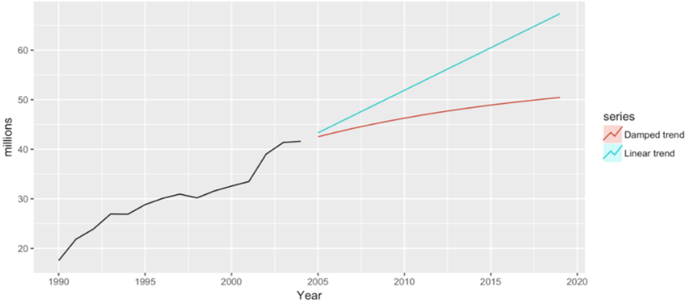

# Set-up

```{r, include=FALSE}
library(tidyverse)
library(forecast)
library(fpp2)
library(knitr)
```

- Start a new project and notebook

- Change YAML

```{r, eval=FALSE}
---
title: "RLab 10: Forecasting"
author: "Your Name"
output: 
  html_document:
    theme: spacelab
    df_print: paged
---
```

---
# Set-up

- Download the following data available on eLC and add to your project folder

```{r, eval=FALSE}
load("sales.RData")
load("voting.RData")
```

```{r, include=FALSE}
load("labs_files/sales.RData")
load("labs_files/voting.RData")
```

---
# Packages

- Remember to set `include=FALSE`

```{r, eval=FALSE}
library(tidyverse)
library(forecast)
library(fpp2)
```

---
# Learning objectives

By the end of this lab, you will have learned how to...

- Convert a dataset to a time series dataset in R
- Explore time series for patterns
- Execute some simple forecasting models like naive, average, and (seasonal) trend
- Execute exponential smoothing
- Execute a regression-adjusted forecast
- Evaluate and choose between forecast models

---
# Forecasts

```{r, echo=FALSE, fig.align='center'}
include_graphics('labs_files/hurricaneforecast.png')
```

---
# Forecasts

```{r, echo=FALSE, fig.align='center'}
include_graphics('labs_files/hurricanespag.png')
```

---
# Forecasts

```{r, echo=FALSE, fig.align='center'}
include_graphics('labs_files/tourismspag.png')
```

---
# Forecasts

```{r, echo=FALSE, fig.align='center'}
include_graphics('labs_files/tourismforecast.png')
```

---
# Steps of forecasting

1. Preliminary/exploratory analysis
2. Choosing and fitting models
3. Using and evaluating a forecasting model

---
# Creating a time series (TS) object

- First, need to tell R that data is time series

- Generic syntax:

```{r, eval=FALSE}
ts_name <- ts(data_name[,-1], # tells R to skip the first row of names
              start = first_time_period,
              end = last_time_period, 
              frequency = unit_of_time_between_observations)
```

---
# TS object examples

- annual time series

```{r, echo=FALSE, fig.align='center'}
include_graphics('labs_files/tsobjannual.png')
```

```{r, eval=FALSE}
ts_data <- ts(data[,-1], start = 2012, end = 2016,
              frequency = 1)
```

---
# TS object examples

```{r, include=FALSE}
quarterly <- tibble::tibble(year = rep(2016:2020, 4), quarter = rep(1:4, 5), value = round(rnorm(20, 50, 10),0))

quarterly <- arrange(quarterly, year, quarter)
```

- quarterly data (head & tail shown)

```{r, echo=FALSE}
head(quarterly, n = 2) %>% kable()
tail(quarterly, n = 2) %>% kable()
```

```{r, eval=FALSE}
ts_quarterly <- ts(quarterly[,-1], start = 2016, end = 2020,
                   frequency = 4)
```

---
# TS object examples

- monthly data (head & tail shown)

```{r, include=FALSE}
monthly <- tibble::tibble(year = rep(2016:2020, 12), month = rep(1:12, 5), value = round(rnorm(60, 50, 10),0))

monthly <- arrange(monthly, year, month)
```

```{r, echo=FALSE}
head(monthly, n = 2) %>% kable()
tail(monthly, n = 2) %>% kable()
```

```{r, eval=FALSE}
ts_monthly <- ts(monthly[,-1], start = 2016, end = 2020,
                   frequency = 12)
```

---
# TS object examples

- biennial data (head & tail shown)

```{r, include=FALSE}
biennial <- tibble::tibble(year = seq(2000, 2020, 2), value = round(rnorm(11, 50, 10),0))

biennial <- arrange(biennial, year)
```

```{r, echo=FALSE}
head(biennial, n = 2) %>% kable()
tail(biennial, n = 2) %>% kable()
```

```{r, eval=FALSE}
ts_biennial <- ts(biennial[,-1], start = 2000, end = 2020,
                   frequency = 0.5)
```

---
# Frequencies

```{r, echo=FALSE}
freq.table <- tibble(Data = c('Quadrennial', 'Biennial', 'Annual', 'Quarterly', 'Monthly', 'Weekly', 'Daily'), frequency = c('0.25', '0.5', '1', '4', '12', '52', '365'))

freq.table %>% 
  kable()
```

---
# Creating TS object

- `voting` contains national turnout for each U.S. presidential election from 1912 to 2016

- Try to set `voting` as a TS object on your own

```{r, eval=FALSE}
ts_voting <- 
```

--

```{r}
ts_voting <- ts(voting[,-1], start = 1912, end = 2016, 
                frequency = 0.25)
```

---
# Creating TS object

- `sales` contains data for a social enterprise

- Examine `sales` and try to convert to TS on your own

```{r, eval=FALSE}
ts_sales <- 
```

--

```{r}
ts_sales <- ts(sales[,-1], start = 1981, end = 2005, 
               frequency = 4)
```

---
# Exploratory plotting

- The purpose of exploratory plotting is to detect **patterns**

- Patterns provide information for prediction in the future

- Certain forecast models are better for certain patterns

---
# Types of patterns

1. Trend - A long-term increase or decrease in the data

2. Seasonal - A periodic pattern that follows the calendar (e.g. quarter, month, day of the week)

3. Cyclic - Data rises and falls not according to a fixed period (e.g. recessions)
  
---
# Patterns

```{r, echo=FALSE, fig.align='center'}
autoplot(usmelec) +
  labs(title = 'U.S. monthly net electricity generation')
```

---
# Patterns

```{r, echo=FALSE, fig.align='center'}
include_graphics('labs_files/patterns-colfinance.png')
```

---
# Exploratory plots

- With a TS object, line graphs can be made very quickly

- Add and run following code

```{r, fig.show='hide'}
autoplot(ts_voting)
autoplot(ts_sales)
```

---
# Exploratory plots

- The sales data exhibits seasonality. There are useful ways to visualize seasonal patterns.

- Add and run following code

```{r, eval=FALSE}
ggseasonplot(ts_sales[,1]) #tells R to run on first variable only, sales
```

---
# Exploratory plots

- Suppose we want a subset of the years

- Following code creates a new ts object starting in year 2000. Add and run.

```{r}
ts_sales2 <- window(ts_sales, start = 2000)
```

- Run `ggseasonplot` on `sales` using `ts_sales2`

```{r, eval=FALSE}
ggseasonplot(ts_sales2[,1])
```

---
# Exploratory plots

- Here are a few more options. Add and run.

```{r, eval=FALSE}
ggseasonplot(ts_sales2[,1], polar = TRUE)
ggsubseriesplot(ts_sales2[,1])
```

- Run `ggseasonplot` and `ggsubseriesplot` on `GDP` using `ts_sales2`

--

```{r, eval=FALSE}
ggseasonplot(ts_sales2[,3], polar = TRUE)
ggsubseriesplot(ts_sales2[,3])
```

---
# Trends

- Exploratory graphs are good for showing patterns to an audience and getting an initial sense for our own forecasts

- Voting seems to be cyclical and sales are clearly seasonal and maybe a slight upward trend

- We can be more scientific than using visualizations...

---
# Autocorrelation

- Correlation measures the linear association between two variables

- **Autocorrelation** measures the linear association between a variable and past values of the same variable

- If past values are correlated with future values, then the past informs the future

--

- **Lag**: term used to refer to a past value

- The 3rd lag for annual time series value for 2020 is 2017

---
# Autocorrelation

```{r, echo=FALSE, fig.align='center', fig.height=3}
autoplot(usmelec) +
  labs(title = 'U.S. monthly net electricity generation')
```

```{r, echo=FALSE, fig.align='center', fig.height=3}
ggAcf(usmelec)
```

- Blue dashed line delineates statistically significant correlation

---
# Autocorrelation

- Data with a trend will have large positive residuals for recent lags that decrease over time

- Data with seasonality only will have peaks and valleys that correspond to the seasons that correlate with each other

---
# White noise

- A time series that shows no autocorrelation is called white noise

- Means the time series is random and past values do not predict future values to a statistically significant degree

--

- We can check for white noise **after using a forecast model**

- If the residuals from our forecast are white noise, this means we have extracted all of the useful information from the past to predict the future

---
# Autocorrelation

- We can generate an autocorrelation plot for the `sales` variable. Add and run.

```{r, fig.align='center', fig.height=4}
ggAcf(ts_sales[,1])
```

---
# Autocorrelation

- We can formally (i.e. hypothesis test) test for white noise like so:
  - Null hypothesis is the time series is white noise
  - Alternative hypothesis is the time series is autocorrelated

```{r}
Box.test(ts_sales[,1], lag = 4) #test based on fourth lag bc quarterly
```
--

- Use `ggAcf` and `Box.test` to test for autocorrelation in `ts_voting`

```{r, include=FALSE}
ggAcf(ts_voting)
Box.test(ts_voting, lag = 1)
```

---
# Simple Forecasting Models

1. Mean - future values predicted to equal average over time
  - No trend pattern
  - Cyclic or seasonal pattern around what appears to be a stable mean

--

2. Naive - future values predicted to equal most recent value
  - No trend pattern

--

3. Drift - draw line from first to last value and extrapolate
  - Strong trend

--

4. Seasonal Naive - same as naive but predicts each season as equal to its most recent season

---
# Simple forecast models

```{r, echo=FALSE, fig.align='center'}
include_graphics('labs_files/forcastcompare1.png')
```

---
# Simple forecast models

```{r, echo=FALSE, fig.align='center'}

```

---
# In R

- General syntax

```{r, eval=FALSE}
new_object <- forecast_model(tsdata, h = periods into future)
```

- Default for `h` is 10 periods
- Period corresponds to frequency; h = 4 in quarterly is one year

- Simple model functions

```{r, eval=FALSE}
meanf()
naive()
rwf(drift = TRUE)
snaive()
```

---
# In R

- Let's run `meanf`, `naive`, and `snaive` on `sales` using the `ts_sales` data

```{r}
sales_meanf <- meanf(ts_sales[,1], h = 12)
sales_naive <- naive(ts_sales[,1], h = 12)
sales_snaive <- snaive(ts_sales[,1], h = 12)
```

- These new objects are like the regression results we have saved many times
- We can use functions on these to view our results

---
# Viewing forecasts in R

- Use `autoplot` for a quick visualization. Visualize each of our three sales forecasts.

```{r, fig.align='center', fig.height=6}
autoplot(sales_meanf)
```

```{r, include=FALSE}
autoplot(sales_naive)
autoplot(sales_snaive)
```

---
# Viewing forecasts in R

- Use `summary` for quantities. Let's report the numbers from what is likely the best forecast of the three.

```{r, eval=FALSE}
summary(sales_snaive)
```

---
# Evaluating forecasts

- Similar to evaluating goodness-of-fit from before

- We can compare our point forecast to each observed year of the outcome

- The difference between the observed value and our point forecast is the residual

- We prefer the model with the best fit

--

- Must achieve two things to have a valid forecast:
  - The residuals are white noise
  - The residuals have a mean equal to 0

---
# Evaluating forecasts

- Use `checkresiduals` to test whether our forecast is valid

```{r, eval=FALSE}
checkresiduals(sales_snaive)
checkresiduals(sales_meanf)
```

- Use `accuracy` to compare the fit of competing valid models

```{r, eval=FALSE}
accuracy(sales_snaive)
accuracy(sales_meanf)
```

- Which is the better model? How far off is it, on average?

---
# Exponential smoothing

- Combines naive and mean models
- Assigns a descending weight to each past value

```{r, echo=FALSE, fig.align='center'}
include_graphics('labs_files/expsmooth.png')
```

---
# Exponential smoothing

- Can also incorporate trend

```{r, echo=FALSE, fig.align='center'}

```

---
# Exponential smoothing

- Can also incorporate seasonality

```{r, echo=FALSE, fig.align='center'}
include_graphics('labs_files/expsmooth-season.png')
```

---
# In R

```{r, eval=FALSE}
# simple exp smoothing; R automates best alpha
ses(tsdata, h = )
# exp smoothing with trend
holt(tsdata, damped = TRUEorFALSE)
# exp smoothing with trend and seasonality
hw(tsdata, seasonal = "additiveORmultiplicative")
```

---
# In R

Let's use exponential smoothing to forecast sales

```{r}
sales_ses <- hw(ts_sales[,1], h = 12, seasonal = "additive")
```

- Does this forecast perform better than `sales_snaive` forecast?

- Provide the graph and estimates for using the more accurate model.

```{r, include=FALSE, eval=FALSE}
accuracy(sales_snaive)
accuracy(sales_ses)
```

---
# Sales Forecast

```{r}
autoplot(sales_ses)
```
```{r, include=FALSE}
summary(sales_ses)
```

---
# Time series regression forecasts

- Other factors can (often) improve our forecasts

- We can incorporate these concepts into regression

$$y_t=\beta_0+\beta_1x_t + \beta_3t + \beta_4s_t + \epsilon_t$$

- $t$ controls for each period, like year, to add trend
- $s$ controls for seasons, like quarters, to add seasonality

---
# In R

- Let's forecast sales incorporating GDP and AdBudget

```{r}
sales_reg <- tslm(Sales ~ AdBudget + GDP + trend + season, data = ts_sales)
```

- Does this forecast perform better than `sales_ses` forecast?

---
# Using a regression on new data

- When we save regression results, we can feed new data into that model for predictions

- General syntax

```{r, eval=FALSE}
new_object <- forecast(reg_results, newdata = name_of_newdata)
```

---
# In R

- Now we can forecast sales given new scenarios with respect to the explanatory variables

- Download the `sales_forecast_data.RData` file and add to your project folder. Load these data.

```{r, eval=FALSE}
load("sales_forecast_data.RData")
```

```{r, include=FALSE}
load("labs_files/sales_forecast_data.RData")
```

- These data suppose a 50% reduction in advertising and constant GDP over the next 12 quarters

---
# In R

```{r}
fc_sales_reg <- forecast(sales_reg, newdata = sales_forecast_data)
```

- Now we can report these results same as before. Add and run.

```{r, fig.show='hide', results='hide'}
autoplot(fc_sales_reg)
summary(fc_sales_reg)
```

---
# Recap

- Only scratched surface; time series and forecasting is its own course

--

- Identify patterns to inform which model to use

- If time series is white noise, past values aren't great for forecasting

- Consider regression

--

- Exponential smoothing is one of the most common methods; include trends and seasonality as needed

- Check residuals and accuracy to determine best model

--

- To learn more on forecasting with R: [https://otexts.com/fpp2/](https://otexts.com/fpp2/)
