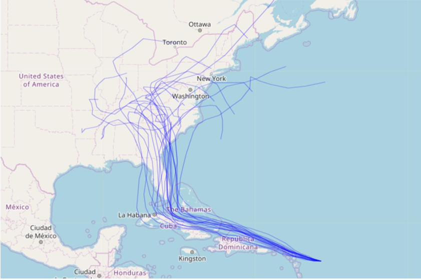

# Set-up

```{r, include=FALSE}
library(tidyverse)
library(forecast)
library(fpp2)
library(knitr)
```

> **Start a new project and Rmd**

> **Change YAML**

```{r, eval=FALSE}
---
title: "RLab 10: Forecasting"
author: "Your Name"
output: 
  html_document:
    theme: spacelab
    df_print: paged
---
```

---
# Set-up

> **Download `acc_select_tax_rev` and `us_house_data` from eLC and import**

```{r, include=FALSE}
acc_taxrev <- read_csv("labs_files/acc_select_tax_rev.csv")
house_data <- read_csv("labs_files/us_house_data.csv")
```

---
# Packages

> **In setup code chunk, load following packages**

```{r, eval=FALSE}
library(tidyverse)
library(forecast)
library(fpp2)
```

---
# Learning objectives

- Convert a dataset to a time series dataset in R
- Explore time series for patterns
- Understand simple forecasting models like naive, average, and trend
- Use exponential smoothing
- Use regression-adjusted forecast
- Evaluate and choose between forecast models

---
# Forecasts

```{r, echo=FALSE, fig.align='center'}
include_graphics('labs_files/hurricaneforecast.png')
```

---
# Forecasts

```{r, echo=FALSE, fig.align='center'}

```

---
# Forecasts

```{r, echo=FALSE, fig.align='center'}
include_graphics('labs_files/tourismspag.png')
```

---
# Forecasts

```{r, echo=FALSE, fig.align='center'}
include_graphics('labs_files/tourismforecast.png')
```

---
# Steps of forecasting

1. Preliminary/exploratory analysis
2. Choosing and fitting models
3. Using and evaluating a forecasting model

---
# Creating a time series (TS) object

- First, need to tell R that data is a time series

- Generic syntax:

```{r, eval=FALSE}
ts_name <- ts(data_set_name[,-1], # tells R which column measures time
              start = year_of_first_observation,
              end = year_of_last_observation, 
              frequency = number_of_observations_between_years)
```

---
# TS object examples

- annual time series

```{r, echo=FALSE, fig.align='center'}
include_graphics('labs_files/tsobjannual.png')
```

```{r, eval=FALSE}
ts_data <- ts(data[,-1], 
              start = 2012,
              end = 2016,
              frequency = 1)
```

---
# TS object examples

```{r, include=FALSE}
quarterly <- tibble::tibble(year = rep(2016:2020, 4), quarter = rep(1:4, 5), value = round(rnorm(20, 50, 10),0))

quarterly <- arrange(quarterly, year, quarter)
```

- quarterly data (head & tail shown)

```{r, echo=FALSE}
head(quarterly, n = 2) %>% kable()
tail(quarterly, n = 2) %>% kable()
```

```{r, eval=FALSE}
ts_quarterly <- ts(quarterly[,-1], 
                   start = 2016, end = 2020,
                   frequency = 4) #<<
```

---
# TS object examples

- monthly data (head & tail shown)

```{r, include=FALSE}
monthly <- tibble::tibble(year = rep(2016:2020, 12), month = rep(1:12, 5), value = round(rnorm(60, 50, 10),0))

monthly <- arrange(monthly, year, month)
```

```{r, echo=FALSE}
head(monthly, n = 2) %>% kable()
tail(monthly, n = 2) %>% kable()
```

```{r, eval=FALSE}
ts_monthly <- ts(monthly[,-1], 
                 start = 2016, end = 2020,
                   frequency = 12) #<<
```

---
# TS object examples

- biennial data (head & tail shown)

```{r, include=FALSE}
biennial <- tibble::tibble(year = seq(2000, 2020, 2), value = round(rnorm(11, 50, 10),0))

biennial <- arrange(biennial, year)
```

```{r, echo=FALSE}
head(biennial, n = 2) %>% kable()
tail(biennial, n = 2) %>% kable()
```

```{r, eval=FALSE}
ts_biennial <- ts(biennial[,-1], 
                  start = 2000, end = 2020,
                   frequency = 0.5) #<<
```

---
# Frequencies

```{r, echo=FALSE}
freq.table <- tibble(Data = c('Quadrennial', 'Biennial', 'Annual', 'Quarterly', 'Monthly', 'Weekly', 'Daily'), frequency = c('0.25', '0.5', '1', '4', '12', '52', '365'))

freq.table %>% 
  kable()
```

---
# Creating TS object

- `us_house_data` contains median home sale price, housing starts (in thousands), and gdp (in billions)

> **Set `us_house_data` as a TS object named `ts_house`**

```{r, eval=FALSE}
ts_house <- 
```

```{r, include=FALSE}
ts_house <- ts(house_data[,-1], start = 1990, end = 2021, 
                frequency = 4)
```

---
# Creating TS object

- `acc_taxrev` contains select tax revenues for Athens-Clarke County

> **Set `acc_taxrev` as a TS object**

```{r, eval=FALSE}
ts_taxrev <-
```

```{r, include=FALSE}
ts_taxrev <- ts(acc_taxrev[,-1], start = 1992, end = 2020, 
               frequency = 1)
```

---
# Exploratory plotting

- The purpose of exploratory plotting is to detect **patterns**

- Patterns provide information for prediction in the future

- Certain forecast models are better for certain patterns

---
# Types of patterns

1. Trend - A long-term increase or decrease in the data

2. Seasonal - A periodic pattern that follows the calendar (e.g. quarter, month, day of the week)

3. Cyclic - Data rises and falls not according to a fixed period (e.g. recessions)

- Time series can exhibit any combination of the above patterns
  
---
# Patterns

```{r, echo=FALSE, fig.align='center'}
autoplot(usmelec) +
  labs(title = 'U.S. monthly net electricity generation')
```

---
# Patterns

```{r, echo=FALSE, fig.align='center'}
include_graphics('labs_files/patterns-colfinance.png')
```

---
# Exploratory plots (line graphs)

- We learned how to make line plots within the `ggplot` package
- If R knows data is time series, we can generate a line graph using a shortcut

> **Add and run following code**

```{r, fig.show='hide'}
autoplot(ts_house)
autoplot(ts_house[,1]) # specifies which variable
autoplot(ts_house[,2]) 
autoplot(ts_house[,3])
autoplot(ts_taxrev)
```

---
# Exploratory plots (seasonal plots)

- GDP exhibits some seasonality. Here are a few useful plots for seasonal patterns.

> **Add and run following code**

```{r, eval=FALSE}
ggseasonplot(ts_house[,3]) 
#tells R to run on first variable only - sales
```

```{r, eval=FALSE}
ggsubseriesplot(ts_house[,3])
```

---
# Exploratory Recap

- Exploratory graphs are useful for detecting patterns that can inform our choice of forecast and providing summary information to an audience

- All of our data appear to be dominated by trend pattern

---
class: inverse, center, middle

# Choosing and fitting forecast models

---
# Sources of information

- When choosing a forecast model, there are two sources of information for making future predictions

  - Past values of the outcome
  - Explanatory variables of the outcome
  
--

- Models that use past values

  - Simple methods: naive, mean, trend
  - Exponential smoothing (common; we will learn how to use)
  - ARIMA (common; we will not cover)

--

- Regression-adjusted models incorporate explanatory variables

  - Useful for forecasts based on scenarios
  - Example: predicted median home price if house starts increase 2% each year

---
# Autocorrelation

- Models using past values rely on autocorrelation

--

- Recall correlation measures the linear association between two variables

--

- **Autocorrelation** measures the linear association between a variable and past values of the *same* variable

- If past values are correlated with future values, then the past informs the future

--

- **Lag**: term used to refer to a past value
  - The 3rd lag for annual time series value in 2020 is 2017

---
# Autocorrelation Plot

.pull-left[
```{r, echo=FALSE, fig.align='center', fig.height=3}
autoplot(usmelec) +
  labs(title = 'U.S. monthly net electricity generation')
```

```{r, fig.align='center', fig.height=3}
ggAcf(usmelec)
```
]

.pull-right[

- Blue dashed line delineates statistically significant autocorrelation

- Here, values as far back as 2 years significantly correlate with values at a particular time

]

---
# White noise

- A time series that shows no autocorrelation is called **white noise**

- The time series is random and past values do not correlate with future values

---
# Autocorrelation Plot

- Can use `ggAcf` to generate an autocorrelation plot of home price

```{r, fig.align='center', fig.height=4}
ggAcf(ts_house[,1]) # applied to first column, price
```

- Home price is definitely not white noise

---
# Autocorrelation Plot

> **Use `ggAcf` to generate an autocorrelation plot for `sales_use_tax` in the `ts_taxrev` dataset**

```{r, include=FALSE}
ggAcf(ts_taxrev[,2])
```

---
# Simple Forecasting Models

1. Mean - future values predicted to equal average over time
  - No trend pattern
  - Cyclic or seasonal pattern around a stable average level

--

2. Naive - future values predicted to equal most recent value
  - No trend pattern; last period is best guess

--

3. Drift - draw line from first to last value and extrapolate
  - Strong trend from start to end

--

4. Seasonal Naive - same as naive but predicts each season as equal to its most recent season

---
# Simple forecast models

```{r, echo=FALSE, fig.align='center'}
include_graphics('labs_files/forcastcompare1.png')
```

---
# Simple forecast models

```{r, echo=FALSE, fig.align='center'}
include_graphics('labs_files/forecastcompare2.png')
```

---
# Simple Forecasts in R

- Generic syntax

```{r, eval=FALSE}
new_object <- forecast_model(tsdata, h = periods_into_future)
```

- Replace `forecast_model` with:

```{r, eval=FALSE}
meanf()
naive()
rwf(drift = TRUE) 
snaive()
```

- Default for `h`orizon is 10 periods
- Corresponds to frequency; h = 4 in quarterly is one year

---
# In R

- Running `meanf`, `naive`, and `snaive` on `house_starts` in the `ts_house` data

```{r}
starts_meanf <- meanf(ts_house[,2], h = 12)
starts_naive <- naive(ts_house[,2], h = 12)
starts_drift <- rwf(ts_house[,2], drift = TRUE, h = 12)
starts_snaive <- snaive(ts_house[,2], h = 12)
```

- These new objects are like the regression results we have saved many times

- We can use functions on these to view our results

---
# Viewing forecasts in R

- Can use `autoplot` on the saved model to visualize forecast.

```{r, fig.align='center', fig.height=6, fig.width=8}
autoplot(starts_meanf)
```

---
# Viewing forecasts in R

- Can use `autoplot` on the saved model to visualize forecast.

```{r, fig.align='center', fig.height=6, fig.width=8}
autoplot(starts_drift)
```

---
# Viewing forecasts in R

```{r, fig.align='center', fig.height=7, fig.width=9}
autoplot(starts_naive)
```

---
# Viewing forecasts in R

```{r, fig.align='center', fig.height=7, fig.width=9}
autoplot(starts_snaive)
```

---
# Reporting plausible ranges

- Can use `summary` on saved models to obtain ranges.

```{r, eval=FALSE}
summary(starts_naive)
```

```{r, include=FALSE}
sum.sales_naive <- summary(starts_naive)
```

```{r, echo=FALSE}
kable(sum.sales_naive)
```

---
# Practice

> **Use mean and drift forecasts on sales tax for next 3 years**

> **Produce the graph and the numerical results**

```{r, include=FALSE}
salestax_mean <- meanf(ts_taxrev[,2], h = 3)
salestax_drift <- rwf(ts_taxrev[,2], drift = TRUE, h = 3)

autoplot(salestax_mean)
autoplot(salestax_drift)
```


---
class: inverse, center, middle

# Exponential Smoothing

---
# Exponential smoothing

- Assigns a descending weight to each past value

```{r, echo=FALSE, fig.align='center'}
include_graphics('labs_files/expsmooth.png')
```

---
# Exponential smoothing

- Can also incorporate trend, damped or linear

```{r, echo=FALSE, fig.align='center'}
include_graphics('labs_files/expsmooth-trend.png')
```

---
# Exponential smoothing

- Can also incorporate additive or multiplicative seasonality

```{r, echo=FALSE, fig.align='center'}
include_graphics('labs_files/expsmooth-season.png')
```

---
# Exponential smoothing combinations

- Error: `A`dditive, `M`ultiplicative

- Trend: `N`one, `A`dditive, `A_d`amped

- Seasonal: `N`one, `A`dditive, `M`ultiplicative

- 18 possible combinations for exponential smoothing models

---
# Exponential smoothing in R

- The `ets` (error, trend, seasonal) function tests the 18 competing models and chooses the best one

- Generic syntax

```{r, eval=FALSE}
ets(ts_data) %>% 
  forecast(h=forecast_horizon) %>% 
  autoplot() OR summary()
```

---
# Exponential smoothing in R

.pull-left[
```{r, fig.align='center', fig.height=5}
ets(ts_house[,1]) %>%
  forecast(h=12) %>% 
  autoplot()
```
]

.pull-right[
- Note that `ets` has fit a model with `M`ultiplicative error, `Ad`amped trend, and `A`dditive seasonality
]
---
# Exponential smoothing in R

```{r, eval=FALSE}
ets(ts_house[,1]) %>%
  forecast(h=12) %>% 
  summary()
```

```{r, include=FALSE}
sum.ets_prices <- ets(ts_house[,1]) %>%
  forecast(h = 12) %>% 
  summary()
```

```{r, echo=FALSE}
kable(sum.ets_prices)
```

---
# Practice

> **Use the `ets` function on sales tax for the next 3 years**

```{r, include=FALSE}
ets(ts_taxrev[,2]) %>% 
  forecast(h=3) %>% 
  autoplot()
```

```{r, include=FALSE}
ets(ts_taxrev[,2]) %>% 
  forecast(h=3) %>% 
  summary()
```

---
class: inverse, center, middle

# Evaluating forecast models

---
# Evaluating forecasts

- We can compare our point forecast to each observed year of the outcome

- The difference between the observed value and our point forecast is the residual

--

- To have a valid forecast:
  - The residuals are white noise
  - The residuals have a mean equal to 0
  - If not, we haven't extracted all the useful information from the past

--

- Among valid models, we prefer the model with the best fit
  
---
# Evaluating forecasts

- Can use `checkresiduals` to test the validity of our forecast

.pull-left[

```{r, fig.height=5}
ets(ts_house[,2]) %>% 
  checkresiduals()
```
]

.pull-right[
- Also produces the p-value for a hypothesis test (e.g., Ljung-Box) of overall fit

- Null hypothesis is that the model is valid
]

---
# Evaluating forecasts

> **Use `checkresiduals` on the drift and ets forecasts for sales tax**

```{r, include=FALSE}
checkresiduals(salestax_drift)
ets(ts_taxrev[,2]) %>% checkresiduals()
```

- Does the information provided help us choose a preferred model?

---
# Goodness of fit

- Can use `accuracy` to compare the fit of competing models

```{r}
accuracy(starts_drift)
ets(ts_house[,2]) %>% accuracy()
```

---
# Goodness of fit

> **Use `accuracy` to compare drift and ets models for sales tax**

```{r, include=FALSE}
accuracy(salestax_drift)
ets(ts_taxrev[,2]) %>% accuracy()
```

- Which model fits the data better? How far off is it, on average?

---
class: inverse, center, middle

# Regression-adjusted forecast models

---
# Time series regression forecasts

- Including explanatory factors can improve our forecasts

- We can incorporate trend and seasonality in regression while controlling for other explanatory factors

$$y_t=\beta_0+\beta_1x_t + \beta_3t + \beta_4s_t + \epsilon_t$$

- $t$ controls for each period, like year, to add trend
- $s$ controls for seasons, like quarters, to add seasonality

---
# In R

- Let's forecast house starts incorporating price and GDP as explanatory variables

> **Add and run below time series linear model**

```{r}
reg_starts <- tslm(house_starts ~ median_homeprice + gdp + trend, data = ts_house)
```

- Does this forecast fit better than `ets` forecast?

```{r, eval=FALSE}
summary(reg_starts)
```

---
# Using a regression on new data

- When we save regression results, we can feed new data into the `forecast` function to make predictions

- Generic syntax

```{r, eval=FALSE}
new_object <- forecast(saved_regression_results, 
                       newdata = name_of_new_dataset)
```

---
# In R

- Now we can forecast starts in response to changes in explanatory variables

> **Download `starts_forecast_data` CSV file and add to your project folder. Import**

```{r, include=FALSE}
starts_forecast_data <- read_csv("labs_files/starts_forecast_data.csv")
```

- These data suppose a 2% annual increase in prices and GDP over the next 12 quarters

---
# In R

> **Add and run below code**

```{r}
reg_starts_forecast <- forecast(reg_starts, 
                          newdata = starts_forecast_data)
```

- Now we can report these results same as before. 

> **Add and run below code**

```{r, fig.show='hide', results='hide'}
autoplot(reg_starts_forecast)
summary(reg_starts_forecast)
```

---
# Recap

- Only scratched surface; time series and forecasting is its own course

--

- Key concepts
  - Patterns
  - Autocorrelation
  - White noise
  - Conditions for valid forecast
  - Difference between using past values vs. explanatory variables
