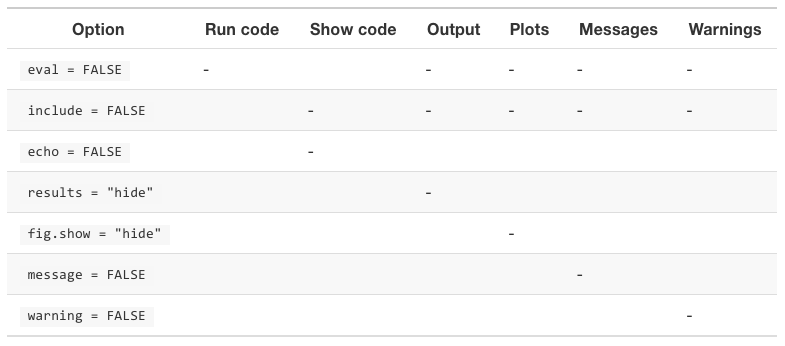

# Objectives

By the end of this lab, you will have learned how to...

- Import data

  - included in a R package
  - csv and xlsx
  - directly from url
  
- Export R Markdown

  - change YAML to print nicer tables
  - to Word and PDF
  - suppress code and/or results

- Export data to csv

```{r setup, include=FALSE}
library(tidyverse)
library(readxl)
library(gapminder)
library(knitr)
library(fivethirtyeight)
library(data.table)
```

---
# New Rlab2 project

> **Start a new project named "rlab2". I recommend locating it in the same parent file your rlab1 folder is in.**
  
> **Start a R Markdown document**

> **Change the title in the YAML to "RLab2: Import & Export"**

> **Keep the setup code chunk at the top but the rest of the template**

---
# Packages

- I will now demonstrate loading the R packages we need for this lab.

- Remember that a package will not load if it is not installed.

--

> **In your setup code chunk, load the following packages.**

```{r, eval=FALSE}
library(tidyverse)
library(readxl)
library(gapminder)
library(fivethirtyeight)
library(data.table)
```

---
class: inverse, middle, center

# Data imports

---
# Review

- Learned last week how to load RData files

> **Load the "states1.RData" file from the previous lab**

- You can copy-and-paste from rlab1 to rlab2 folder, then

```{r, eval=FALSE}
load("states1.RData")
```

- Or, if you want to keep file in rlab1:

```{r, eval=FALSE}
load("../rlab1/states1.RData")
```

- The `..` is a shortcut so you don't have to type the entire file directory.

---
# Data in R

- R loads with some example datasets already built in

```{r, eval=FALSE}
# head() prints out the top 6 rows of a dataset
head(mtcars)
```

```{r, echo=FALSE}
head(mtcars) %>% 
  kable()
```

---
# Data in R Packages

- Many R packages, like `gapminder` and `fivethirtyeight` include datasets

- We can browse these datasets by going to the "Packages" tab in the bottom-right pane of RStudio

- I will demonstrate

---
# Data in R Packages

> **Add and run the following code chunk**

```{r, eval=FALSE}
# n=4 changes default of first six rows to first 4
head(gapminder, n=4)
```

```{r, echo=FALSE}
head(gapminder, n=4) %>% 
  kable()
```

---
# Data in R Packages

> **Change the code so it saves as an object named `gap_preview` like so and run again**

```{r, eval=FALSE}
gap_preview <- head(gapminder, n=4)
```

--

- Note that you now have a new object in the environment and R does not print the table

- If you want R to print `gap_preview`, you can wrap the line in parentheses like so

- Or type `gap_preview` on a separate line

```{r, eval=FALSE}
(gap_preview <- head(gapminder, n=4))

gap_preview
```

---
# Data in R Packages

- There is a dataset named `hate_crimes` loaded from the the `fivethirtyeight` package.

- We can use it directly, but suppose we want to copy it as a local object. Then,

```{r, eval=FALSE}
hc <- hate_crimes
```

> **Use the code above to copy `hate_crimes` to your environment**

> **Add a code chunk that prints the first six rows of the `hc` dataset.**

---
class: inverse, middle, center

# Let's pause learning data imports to learn how to print tables.

---
# Printing tables

- We have made two tables that will print to our output with the commands:

```{r, eval=FALSE}
(gap_preview <- head(gapminder, n=4))
head(hc, n=4)
```

> **Knit to HTML and view the output**

- Note that both tables are readable but neither looks good

- There is enough horizontal space for all `gapminder` variables to display but not for all `hc` variables

- Common to knit often to check how the output looks. We can make this output look better.

---
# YAML df_print: kable

- We can change how all tables print within the YAML

> **Change your YAML to the following:**

```{r, eval=FALSE}
---
title: "RLab2: Import & Export"
author: "Alex Combs"
date: "12/26/2020"
output: #<<
  html_document: #<<
    df_print: kable #<<
---
```

> **Knit to HTML to see what this did**

--

- The `gapminder` table looks good but notice that the `hc` table runs off the page.

---
# YAML df_print: paged

> **Change your YAML to the following:**

```{r, eval=FALSE}
---
title: "RLab2: Import & Export"
author: "Alex Combs"
date: "12/26/2020"
output:
  html_document:
    df_print: paged #<<
---
```

--

- Now we can interact with the `hc` table to view multiple pages of variables

- This paged option only works for HTML. Must make table fit the page of a Word doc or PDF.

---
# YAML themes

- Several [themes](https://bootswatch.com/3/) available to change the appearance of your HTML output

> **Add the highlighted lines to your YAML, then knit to HTML**

```{r, eval=FALSE}
---
title: "RLab2: Import & Export"
author: "Alex Combs"
date: "12/26/2020"
output:
  html_document:
    theme: spacelab #<<
    highlight: tango #<<
    df_print: paged
---
```

- More info on formatting HTML [here](https://bookdown.org/yihui/rmarkdown/html-document.html#appearance-and-style)

---
class: inverse, middle, center

# Next, let's review the code chunk options from R Demo 2 and learn a few more.

---
# Code chunk options

```{r, eval=FALSE}
{r, options go here}
```

- echo = TRUE/FALSE 
  - Suppress the code from the output but show results

- include = TRUE/FALSE
  - Suppress the code and the results from the output

```{r, eval=FALSE}
{r, include=FALSE}
```

---
# Code chunk options

- Suppose we wanted to explore the `gapminder` data but don't want to show the code or the table to show in the output.

> **Add the code chunk option that will achieve this.**

--

- Now, suppose we want to suppress the code that generated the `hc` table but keep the table.

> **Add the code chunk option that will achieve this.**

> **Knit to HTML again to check the output**

---
# Output options recap



---
class: inverse, middle, center

# Back to data imports

---
# Importing CSV and Excel

- Two very common data file types are

  - Comma separated files (CSV)
  - Excel files (XLS or XLSX)

--
  
- Considerations:

  - Will others need to replicate my analysis in the future?
  - Do I want to create a RData file and discard the original file, or
  - Keep the orignial file and import with each knit?
  - Do the data update frequently?

---
# Import CSV files

> **Download "ncbirths.csv" available on eLC and add it to your "rlab2" project folder**

> **Open it using whatever spreadsheet software you prefer.**

- Some notable features when importing:
  - Variable names are in the top row
  - Variable names are concise and lowercase
  - Missing values denoted by "NA"

- This dataset is already in good shape, so its import needs minimal work

---
# Import CSV

- To import CSV, we should use `read_csv` which is part of the `tidyverse` package.

- Generic syntax:

```{r, eval=FALSE}
any_name <- read_csv("filename.csv")
```

- Tells R to import the `"filename.csv"`, naming it whatever we type on the left side

- Remember:
  - Quotes (single or double) around the file
  - Include the file extension .csv

> **Add a code chunk to your Rmd and import `ncbirths`**

---
# Import CSV

- Should see a long printout where R tells you how it stored each variable

- Should also see a new object in the environment

--

- `read_csv()` has several options that can help us import files less neatly organized csv files

- To see options of any function, go to its `help` documentation on the "Help" tab in the bottom-right pane

- Start typing the function in the search bar. If you loaded the package that contains the function, it should auto-complete.

---
# read_csv() options

- A few helpful options:
  - col_names = list names for variables
  - col_types = specify what type to store each variable
  - na = specify what symbols are used to denote missing
  - skip = number of rows to skip from the top when importing

```{r, eval=FALSE}
ncbirths <- read_csv("ncbirths.csv", 
                     col_names = c("age_f", "age_m"),
                     col_types = "iifififinffff",
                     skip = 1)
```

--

- The above code uses options to:
  - Name first two variables
  - Store all variables as integers or factors
  - Skip the first row because no longer using it

---
# Import Excel

- To import Excel files, we should use the `read_xlsx` or `read_xls` functions in the `readxl` package.

- Generic syntax:

```{r, eval=FALSE}
anyname <- read_xlsx("filename.xlsx")
```

- Remember
  - Quotes around the file name
  - File extension .xlsx or .xls needs to match the function `read_xlsx()` or `read_xls()`
  
---
# Import Excel

> **Download "ga_schdist_raw.xlsx" from eLC and add to your "rlab2" project folder.**

> **Open "ga_schdist_raw.xlsx" using your preferred spreadsheet software.**

--

- Notable features:
  - Variable names start on 7th row
  - Variable names are messy
  - Several rows we should not import starting after row 230

- We need to use options for this file. Let's check out what options `read_xlsx` has.

---
# Import Excel

- The `range` option allows us to specify the cells we want to import

- We could import "A7:I230" but that includes variable names that we would want to change later anyway.

- Instead, we can import "A8:I230" and specify the names using `col_names`.

---
# Import Excel

> **Add and run the following code**

```{r, include=FALSE}
ga_schdist_raw <- read_xlsx("labs_files/ga_schdist_raw.xlsx", 
                            range = "A8:I230",
                            col_names =  c("district",
                                           "state",
                                           "charter",
                                           "enroll",
                                           "lep", "sped",
                                           "frpl",
                                           "white",
                                           "expenditures"))
#save(ga_schdist_raw, file = 'ga_schdist_raw.RData')
```

```{r, eval=FALSE}
ga_schdist_raw <- read_xlsx("ga_schdist_raw.xlsx", 
                            range = "A8:I230",
                            col_names = c("district",
                                           "state",
                                           "charter",
                                           "enroll",
                                           "lep", "sped",
                                           "frpl",
                                           "white",
                                           "expenditures"))
```

- Now anyone using the same data file can run this code to get a clean import

---
# Import from URL

-  If data updates frequently, we don't want to download a new version every time.

- If a large dataset is publicly available, we don't want to save it to our computer.

- Lots of data are saved to the web and accessible via a url. We can import directly from the url.

--

- We can use the `fread` function from the `data.table` package

- General syntax:

```{r, eval=FALSE}
anyname <- fread('url')
```

---
# Import from URL

[Coronavirus case count](https://www.nytimes.com/interactive/2020/us/coronavirus-us-cases.html)

- New York Times made the data publicly available on GitHub

[Data repository](https://github.com/nytimes/covid-19-data)

- The url for the raw state-level data is [here](https://raw.githubusercontent.com/nytimes/covid-19-data/master/us-states.csv)

--

> **Use the `fread()` function to import NYT's state-level coronavirus data**

```{r, eval=FALSE, include=FALSE}
covid <- fread('https://raw.githubusercontent.com/nytimes/covid-19-data/master/us-states.csv')
```

---
class: inverse, center, middle

# Exporting to Word and PDF

---
# Knit to Word

- If Word is installed on your computer, knitting to Word should just work

> **In the Knit dropdown menu, select "Knit to Word"**

- Formatting likely an issue

- I recommend changing the formatting from inside Word after you finish the main content using R

---
# Knit to PDF

- In order to knit to PDF, your computer needs a copy of a program called LaTeX

- You can install a light version of LaTeX within RStudio. 

> **Run the following code in your console**

```{r, eval=FALSE}
# First
install.packages('tinytex') # hit Enter
# Next
tinytex::install_tinytex() # hit Enter, this will take a few minutes
# if you ever need to uninstall TinyTeX, run tinytex::uninstall_tinytex()
```

---
# Knit to PDF

> **Knit your document to PDF using the Knit dropdown menu**

- You should now have a PDF document in your project folder you can open.

- There are packages you can download that offer templates that will format your PDFs into research papers or reports so you don't have to learn LaTeX formatting.

- If interested, check out
  - [rticles](https://github.com/rstudio/rticles)
  - `install.packages("stevetemplates")`

---
class: inverse, center, middle

# Exporting data to CSV

---
# Export data to CSV

- We may want to export an object in our environment to CSV for non-R-users to use

- Generic syntax:

```{r, eval=FALSE}
write_csv(name_of_object, 'name_for_new_file.csv')
```

--

> **Export the `gap_preview` object to a csv file.**

---
# Recap

- Over past two weeks...

- Launch R -> load data & packages needed to do analysis -> knit to document -> save documents and data for later use

--

  - Import .RData, .csv, Excel, and urls

  - Export analysis to HTML, Work, PDF

  - Format what your reader sees

  - Export any new data to .csv for anyone else to use with other software

--

- This pretty much covers everything you need to realistically use R

---
# Upload to eLC

- Upload your Rmd to the RLabs assignment dropbox on eLC.
