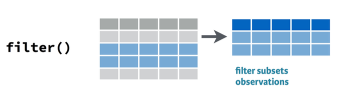
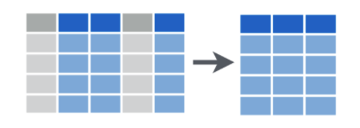
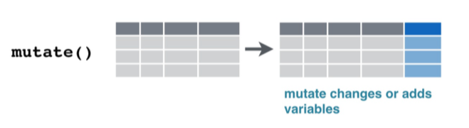
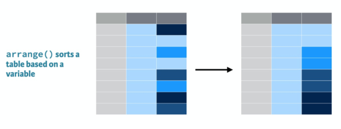

# Why learn data wrangling

- 80/20 rule
  - About 80% of time on data analysis is spent preparing data for analysis (i.e. wrangling)
  - Other 20% spend on actual analysis

--

- Teaching you analysis is not very useful if you can't realistically prepare data first

--

- Wrangling is a pain. Software like R can save you a lot of time.

---
# Objectives

By the end of this lab, you will have learned how to...

- rename variables
- change the type of variable
- extract observations using `filter`
- extract columns using `select`
- create new variables or change existing variables using `mutate`
- reorder rows using `arrange`
- extract a few of the top or bottom rows using `head` and `tail`
- combine functions in one chunk using the pipe operator `%>%`
- print nice looking tables using `kable`
- report summary stats using `summarize` and `group_by`

---
# Start a new project

- Using the file directory on your computer
  - Go to the parent folder that contains your RLabs folders
  - Create a new folder named RLab3

--

- In RStudio
  - Create new project
  - Select Existing Directory
  - Click Browse and select the RLab3 folder you just created
  - Click Create Project
  
---
# Start a R notebook

- Use the dropdown menu in the upper-left of RStudio to start a notebook
- Let's make some minimal changes to the YAML header
  - Change the title to "RLab 3: Data Wrangling"
  - Change the output to `html_document`
- Delete all of the content included in the template

---
# Wrangle with Tidyverse

- Virtually all wrangling can/should be done with the tidyverse package written by Hadley Wickham

- Load the tidyverse package. Hide the code and any output using one of the code chunk options we learned last week.

```{r, include=FALSE}
library(tidyverse)
```

---
# Download & load data

- Download the `state_finance_16.RData` and `ga_schdist_raw.RData` files from eLC and add to your project folder

- Load both datasets into R. Hide the code and output.

```{r, include=FALSE}
load('labs_files/state_finance_16.RData')
load('labs_files/ga_schdist_raw.RData')
```

```{r, eval=FALSE}
load('state_finance_16.RData')
load('ga_schdist_raw.RData')
```

- Click on the objects in your environment to view what mess these data are in

---
# Renaming variables

- In general, we want variable names to be in snake_case_format and as short as possible
- The names for `state_finance_16` aren't bad
- I already wrangled these data some

--

```{r, eval=FALSE}
state_finance_16 <- read_csv("SGF_2016_00A1_with_ann.csv", 
                             col_names = c("id1", "id2", "state", "year",
                                           "finance_type_id", "finance_type",
                                           "finance_source_id", "finance_source",
                                           "amount_1000"), 
                             col_types = "ccciccccn", 
                             na = c("X"), 
                             skip = 2)
```

---
# Show reader original data

- Insert a header 'Raw Data'

- Show the reader the original data using `glimpse`

```{r, results='hide'}
glimpse(state_finance_16)
```

---
# Renaming a few variables

```{r, eval=FALSE}
data_set <- rename(data_set, 'new_var' = 'old_var', 
                    'new_var' = 'old_var', ...)
```

--

- Let's rename 'id2' to 'id' and 'id1' to 'id2' in `state_finance_16`

```{r, results='hide'}
state_finance_16 <- rename(state_finance_16, 'id' = 'id2', 'id2' = 'id1')
```

---
# Renaming many long variables

- The names in the `ga_schdist_raw` data are super long
- We could rename using the same function, copy and pasting the current names to the code
- There is a quicker way

---
# Renaming many long variables

- Start a code chunk
- Run the following code

```{r, eval=FALSE}
names(ga_schdist_raw)
```

- The `names` functions returns a list of all variable names
- We can save this list to a new object

--

- Add the following to the code chunk

```{r}
schdist_oldnames <- names(ga_schdist_raw)
```

---
# Renaming many long variables

- Now we need to save a list of new variable names

```{r}
schdist_newnames <- c("district", "state", "charter", "enroll", "lep", "sped", 
    "frpl", "white", "expenditures")
```

- Tedious but you only have to do this once for multiple datasets with the same variables

---
# Renaming many long variables

- Finally, we tell R to replace the old names with our new names

```{r, message=FALSE}
ga_schdist_raw <- rename_at(ga_schdist_raw, vars(schdist_oldnames), 
                        ~ schdist_newnames)
```

- Don't worry about understanding all of the code. You can follow its logic for any dataset.

- Show reader the new `state_finance_16` and `ga_schdist_raw` names using `glimpse`

---
# Converting variable types

- We can overwrite how R stores variables within a dataset

- General logic
```{r, eval=FALSE}
data_set$variable <- as.newtype(data_set$variable)
#where newtype is the type you want
```

- Basic variable type options:

```{r, eval=FALSE}
as.numeric()
as.character()
as.integer()
as.factor()
```

---
# Converting variable types

- From glimpsing the data, we see that `state_finance_16$state` is stored as a character variable

- That's OK, but suppose we want R to recognize it as a categorical, nominal variable

- R stores categorical variables as **factors**

```{r}
state_finance_16$state <- as.factor(state_finance_16$state)
```

- Use `glimpse` again to check if it worked

---
# Skill check

- Several character variables in `ga_schdist_raw` need converted to numeric

- In your notebook, convert numeric variables stored as character to numeric

```{r, include=FALSE}
ga_schdist_raw$enroll <- as.numeric(ga_schdist_raw$enroll)
ga_schdist_raw$lep <- as.numeric(ga_schdist_raw$lep)
ga_schdist_raw$sped <- as.numeric(ga_schdist_raw$sped)
ga_schdist_raw$frpl <- as.numeric(ga_schdist_raw$frpl)
ga_schdist_raw$white <- as.numeric(ga_schdist_raw$white)
ga_schdist_raw$expenditures <- as.numeric(ga_schdist_raw$expenditures)
```


---
# Filter



- General logic

```{r, eval=FALSE}
filtered_data_set <- filter(unflitered_data_set, criteria)
```

---
# Filter

- Insert a header 'Filter'

- Run the following code in your console

```{r}
unique(state_finance_16$finance_type)
```

- Suppose we want to keep the rows if: **`finance_type` *equals* 'Revenue' *or* 'Expenditure'**

---
# Filter

```{r}
stf_filtered <- filter(state_finance_16, 
                       finance_type == 'Revenue' | finance_type == 'Expenditure')
```

- Note our new dataset has 100 fewer observations

- And checking the levels of the variable we see

```{r}
unique(stf_filtered$finance_type)
```

---
# Conditional and logical operators

- Conditionals
  - "If equal to" `==`
  - "If not equal to" `!=`
  - "If greater than, less than, or equal to" `>, <, >=, <=`

- Logicals
  - "And" `&`
  - "Or" `|`

---
# Skill check

- Use `unique` to examine the different levels for `state_finance_16$finance_source`

- Use filter to keep only the rows with total revenue or total expenditure

- Name the new object `stf_filtered`, which will overwrite the current object

---
# Select



- General logic

```{r, eval=FALSE}
new_dataset <- select(old_dataset, var1, var2, var3, ...)
# where var# are the names of the variables you want to keep
```

- Or to drop variables

```{r, eval=FALSE}
new_dataset <- select(old_dataset, -var1, -var2, ...)
```

- Whichever requires the shorter list of names

---
# Select

- Insert a header 'Select'

- Several variables in `stf_filtered` are unnecessary

- If we wanted to drop 'id2'

```{r, eval=FALSE}
stf_f_select <- select(stf_filtered, -id2)
```

- In your notebook, create a new object `stf_f_select` that drops `id2`, `finance_type_id` and `finance_source_id`

```{r, include=FALSE}
stf_f_select <- select(stf_filtered, -id2, -finance_type_id, -finance_source_id)
```


---
# Mutate



- General logic

```{r, eval=FALSE}
new_dataset <- mutate(old_dataset, newvar = whatever)
```

- If `newvar` is the name of an existing variable, `mutate` will change it according to your equation
- Otherwise, `mutate` will add a new variable to the new or existing dataset

---
# Mutate

- The `ga_schdist_raw` data has several absolute counts, such as `expenditures`

- Not good if we want to compare; larger districts will probably have higher counts of anything

- To compare variables across units of different size, we need to *normalize* the variables by size

---
# Mutate

- Insert a header 'Mutate'

- Let's add a new variable `exp_per_pupil`

```{r}
ga_schdist <- mutate(ga_schdist_raw, exp_per_pupil = expenditures/enroll)
```

---
# Skill check

- Use `mutate` to add another new variable to `ga_schdist` that equals the number of students of color named `non_white`

```{r, include=FALSE}
ga_schdist <- mutate(ga_schdist, non_white = enroll - white)
```

---
# Mutate many variables

- We want several variables in `ga_schdist` expressed as percentages

- Could follow the same process

```{r, eval=FALSE}
ga_schdist <- mutate(lep_pct = (lep/enroll)*100, 
                     sped_pct = (sped/enroll)*100,
                     and so on)
```

- Gets repetitive; there is a shortcut if we want to mutate many variables using the same function

---
# Mutating many variables

- Add and execute the following code

```{r, warning=FALSE}
ga_schdist <- mutate_at(ga_schdist, 
                    vars(lep, sped, frpl, white, non_white),
                    funs((./enroll)*100))
```

- We could rename these variables to include 'pct' or just assume it is clear

---
# Arrange



- General logic

```{r, eval=FALSE}
arrange(data_set, var)
# Where var is the variable on which you want to arrange
```

- By default, `arrange` arranges in ascending order
- You can `arrange` in descending order like so

```{r, eval=FALSE}
arrange(data_set, desc(var))
```

--

- Usually doesn't make sense to create a new dataset with `arrange` but helpful for printing tables

---
# Arrange

- Suppose I wanted to see GA school districts listed from lowest percentages of FRPL students to highest

```{r}
arrange(ga_schdist, frpl)
```

---
# Head and Tail

- Too many rows in the previous table
- Use `head` and `tail` to extract the top or bottom rows of a dataset

- General logic
```{r, eval=FALSE}
head(data_set, n = number_of_top_rows)
tail(data_set, n = number_of_bottom_rows)
```

---
# Head and tail

- Insert header 'Head and Tail'

- Five GA districts with lowest FRPL

- Add the following code

```{r}
arrange(ga_schdist, frpl) %>% 
  head(n=5)
```

---
# Head and tail

- Five GA districts with highest FRPL

- Add the following code

```{r}
arrange(ga_schdist, desc(frpl)) %>% 
  head(n=5)
```

- What is this `%>%` symbol? 

---
# Pipe operator `%>%` 

- The pipe operator allows us to run multiple commands, sequentially feeding the result of one command to the next

- Recall the separate steps to create `stf_f_select`
```{r, eval=FALSE}
stf_filtered <- filter(state_finance_16, 
                       finance_source == "Total Revenue" |
                       finance_source == "Total Expenditure")

stf_f_select <- select(stf_filtered,
                       -id2,
                       -finance_type_id, 
                       -finance_source_id)
```

---
# Pipe operator

- Instead, we can get to the end result without creating a intermediate dataset

```{r}
stf_f_select <- state_finance_16 %>% 
  filter(finance_source == "Total Revenue" |
         finance_source == "Total Expenditure") %>% 
  select(-id2,
         -finance_type_id, 
         -finance_source_id)
```

- Note that we don't specify the dataset inside `filter` or `select` like before because the data is fed into each command from the previous line

---
# Pipe operator

- Suppose I want a table of the five districts with the highest FRPL that only shows the name of the district and FRPL

```{r}
ga_schdist %>% 
  select(district, frpl) %>% 
  arrange(desc(frpl)) %>% 
  head(n=5)
```

---
# Skill Check

- In your notebook, provide a table of the five school districts with the highest percentages of students in special education that only shows the name of the district and the percentage

- Knit to html

```{r, include=FALSE}
ga_schdist %>% 
  select(district, sped) %>% 
  arrange(desc(sped)) %>% 
  head(n=5)
```

---
# Printing tables

- Our tables don't look very good

- We can print nice tables using `kable`, which is part of the `knitr` package

- Load `knitr`. Suppress the code and output.

```{r}
library(knitr)
```

---
# Printing tables

- Add the code chunk below to your notebook. It is identical to the code chunk you just made except for the last line.
- Then knit to html

```{r}
ga_schdist %>% 
  select(district, sped) %>% 
  arrange(desc(sped)) %>% 
  head(n=5) %>% 
  kable()
```

---
# Changing how all tables print

- Can control how all tables are printed in the YAML header

- Scroll up to your YAML header at the top of your notebook and change like so

```{r, eval=FALSE}
---
title: "RLab 3: Data Wrangling"
author: "Your Name"
output: 
  html_document:
    theme: spacelab
    df_print: kable
---
```

- Knit to html. You should notice all your tables look better.

---
# Changing how all tables print

- html allows you to make table interactive

- change your YAML to this instead

```{r, eval=FALSE}
---
title: "RLab 3: Data Wrangling"
author: "Your Name"
output: 
  html_document:
    theme: spacelab
    df_print: paged
---
```

- Knit to html. You should notice large tables can be scrolled through.

---
# Summarize


- General logic

```{r, eval=FALSE}
summarize(data_set, name = function(variable),
          name = function(variable),...)
```

---
# Summarize

- Suppose I wanted to report average expenditures per pupil

```{r}
ga_schdist %>% 
  summarize(AvgExp = mean(exp_per_pupil, na.rm = TRUE),
            AvgFRPL = mean(frpl, na.rm = TRUE)) %>% 
  kable()
```

---
# Group By


- General logic

```{r, eval=FALSE}
data_set %>% 
  group_by(grouping_variable) %>% 
  summarize(name = function(variable))
```

- Year and any nominal variable are common grouping variables
---
# Group By

- Suppose I want to report average expenditures per pupil by whether a district has no charter schools, some charter schools, or all charter schools

```{r, message=FALSE}
ga_schdist %>% 
  group_by(charter) %>% 
  summarize(AvgExp = mean(exp_per_pupil, na.rm = TRUE)) %>% 
  kable()
```

---
# Skill check

- Insert header 'Summarize and Group By'

- Provide a table that reports the average amounts in the `stf_f_select` data separately for each state. Execute the code to check if it works.

```{r, include=FALSE}
stf_f_select %>% 
  group_by(state) %>% 
  summarize(AvgAmount = mean(amount_1000, na.rm = TRUE))
```

---
# Interpretation

- What is the meaning of these averages?

--

- Meaningless because expenditures and revenues are in the same column

- These data are **untidy**

- We will learn how to tidy data next week

---
# Save data and submit lab

- We need to save `stf_f_select` to use next week

```{r}
save(stf_f_select, file = 'stf_f_select.RData')
```

- Upload your notebook to eLC