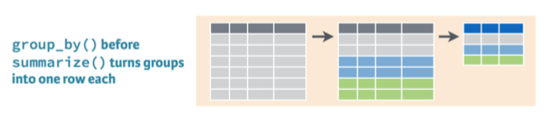

# Outline

```{r setup, include=FALSE}
library(tidyverse)
library(readxl)
library(gapminder)
library(knitr)
state_finance_2016 <- read_csv('labs_files/state_finance_2016.csv')
ga_schdist_clean <- read_csv("labs_files/ga_schdist_clean.csv")
```

- Wrangle verbs
  - extract rows using `filter`
  - extract columns using `select`
  - create new or change existing variables using `mutate`
  - reorder rows using `arrange`
- Other
  - print top or bottom rows using `slice_head` and `slice_tail`
  - combine functions using the pipe operator `%>%`
  - provide descriptive stats using `summarize` and `group_by`

---
# Why learn data wrangling


- Change original data to help achieve our goal

- Create a table we want to include in a report

- Learning statistics is not as useful if you can't prepare data

---
# Realistic Expectations

- Cleaning data is not fun (to most ppl) and can involve many steps. 

- This lab covers a lot of information.

- The expectation is not to memorize everything.

--

- Our goal is to be able to start with original data have an idea of the functions needed to get to the desired result

- If you understand the steps/functions, searching for examples or copying previous work is easy

---
# Set up

> **Create a new project named "rlab3" and start new R Markdown document.**
  
> **Change YAML:**

```{r, eval=FALSE}
---
title: "RLab3: Data Wrangling"
author: "Your Name"
output:
  html_document:
    df_print: paged
---
```

> **Keep setup code chunk at the top. Change the global option to `echo=FALSE, message=FALSE, warning=FALSE`**

> **Delete rest of the template.**

---
# Set up: Packages

> **In the setup code chunk, load the following packages:**

```{r, eval=FALSE}
library(tidyverse) # handles virtually all wrangling tasks
library(readxl) # to import Excel
library(gapminder) # for data we will use
```

---
class: inverse, middle, center

# Wrangle verbs

---
# Practice Data

- We will practice wrangle verbs using the `gapminder` dataset

```{r, echo=FALSE}
gapminder %>% 
  slice_head(n=1) %>% 
  kable(digits = 1)
```

- Continents & years included

```{r, echo=FALSE}
levels(gapminder$continent)
unique(gapminder$year)
```

---
# Preview data

> **Below the setup code chunk, on a new line outside of the code chunk, type a heading Preview**

> **Insert a new code chunk. Name this code chunk {r preview}**

> **Provide a preview of the data using `slice_head()` to print the first four rows.**

---
# Filter


- Keeps or removes rows based on criteria you specify

- General syntax:

```{r, eval=FALSE}
filter(data_set, criteria) #prints the result
filtered_data_set <- filter(data_set, criteria) #saves result
filtered_data_set # prints the saved result in the above line
```

---
# Specifying criteria

- We can tell R to keep rows that meet a criterion

  - "If equal to" `==`
  - "If not equal to" `!=`
  - "If greater than, less than, or equal to" `>, <, >=, <=`
  - "If missing values for" `is.na()`

- We can specify multiple criteria
  - "And" `&`
  - "Or" `|`

---
# Filter examples

Print all observations where year equals 2007

```{r, eval=FALSE, results='hide'}
filter(gapminder, year == 2007)
```

--

Print all observations where continent equals Africa

```{r, eval=FALSE, results='hide'}
filter(gapminder, continent == 'Africa')
```

--

Save a new dataset containing only observations where life expectancy is greater than 75 years, then print the saved result.

```{r, eval=FALSE}
long_life <- filter(gapminder, lifeExp > 75)
long_life
```

---
# Filter examples

Print observations missing values for life expectancy

```{r, eval=FALSE}
filter(gapminder, is.na(lifeExp))
```

--

Save a new dataset with Oceania observations removed

```{r, eval=FALSE}
no_oceania <- filter(gapminder, continent != 'Oceania')
```

---
# Filter practice

> **Type a new heading, "Wrangle Practice"**

> **Type a lower-level heading, "Filter"**

--

> **Start a new code chunk and name it `filter`.**

--

> **Use `filter` to save new dataset named `asia` containing all Asia observations**

--

> **On new line, use `filter` to save new dataset named `gap1952` containing all 1952 observations**

--

> **On new line, use `filter` to save a new dataset named `oceania` containing only Oceania observations. Then print `oceania`.**

--

> **Knit to HTML and inspect the output.**


---
# Filter examples (multiple criteria)

Print all Africa observations for 2007

```{r, eval=FALSE, results='hide'}
filter(gapminder, continent == 'Africa' & year == 2007)
```

--

Print all Africa and Oceania observations

```{r, eval=FALSE, results='hide'}
filter(gapminder, continent == 'Africa' | continent == 'Oceania')
```

--

Print non-Oceania observations for 1992 or later

```{r, eval=FALSE, results='hide'}
filter(gapminder, continent != 'Oceania' & year >= 1992)
```

---
# Filter practice

> **Start a new code chunk named `filter2`**

--

> **Print a table containing countries only in the Americas with a life expectancy lower than 65 in year 1952**

--

> **Knit to HTML.**

---
# Select


- General syntax

```{r, eval=FALSE}
new_dataset <- select(old_dataset, var1, var2, var3, ...)
# where var is the name of the variable you want to keep
```

- Or to drop variables

```{r, eval=FALSE}
new_dataset <- select(old_dataset, -var1, -var2, ...)
```

- Whichever requires the shorter list of names

---
# Select examples

Print only country, year, and life expectancy

```{r, results='hide'}
select(gapminder, country, year, lifeExp)
```

--

Remove population and print the rest

```{r, results='hide'}
select(gapminder, -pop)
```

---
# Select practice

> **Insert a heading named Select**

--

> **Start a new code chunk and name it `select`**

--

> **You have an dataset saved named `oceania`. Use select to print a table of `oceania` containing only `country`, `year`, and `pop`**

--

> **On separate line, use select to print a table of `oceania` with all variables except `continent`**

--

> **Knit to HTML.**

---
# Manual subsetting

- `filter` & `select` subsets data based on intelligent criteria (e.g., keep if lifeExp < 65)

- Can manually subset data, or keep/remove rows and columns based on their positions in a dataset (e.g. remove first row)

- Sometimes easier to manually subset

---
# Subsetting

General syntax

```{r, eval=FALSE}
new_dataset <- dataset[row number(s) to keep or remove, 
                   column number(s) to keep or remove]
```

--

```{r, eval=FALSE}
new_dataset <- dataset[5, 2]
# this saves the 5th row and 2nd column to a new dataset
```

--

```{r, eval=FALSE}
new_dataset <- dataset[-5, -2]
# this drops 5th row and 2nd column and saves the result
```

--

```{r, eval=FALSE}
new_dataset <- dataset[c(-3,-5), c(1:10)]
# this drops 3rd and 5th rows, and keeps columns 1-10
```

---
# Subsetting example

Suppose I want to print first two rows of `gapminder` and keep all columns

```{r, eval=FALSE}
gapminder[c(1:2),]
```

Or remove first row and sixth column and save it as a new object

```{r, eval=FALSE}
gapminder_subset <- gapminder[-1, -6]
```

---
# Subsetting practice

> **Insert a heading named Subset**

> **Start a new code chunk and name it subset.**

--

> **Print only the first row and all columns of `gapminder`**

--

> **Save a new dataset named `gap_subset` where you remove the first, ninth, and thirteenth rows, and keep columns 1-4.**

--

> **Knit to HTML**

---
# Mutate


- Generic syntax

```{r, eval=FALSE}
dataset <- mutate(dataset, var_name = any_formula)
```

- Only a single `=` is used because we are assigning value

- If `var_name` is an existing variable, `mutate` will replace it

- Otherwise, `mutate` will add a new variable

---
# Mutate examples

Replace `pop`ulation rescaled from ones to millions

```{r, eval=FALSE}
gapminder <- mutate(gapminder, pop = pop/1000000)
```

--

Add a new variable `pop_millions` that rescales `pop` to millions

```{r, eval=FALSE}
gapminder <- mutate(gapminder, pop_millions = pop/1000000)
```

--

Save new dataset with a variable equal to average life expectancy among all observations

```{r, eval=FALSE}
gapminder2 <- mutate(gapminder, avg_lifeExp = mean(lifeExp))
```

---
# Mutate examples

Can create multiple variables at a time separated by commas

```{r, eval=FALSE}
gapminder3 <- mutate(gapminder,
                     pop_millions = pop/1000000,
                     avg_lifeExp = mean(lifeExp))
```

---
# Practice

> **Type a heading titled Mutate. Start a new code chunk and name it mutate.**

--

> **First, save a new dataset `gapminder07` containing only observations for 2007**

--

- Our data contain a variable, `gdpPercap`, for GDP per capita but suppose we want GDP also

> **On a new line, create a new variable `gdp` equal to a country's GDP and save it to `gapminder07`**

---
# Practice continued

> **In the *same* mutate function, create a second variable, `global_gdp`, equal to the `sum()` of all `gdp`s.**

--

> **In the *same* mutate function, create a third variable, `pct_gdp`, equal to each country's percent of `global_gdp`.**

--

> **Print a table that displays only the country name and percent of global gdp where `pct_gdp` is greater than or equal to 10.**

---
# Arrange


```{r, eval=FALSE}
arrange(data_set, var)
# Where var is the variable by which you want to arrange
# Arranges in ascending order by default

arrange(data_set, desc(var))
# Arranges in descending order
```

- Useful for printing tables to see highest or lowest cases

---
# Arrange examples

Print countries arranged in ascending order of life expectancy (low-to-high)

```{r, eval=FALSE}
arrange(gapminder, lifeExp)
```

--

Print countries arranged in descending order of life expectancy (high-to-low)

```{r, eval=FALSE}
arrange(gapminder, desc(lifeExp))
```

--

Rearrange and replace existing data

```{r, eval=FALSE}
gapminder <- (gapminder, lifeExp)
```


---
# Arrange practice

> **Type a heading titled Arrange. Start a new code chunk and name it arrange.**

--

> **Rearrange `gapminder07` in descending order by `pct_gdp`**

--

> **Print a table of the first 10 rows**

---
class: inverse, middle, center

# Combining Wrangle Verbs

---
# Pipe operator %>%

- Allows us to run multiple commands, sequentially feeding the result of the previous line of code to the next

- Makes code easier to read and write

- Keyboard shortcut is `Cmd+Shift+M` or `Ctrl+Shift+M`

.pull-left[

Prints the result

```{r, eval=FALSE}
dataset %>% 
  filter(___) %>% 
  select(___) %>% 
  mutate(___) %>% 
  arrange(___)
```
]

.pull-right[

Saves the result

```{r, eval=FALSE}
dataset <- dataset %>% 
  filter(___) %>% 
  select(___) %>% 
  mutate(___) %>% 
  arrange(___)
```
]

---
# Pipe example

Suppose I want to print a table of the top five countries with respect to percent of global GDP in 2007. **Without using %>%:**

```{r, eval=FALSE}
#Filter gapminder
gapminder07 <- filter(gapminder, year == 2007)

#Add variables to gapminder07
gapminder07 <- mutate(gapminder07, 
                     gdp = gdpPercap*pop,
                     global_gdp = sum(gdp),
                     pct_gdp = (gdp/global_gdp)*100)

#Create dataset according to desired table
gdp_table <- select(gapminder07, country, pct_gdp)
gdp_table <- arrange(gdp_table, desc(pct_gdp))

#Print table
slice_head(gdp_table, n = 5)
```

---
# Pipe example

To print same table with `%>%`:

```{r, eval=FALSE}
gapminder %>% 
  filter(year == 2007) %>% 
  mutate(gdp = gdpPercap*pop,
         global_gdp = sum(gdp),
         pct_gdp = (gdp/global_gdp)*100) %>% 
  select(country, pct_gdp) %>% 
  arrange(desc(pct_gdp)) %>% 
  slice_head(n=5)
```

- Don't specify the data inside each verb because that is being piped from the first line

- Don't have to save the result each step of the way; no `gapminder07` or `gdp_table` needed.

---
# Pipe operator practice

> **Add a heading "Pipe Operator"**

> **Start a new code chunk and name it pipe.**

--

> **Use the pipe operator to save a new dataset `gapminder52` that contains only 1952 observations and add the GDP variables we created earlier (consider copy-and-paste)**

--

> **On a new line, use pipe operator to print a table of `gapminder52` that includes only `country` and `pct_gdp`, arranged in descending order and only the first 5 countries.**

--

> **Knit to HTML**

---
class: inverse, middle, center

# Summarize & Group By

---
# Summarize


- Generic syntax

```{r, eval=FALSE}
summarize(data_set, "Name of column" = function(variable),
          "Name of column" = function(variable),...)
```

- Where `function` is one of many possible summary functions

- Useful for reporting a few summary stats

---
# Summarize example

Suppose I want to report median life expectancy and GDP per capita in 2007

```{r, eval=FALSE}
gapminder %>% 
  filter(year == 2007) %>% 
  summarize("Median Life Expectancy" = median(lifeExp),
            "Median GDP per Capita" = median(gdpPercap))
```

```{r, echo=FALSE}
gapminder %>% 
  filter(year == 2007) %>% 
  summarize('Median Life Expectancy' = median(lifeExp),
            'Median GDP per Capita' = median(gdpPercap)) %>% 
  kable(digits = 0,
        format.args = list(big.mark = ','))
```

---
# Summarize practice

> **Add a heading "Summarize"**

> **Start a new code chunk and name it summarize**

> **Use `gapminder52` to print a table with the `min`imum, `median`, and `max`imum for `pct_gdp` in 1952. Name columns accordingly.**

---
# Group By



- General syntax

```{r, eval=FALSE}
data_set %>% 
  group_by(grouping_variable) %>% 
  summarize(name = function(variable))
```

- Year and categorical variables are common grouping variables

---
# Group by example

Median life expectancy and GDP per capita in 2007 **by continent**

```{r, eval=FALSE}
gapminder %>% 
  filter(year == 2007) %>% 
  group_by(continent) %>% #<<
  summarize('Median Life Expectancy' = median(lifeExp),
            'Median GDP per Capita' = median(gdpPercap))
```

```{r, echo=FALSE, message=FALSE}
gapminder %>% 
  filter(year == 2007) %>% 
  group_by(continent) %>% #<<
  summarize('Median Life Expectancy' = median(lifeExp),
            'Median GDP per Capita' = median(gdpPercap)) %>% 
  kable(digits = 0, format.args = list(big.mark = ','))
```

---
# Group by practice

> **Add a heading "Group By"**

> **Start a new code chunk and name it groupby.**

> **Copy and paste your code that made the summary table**

> **Change the table so it reports these summary statistics by each year**

> **Knit**

---
# Upload Rmd

> **Upload your .Rmd to eLC**

---
class: inverse, middle, center

# Optional Reference: Formatting tables

---
# Kable options for tables

- The `kable()` function, part of the `knitr` package, is a quick way to format tables.

```{r, eval=FALSE}
library(knitr)
```

- Three useful options:
  - `digits = #` sets the number of digits to the right of the decimal
  - `format.args = list(big.mark = ',')` inserts commas
  - `col.names =` renames the columns
  - `caption =` provides a table title

---
# Kable example

> **Add a heading "Kable Table"**

> **Start a new code chunk and name it kable. Add the following code.**

```{r, eval=FALSE}
gapminder52 %>% 
  select(country, pct_gdp) %>% 
  arrange(desc(pct_gdp)) %>% 
  slice_head(n=5) %>% 
  kable(digits = 1,
        col.names = c('Country', 'Percent of Global GDP'),
        caption = 'Largest Economies in 1952')
```

> **Knit to HTML to see difference in table format**
