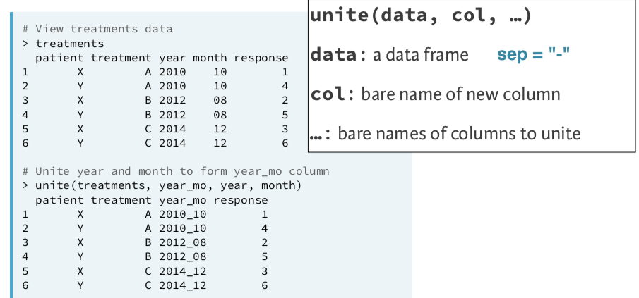

# Objectives

By the end of this lab, you will have learned how to...

- Pivot a wide dataset to long
- Pivot a long dataset to wide
- Separate a variable into multiple variables
- Unite multiple variables to one variable

```{r setup, include=FALSE}
library(tidyverse)
library(knitr)
library(gapminder)
```

---
# Setup

> **Start a new project named "rlab4".**
  
> **Start a R Markdown document**

> **Keep the setup code chunk at the top but delete the rest of the template. Change echo to FALSE.**

> **Change YAML to:**

```{r, eval=FALSE}
---
title: "RLab4: Tidying Data"
author: "Your Name"
output:
  html_document:
    df_print: paged
---
```

---
# Packages

> **In the top "setup" code chunk, load the `tidyverse` package**

---
# Tidy data

Tidy data satisfy three rules:

- Each variable has its own column
- Each observation (unit of analysis) has its own row
- Each value (datum) has its own cell


---
# Tidy data

- Let's revisit the state finance data

> **Insert a heading "Untidy State Finance Data"**

> **Load the `st_fin_16_wrangled.csv` from the in-class activity. Suppress any output R may print.**

- Correct version is available on eLC for download in case you do not trust your copy.

- You can load these data in your setup code chunk or a new code chunk.

```{r, include=FALSE}
st_fin_16_wrangled <- read_csv('labs_files/st_fin_16_wrangled.csv')
```

---
# Tidy Data

- Let's show readers a sample of the data

> **In a new code chunk, provide the first 4 rows of `st_fin_16_wrangled`.**

```{r, echo=FALSE}
st_fin_16_wrangled %>% 
  head(n = 4) %>% 
  kable()
```

---
class: inverse, center, middle

# Are these data tidy? Why or why not?

---
# Untidy Data

```{r, echo=FALSE}
st_fin_16_wrangled %>% 
  head(n=4) %>% 
  kable()
```

- What is the unit of analysis?

--

- There are two rows per observation (unit of analysis)

--

- Why?

--

- Because `finance_type` should be two variables, not one

---
# Long vs. Wide Data

- Most tidying issues involve whether a dataset should be long or wide

--

- Is `st_fin_16_wrangled` in long or wide format?

```{r, echo=FALSE}
st_fin_16_wrangled %>% 
  head(n=4) %>% 
  kable()
```

---
# Long vs. Wide Data

- Here is a different example that is very common.

```{r, echo=FALSE}
uspop <- gapminder %>% 
  filter(country == 'United States' & year >= 1997) %>% 
  select(country, year, pop) %>% 
  pivot_wider(names_from = year, names_prefix = 'pop', values_from = pop) 

 
kable(uspop, format = 'html')
```

- Are these data in long or wide format?

--

- Are these data tidy? Why or why not?

---
# Tidy State Finance Data

- Our goal is to tidy `st_fin_16_wrangled`

- It is long when it should be wide

--

- To achieve this, we can use the `pivot_wider` function

- General syntax:

```{r, eval=FALSE}
new_data <- current_data %>% 
  pivot_wider(names_from = column-with-variable-names,
              values_from = column-with-values)
```

---
# Tidy State Finance Data

```{r, echo=FALSE}
st_fin_16_wrangled %>% 
  head(n=2) %>% 
  kable()
```

> **Insert a heading "Tidy State Finance Data"**

> **Start a code chunk that creates a new dataset `st_fin_16_tidy`**

```{r, eval=FALSE}
st_fin_16_tidy <- st_fin_16_wrangled %>% 
```

---
# Tidy State Finance Data

```{r, echo=FALSE}
st_fin_16_wrangled %>% 
  head(n=2) %>% 
  kable()
```

```{r, eval=FALSE}
new_data <- current_data %>% 
  pivot_wider(names_from = column-with-variable-names,
              values_from = column-with-values)
```

- Which column contains the names of the new variables we want?
- Which column contains the values for the new variables?
> **Add `pivot_wider` to your code chunk according to answers.**

---
# Tidy State Finance Data

```{r}
st_fin_16_tidy <- st_fin_16_wrangled %>% 
  pivot_wider(names_from = finance_source,
              values_from = amount_1000)
```

> **Run your code and examine the new dataset to see if/how it worked.**

---
# Tidy State Finance Data

> **Provide the reader with top 4 rows of the new dataset.**

```{r, echo=FALSE}
st_fin_16_tidy %>% 
  head(n=4) %>% 
  kable()
```


---
# Changing variable names

- The variable names in our `st_fin_16_tidy` are not ideal.

> **Change "Total Revenue" to `revenue` and "Total Expenditure" to `expenditure`.**

```{r, echo=FALSE}
st_fin_16_tidy <- st_fin_16_tidy %>% 
  rename('revenue' = 'Total Revenue', 
         'expenditure' = 'Total Expenditure')
```

---
# Summarize by Group

- Recall in the wrangling activity you computed the average `amount_1000` but realized it was meaningless because it combined revenues and expenditures.

> **Now create a new variable that computes the surplus (revenue - expenditure) for each state. Provide a table that lists surplus in descending order for three states with highest surplus.**

```{r, echo=FALSE}
st_fin_16_tidy %>% 
  mutate(surplus = revenue - expenditure) %>% 
  select(state, surplus) %>% 
  arrange(desc(surplus)) %>% 
  head(n=3) %>% 
  kable()
```

---
# Wide to Long

```{r, echo=FALSE}
kable(uspop, format = 'html')
```

- To tidy wide data to long format, we can use `pivot_longer`

```{r}
uspop_tidy <- uspop %>% 
  pivot_longer(cols = pop1997:pop2007,
               names_to = 'year',
               names_prefix = 'pop',
               values_to = 'population')
```

```{r, echo=FALSE}
kable(uspop_tidy)
```

---
# Untidy Enrollment Data

> **Download the `ky_private_school_enrollment.csv` file from eLC and add to your project folder.**

> **Open this file using whatever spreadsheet software is on your computer, or watch me view it on Excel.**

---
# Untidy Enrollment Data

> **Insert a heading "Untidy Enrollment Data"**

> **Import `ky_private_school_enrollment.csv`, suppressing code and output**

> **Name the new dataset `ky_priv_enroll_wide`**

```{r, include=FALSE}
ky_priv_enroll_wide <- read_csv('labs_files/ky_private_school_enrollment.csv')
```

---
# Untidy Enrollment Data

> **Provide the reader the first 3 rows of these data, suppressing the code**

```{r, echo=FALSE}
head(ky_priv_enroll_wide, n=3) %>% 
  kable()
```

---
# Untidy Enrollment Data

- We need to take the `enrollyear` columns and name them to a new variable `year` and send the values to a variable we will name `enrollment`

- Recall how this was done for the `uspop` data

```{r, eval=FALSE}
uspop_tidy <- uspop %>% 
  pivot_longer(cols = pop1997:pop2007,
               names_to = 'year',
               names_prefix = 'pop',
               values_to = 'population')
```

> **Create a new dataset called `ky_priv_enroll` that is in long format**

```{r, include=FALSE}
ky_priv_enroll <- ky_priv_enroll_wide %>% 
  pivot_longer(cols = enroll2000:enroll2010,
               names_to = 'year',
               names_prefix = 'enroll',
               values_to = 'enrollment')
```

---
class: inverse, center, middle

# Are these data tidy? Why or why not?

---
# Separating variables


---
# Tidy Enrollment Data

- We should `separate` city_county into city and county

> **Overwrite the `ky_priv_enroll` with `city_county` separated.**

--

```{r, warning=FALSE}
ky_priv_enroll <- ky_priv_enroll %>% 
  separate(city_county, c('city', 'county'))
```

--

> **Finally, provide the reader the first 6 rows of these tidy data**

> **Knit to HTML and check that the output looks correct**

---
# Uniting variables



---
# Upload Lab

- Upload your .Rmd file to eLC