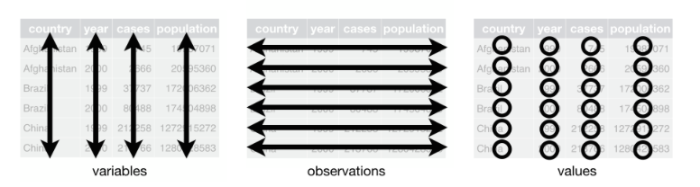
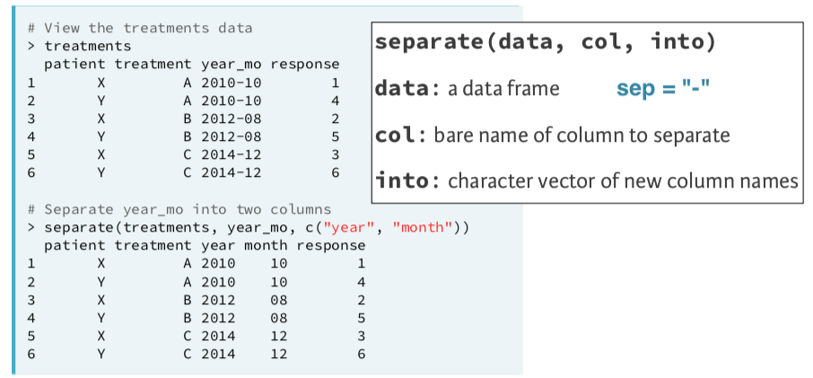

# Objectives

- Pivot wide data to long
- Pivot long data to wide
- Separate a variable into multiple variables

```{r setup, include=FALSE}
library(tidyverse)
library(knitr)
library(gapminder)
```

---
# Set-up

.pull-left[

> **If using RStudio Cloud, do not create a new project space. Instead, use the project that has all packages installed. Installed packages do not carry over to other project spaces.**

]

.pull-right[

> **Otherwise, create a new project named "rlab4". I recommend locating it in the same parent file as your other RLab folders.**

]

---
# Setup
  
> **Start a new R Markdown document**

> **Keep setup code chunk at the top. Change to `echo=FALSE`. Following echo, add `warning=FALSE` and `message=FALSE` separated by commas.**

> **Change YAML:**

```{r, eval=FALSE}
---
title: "RLab4: Tidying Data"
author: "Your Name"
output:
  html_document:
    df_print: paged
---
```

> **Delete rest of the template.**

---
# Setup: Packages

> **In the setup code chunk, load the following packages:**

```{r, eval=FALSE}
library(tidyverse)
```

---
# Setup: Data

> **Download the "state_finance_2016_wrangled.csv" and "ky_private_school_enrollment.csv" files from eLC and add to your project folder**

> **In the setup code chunk, import "state_finance_2016_wrangled.csv" and "ky_private_school_enrollment.csv". You do not need to use any import options. Name the objects in your environment the same as the file names.**

```{r, include=FALSE}
state_finance_2016_wrangled <- read_csv("labs_files/state_finance_2016_wrangled.csv")

ky_private_school_enrollment <- read_csv("labs_files/ky_private_school_enrollment.csv")
```

---
# Tidy data

Tidy data satisfy three rules:

- Each variable has its own column
- Each observation (unit of analysis) has its own row
- Each value (datum) has its own cell



---
# Tidy data

> **Insert a heading "Untidy State Finance Data"**

--

- Let's show readers a preview of the data

> **In a new code chunk, provide the first 4 rows of `state_finance_2016_wrangled`.**

```{r, echo=FALSE}
state_finance_2016_wrangled %>% 
  slice_head(n = 4) %>% 
  kable()
```

--

- Are these data tidy? Why or why not?

---
# Untidy Data

```{r, echo=FALSE}
state_finance_2016_wrangled %>% 
  slice_head(n=4) %>% 
  kable()
```

- What is the unit of analysis?

--

- There are two rows per observation (unit of analysis)

--

- Why?

---
# Long vs. Wide Data

- Most tidying issues involve data that is too long or too wide
  - Long if too many rows relative to unit of analysis
  - Wide if too many columns
--

- Is `state_finance_2016_wrangled` too long or wide?

```{r, echo=FALSE}
state_finance_2016_wrangled %>% 
  slice_head(n=4) %>% 
  kable()
```

---
# Long vs. Wide Data

- Here is a different example that is very common.

```{r, echo=FALSE}
uspop <- gapminder %>% 
  filter(country == 'United States' & year >= 1997) %>% 
  select(country, year, pop) %>% 
  pivot_wider(names_from = year, names_prefix = 'pop', values_from = pop) 

 
kable(uspop, format = 'html')
```

- Are these data tidy? Why or why not?

--

- Are these data too long or wide?

---
# Tidy State Finance Data

- Our goal is to tidy `state_finance_2016_wrangled`

- It is too long, needs to be wider

--

- To achieve this, we can use the `pivot_wider` function

- General syntax:

```{r, eval=FALSE}
new_data <- current_data %>% 
  pivot_wider(names_from = column-with-variable-names,
              values_from = column-with-values)
```

---
# Tidy State Finance Data

```{r, echo=FALSE}
state_finance_2016_wrangled %>% 
  slice_head(n=2) %>% 
  kable()
```

> **Insert a heading "Tidy State Finance Data"**

> **Start a code chunk. Add the following code that begins to overwrite the original data**

```{r, eval=FALSE}
state_finance_2016_tidy <- state_finance_2016_wrangled %>% 
```

---
# Tidy State Finance Data

```{r, echo=FALSE}
state_finance_2016_wrangled %>% 
  slice_head(n=2) %>% 
  kable()
```

```{r, eval=FALSE}
state_finance_2016_tidy <- state_finance_2016_wrangled %>% 
  pivot_wider(names_from = column-with-variable-names,
              values_from = column-with-values)
```

- Which column contains the names of the new variables we want?
- Which column contains the values for the new variables?
> **Add `pivot_wider` to your code chunk according to answers. Run your code and examine the new data.**

```{r, include=FALSE}
state_finance_2016_tidy <- state_finance_2016_wrangled %>% 
  pivot_wider(names_from = finance_source,
              values_from = amount_1000)
```

---
# Tidy State Finance Data

> **Provide the reader with top 4 rows of the new dataset.**

```{r, echo=FALSE}
state_finance_2016_tidy %>% 
  slice_head(n=4) %>% 
  kable()
```

---
# Wide to Long

```{r, echo=FALSE}
kable(uspop, format = 'html')
```

- The variable names contain two variables: pop and year
- The values for year are *in* the variable name
- The values in the rows measure pop
- To tidy wide data to long format, we can use `pivot_longer`

- General code:

```{r, eval=FALSE}
new_data <- current_data %>% 
  pivot_longer(cols = variables_you_want_to_pivot,
               names_to = 'name_of_new_variable',
               names_prefix = 'where_to_split_varname',
               values_to = 'varname_containing_original_values')
```

---
# Wide to long

```{r, echo=FALSE}
kable(uspop, format = 'html')
```

```{r}
uspop_tidy <- uspop %>% 
  pivot_longer(cols = pop1997:pop2007,
               names_to = 'year',
               names_prefix = 'pop',
               values_to = 'population')
```

```{r, echo=FALSE}
kable(uspop_tidy)
```

---
# Untidy Enrollment Data

> **Provide the reader the first 3 rows of the `ky_private_school_enrollment`**

```{r, echo=FALSE}
slice_head(ky_private_school_enrollment, n=3) %>% 
  kable()
```

---
# Untidy Enrollment Data

- We need to take the `enrollyear` columns and name them to a new variable `year` and send the values to a variable we will name `enrollment`

- Recall how this was done for the `uspop` data

```{r, eval=FALSE}
uspop_tidy <- uspop %>% 
  pivot_longer(cols = pop1997:pop2007,
               names_to = 'year',
               names_prefix = 'pop',
               values_to = 'population')
```

> **Create a new dataset called `ky_private_enroll_long` that pivots `ky_private_school_enrollment` to long format**

```{r, include=FALSE}
ky_private_enroll_long <- ky_private_school_enrollment %>% 
  pivot_longer(cols = enroll2000:enroll2010,
               names_to = 'year',
               names_prefix = 'enroll',
               values_to = 'enrollment')
```

---
# Enrollment Data

```{r, echo=FALSE}
ky_private_enroll_long %>%
  slice_head(n=3) %>% 
  kable()
```

- Are these data tidy? Why or why not?

---
# Separating variables



---
# Tidy Enrollment Data

- We should `separate` city_county into city and county

> **Create a new dataset `ky_priv_enroll_tidy` that separates `city_county` in `ky_private_enroll_long.`**

--

```{r, include=FALSE, warning=FALSE}
ky_priv_enroll_tidy <- ky_private_enroll_long %>% 
  separate(city_county, c('city', 'county'))
```

--

> **Provide the reader the first 6 rows of these tidy data**

> **Knit to HTML and check that the output looks correct**

---
# Upload Lab

- Upload your .Rmd file to eLC