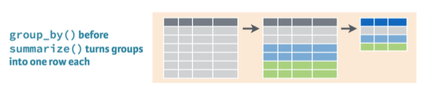

# Outline

```{r setup, include=FALSE}
library(tidyverse)
library(readxl)
library(gapminder)
library(knitr)
```

- More wrangling
  - combine functions using the pipe operator `%>%`
  - provide descriptive statistics using `summarize` and `group_by`
  
- Make small improvements to the format of our tables

---
# Set up

> **Open your RLab 3 project file**

> **Open your RLab 3 Rmd file**

> **Or download the RLab 3 Rmd on eLC and move to your project folder to use instead**

> **Add the following package in the setup code chunk**

```{r, eval=FALSE}
library(knitr)
```

> **Use "Run" menu to run all code chunks**

---
# Review

- In last R Lab, we learned:
  - Keep/remove rows using `filter`
  - Keep/remove columns using `select`
  - Create new or change existing variables using `mutate`
  - Reorder rows based on ascending or descending values of a variable using `arrange`
  - Print a sample of our data using `slice_head` or `slice_tail`

---
class: inverse, middle, center

# Combining Wrangle Verbs

---
# Pipe operator %>%

- Allows us to run multiple commands, sequentially feeding the result of the previous line of code to the next

- Makes code easier to read and write

- Keyboard shortcut is `Cmd+Shift+M` or `Ctrl+Shift+M`

.pull-left[

Prints the result

```{r, eval=FALSE}
dataset %>% 
  filter(___) %>% 
  select(___) %>% 
  mutate(___) %>% 
  arrange(___)
```
]

.pull-right[

Saves the result

```{r, eval=FALSE}
dataset <- dataset %>% 
  filter(___) %>% 
  select(___) %>% 
  mutate(___) %>% 
  arrange(___)
```
]

---
# Pipe example

Suppose I want to print a table of the top five countries with respect to percent of global GDP in 2007. Without using %>%:

```{r, eval=FALSE}
#Filter gapminder to get 2007
gapminder07 <- filter(gapminder, year == 2007)

#Add variables to gapminder07
gapminder07 <- mutate(gapminder07, 
                     gdp = gdpPercap*pop,
                     global_gdp = sum(gdp),
                     pct_gdp = (gdp/global_gdp)*100)

#Create dataset according to desired table
gdp_table <- select(gapminder07, country, pct_gdp)
gdp_table <- arrange(gdp_table, desc(pct_gdp))

#Print table
slice_head(gdp_table, n = 5)
```

---
# Pipe example

To print same table with `%>%`:

```{r, eval=FALSE}
gapminder %>% 
  filter(year == 2007) %>% 
  mutate(gdp = gdpPercap*pop,
         global_gdp = sum(gdp),
         pct_gdp = (gdp/global_gdp)*100) %>% 
  select(country, pct_gdp) %>% 
  arrange(desc(pct_gdp)) %>% 
  slice_head(n=5)
```

- Don't specify the data inside each verb because that is being piped from the first line

- Don't have to save the result each step of the way; no `gapminder07` or `gdp_table` needed.

---
# Pipe operator practice

> **Add a heading "Pipe Operator"**

> **Start a new code chunk.**

> **Use the pipe operator to save a new dataset `gapminder52` that contains only 1952 observations and add the GDP variables we created earlier (consider copy-and-paste)**

--

> **On a new line, use pipe operator to print a table of `gapminder52` that includes only `country` and `pct_gdp`, arranged in descending order and only the first 5 countries.**

---
class: inverse, middle, center

# Summarize & Group By

---
# Summarize


- Generic syntax

```{r, eval=FALSE}
summarize(data_set, "Name of column" = function(variable),
          "Name of column" = function(variable),...)
```

- Where `function` is one of many possible summary functions

- Useful for reporting a few summary stats

---
# Summarize example

Suppose I want to report median life expectancy and GDP per capita in 2007

```{r, eval=FALSE}
gapminder %>% 
  filter(year == 2007) %>% 
  summarize("Median Life Expectancy" = median(lifeExp),
            "Median GDP per Capita" = median(gdpPercap))
```

```{r, echo=FALSE}
gapminder %>% 
  filter(year == 2007) %>% 
  summarize('Median Life Expectancy' = median(lifeExp),
            'Median GDP per Capita' = median(gdpPercap)) %>% 
  kable(digits = 0,
        format.args = list(big.mark = ','))
```

---
# Summarize practice

> **Add a heading "Summarize"**

> **Start a new code chunk and name it summarize**

> **Use `gapminder52` to print a table with the `min`imum, `median`, and `max`imum for `pct_gdp` in 1952. Name columns accordingly.**

---
# Group By



- General syntax

```{r, eval=FALSE}
data_set %>% 
  group_by(grouping_variable) %>% 
  summarize(name = function(variable))
```

- Year and categorical variables are common grouping variables

---
# Group by example

Median life expectancy and GDP per capita in 2007 **by continent**

```{r, eval=FALSE}
gapminder %>% 
  filter(year == 2007) %>% 
  group_by(continent) %>% #<<
  summarize('Median Life Expectancy' = median(lifeExp),
            'Median GDP per Capita' = median(gdpPercap))
```

```{r, echo=FALSE, message=FALSE}
gapminder %>% 
  filter(year == 2007) %>% 
  group_by(continent) %>% #<<
  summarize('Median Life Expectancy' = median(lifeExp),
            'Median GDP per Capita' = median(gdpPercap)) %>% 
  kable(col.names = c('Continent','Median Life Expectancy','Median GDP per Capita'), digits = 0, format.args = list(big.mark = ','))
```

---
# Group by practice

> **Add a heading "Group By"**

> **Start a new code chunk and name it groupby.**

> **Copy and paste your code that made the summary table**

> **Change the table so it reports these summary statistics by each year**

---
# Kable options for tables

- The `kable()` function, part of the `knitr` package, helps with formatting tables.

- A few useful options:
  - `digits = #` sets the number of digits to the right of the decimal
  - `format.args = list(big.mark = ',')` inserts commas
  - `col.names = c("name","name")` renames the columns
  - `caption = "Title"` provides a table title

---
# Kable example

> **Add a heading "Formatted Table"**

> **Start a new code chunk and name it kable. Add the following code.**

```{r, eval=FALSE}
gapminder52 %>% 
  select(country, pct_gdp) %>% 
  arrange(desc(pct_gdp)) %>% 
  slice_head(n=5) %>% 
  kable(digits = 1,
        col.names = c('Country', 'Percent of Global GDP'),
        caption = 'Largest Economies in 1952')
```

---
# One more practice table

- Suppose we want to examine how life expectancy has changed over time

> **Create the best table you can that shows a reader this information**

---
# Testing AI

> **Time permitting, let's give the prompt on the previous slide to AI and see how it does.**

- How difficult was it to provide a sufficient prompt?
- Can we understand the answer?

---
# Upload Rmd

> **Let's knit our Rmd to inspect the output**

> **Upload your Rmd to eLC**


