# Objectives

- Choose appropriate graphs

- Basic guidelines of good visualization

- Create graphs and make simple improvements

```{r, include=FALSE}
library(tidyverse)
library(gapminder)
library(knitr)
```

---
class: inverse, middle, center

# Choosing Graphs

---
# Choosing graphs

Among common types of graphs, which are appropriate for visualizing the following scenarios?

- values for a categorical variable
- values of a single continuous variable
- relationship between values of two categorical variables
- relationship between values of a continuous variable and a categorical variable
- relationship between values of two continuous variable?

---
# Choosing graphs

```{r, echo=FALSE}
gap07 <- filter(gapminder, year==2007)
gapminder %>% 
  slice_head(n=5) %>% 
  kable(digits = 0)
```

Which graph could we use to show the distribution of life expectancy in these data?

---
# Choosing graphs

```{r, echo=FALSE}
gap07 %>% 
  slice_head(n=5) %>% 
  kable(digits = 0)
```

Which graph could we use to show the distribution of life expectancy by continent?

---
# Choosing graphs

```{r, echo=FALSE}
gap07 %>% 
  slice_head(n=5) %>% 
  kable(digits = 0)
```

Which graph could we use to show the average life expectancy in each continent?

---
# Choosing graphs

```{r, echo=FALSE}
gap07 %>% 
  slice_head(n=5) %>% 
  kable(digits = 0)
```

Which graph could we use to show the relationship between life expectancy and GDP per capita?

---
# Choosing graphs

```{r, echo=FALSE}
gap07 %>% 
  slice_head(n=5) %>% 
  kable(digits = 0)
```

Which graph could we use to show the number of countries in each continent?

---
# Choosing graphs

```{r, echo=FALSE}
gapminder %>% 
  slice_head(n=5) %>% 
  kable(digits = 0)
```

Which graph could we use to show the change in population over time?

---
class: inverse, middle, center

# Basic Guidelines of Good Graphs

---
# Guidelines

- Appropriate graph given variable types

- Accessible, should need minimal written explanation

- Don't distort perception

- Avoid uninformative decoration (chart junk)

---
# Example

.center[
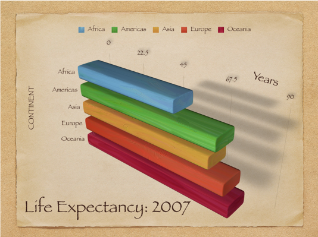
]

---
# Example

.center[
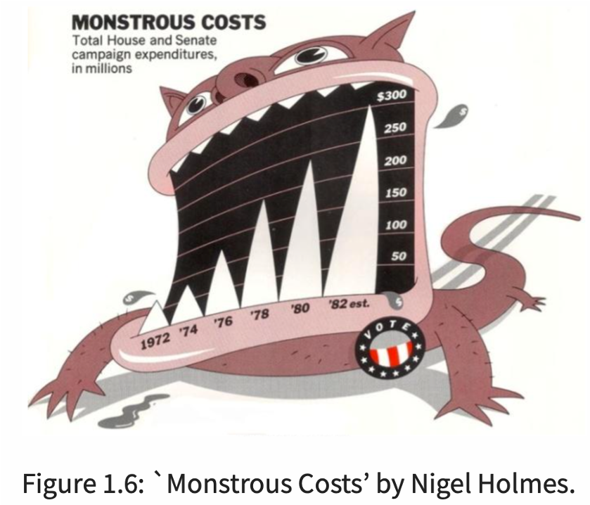
]

---
# Distortion

- Law school enrollment trend

.center[
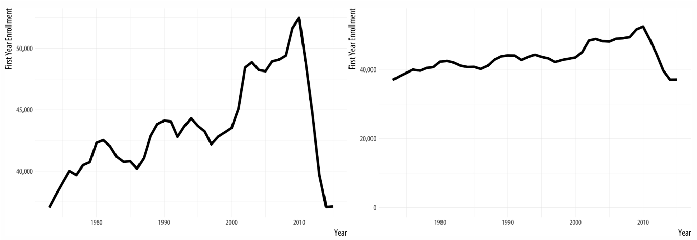
]

---
# Possible distortion

.center[
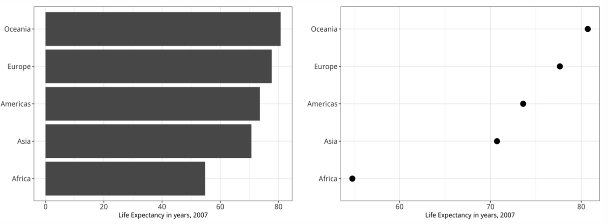
]

---
# Decoding numerical visualization

.center[
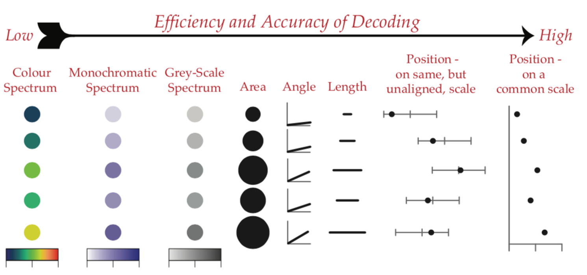
]

---
# Example

.center[
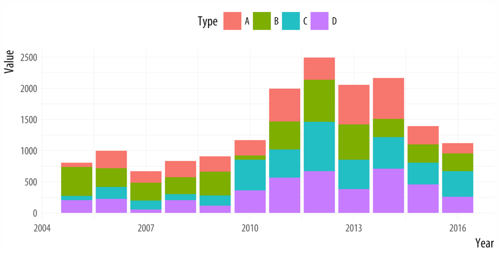
]

- Is type D greater in 2010 or 2011?

- Is type C greater in 2010 or 2011?

- Dodged bar chart usually better

---
# Decoding categorical visualization

.center[
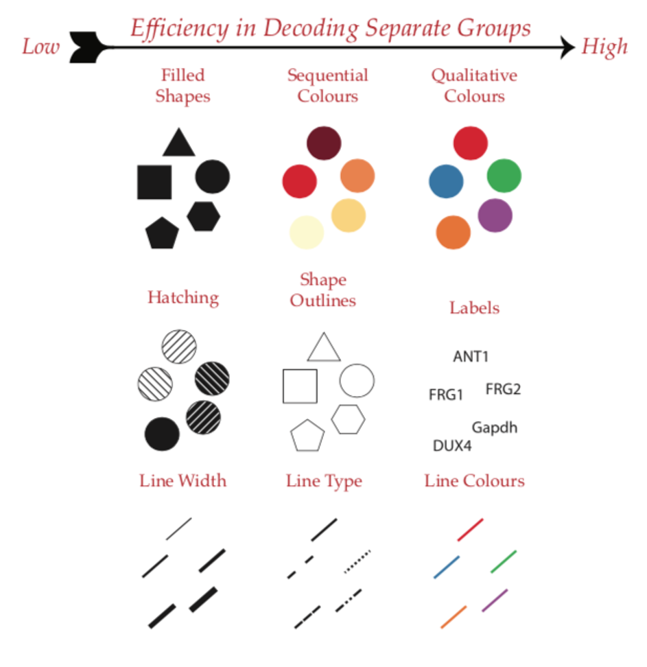
]

---
# Find the blue circle

.center[
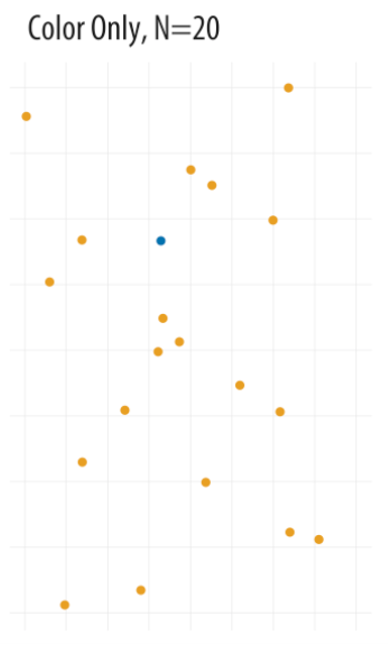
]
---
# Find the blue circle
.center[
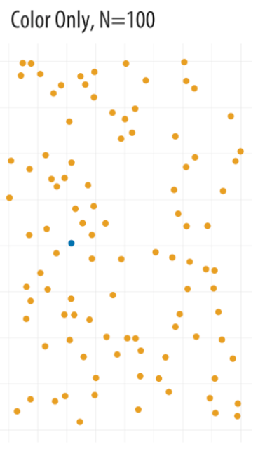
]

---
# Find the blue circle
.center[
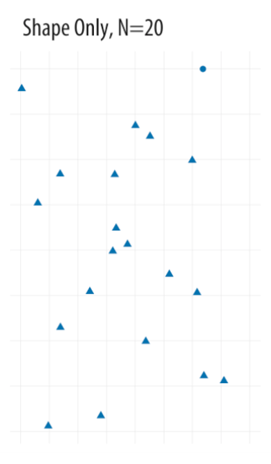
]

---
# Find the blue circle
.center[
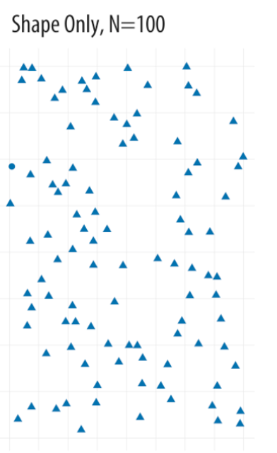
]

---
# Find the blue circle
.center[
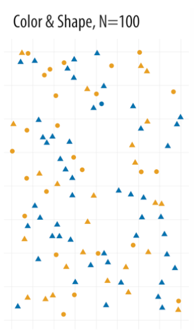
]

---
class: inverse, middle, center

# Creating Graphs

---

# Set up

> **Create a new project named "rlab5" and start new R Markdown document Change YAML and global options. Delete template.**

```{r, eval=FALSE}
---
title: "RLab5: Data Viz"
author: "Your Name"
output:
  html_document:
    theme: spacelab
    df_print: paged
    fig_width: 6.5
    fig_height: 4.5
    fig_align: "center"
---
```

---
# Setup: Packages

> **In the setup code chunk, load the following packages:**

```{r, eval=FALSE}
library(tidyverse)
```

---
# Setup: Data

> **Download the four CSV files on eLC and add to project folder:**

> **`cod_research_funding.csv` `fbi_gun_deaths.csv` `guns_manufatured.csv` `nhanes_2012.csv`**

> **Import data**


```{r, eval=FALSE}
cod_research_funding <- read_csv("cod_research_funding.csv")
fbi_gun_deaths <- read_csv("fbi_gun_deaths.csv")
guns_manufactured <- read_csv("guns_manufatured.csv")
nhanes <- read_csv("nhanes_2012.csv")
```

```{r, include=FALSE}
cod_research_funding <- read_csv('/Users/alexcombs/web-work/content/teaching/slides/labs_files/cod_research_funding.csv')
fbi_gun_deaths <- read_csv('/Users/alexcombs/web-work/content/teaching/slides/labs_files/fbi_gun_deaths.csv')
guns_manufactured <- read_csv('/Users/alexcombs/web-work/content/teaching/slides/labs_files/guns_manufactured.csv')
nhanes <- read_csv('/Users/alexcombs/web-work/content/teaching/slides/labs_files/nhanes_2012.csv')
```

---
# Grammar of graphics

- General syntax for all default graphs

```{r, eval=FALSE}
dataset %>% 
  ggplot(aes(...)) +
    geom_type()
```

- Replace `dataset` with the data in your environment
- Add `aes`thetics based on the variables and type of graph intended
- Replace `type` with the type of graph intended
- After the `ggplot` portion, each additional element should be separated by a `+`

---
# Grammar of graphics

- Many options with ggplot; virtually impossible to memorize

- The autocomplete menu that pops up is very helpful

- Can result in long chunks of code

- But easy to reproduce graphs and copy code from previous graphs to use on different data

---
# Some common options

```{r, eval=FALSE}
dataset %>% 
  ggplot(aes(...)) +
  geom_type(...) + # can add options specific to graph type
  labs(...) + # alter axis and legend labels
  scale_option(...) + # alter axis or color scales
  theme_option() + # add a prepackaged style
  theme(...) # alter any non-data component 
```

---
class: inverse, middle, center

# Single Categorical Variable

---
# Gun use in the US

- `nhanes` is survey data from over 9,000 respondents. It contains a variable `gun.use` with "Yes" or "No" indicating whether the respondent has ever used a firearm.

- Suppose we want to graph the total number of yes and no responses. Which graph should we use?

- Which `geom` function should we use? 

---
# Gun use in the US

> **Create the following graph**

```{r, echo=FALSE}
nhanes %>% 
  ggplot(aes(x = gun.use)) +
  geom_bar()
```

---
# Gun use in the US

- Common to have `NA` in survey data. Usually okay to drop these for graphs.

> **Insert `drop_na(gun.use)` prior to using the `ggplot` function**

> **Re-run graph**

```{r, eval=FALSE, echo=FALSE}
nhanes %>% 
  drop_na(gun.use) %>% 
  ggplot(aes(x = gun.use)) +
  geom_bar()
```

---
# Exporting graphs

- RStudio saves your most recent graph in its memory for exporting

- To export most recent graph

```{r, eval=FALSE}
ggsave("filename.png") # or any image file extension like jpeg
```

> **Export the most recent graph you made as a PNG file**

---
# Axis labels

- You can add labels with the general code

```{r, eval=FALSE}
labs(x = "Whatever", y = "Whatever")
```

- should correspond with the parts in the `aes` function

> **Add axis labels to the gun use graph**

```{r, eval=FALSE, echo=FALSE}
nhanes %>% 
  drop_na(gun.use) %>% 
  ggplot(aes(x = gun.use)) +
  geom_bar() +
  labs(x = 'Gun use', y = 'Number of respondents')
```

---
# Gun use in the US

- **Change graph "ink" using `theme_...()` such as `theme_minimal()`**

```{r, eval=FALSE}
nhanes %>% 
  drop_na(gun.use) %>% 
  ggplot(aes(x = gun.use)) +
  geom_bar() +
  labs(x = 'Gun use', y = 'Number of respondents') +
  theme_minimal() #<<
```

---
# Gun use in the US

- Can add color according to values of a variable using `fill=variable`

- **Fill bars with different colors**

```{r, eval=FALSE}
nhanes %>% 
  drop_na(gun.use) %>% 
  ggplot(aes(x = gun.use, fill = gun.use)) + #<<
  geom_bar() +
  labs(x = 'Gun use', y = 'Number of respondents') +
  theme_minimal()
```

---
# Gun use in the US

- Can manually control colors using `scale_fill_manual(...)`

> **Add following code to alter colors**

```{r, warning=FALSE, eval=FALSE}
nhanes %>% 
  drop_na(gun.use) %>% 
  ggplot(aes(x = gun.use, fill = gun.use)) +
  geom_bar() +
  scale_fill_manual(values = c('grey', 'steelblue'), guide = "none") + #<<
  labs(x = 'Gun use', y = 'Number of respondents') +
  theme_minimal()
```

---
# Gun use in the US

- Can alter data inside graph using `after_stat()` inside `aes`

> **In new code chunk, create another bar chart displaying percent**

```{r, eval=FALSE}
nhanes %>% 
  drop_na(gun.use) %>% 
  ggplot(aes(x = gun.use, 
             y = after_stat(100*(count)/sum(count)), #<<
             fill = gun.use)) +
  geom_bar() +
  scale_fill_manual(values = c('grey', 'steelblue'), guide = "none") +
  labs(x = 'Gun use', y = 'Percent of respondents') +
  theme_minimal()
```

---
# Skill check

> **Create another bar chart for respondent's `sex` in the `nhanes` data. Make the bars different colors and display percentages rather than counts.**

---
class: inverse, middle, center

# Single Continuous Variable

---
# Cause of death research funding

- The `cod_research_funding` data contains a variable `funding` that is continuous.

- Suppose we want to graph the distribution of `funding`. Which graph should we use?

--

- Which `geom_...()` function should we use?

---
# COD research funding

> **Try to create the following graph (color need not match)**

```{r, echo=FALSE, message=FALSE, fig.height=4}
cod_research_funding %>% 
  ggplot(aes(x = funding)) +
  geom_histogram(fill = 'springgreen4', color = 'black') +
  labs(y = 'Causes of Death', x = 'Research funding, 2004-2015') +
  theme_minimal()
```

---
# Adjusting bins or binwidth

- RStudio sometimes suggests we adjust `bins` or `binwidth`

- Default is 30 bins. This is too many for 30 observations.

> **Let's adjust the number of bins to 10**

---
# Adjusting bins or binwidth

```{r, eval=FALSE}
cod_research_funding %>% 
  ggplot(aes(x = funding)) +
  geom_histogram(bins = 10, #<<
                 fill = 'springgreen4', color = 'black') +
  labs(y = 'Causes of Death', x = 'Research funding, 2004-2015') +
  theme_minimal()
```

---
# Dealing with large values

- R will display large numbers in scientific notation

- We can turn this off during an RStudio session

> **Add the following to your setup code chunk and run it. Then, rerun your histogram.**

```{r}
options(scipen = 999)
```

---
# Dealing with large values

```{r, echo=FALSE}
cod_research_funding %>% 
  ggplot(aes(x = funding)) +
  geom_histogram(bins = 10, #<<
                 fill = 'springgreen4', color = 'black') +
  labs(y = 'Causes of Death', x = 'Research funding, 2004-2015') +
  theme_minimal()
```

---
# Dealing with large values

- x-axis is overcrowded with unnecessary zeros

- What can we do to the `funding` variable so the x-axis shows 5, 10, 15, and 20?

> **Change code accordingly**

---
# Dealing with large values

```{r, echo=FALSE}
cod_research_funding %>% 
  ggplot(aes(x = funding/1000000000)) +
  geom_histogram(bins = 10, #<<
                 fill = 'springgreen4', color = 'black') +
  labs(y = 'Causes of Death', x = 'Research funding, 2004-2015 (billions of dollars)') +
  theme_minimal()
```

---
# COD research funding

- What is another option for graphing the distribution of a single continuous variable that also shows certain descriptive statistics?

> **In a new code chunk, copy-and-paste the code you used to make the last histogram. Change the code to create this other graph.**

---
# COD research funding

```{r, echo=FALSE}
cod_research_funding %>% 
  ggplot(aes(x = funding/1000000000)) +
  geom_boxplot(fill = 'springgreen4', color = 'black') +
  labs(x = 'Research funding, 2004-2015 (billions of dollars)') +
  theme_minimal()
```

---
class: inverse, middle, center

# Graphing Two Variables

---
# Combination of variable type

- Two categorical: 
  - Stacked bar chart 
  - Grouped/dodged bar chart

- One categorical, one numeric: 
  - Bar chart that displays total by category
  - Bar chart or point chart displaying summary stat by category
  - Overlapping histograms by category
  - Boxplots by category

- Two numeric:
  - Scatterplot
  - Line graph

---
# Stacked bar chart

> **In a new code chunk, copy-and-paste code that created the bar chart displaying gun use percentages**

> **Try changing the code to produce a graph with respondent's sex along the x axis**

```{r, echo=FALSE, message=FALSE, warning=FALSE, fig.height=4}
nhanes %>% 
  drop_na(gun.use) %>% 
  ggplot(aes(x = sex, 
             y = after_stat(100*(count)/sum(count)),
             fill = gun.use)) +
  geom_bar() +
  scale_fill_manual(values = c('grey', 'steelblue')) +
  labs(x = 'Sex', y = 'Percent of respondents', fill = 'Gun use') +
  theme_minimal()
```

---
# Grouped/dodged bar chart

> **Find the line in your code `geom_bar()`**

> **Change to `geom_bar(position = "dodge")`**

> **Re-run code**

---
# Grouped/dodged bar chart

```{r, echo=FALSE, fig.height=4}
nhanes %>% 
  drop_na(gun.use) %>% 
  ggplot(aes(x = sex, 
             y = after_stat(100*(count)/sum(count)),
             fill = gun.use)) +
  geom_bar(position = "dodge") +
  scale_fill_manual(values = c('grey', 'steelblue')) +
  labs(x = 'Sex', y = 'Percent of respondents', fill = 'Gun use') +
  theme_minimal()
```

- Note percentages add to 100 across all respondents, not within each sex

---
# Barchart by category

- `fbi_gun_deaths` data contain `number` of annual homicides by `weapons` for `year`s 2012-2016

- Let's create a bar chart of `number` by `weapons` for `year` 2016

> **Start a new code chunk**

```{r, eval=FALSE}
fbi_gun_deaths %>% 
  ___(___) %>%    #<< what goes here?
  ggplot(aes(___)) +
    geom____()
```

---
# Barchart by category

- Each cell contains the value we want to use as the height of the bar. No adding across rows needed.

- Which `geom` do we use in this case, `geom_bar()` or `geom_col()`?

> **Add this to the code chunk**

---
# Barchart by category

- Need to fill in the `aes`thetic

- Which variable should map to which axis?

> **Complete the code and run**

---
# Barchart by category

```{r, echo=FALSE, fig.height=4}
fbi_gun_deaths %>% 
  filter(year==2016) %>%
  ggplot(aes(x = number, y = weapons)) +
  geom_col()
```

- Can fill each bar with different color, add labels, and change theme just like before

---
# Barchart by category

> **Add `fill=weapons` inside `aes()` and re-run**

--

> **Change `y=weapons` to `y = reorder(weapons, number)` and re-run**

---
# Barchart by category

```{r, echo=FALSE}
fbi_gun_deaths %>% 
  filter(year==2016) %>%
  ggplot(aes(x = number, y = reorder(weapons, number), fill = weapons)) +
  geom_col() +
  scale_fill_discrete(guide="none") +
  labs(y = "Gun type", x = "Number of homicides, 2016") +
  theme_minimal()
```

---
# Boxplots by category

- Useful for showing the distribution of a numeric variable by levels of a categorical variable

- Suppose we wanted to display the distribution of homicides 2012-2016 for each weapon

> **In a new code chunk, copy-and-paste the code you used to create the previous bar chart**

- How should we change this code to get boxplots by weapon?

> **Make these changes and run code**

---
# Boxplots by category

```{r, echo=FALSE}
fbi_gun_deaths %>% 
  ggplot(aes(x = number, y = reorder(weapons, number), fill = weapons)) +
  geom_boxplot() +
  scale_fill_discrete(guide="none") +
  labs(y = "Gun type", x = "Annual homicides, 2012-2016") +
  theme_minimal()
```

---
# Scatterplot

- Association between two numeric variables, especially continuous variables

- Discrete variables may cause points on scatterplot to be overcrowded

- Suppose we wanted to explore the association between `mortality_rate_per_100k` and research `funding` in the `cod_research_funding` data

> **Add new code chunk and complete code**

```{r, eval=FALSE}
cod_research_funding %>% 
  ___(___(___)) +
  ___()
```

---
# Dealing with skewed variables

```{r, eval=FALSE, message=FALSE}
cod_research_funding %>% 
  ggplot(aes(x = mortality_rate_per_100k, y = funding)) +
  geom_point() +
  geom_smooth(method = 'lm') +
  scale_x_log10() + #<<
  scale_y_log10() #<<
```

---
# Line graph

- Useful for plotting change in numeric variable over time

- Suppose we want to graph `num_guns` manufactured over `Year`s by `gun_type` using the `guns_manufactured` data

> **In new code chunk, complete code below and run**

```{r, eval=FALSE}
guns_manufactured %>% 
  ___(___(___)) +
  ___()
```

```{r, eval=FALSE, echo=FALSE}
guns_manufactured %>% 
  ggplot(aes(x = Year, y = num_guns, color = gun_type)) +
  geom_line()
```

---
# Upload lab

- Upload your Rmd to eLC.
