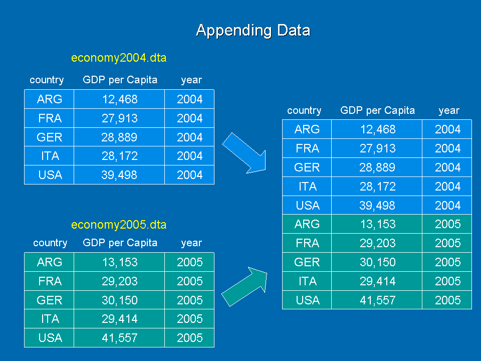
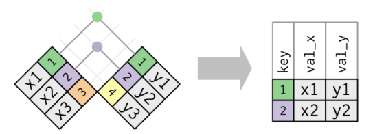
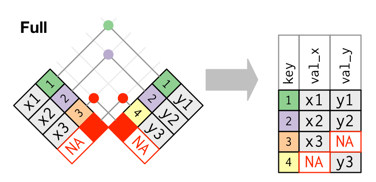

# Objectives

- Learn to perform two most common tasks for combining data

  - Append
  - Left join

---
# Set up

> **Create a new project named "rlab6" and start new R Markdown document. Change YAML and global options. Delete template.**

```{r, eval=FALSE}
---
title: "RLab 6: Combining Data"
author: "Your Name"
output:
  html_document:
    df_print: kable
---
```

---
# Setup

> **Load the following packages**

```{r, eval=FALSE}
library(tidyverse)
```

```{r, include=FALSE}
library(tidyverse)
```

---
# Download & Import Data

> **Download the `st_fin_2014.csv`, `st_fin_2015.csv`, `st_fin_2016.csv`, `covid_ga_5.csv` and `ga_county_pop.csv` files from eLC and add them to your project folder.**

> **In your setup code chunk, import the data files using the following code.**

```{r, eval=FALSE}
st_fin_2014 <- read_csv("st_fin_2014.csv")
st_fin_2015 <- read_csv("st_fin_2015.csv")
st_fin_2016 <- read_csv("st_fin_2016.csv")
covid_ga_5 <- read_csv("covid_ga_5.csv")
ga_county_pop <- read_csv("ga_county_pop.csv")
```

```{r, include=FALSE}
st_fin_2014 <- read_csv("labs_files/st_fin_2014.csv")
st_fin_2015 <- read_csv("labs_files/st_fin_2015.csv")
st_fin_2016 <- read_csv("labs_files/st_fin_2016.csv")
covid_ga_5 <- read_csv("labs_files/covid_ga_5.csv")
ga_county_pop <- read_csv("labs_files/ga_county_pop.csv")
```

---
# Append

- Stacking observations of two or more datasets that have common variables with exactly the same name. 

- Example: Adding multiple time periods together of the same data that is released annually.




---
# Append Example

```{r, include=FALSE}
library(gapminder)

gapminder07 <- gapminder %>% 
  filter(year == 2007) %>% 
  select(country, year, gdpPercap)

gapminder02 <- gapminder %>% 
  filter(year == 2002) %>% 
  select(country, year, gdpPercap)

gapminder97 <- gapminder %>% 
  filter(year == 1997) %>% 
  select(country, year, gdpPercap)
```

- Suppose I need to append three datasets with same layout

--

```{r}
glimpse(gapminder07)
glimpse(gapminder02)
```

---
# Append Example

```{r}
glimpse(gapminder97)
```

---
# Append Example

- To append, all we need to do is `bind` the `rows` of each dataset using the `bind_rows` function

- General syntax

```{r, eval=FALSE}
new_dataset <- bind_rows(dataset1, dataset2, ...)
```

---
# Append Example

```{r}
gapminder97_07 <- bind_rows(gapminder97, gapminder02, gapminder07)

glimpse(gapminder97_07)
```

- There are now 426 rows in the new dataset (3 x 142)

---
# Append Practice

> **Immediately below your setup code chunk, insert a heading "Append"**

- You have three `st_fin_year` datasets with the same layout

> **Append them to create a new dataset `st_fin_2014_2016`**

```{r, include=FALSE}
st_fin_2014_2016 <- bind_rows(st_fin_2016, st_fin_2015, st_fin_2014)
```

---
# Append Practice

> **Start a new code chunk and use `glimpse` to confirm it worked**

```{r, eval=FALSE}
glimpse(st_fin_2014_2016)
```

- You should have 150 observations (3 years X 50 states)

- Now we can explore things like changes in state finances over time

---
class: inverse, middle, center

# Left joining data

---
# County COVID Data

- Let's view the `covid_ga_5` data

- These come from *New York Time's* daily COVID data [here](https://github.com/nytimes/covid-19-data)

- *NYT* discontinued collecting local data on March 23, 2023 and now uses weekly CDC data

- Our `covid_ga_5` data contain their last counts of cumulative COVID cases and deaths for 5 Georgia counties

---
# County comparison

> **Insert a heading "Left Join"**

- Suppose we want to compare cumulative cases as of 3/23/2023 across these 5 counties.

> **Generate a bar graph using the following code.**

```{r,eval=FALSE,fig.width=4, fig.height=8, fig.align='center'}
covid_ga_5 %>% 
  ggplot(aes(x = county, y = cases)) +
  geom_col()
```

> **Make another bar graph for deaths**

---
# County comparison

- Cases

```{r,echo=FALSE,fig.width=8, fig.height=6, fig.align='center'}
covid_ga_5 %>% 
  ggplot(aes(x = county, y = cases)) +
  geom_col()
```

---
# County comparison

- Deaths

```{r,echo=FALSE,fig.width=8, fig.height=6, fig.align='center'}
covid_ga_5 %>% 
  ggplot(aes(x = county, y = deaths)) +
  geom_col()
```

---
# County comparison

- Why are these county comparisons misleading?

---
# County comparison

- We haven't adjusted for county population.

- Therefore, we need to compute rates; cases and/or deaths per some standard number of people. 

- But the raw data do not include county population

- We need to `left_join` county population data to the COVID data

---
# Left Joins

- A left join is used when we want to add variables from a secondary dataset to our primary dataset, matching observations based on a common set of variables called the **key**

- Keeps **ALL** of the observations in our main dataset regardless of whether there is a match in the secondary dataset

- Observations in the secondary dataset that don't match with the main dataset **are not** added


---
# The Key to Joins/Merges

- The **key** is the variable or set of variables that uniquely identifies each observation/row that is shared across the datasets you want to join.

- If you can identify the unit of analysis in both datasets, you have identified the key to use for joins

- Datasets must have the same key in order to join them

- The key does not need to have the same variable name(s) across datasets

---
# General Syntax of Left Joins

- If a single variable is the key and named the same across datasets

```{r, eval=FALSE}
new_dataset <- name_of_left_dataset %>% 
  left_join(name_of_right_dataset, 
            by = "name_of_key")
```

--

-  If multiple variables of the same name are the key

```{r, eval=FALSE}
new_dataset <- name_of_left_dataset %>% 
  left_join(name_of_right_dataset, 
            by = c("name_of_key1", "name_of_key2", ...)) #<<
```

---
# General Syntax of Left Joins

- If one variable is the key and named differently across datasets

```{r, eval=FALSE}
new_dataset <- name_of_left_dataset %>% 
  left_join(name_of_right_dataset, 
            by = c("key_in_left_data" = "key_in_right_data")) #<<
```

--

- If multiple variables are the key and at least one is named differently

```{r, eval=FALSE}
new_dataset <- name_of_left_dataset %>% 
  left_join(name_of_right_dataset, 
            by = c("key_in_left_data" = "key_in_right_data", #<<
                   "common_key", ...)) #<<
```

---
# General Syntax to Left Joins

- Suppose I want to join several datasets to a main dataset. Some have same name for key and some don't.

```{r, eval=FALSE}
new_dataset <- name_of_left_dataset %>% 
  left_join(right1_dataset, by = "name_of_key") %>% 
  left_join(right2_dataset, by = c("key_in_left" = "key_in_right2")) %>% 
  left_join(right3_dataset, by = "name_of_key")
```

---
# Left Join Example

- Suppose I want to add population to the `gapminder97_07` that I appended earlier

```{r}
glimpse(gapminder97_07)
```

---
# Left Join Example

- Suppose I could find population data for only the U.S.

```{r, include=FALSE}
gap_pop_US <- gapminder %>% 
  select(country, year, pop) %>% 
  filter(country == "United States")
```

```{r}
glimpse(gap_pop_US)
```

- Note that there are only 12 observations in `gap_pop_US`, not 426 as in `gapminder97_07`

---
# Left Join Example

- First step is to identify the key(s) for `gapminder97_07` and `gap_pop_US`

- `country` AND `year`

- They are named the same across both datasets as well, so...

--

```{r}
gap_pop_97_07 <- gapminder97_07 %>% 
  left_join(gap_pop_US, 
            by = c('country', 'year'))
glimpse(gap_pop_97_07)
```

---
# Left Join Practice

- You imported `ga_county_pop` earlier

- These data include total county population for 2019 from the US Census

---
# Left Join Practice

- Which variable(s) is(are) the key for joining the two datasets?

```{r}
glimpse(ga_county_pop)
glimpse(covid_ga_5)
```

---
# Variable Type Mismatch

- Before using a key to join data, make sure they are stored as the same type of variable in both datasets

- The glimpse output tells us how each variable is stored. Is the key stored differently across the two datasets?

--

- For example, if `county` was stored as a factor variable in `covid_ga_5` and as a character variable in `ga_county_pop`, we could change county to factor in `ga_county_pop` like so.

```{r, eval=FALSE}
ga_county_pop$county <- as.factor(ga_county_pop$county)
```

---
# Left Join Practice

- Which data set makes the most sense as our "left" dataset? 

> **Left join the two datasets, overwriting `covid_ga_5`.**

```{r, include=FALSE}
covid_ga_5 <- covid_ga_5 %>% 
  left_join(ga_county_pop, by = 'county')
```

```{r, eval=FALSE}
covid_ga_5 <- covid_ga_5 %>% 
  ___(___, ___ = '___')
```

---
# Left Join Practice

> **Use `glimpse` on our updated data**

```{r}
glimpse(covid_ga_5)
```

---
# Adjusting for Population

> **Insert a new code chunk below the left join that added population to `covid_ga_5`. Add three new variables: `pop100K`, `cases_rate`, and `deaths_rate`.**

```{r, eval=FALSE}
covid_ga_5 <- covid_ga_5 %>% 
  ___(pop100K = ___,
      cases_rate = ___, 
      deaths_rate = ___)
```

```{r, include=FALSE}
covid_ga_5 <- covid_ga_5 %>% 
  mutate(pop100K = population/100000,
         cases_rate = cases/pop100K, 
         deaths_rate = deaths/pop100K)
```

---
# Update bar graphs

> **Add a new code chunk. Copy-and-paste bar graph code. Modify the code to include new variables.**

---
# Updated bar graphs

```{r,echo=FALSE,fig.width=8, fig.height=6, fig.align='center'}
covid_ga_5 %>% 
  ggplot(aes(x = county, y = cases_rate)) +
  geom_col()
```

---
# Updated bar graphs

```{r,echo=FALSE,fig.width=8, fig.height=6, fig.align='center'}
covid_ga_5 %>% 
  ggplot(aes(x = county, y = deaths_rate)) +
  geom_col()
```

---
# Upload

> **Upload your Rmd to eLC.**

---
# Other types of joins

- Inner join keeps only observations where the key matches



- Replace `left_join` with `inner_join` in any of the previous examples

---
# Other types of joins

- Full join keeps all observations in both datasets regardless of match



- Replace `left_join` with `full_join` in any of the examples