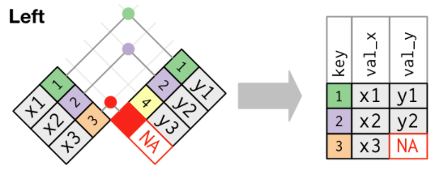

# Objectives

- Learn to perform most common combining data tasks

  - Append
  - Left join

---

# Setup

> **Start a new project, "rlab7".**
  
> **Copy or move your RLab5 Rmd to your RLab7 project folder. Change file name to "rlab7_lastname".**

> **Change YAML to:**

```{r, eval=FALSE}
---
title: "RLab7: Combining Data" #<<
author: "Your Name"
output:
  html_document:
    df_print: paged
---
```

---
# Setup

> **Reload the packages that should already be in your Rmd:**

```{r, eval=FALSE}
library(tidyverse)
library(data.table)
library(lubridate)
```

```{r, include=FALSE}
library(data.table)
library(tidyverse)
library(lubridate)

covid <- fread('https://raw.githubusercontent.com/nytimes/covid-19-data/master/us-counties.csv')

covid_ga <- covid %>% 
  filter(state == 'Georgia')

covid_ga$date <- ymd(covid_ga$date)

yesterday <- '2020-01-29'

#covid_ga$county <- as.factor(covid_ga$county)
```

---
# Download & Import Data

> **Download the `st_fin_2014.csv`, `st_fin_2015.csv`, `st_fin_2016.csv`, and `ga_county_pop.csv` files from eLC and add them to your project folder.**

> **In your setup code chunk, import the four data files.**

```{r, eval=FALSE}
st_fin_14 <- 
st_fin_15 <- 
st_fin_16 <- 
ga_county_pop <- 
```

```{r, eval=FALSE, include=FALSE}
st_fin_14 <- read_csv("st_fin_2014.csv")
st_fin_15 <- read_csv("st_fin_2015.csv")
st_fin_16 <- read_csv("st_fin_2016.csv")
```

```{r, include=FALSE}
st_fin_14 <- read_csv("labs_files/st_fin_2014.csv")
st_fin_15 <- read_csv("labs_files/st_fin_2015.csv")
st_fin_16 <- read_csv("labs_files/st_fin_2016.csv")
```

---
# Append

- Stacking observations among two or more datasets with **identical** layout. 

- Example: Adding multiple time periods together of the same data that is released annually.


---
# Excel Append

- Let's try the combinations today using Excel to compare and better visualize what we are trying to do in R
  
> **Download and open the "gapminder_joins.xlsx" file on eLC.**

--

- First three tabs contain gapminder data for three different years.

> **Append the three years into the fourth tab `4.gap97_07`.

---
# Append

- Appending is simple to do in something like Excel but can become tedious if you need to append many datasets

- And like always, Excel doesn't allow the process to be replicated

- R can append datasets with much less effort

---
# Append Example

```{r, include=FALSE}
library(gapminder)

gapminder07 <- gapminder %>% 
  filter(year == 2007) %>% 
  select(country, year, gdpPercap)

gapminder02 <- gapminder %>% 
  filter(year == 2002) %>% 
  select(country, year, gdpPercap)

gapminder97 <- gapminder %>% 
  filter(year == 1997) %>% 
  select(country, year, gdpPercap)
```

- Suppose I need to append three datasets with same layout

--

```{r}
glimpse(gapminder07)
glimpse(gapminder02)
```

---
# Append Example

```{r}
glimpse(gapminder97)
```

---
# Append Example

- To append, all we need to do is `bind` the `rows` of each dataset using the `bind_rows` function

- General syntax

```{r, eval=FALSE}
new_dataset <- bind_rows(dataset1, dataset2, ...)
```

---
# Append Example

```{r}
gapminder97_07 <- bind_rows(gapminder97, gapminder02, gapminder07)

glimpse(gapminder97_07)
```

- Note that there are now 426 rows in the new dataset (3 x 142)

---
# Append Practice

- You have three `st_fin` datasets with the same layout

> **Append them to create a new dataset `st_fin_14_16`**

```{r, include=FALSE}
st_fin_14_16 <- bind_rows(st_fin_16, st_fin_15, st_fin_14)
```

---
# Append Practice

> **Use `glimpse` to confirm it worked**

```{r, eval=FALSE}
glimpse(st_fin_14_16)
```

- You should have 150 observations (3 years X 50 states)

- Now we can explore things like changes in state finances over time

---
class: inverse, middle, center

# Left joining data

---
# Where to add code

- Now we're ready to add data to the `covid_ga` data from the previous lab in order to make better comparisons across counties.

- We need to add code chunks that add these data *before* we start making graphs

> **Find the point in your Rmd where you finished preparing `covid_ga` and before making the first visualization. Add a new code chunk here.**

---
# Left Joins

- A left join is used when we want to add variables from a secondary dataset to our primary dataset, matching observations based on a common set of variables called the **key**

- Keeps **ALL** of the observations in our main dataset regardless of whether there is a match in the secondary dataset

- Observations in the secondary dataset that don't match with the main dataset **are not** added



---
# Excel Comparison

- The fifth tab in our Excel file, `gap_pop_US`, supposes we could only find population data for the US from 1952-2007 in intervals of 5 years.

- Suppose `gap97_07` is our primary dataset

> **Use the `gap_USpop_leftjoin` sheet to left join the `gap_pop_US` data to the the `gap97_07` data**

---
# Excel Comparison

- This left join was manageable because it did not involve much data in the secondary dataset

- Quickly becomes untenable if there were more data we needed to match to the primary dataset

---
# The Key to Joins/Merges

- The **key** is the variable or set of variables that uniquely identifies each observation/row that is shared across the datasets you want to join.

- If you can identify the unit of analysis in both datasets, you have identified the key to use for joins

- Datasets must have the same key in order to join them

- The key does not need to have the same variable name(s) across datasets

---
# General Syntax of Left Joins

- If a single variable is the key and named the same across datasets

```{r, eval=FALSE}
new_dataset <- name_of_left_dataset %>% 
  left_join(name_of_right_dataset, 
            by = "name_of_key")
```

--

-  If multiple variables of the same name are the key

```{r, eval=FALSE}
new_dataset <- name_of_left_dataset %>% 
  left_join(name_of_right_dataset, 
            by = c("name_of_key1", "name_of_key2", ...)) #<<
```

---
# General Syntax of Left Joins

- If one variable is the key and named differently across datasets

```{r, eval=FALSE}
new_dataset <- name_of_left_dataset %>% 
  left_join(name_of_right_dataset, 
            by = c("key_in_left_data" = "key_in_right_data")) #<<
```

--

- If multiple variables are the key and at least one is named differently

```{r, eval=FALSE}
new_dataset <- name_of_left_dataset %>% 
  left_join(name_of_right_dataset, 
            by = c("key_in_left_data" = "key_in_right_data", #<<
                   "common_key", ...)) #<<
```

---
# General Syntax to Left Joins

- Suppose I want to join several datasets to a main dataset. Some have same name for key and some don't.

```{r, eval=FALSE}
new_dataset <- name_of_left_dataset %>% 
  left_join(right1_dataset, by = "name_of_key") %>% 
  left_join(right2_dataset, by = c("key_in_left" = "key_in_right2")) %>% 
  left_join(right3_dataset, by = "name_of_key")
```

---
# Left Join Example

- Suppose I want to add population to the `gapminder97_07` that I appended earlier

```{r}
glimpse(gapminder97_07)
```

---
# Left Join Example

- Suppose I could find population data for only the U.S.

```{r, include=FALSE}
gap_pop_US <- gapminder %>% 
  select(country, year, pop) %>% 
  filter(country == "United States")
```

```{r}
glimpse(gap_pop_US)
```

- Note that there are only 12 observations in `gap_pop_US`, not 426 as in `gapminder97_07`

---
# Left Join Example

- What is the key for `gapminder97_07` and `gap_pop_US`?

--

- `country` AND `year`
- They are named the same across both datasets as well, so...

--

```{r}
gap_pop_97_07 <- gapminder97_07 %>% 
  left_join(gap_pop_US, 
            by = c('country', 'year'))
glimpse(gap_pop_97_07)
```

---
# Left Join Practice

- You imported `ga_county_pop` earlier

- These data include total county population for 2019 from the US Census

```{r, include=FALSE}
ga_county_pop <- read_csv('labs_files/ga_county_pop.csv')
```

```{r}
glimpse(ga_county_pop)
```

- What is the variable name(s) of the key between `covid_ga` and `ga_county_pop`?

--

- `county` (not ideal to match using text but it's all we have)

---
# Variable Type Mismatch

- Before using a key to join data, make sure they are stored as the same type of variable in both datasets

- How is `county` stored in `covid_ga` and `ga_county_pop`?

> **If different, convert the type of one to match the type in the other dataset.**

```{r, include=FALSE, eval=FALSE}
ga_county_pop$county <- as.factor(ga_county_pop$county)
```

---
# Left Join Practice

> **Now we are ready to join `ga_county_pop` to `covid_ga`. Give it a shot. Overwrite `covid_ga` instead of creating a new dataset.**

```{r, include=FALSE}
covid_ga <- covid_ga %>% 
  left_join(ga_county_pop, by = 'county')
```

> **Use `glimpse` on our updated dataset**

```{r}
glimpse(covid_ga)
```

---
# Recap

- In one chunk of code, we had R merge each county's population to all of the rows for that county in our COVID data

- We are now ready to compute normalized rates and visualize comparisons

- We will continue this project in the next lab

> **Upload your Rmd to eLC. You do not need to upload what you did in the Excel file.**

---
# Other types of joins

- Inner join keeps only observations where the key matches


- Replace `left_join` with `inner_join` in any of the previous examples

---
# Excel Comparison

- The sheet `gap_le_americas` supposes we could find life expectancy data for only North and South American countries between 1952-2007.

> **Using the `gap_97_07_innerjoin` sheet, try to carry out an inner join between `gap_le_americas` data and the data in the `gap_USpop_leftjoin` sheet.**

- Remember, the result should contain only the observations for which there is a match between both datasets.

---
# Other types of joins

- Full join keeps all observations in both datasets regardless of match


- Replace `left_join` with `full_join` in any of the examples