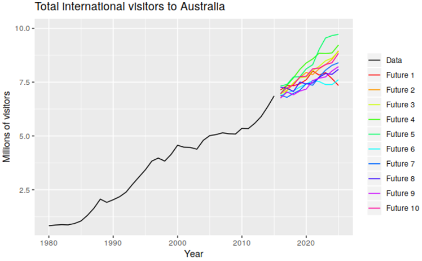

# Set-up

```{r, include=FALSE}
library(tidyverse)
library(forecast)
library(fpp2)
library(knitr)
```

- Start a new project and notebook

- Change YAML

```{r, eval=FALSE}
---
title: "RLab 10: Forecasting"
author: "Your Name"
output: 
  html_document:
    theme: spacelab
    df_print: paged
---
```

---
# Set-up

- Download the follwing data available on eLC

```{r, eval=FALSE}
load("sales.RData")
load("voting.RData")
```

```{r, include=FALSE}
load("labs_files/sales.RData")
load("labs_files/voting.RData")
```

---
# Packages

- Remember to set `include=FALSE`

```{r, eval=FALSE}
library(tidyverse)
library(forecast)
library(fpp2)
```

---
# Learning objectives

By the end of this lab, you will have learned how to...

- Convert a dataset to a time series dataset in R
- Explore time series for patterns
- Execute some simple forecasting models like naive, average, and (seasonal) trend
- Execute exponential smoothing
- Exucute a regression-adjusted forecast
- Evaluate and choose between forecast models

---
# Forecasts

```{r, echo=FALSE, fig.align='center'}
include_graphics('labs_files/hurricaneforecast.png')
```

---
# Forecasts

```{r, echo=FALSE, fig.align='center'}
include_graphics('labs_files/hurricanespag.png')
```

---
# Forecasts

```{r, echo=FALSE, fig.align='center'}

```

---
# Forecasts

```{r, echo=FALSE, fig.align='center'}
include_graphics('labs_files/tourismforecast.png')
```

---
# Steps of forecasting

1. Preliminary/exploratory analysis
2. Choosing and fitting models
3. Using and evaluating a forecasting model

---
# Creating a TS object

- Before starting prelim analysis, we need to prep data
- The below code converts the `voting` data to a new TS object.

```{r}
voting_ts <- ts(voting[,-1], start = 1912, end = 2016, frequency = 0.25)
```

5. Convert the `sales` data to a new TS object.

```{r, eval=FALSE}
sales_ts <- 
```

```{r, include=FALSE}
sales_ts <- ts(sales[,-1], start = 1981, end = 2005, frequency = 4)
```