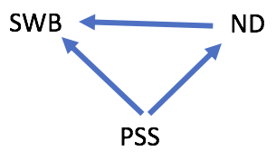
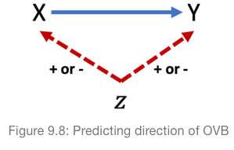

# Objectives

By the end of this lab, you will have learned how to...

- Compare two models on the basis of their omitted variable bias
- Hypothesize the direction of omitted variable bias

```{r, include=FALSE}
library(tidyverse)
library(moderndive)
library(knitr)
```

---
# Set-up

> **Start a new project and Rmd**

> **Change YAML**

```{r, eval=FALSE}
---
title: "RLab 6: Omitted Variable Bias"
author: "Your Name"
output: 
  html_document:
    theme: spacelab
    df_print: paged
---
```

---
# Set-up

> **Download `predicting_happiness.csv` from eLC and import into RStudio**

```{r, include=FALSE}
load('labs_files/predicting_happiness.RData')
```

> **Load following packages**

```{r, eval=FALSE}
library(tidyverse)
library(moderndive)
```

---
# Introduction

- Governments generally want citizens to be happy. 

- Suppose we are government officials interested in whether citizens' social network diversity affects their happiness. Perhaps we have concerns about isolation during the pandemic.

---
# Data

.pull-left[
```{r}
head(predicting_happiness, n = 4) %>% 
  kable()
```
]

.pull-right[
- Subjective Well Being (SWB) - individual's own level of happiness from 0 to 40.
- Network Diversity (ND) - scope and variability of a person's social capital from 0 to 10.
- Perceived Social Support (PSS) - perception of how much support received from social networks from 0 to 100.

]

---
# Correlations

- Let's examine the correlations between the three numerical variables

> **In a new code chunk, compute correlations between the three numerical variables using the `cor()` function.**

> **Outside of the code chunk, complete the following sentences:**

- ND is _ correlated with SWB.
- PSS is _ correlated with SWB.
- PSS is _ correlated with ND.

---
# DAG

- Suppose we theorize the effect of ND and PSS on SWB like so

```{r, echo=FALSE, fig.align='center'}

```

--

- We want to estimate the effect of ND on SWB.

- How many backdoor paths between ND and SWB? Is it open or closed?

--

- Therefore, what is the regression model needed to eliminate OVB?

$$SWB_i=\beta_0+ \dots ?$$

---
# Dueling Models

$$SWB_i=\beta_0+\beta_1ND_i+\beta_2PSS_i+\epsilon$$

- But suppose we choose to estimate the following model instead

$$SWB_i=\beta_0+\beta_1ND_i+\epsilon$$

---
# Biased regression

$$SWB_i=\beta_0+\beta_1ND_i+\epsilon$$

> **Estimate the biased model and produce a basic regression table**

```{r, eval=FALSE}
biased <- 
```

---
# Biased regression results

```{r, echo=FALSE}
biased <- lm(SWB ~ ND, data = predicting_happiness)
get_regression_table(biased) %>% 
  kable()
```


- What is the interpretation of the ND estimate?

--

- **Haven't covered yet:** the estimate is also statistically significant at standard threshold of p-value < 0.05.

--

- In other words, our estimate of 0.523 is too far (above) from 0 to be due to random noise.

---
# OVB

- But we know our estimate for ND is biased :(

- Bias causes our estimate to be higher or lower than what it should be.

--

- So we can't trust our estimate of 0.523. Maybe it should be closer to 0 and enough so that it could be random noise (i.e., statistically insignificant).

---
# OVB

- It would be useful to predict whether the bias was causing our estimate to be too high or low.

- If it were causing our estimate to be too low, and given that 0.523 is already far enough above 0 to be statistically significant, we could still make useful conclusions.

---
# OVB Direction

```{r, echo=FALSE, fig.align='center'}

```

- Direction of OVB is similar to correlation between two variable

- If Z causes X and Y to move in same direction, OVB is positive

- If Z causes X and Y to move in opposite directions, OVB is negative

---
# Revisiting correlations

.pull-left[
```{r}
predicting_happiness %>% 
  select(-Id) %>% 
  cor() %>% 
  kable(digits = 2)
```
]

.pull-right[

- ND is positively correlated with SWB.
- PSS is positively correlated with SWB.
- PSS is positively correlated with ND.

]


Based on the correlations between these three variables, what direction is the OVB for $ND$ for the biased model?

---
# OVB Direction

- PSS affects SWB and ND according to our theoretical DAG 

- PSS effect is the same direction on SWB and ND according to the correlations

- We can predict this OVB will be positive

- Knowing the direction of the OVB, can we make a valid conclusion concerning the effect of network diversity (ND) on happiness (SWB)?

--

- No. Our estimate is positive and our OVB is predicted to be positive. Therefore, our estimate for ND may be statistically insignificant if not for the positive OVB pushing it above 0.

---
# Valid regression

- Since we have the data for the omitted variable, let's confirm that this works the way we predicted it to

> **Estimate the valid model and provide the results**

$$SWB_i=\beta_0+\beta_1ND_i+\beta_2PSS_i+\epsilon$$

```{r, eval=FALSE}
valid <- 
```

---
# Valid regression

```{r, echo=FALSE}
valid <- lm(SWB ~ ND + PSS, data = predicting_happiness)
get_regression_table(valid) %>% 
  kable()
```

- Does our conclusion for ND change?

--

- Yes. The estimate is negative AND it is no longer statistically significant p-value = 0.787 > 0.05

---
# Computing OVB

- OVB can be calculated by subtracting the valid estimate from the biased estimate:

$$b^{biased}-b^{valid}$$

> **Calculate the magnitude of the OVB on the estimate for ND between the two models**

- Is it in the direction we predicted?

---
# Computing OVB

```{r}
0.523 - (-0.050)
```

- OVB is positive, just as we predicted.

- You now understand bias. Congratulations!

> **Knit and/or save your Rmd and upload Rmd to eLC**

---
# What is the story?

- What is the story of our valid model?